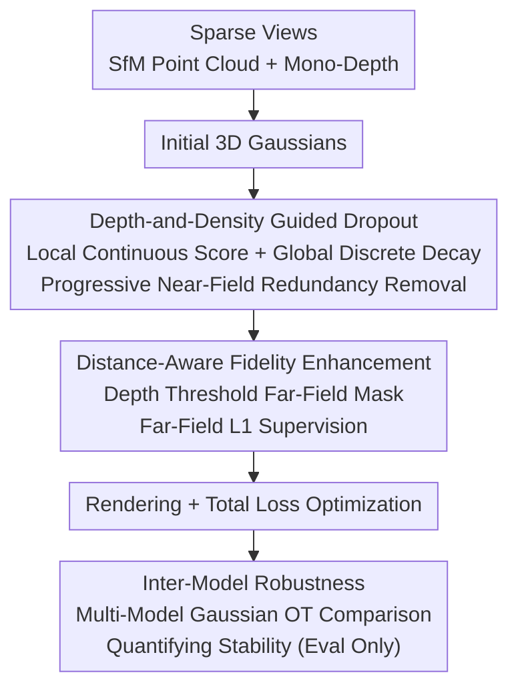

# D²GS: Depth-and-Density Guided Gaussian Splatting for Stable and Accurate Sparse-View Reconstruction

**Conference**: ICLR2026  
**OpenReview**: [https://openreview.net/forum?id=7yvz93kBw9](https://openreview.net/forum?id=7yvz93kBw9)  
**Code**: [Project Page](https://insta360-research-team.github.io/DDGS-website/)  
**Area**: 3D Vision  
**Keywords**: Sparse-view reconstruction, 3D Gaussian Splatting, Depth priors, Adaptive Dropout, Robustness metric

## TL;DR
D²GS addresses two failure modes of 3DGS under sparse views—"near-field overfitting and far-field underfitting"—by using "Depth-and-Density Guided Dropout" to suppress redundant near-field Gaussians and "Distance-Aware Fidelity Enhancement" to reinforce far-field supervision. It also proposes an Inter-Model Robustness (IMR) metric based on Optimal Transport to quantify reconstruction stability, simultaneously achieving state-of-the-art image quality and robustness on LLFF/MipNeRF360.

## Background & Motivation
**Background**: 3D Gaussian Splatting (3DGS) achieves an excellent balance between quality and speed using explicit Gaussian primitives and differentiable splatting rendering, becoming a mainstream representation for New View Synthesis (NVS). However, its performance relies on the premise of "dense multi-view inputs," whereas in reality, often only three to five images are available.

**Limitations of Prior Work**: 3DGS performance drops sharply and training becomes unstable under sparse views. Prior works (e.g., DropGaussian) found that sparse training causes the model to overfit to a small cluster of Gaussians, thus adopting "Uniform Dropout"—randomly and indiscriminately discarding Gaussians during training to mitigate over-reconstruction. However, the authors observe that uniform dropping **accidentally harms regions that are already well-fitted or under-fitted**, thereby lowering the image quality of critical areas.

**Key Challenge**: The authors attribute the failure to a **spatial imbalance** problem. Comparing Gaussian distributions trained under dense views (55 images) vs. sparse views (3 images) clearly reveals two opposite pathologies: ① **Near-field Overfitting**: Texture-rich areas near the camera accumulate excessive Gaussians (11,450 in sparse vs. 6,112 in dense), creating aliasing and artifacts; furthermore, local over-reconstruction in the near field propagates globally to contaminate the entire rendered image. ② **Far-field Underfitting**: Distant regions suffer from low visibility and are often occluded by dense near-field Gaussians, leading to significantly insufficient Gaussians (3,082 in sparse vs. 5,224 in dense), resulting in blurred details and broken structures. **Uniform Dropout fails precisely because it treats these two opposite pathologies identically.**

**Goal**: ① Enable regularization to "recognize" which Gaussians should be dropped and which should be kept; ② Actively reinforce the under-fitted far-field; ③ Provide a metric to quantify "reconstruction stability" for sparse 3DGS.

**Key Insight**: Since failure modes are spatially distributed along **depth** and **density** axes, regularization should be adaptive along these axes rather than being uniformly random.

**Core Idea**: Replace "Uniform Dropout" with "Depth-and-Density Guided Adaptive Dropout" to precisely suppress near-field overfitting, and use "Distance-Aware Fidelity Enhancement" to reinforce far-field underfitting, addressing spatial imbalance from both ends.

## Method

### Overall Architecture
D²GS takes sparse views as input, uses SfM to obtain initial point clouds and camera poses, and employs a monocular depth estimator to generate depth maps for each image to initialize Gaussians. During training, two complementary modules are inserted: **DD-Drop** (Depth-and-Density Guided Dropout) adaptively discards redundant near-field Gaussians based on depth and density to treat "overfitting"; **DAFE** (Distance-Aware Fidelity Enhancement) uses depth thresholds to generate far-field masks and applies specialized loss to the far-field to treat "underfitting." One performs "subtraction" (dropping redundancy) and the other performs "addition" (supplementing supervision) to pull the spatial distribution of Gaussians back to equilibrium. Additionally, the authors propose the **IMR** metric to compare the consistency of Gaussian distributions across multiple independently trained models to quantify robustness (this is an evaluation tool and does not participate in training).

### Key Designs

**1. Depth-and-Density Guided Dropout (DD-Drop): Making dropout "recognize" near-field redundancy**

To address near-field overfitting, the authors no longer drop Gaussians uniformly at random. Instead, they calculate a "should-be-dropped" score for each Gaussian, jointly constrained from **local continuous** and **global discrete** perspectives. The local mechanism calculates Euclidean distance $d_i$ (depth) to the camera and local density $\rho_i$ estimated by k-nearest neighbors for each Gaussian $i$. These are min-max normalized to get depth score $\tilde d_i$ and density score $\tilde\rho_i$, combined into a dropout score:

$$S_i = \omega_{\text{depth}}\,\tilde d_i + \omega_{\text{density}}\,\tilde\rho_i,\quad \omega_{\text{depth}}+\omega_{\text{density}}=1.$$

The intuition is that "nearer and denser" Gaussians are more likely to be overfitting, thus receiving higher scores and being more likely to be dropped. However, local scores cannot capture global patterns, so a global mechanism is added: the point cloud is segmented into near/middle/far layers using two tertiles $D_{\text{near}}, D_{\text{middle}}$ of the depth distribution. Different decay factors are applied to different layers (no decay for the near layer, $0<\lambda_{\text{far}}<\lambda_{\text{middle}}<1$, set to $\lambda_{\text{far}}=0.3,\ \lambda_{\text{middle}}=0.7$), and the final per-Gaussian dropout probability is:

$$P_i = \begin{cases} S_i, & d_i \le D_{\text{near}},\\ \lambda_{\text{middle}}\,S_i, & D_{\text{near}} < d_i \le D_{\text{middle}},\\ \lambda_{\text{far}}\,S_i, & d_i > D_{\text{middle}}.\end{cases}$$

This ensures near-field high-score Gaussians are dropped with high probability while far-field Gaussians are protected by decay even if their scores are high—precisely suppressing near-field overfitting without collateral damage to the far-field. Considering Gaussian counts grow during optimization, a progressive global dropout rate $r(t) = r_{\min} + (r_{\max}-r_{\min})\cdot \min(t,T)/T$ (with $r_{\min}=0.05, r_{\max}=0.3$) is used: light dropping early to preserve geometry, followed by intensified regularization. This "Local Continuous + Global Discrete + Progressive" combination provides the spatial and temporal adaptivity that Uniform Dropout lacks.

**2. Distance-Aware Fidelity Enhancement (DAFE): "Adding supervision" to the under-fitted far-field**

While DD-Drop solves "dropping too much/uniformly," far-field underfitting is caused by "weak supervision," requiring inverse reinforcement. DAFE first generates depth maps for each input image using a monocular depth model, then cuts a binary far-field mask using a depth threshold—retaining only the farthest pixels:

$$M_{\text{dis}}(x,y) = \begin{cases} 1, & D(x,y) > \tau D_{\max},\\ 0, & \text{otherwise},\end{cases}$$

where $D_{\max}$ is the maximum depth and $\tau$ is the threshold (top 5% farthest pixels perform best). This mask is applied to both the rendered image $\hat I$ and the ground truth $I$ to calculate a specialized far-field L1 loss:

$$L_{\text{DAFE}} = \frac{1}{\sum M_{\text{dis}}}\sum_{x,y} M_{\text{dis}}(x,y)\cdot \big|\hat I(x,y) - I(x,y)\big|_1.$$

By "amplifying" far-field errors, the optimizer is forced to allocate more attention to distant areas, thereby **encouraging denser Gaussian growth in the far-field** to fill in missing geometry and texture details. The total training objective adds this term to the standard L1 + D-SSIM color loss of 3DGS:

$$L_{\text{total}} = L_1(\hat I, I) + \lambda_{\text{SSIM}} L_{\text{D-SSIM}}(\hat I, I) + \lambda_{\text{DAFE}} L_{\text{DAFE}}(\hat I, I).$$

It acts as a mirror operation to DD-Drop: one subtracts in the near field, the other adds in the far field.

**3. Inter-Model Robustness (IMR): Quantifying "reconstruction stability" via Optimal Transport**

The authors found that repeating training with the same algorithm and configuration leads to severe PSNR fluctuations (e.g., between 13~18), indicating that sparse 3DGS is highly non-robust to initialization and training noise. Traditional PSNR/SSIM are image-space metrics that cannot capture whether the "3D Gaussian distribution itself" is stable. IMR directly compares $N$ independently trained models at the distribution level. Each model is abstracted as a Gaussian Mixture Model (GMM) $\mathcal G_i = \sum_j w_{i,j}\,\mathcal N(m_{i,j}, \Sigma_{i,j})$, where weights are normalized by rendering opacity $w_{i,j} = \alpha_{i,j}/\sum_k \alpha_{i,k}$ (using opacity as a proxy for the importance of the Gaussian in the final render).

Since two GMMs with tens of thousands of primitives cannot be matched one-by-one, 2-Wasserstein distance + Optimal Transport (OT) is used for soft matching. The Wasserstein distance for a single pair of Gaussians has the Bures closed-form solution $W_2^2 = \|m_1-m_2\|^2 + \mathrm{tr}(\Sigma_1+\Sigma_2 - 2(\Sigma_2^{1/2}\Sigma_1\Sigma_2^{1/2})^{1/2})$, but the matrix square root is expensive and numerically unstable. Thus, a first-order Taylor expansion approximates the shape term: $\tilde W_2^2 = \|m_1-m_2\|^2 + \tfrac14 \mathrm{tr}\big((\Sigma_1-\Sigma_2)\Sigma_2^{-1}(\Sigma_1-\Sigma_2)\big)$. The mixture Wasserstein distance between two models is formulated as an OT problem $\mathrm{MW}_2^2(\mathcal G_1,\mathcal G_2) = \min_{\gamma\ge0}\sum_{i,j}\gamma_{ij}\tilde W_2^2$ (with marginal constraints on respective $w$) and solved via Sinkhorn iteration with entropic regularization. For computational efficiency, depth-stratified importance sampling is used to select ~10,000 Gaussians (over-sampling the far-field due to its instability). Finally, IMR is defined as:

$$\mathrm{IMR} = \ln\!\left(\frac{\sum_{i<j} S_{ij}^2}{\sum_{i<j} S_{ij}}\right),$$

where $S_{ij}$ is the distance between model pairs. The quadratic weighting amplifies pairs with "extremely large differences." A lower IMR indicates more consistent and robust Gaussian distributions across independent runs.

### Loss & Training
Color loss follows 3DGS (L1 + D-SSIM), with additional far-field L1 from DAFE, weighted as shown above. Implementation is based on DropGaussian, trained for 10k iterations per dataset on a single H20 GPU. Key hyperparameters: $\lambda_{\text{far}}=0.3, \lambda_{\text{middle}}=0.7$, $r_{\min}=0.05, r_{\max}=0.3$, $\omega_{\text{depth}}=\omega_{\text{density}}=0.5$, $\tau$ at top 5%, $\lambda_{\text{DAFE}}=1.0$.

## Key Experimental Results

### Main Results
On LLFF (3-view) and MipNeRF360 (3-view), D²GS leads across the board compared to NeRF-based and 3DGS-based methods.

| Dataset | Metric | D²GS (Ours) | DropGaussian | CoR-GS | Gain |
|--------|------|------|----------|------|------|
| LLFF 1/8 | PSNR↑ | **21.35** | 20.76 | 20.45 | +0.59 / +0.90 dB |
| LLFF 1/8 | SSIM↑ | **0.746** | 0.713 | 0.712 | — |
| LLFF 1/8 | LPIPS↓ | **0.179** | 0.200 | 0.196 | — |
| LLFF 1/4 | PSNR↑ | **20.56** | 20.01 | 19.96 | +0.55 dB |
| MipNeRF360 | PSNR↑ | **20.09** | 19.74 | 19.52 | +0.35 / +0.57 dB |

Robustness metric IMR (measured over 10 independent runs, lower is more stable):

| Method | LLFF 3-view IMR↓ | LLFF 6-view IMR↓ |
|------|------|------|
| 3DGS | 3.162 | 3.234 |
| CoR-GS | 3.136 | 3.270 |
| DropGaussian | 3.205 | 3.143 |
| **D²GS** | **3.039** | **3.109** |

### Ablation Study
Incremental component addition (LLFF, PSNR/LPIPS/IMR):

| Configuration | PSNR↑ | LPIPS↓ | IMR↓ | Description |
|------|---------|------|------|------|
| Baseline | 19.22 | 0.229 | 3.162 | No components |
| + Density Score | 21.02 | 0.191 | 3.119 | Density-guided dropout |
| + Depth Score (replacing density) | 20.92 | 0.200 | 3.155 | Depth score only |
| Density + Depth Score | 21.10 | 0.187 | 3.111 | Combined local scores |
| + Depth Stratification | 21.17 | 0.181 | 3.088 | Global discrete mechanism |
| Full (+ DAFE) | **21.35** | **0.179** | **3.039** | Complete model |

### Key Findings
- **Adding the density score to the baseline yields a 1.8 dB PSNR jump** (19.22→21.02), indicating "dropping based on density" is the primary contributor to curing near-field overfitting; depth stratification and DAFE provide further consistent gains, with IMR decreasing synchronously, proving that image quality and robustness improve together.
- **Depth/Density balance is optimal**: $\omega_{\text{depth}}=\omega_{\text{density}}=0.5$ yields the highest PSNR (21.16). Biasing toward either side leads to performance drops—both types of information are complementary and indispensable.
- **Far-field mask "aggressiveness" is beneficial**: Supervising only the top 5% farthest pixels works best, indicating underfitting is concentrated in extreme distances; $\lambda_{\text{DAFE}}=1.0$ is the best compromise for quality.
- The progressive strategy—starting with light dropout ($r_{\min}=0.05$) to preserve basic geometry and increasing it later to strengthen regularization—outperforms a fixed dropout rate.

## Highlights & Insights
- **Using "failure mode diagnosis" as the starting point for method design**: The authors first quantify "near-field overfitting / far-field underfitting" using Gaussian counts (dense vs. sparse), then apply DD-Drop and DAFE as targeted treatments. Every module trace back to a specific pathology rather than just stacking tricks.
- **The "Local-Continuous + Global-Discrete" split for adaptive dropout is clever**: Continuous scores capture fine-grained local changes while discrete stratification injects global depth priors without strong dependency on exact slicing. Combining both is more stable than a single perspective, providing a transferable idea for other "spatial-aware regularization" tasks.
- **IMR fills an evaluation gap**: Sparse 3DGS has been plagued by "drifting results across multiple runs," yet the community mostly looks at single-run PSNR. Abstracting models as GMMs and using OT/Sinkhorn to compare consistency at the 3D distribution level provides a quantifiable number for "reconstruction stability." This measurement philosophy is valuable for any stochastic 3D representation.

## Limitations & Future Work
- **Dependency on mono-depth estimator quality**: Both DD-Drop stratification and DAFE far-field masks rely on depth maps. Errors in depth estimation in textureless or reflective areas can mislead dropout and supervision; the paper compares MiDaS vs. DPT (DPT being slightly better) but does not investigate depth error propagation deeply.
- **Numerous empirical hyperparameters**: $\lambda_{\text{far}}/\lambda_{\text{middle}}$, $r_{\min}/r_{\max}$, $\dots$, $\lambda_{\text{DAFE}}$ are mostly empirically set. Adaptability across datasets/scenes has not been fully verified.
- **IMR computational cost**: Training 10 independent models and performing OT is computationally expensive. Although the authors use importance sampling to approximate with ~10k Gaussians, the trade-off between accuracy and cost for large-scale evaluation deserves further analysis.
- **Evaluation focuses on forward-facing/bounded scenes** (LLFF, MipNeRF360); sparse reconstruction for large-scale, 360° unbounded, or dynamic scenes remains unverified.

## Related Work & Insights
- **vs DropGaussian**: Both use Dropout to suppress sparse overfitting, but DropGaussian uses **uniform random** dropping, which harms good/under-fitted regions. D²GS employs **depth-and-density adaptive** dropping to target only near-field redundancy and supplements far-field via DAFE—treating both overfitting and underfitting simultaneously to lead in both PSNR and IMR.
- **vs CoR-GS / LoopSparseGS / FSGS**: These rely on pseudo-view generation, extra priors, or collaborative regularization. D²GS does not introduce additional views but addresses regularization and supervision redistribution directly from "spatial distribution imbalance," providing the first distribution-level robustness metric.
- **vs Feed-forward (PixelSplat / MVSplat / HiSplat)**: Feed-forward methods regress Gaussian parameters directly from images. D²GS follows the per-scene optimization route. They are complementary—the "spatially adaptive regularization" from DD-Drop/DAFE could potentially benefit the training of feed-forward models as well.

## Rating
- Novelty: ⭐⭐⭐⭐ Failure mode diagnosis + bidirectional treatment + OT robustness metric; a systematic approach where IMR has independent value.
- Experimental Thoroughness: ⭐⭐⭐⭐ Two datasets + multiple baselines + detailed ablation + 10-model IMR; quite solid, though scene diversity is somewhat narrow.
- Writing Quality: ⭐⭐⭐⭐ Observation-driven motivation; clear formulas; modules directly correspond to explained pathologies.
- Value: ⭐⭐⭐⭐ Clear practical gains for sparse 3DGS; the IMR metric offers spillover value for community evaluation.

<!-- RELATED:START -->

## Related Papers

- [\[CVPR 2026\] Confidence-Guided Multi-Scale Aggregation for Sparse-View High-Resolution 3D Gaussian Splatting](../../CVPR2026/3d_vision/confidence-guided_multi-scale_aggregation_for_sparse-view_high-resolution_3d_gau.md)
- [\[CVPR 2026\] SV-GS: Sparse View 4D Reconstruction with Skeleton-Driven Gaussian Splatting](../../CVPR2026/3d_vision/sv-gs_sparse_view_4d_reconstruction_with_skeleton-driven_gaussian_splatting.md)
- [\[ICLR 2026\] CLoD-GS: Continuous Level-of-Detail via 3D Gaussian Splatting](clod-gs_continuous_level-of-detail_via_3d_gaussian_splatting.md)
- [\[CVPR 2026\] FSFSplatter: Geometrically Accurate Reconstruction with Free Sparse-view Images within 2 minutes](../../CVPR2026/3d_vision/fsfsplatter_geometrically_accurate_reconstruction_with_free_sparse-view_images_w.md)
- [\[CVPR 2026\] Exact-GS: Mathematically Rigorous and Accurate 3D Gaussian Splatting for 3D X-ray Reconstruction](../../CVPR2026/3d_vision/exact-gs_mathematically_rigorous_and_accurate_3d_gaussian_splatting_for_3d_x-ray.md)

<!-- RELATED:END -->
