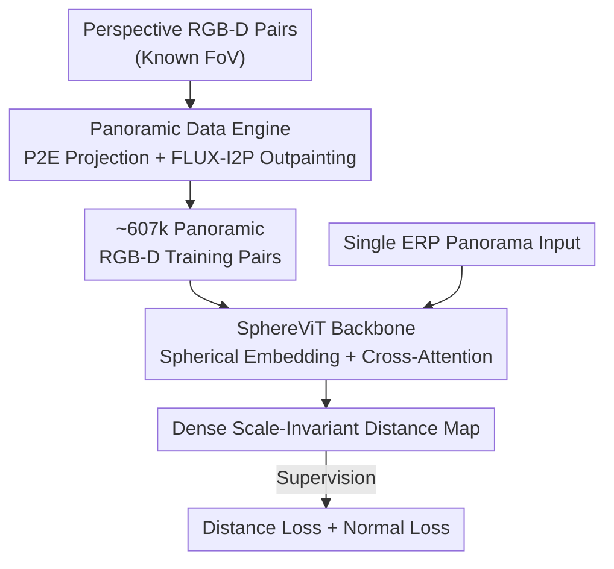

# DA$^{2}$: Depth Anything in Any Direction

**Conference**: ICLR2026  
**OpenReview**: [https://openreview.net/forum?id=323ximYcsk](https://openreview.net/forum?id=323ximYcsk)  
**Code**: https://depth-any-in-any-dir.github.io/ (Available, project page contains code and data)  
**Area**: 3D Vision / Panoramic Depth Estimation  
**Keywords**: Panoramic Depth Estimation, Zero-shot Generalization, Spherical Distortion, Data Engine, Cross-Attention

## TL;DR
DA2 utilizes a "Perspective-to-Panorama" data engine to transform approximately 540,000 perspective RGB-D pairs into panoramic training data (increasing the total to approximately 607,000). Combined with the SphereViT backbone that explicitly injects spherical coordinates, it achieves end-to-end, single 360° panorama scale-invariant distance prediction. In zero-shot settings, it improves AbsRel by approximately 38% over the strongest baselines, even surpassing previous in-domain methods.

## Background & Motivation
**Background**: Panoramic images (360°×180° full field-of-view) provide a complete view of a scene compared to perspective images, which is highly valuable for applications requiring comprehensive spatial perception such as AR/VR, 3D scene generation, and robotics simulation. Consequently, "estimating the distance of each pixel to the sphere center from a single panorama" has gained increasing attention. Mainstream depth models have shifted toward large-scale data and ViT backbones (perspective models like DepthAnything, UniDepth, and MoGe achieve strong results by scaling data).

**Limitations of Prior Work**: Panoramic depth estimation suffers from two main bottlenecks. First is **data scarcity**—capturing or rendering panoramas is much harder than perspective views, and available annotated panoramic depth data is limited and lacks diversity (PanDA ~20k, UniK3D ~29k), forcing early methods to rely on in-domain training and testing, resulting in poor zero-shot generalization. Second is **spherical distortion**—panoramas typically use Equirectangular Projection (ERP) to flatten the sphere into a plane, but 3D surfaces cannot be mapped to 2D without distortion, leading to severe stretching near the poles. To mitigate this, many methods split panoramas into cubemaps (6 perspective faces) for fusion or introduce extra modules like spherical grids or harmonics, which are complex and inefficient.

**Key Challenge**: Strong generalization requires large-scale diverse data, but the ceiling for native panoramic data is low. Addressing distortion often involves decomposing end-to-end single-image inference into "multi-view partitioning + fusion," sacrificing efficiency. Both requirements are hindered by the inherent "scarcity and distortion" of panoramas.

**Goal**: To develop an **accurate, zero-shot generalizable, and fully end-to-end** panoramic depth estimator by addressing two sub-problems: (1) how to "transform" abundant perspective depth data into usable panoramic training data; (2) how to enable a single backbone network to perceive and compensate for spherical distortion without additional fusion modules.

**Key Insight**: The authors noted that perspective depth data is extremely abundant and considered whether perspective samples could be projected onto a sphere and completed into panoramas. They also observed that all panoramas share a fixed 360°×180° field-of-view, meaning the spherical angle field for each pixel is **fixed and reusable**, serving as a geometric prior that can be explicitly fed into the network rather than being learned from distorted images.

**Core Idea**: By employing a "Data Engine for Panorama Generation + SphereViT for Explicit Spherical Coordinate Injection," the method brings the data dividends of the perspective world and the simplicity of end-to-end architectures to panoramic depth estimation.

## Method

### Overall Architecture
DA2 consists of two components: an **offline panoramic data engine** responsible for converting massive perspective RGB-D pairs into panoramic RGB-D pairs to solve data scarcity; and an **online SphereViT model + training loss** that takes a single ERP panorama $I\in\mathbb{R}^{H\times W\times 3}$ and end-to-end outputs a dense scale-invariant distance map $\hat{D}\in\mathbb{R}^{H\times W}$ to solve distortion. The data engine first uses Perspective-to-Equirectangular (P2E) projection to map perspective images onto a sphere, creating "incomplete panoramas," then uses a LoRA-finetuned FLUX-I2P to outpaint them into "complete panoramas." The corresponding GT depth is only processed via P2E projection without outpainting (as the absolute accuracy of outpainted depth is unreliable). During training, the SphereViT backbone calculates the spherical angle field for each pixel from the ERP layout, expanding it into a fixed spherical embedding. Image features in the ViT "attend" to this embedding via cross-attention to obtain distortion-aware representations, followed by distance regression and normal supervision.

### Key Designs

**1. Panoramic Data Engine: Transforming Perspective Data into Panoramas to Break Scarcity**

This step directly addresses the lack of diversity in native panoramic data. Given a perspective image with known horizontal/vertical fields-of-view (XFoV, YFoV), each pixel's unit direction vector $\hat{d}$ in the camera coordinate system is calculated using focal lengths $f_x=\frac{W_{per}}{2\tan(\text{FoV}_x/2)}$ and $f_y=\frac{H_{per}}{2\tan(\text{FoV}_y/2)}$. Then, its azimuth $\phi=\text{atan2}(\hat{d}_x,\hat{d}_z)+\phi_c$ and polar angle $\theta=\arccos(\hat{d}_y)+\theta_c$ are derived ($\phi_c, \theta_c$ are spherical offsets of the optical center), mapping to ERP positions $u=\frac{\phi}{2\pi}W_{pano}$ and $v=\frac{\theta}{\pi}H_{pano}$. Since perspective views typically cover only 70°–90°, they only form "incomplete panoramas." The second step uses FLUX-I2P, a LoRA-finetuned FLUX model, for **panoramic outpainting**. To maintain consistency at the poles and boundaries, FLUX-I2P concatenates image features with spherical coordinates $(\phi, \theta)$ along the channel dimension before entering the DiT. A crucial tradeoff is: **GT depth undergoes only P2E projection and is never outpainted**, as the absolute accuracy of generated depth cannot be guaranteed. This ensures supervision only covers the "real" parts of the sphere. The engine generates ~543k panoramic samples, increasing the total training set from ~63k to ~607k (approx. 10x).

**2. SphereViT Spherical Embedding: Explicitly Injecting Reusable Spherical Geometry**

Addressing the limitation where **2D position encodings cannot represent non-uniform spherical distortion**. Standard ViT position encodings are derived from pixel coordinates $(x, y)$, but panoramic pixels $(u, v)$ correspond to longitudes and latitudes $(\phi, \theta)$, where high latitudes are stretched. The authors calculate the angle field $A\in\mathbb{R}^{H\times W\times 2}$ from the ERP layout ($\phi=2\pi\frac{u}{W}, \theta=\pi\frac{v}{H}$) and flatten it to $A'\in\mathbb{R}^{(H'\times W')\times 2}$. Following the sine-cosine encoding of ViT, the 2-channel field is expanded to feature dimension $D$: defining coefficients $\{2^{d_n}\}_{n=1}^{D'}$ ($D'=D/4$, $d_n=(n-1)\frac{\log_2 H'}{D'}$), each unit $[\phi_i, \theta_j]$ is multiplied by these coefficients before applying $\sin/\cos$, resulting in a fixed spherical embedding $E_{sphere}\in\mathbb{R}^{(H'\times W')\times D}$. **The key insight is that since all panoramas share the same full field-of-view, $E_{sphere}$ is fixed and reusable**, turning spherical geometry from something to be "learned" into a "known prior."

**3. Cross-Attention Injection: Image Features "Attend" to Spherical Embeddings**

Based on the insight from Design 2: since the spherical embedding is fixed and requires no updates, there is no need to add it to features for self-attention as in standard ViT (i.e., $Z+E_{sphere}$), which would force the embedding to be refined. SphereViT uses **cross-attention**, where image features $Z$ act as the query, and the spherical embedding $E_{sphere}$ acts as both key and value:

$$\text{CrossAttn}(Z,E_{sphere})=\text{SoftMax}\!\left(\frac{ZW_Q(E_{sphere}W_K)^\top}{\sqrt{D_k}}\right)(E_{sphere}W_V)$$

Information flows unidirectionally—image features "read" the panoramic spherical structure while the embedding remains unchanged, resulting in distortion-aware representations without splitting cubemaps.

### Loss & Training
The model regresses scale-invariant distance end-to-end. Before loss calculation, predictions are median-aligned: $\hat{D}_{med}=\hat{D}\times\frac{\text{Median}(D^\star)}{\text{Median}(\hat{D})}$. Supervision consists of two $L_1$ terms: **Distance Loss** $\mathcal{L}_{dis}=\frac{1}{|\Omega|}\sum_{p\in\Omega}|\hat{D}^{med}_p-D^\star_p|$ for global accuracy, and **Normal Loss** $\mathcal{L}_{nor}=\frac{1}{|\Omega|}\sum_{p\in\Omega}|\hat{N}_p-N^\star_p|$ for local surface sharpness. Normals are derived from the distance map using a Distance-to-Normal ($\text{D2N}$) operator. The authors use $L_1$ rather than cosine similarity to avoid gradient collapse and instability. The total loss is $\mathcal{L}=\lambda_d\mathcal{L}_{dis}+\lambda_n\mathcal{L}_{nor}$. Training is performed at 1024×512 resolution using 7 datasets (6 perspective + 1 native panoramic, Structured3D).

## Key Experimental Results

### Main Results
On Stanford2D3D, Matterport3D, and PanoSUNCG, DA2 is compared against various zero-shot/in-domain and panoramic/perspective methods (using median alignment for scale invariance):

| Setting | Method | Stanford2D3D AbsRel↓ | Matterport3D AbsRel↓ | PanoSUNCG AbsRel↓ | Zero-shot Rank↓ |
|------|------|------|------|------|------|
| Zero-shot (end2end) | UniK3D | 11.31 | 9.66 | 11.46 | 4.58 |
| Zero-shot (fusion) | MoGev2 | 14.69 | 10.34 | 8.26 | 5.58 |
| Zero-shot (end2end) | **DA2 (Ours)** | **7.23** | **6.67** | **5.96** | **1.00** |
| in-domain (Best) | HUSH | 7.82 | 8.38 | – | – |

DA2 ranks first (Rank 1.00) across all three zero-shot benchmarks, reducing AbsRel by ~38% and RMSE by ~22% compared to the second-best zero-shot method. As a zero-shot model, it even outperforms in-domain methods like HUSH. In terms of efficiency, DA2 takes ~0.1s per image, two orders of magnitude faster than fusion-based MoGev2 (~28s).

### Ablation Study

| Configuration | AbsRel↓ | RMSE↓ | δ1↑ | Description |
|------|---------|-------|-----|------|
| Native Pano S3D Only (63k) | 8.07 | 25.13 | 92.91 | Data scarcity baseline |
| Full Engine Data (607k) | 6.62 | 20.63 | 95.73 | After scaling data |
| w/o Pano Outpainting | 7.59 | 23.80 | 94.12 | Largest performance drop |
| w/o $E_{sphere}$ | 6.84 | 20.87 | 95.26 | Geometric distortion present |
| w/o Normal Loss $\mathcal{L}_{nor}$ | 6.99 | 21.53 | 95.25 | Rougher surfaces/artifacts |
| Full model | 6.62 | 20.63 | 95.73 | Final model |

### Key Findings
- **Outpainting is the true lever in the data engine**: Simply scaling non-outpainted perspective data improved AbsRel by only 0.48, whereas introducing outpainting provided a gain of ~1.45 (approx. 3x), highlighting the importance of full panoramic context.
- **Distinct roles for each design**: Removing $E_{sphere}$ leads to curved wall geometry; removing normal loss results in lack of sharpness in corners and edges. Outpainting is the largest contributor on the data side.
- **Scaling-law behavior**: Performance improves steadily as more perspective data is transformed into panoramas, though authors suggest further gains are possible past current data scales.

## Highlights & Insights
- **Smart "Inverse Data Usage"**: Rather than struggling with limited panoramic data, DA2 projects abundant perspective data onto spheres and outpaints the gaps. The decision to outpaint only RGB and not GT depth avoids the "generated depth" precision trap.
- **Fixed Prior Injection Paradigm**: Recognizing that the panoramic field-of-view is fixed allows for a paradigm where geometric structure is a constant key-value pair for the network to attend to, rather than something for the network to refine through self-attention.
- **End-to-end Simplicity**: Proves that explicit geometric injection can handle distortion within a single backbone better and significantly faster than complex cubemap fusion modules.

## Limitations & Future Work
- **Limitations**: Training resolution (1024×512) is lower than 2K/4K high-res needs; curated perspective data leaves gaps in GT depth coverage on the sphere, occasionally losing fine details. Visible seams may appear at the longitudinal boundaries.
- **Potential Improvements**: Increasing resolution and introducing circular consistency constraints (e.g., wrap-around loss or circular position encodings); incorporating confidence scores for outpainted regions to mitigate supervision asymmetry.

## Related Work & Insights
- **vs. Perspective Zero-shot (DepthAnything/UniDepth/MoGe)**: These leverage massive data but are limited by FoV. DA2 adapts their data dividends to the panoramic domain.
- **vs. Fusion-based Pano Methods (BiFuse/UniFuse/MoGev2)**: DA2 replaces multi-projection fusion with an end-to-end backbone, providing better consistency and 100x speedup.
- **vs. Panoramic Zero-shot (PanDA/UniK3D)**: These are limited by panoramic data scale (~29k). DA2 uses ~21x more training data via its engine, resulting in vastly superior generalization.

## Rating
- Novelty: ⭐⭐⭐⭐ The combination of the data engine and fixed spherical embedding injection is pragmatic and effective.
- Experimental Thoroughness: ⭐⭐⭐⭐⭐ Comprehensive benchmarking across zero-shot and in-domain settings, plus scaling-law analysis.
- Writing Quality: ⭐⭐⭐⭐ Clear motivation, complete formulas, and intuitive visualizations.
- Value: ⭐⭐⭐⭐⭐ A new State-of-the-Art for end-to-end zero-shot panoramic depth, with open-source data and code.

<!-- RELATED:START -->

## Related Papers

- [\[ICLR 2026\] Depth Anything with Any Prior](depth_anything_with_any_prior.md)
- [\[CVPR 2026\] Depth Any Panoramas: A Foundation Model for Panoramic Depth Estimation](../../CVPR2026/3d_vision/depth_any_panoramas_a_foundation_model_for_panoramic_depth_estimation.md)
- [\[CVPR 2025\] Depth Any Camera: Zero-Shot Metric Depth Estimation from Any Camera](../../CVPR2025/3d_vision/depth_any_camera_zero-shot_metric_depth_estimation_from_any_camera.md)
- [\[ICCV 2025\] Find Any Part in 3D](../../ICCV2025/3d_vision/find_any_part_in_3d.md)
- [\[CVPR 2026\] SAM 3D: 3Dfy Anything in Images](../../CVPR2026/3d_vision/sam_3d_3dfy_anything_in_images.md)

<!-- RELATED:END -->
