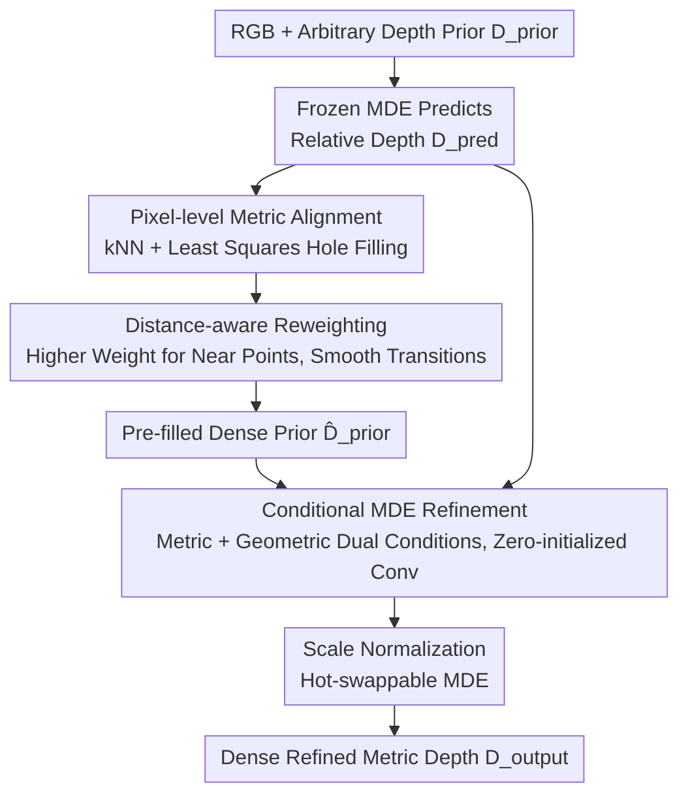

# Depth Anything with Any Prior

**Conference**: ICLR2026  
**OpenReview**: [https://openreview.net/forum?id=IROtFft9Q4](https://openreview.net/forum?id=IROtFft9Q4)  
**Project Page**: https://prior-depth-anything.github.io/  
**Code**: To be confirmed  
**Area**: 3D Vision  
**Keywords**: Monocular depth estimation, metric depth, depth completion, depth super-resolution, depth prior

## TL;DR
Prior Depth Anything employs a two-stage "coarse-to-fine" pipeline to fuse **precise but sparse** metric depth priors measured by sensors with **complete but relative** geometric structures predicted by monocular depth models. A single model unifies three tasks—depth completion, super-resolution, and inpainting—in a zero-shot manner, matching or even exceeding the performance of specialized SOTAs across 7 real-world datasets.

## Background & Motivation
**Background**: Dense and refined metric depth maps are fundamental requirements for 3D reconstruction, autonomous driving, and AR/VR. Two technical routes have distinct advantages: Monocular Depth Estimation (MDE) foundation models (e.g., Depth Anything v2, Depth Pro) can predict **complete and detail-rich** depth for any image, but the output is **relative depth** lacking real-world scale. Conversely, **measurement methods** such as SfM, LiDAR, and ToF provide **precise metric values** but are often **sparse, incomplete, and noisy**.

**Limitations of Prior Work**: There are numerous works that treat measured depth as a "prior" fed into MDE for task completion (depth completion / super-resolution / inpainting), but they focus execution on only **one** specific prior modality—Omni-DC/Marigold-DC focus solely on sparse point completion, PromptDA on low-resolution super-resolution, and DepthLab on missing region inpainting. They fail to generalize when the prior mode changes (e.g., a mix of sparse points + low resolution + missing regions). The authors highlight this in Table 1: existing methods only cover a few columns; none is a "universal player."

**Key Challenge**: These methods suffer from two common flaws: ① Performance collapse when priors are extremely limited (due to a lack of explicit scene geometry guidance, they fail to reconstruct in cases as sparse as 100 points); ② Difficulty in generalizing to prior modalities unseen during training. The root cause is that they do not explicitly utilize the "geometric structure within the predicted depth," instead forcing the network to memorize specific input patterns.

**Goal**: To develop a unified framework robust to **any image + any prior** that outputs dense, refined, and metrically accurate depth maps.

**Key Insight**: Predicted depth and measured depth are **naturally complementary**—one provides complete structure without scale, the other provides scale without complete structure. Rather than designing separate networks for each prior, it is better to design a pipeline that **progressively** merges these two depth sources.

**Core Idea**: Use a coarse-to-fine pipeline where predicted depth first "fills" arbitrary sparse priors into a unified intermediate form (explicit fusion), followed by a conditional MDE model that refines the resulting noise (implicit fusion), thereby unifying the three tasks.

## Method

### Overall Architecture
The input consists of an RGB image $I \in \mathbb{R}^{3\times H\times W}$, an arbitrary metric depth prior $D_{prior} \in \mathbb{R}^{H\times W}$ (with a set of valid pixels $P=\{x_i,y_i\}_{i=0}^N$), and a relative depth prediction $D_{pred}$ from a **frozen MDE model**. The objective is to output a dense, refined, and metrically accurate $D_{output}$.

The pipeline consists of two steps. Step one: **Coarse Metric Alignment (Explicit Fusion)**. The geometric structure of $D_{pred}$ is used to fill the holes in $D_{prior}$ pixel-by-pixel, resulting in a dense pre-filled prior $\hat{D}_{prior}$. This step converges various prior patterns into a **shared intermediate domain**; whether the original was sparse points, a low-resolution grid, or irregular missing areas, they appear similar after filling. Step two: **Fine Structure Refinement (Implicit Fusion)**. The pre-filled prior $\hat{D}_{prior}$ and the original prediction $D_{pred}$ are fed as additional conditions into a **conditional MDE model**. Under RGB guidance, the model corrects the noise remaining from the pre-filling stage to output the final metric depth.

### Key Designs

**1. Unified Prior Abstraction + Pixel-level Metric Alignment: Filling all priors into a single form**

This step directly addresses the inability to handle various priors. The authors abstract LiDAR/SfM sparse points, low-resolution grids, and missing regions into a single "metric prior $D_{prior}$" and then fill the holes using the predicted depth. Valid locations retain original measurements: $\hat{D}_{prior}(x,y)=D_{prior}(x,y)$ for $(x,y)\in P$. For each missing pixel $(\hat{x},\hat{y})$, the system finds its $k$-nearest neighbors ($k=5$) in the valid set $P$, then solves for the optimal scale $s$ and translation $t$ to linearly align the predicted depth to the metric prior across these $K$ support points:

$$s,t = \arg\min_{s,t}\sum_{k=1}^{K}\lVert s\cdot D_{pred}(x_k,y_k)+t-D_{prior}(x_k,y_k)\rVert^2$$

The prediction is then linearly mapped into a metric value for the hole: $\hat{D}_{prior}(\hat{x},\hat{y})=s\cdot D_{pred}(\hat{x},\hat{y})+t$. This has two advantages: first, **pattern convergence**, where differences between prior types are smoothed, significantly improving generalization; second, **inherent geometric fidelity**, as the filled regions are linear transformations of the predicted depth and inherit its refined geometric structure, allowing for reasonable shapes even with extremely sparse priors.

**2. Distance-aware Reweighting: Ensuring smooth transitions at region boundaries**

Pure pixel-level alignment has two risks: adjacent missing pixels might select different kNN sets, leading to **sudden jumps** (discontinuity) in filled values; and in least squares, all support points are weighted equally, whereas closer points are clearly more reliable. The authors solve this with a simple modification—weighting the alignment objective by the inverse distance from the support points to the query pixel:

$$s,t = \arg\min_{s,t}\sum_{k=1}^{K}\frac{\lVert s\cdot D_{pred}(x_k,y_k)+t-D_{prior}(x_k,y_k)\rVert^2}{\lVert(\hat{x},\hat{y})-(x_k,y_k)\rVert^2}$$

Closer support points carry higher weight, making alignment parameters change more continuously across adjacent pixels, leading to smoother transitions between regions and better robustness to noise.

**3. Conditional MDE Refinement: Implicit fusion with networks to correct pre-filled noise**

The first step is a parameter-free geometric stitching, which is sensitive to noise in the prior—a single noisy pixel on a boundary can contaminate all filled areas that use it as a support point. The second step utilizes the MDE model's ability to capture RGB geometric structure to "erase" this noise. Specifically, two conditions are added to the pre-trained MDE: a **metric condition** (pre-filled prior $\hat{D}_{prior}$ with accurate scale) and a **geometric condition** (frozen MDE prediction $D_{pred}$ with refined structure), both injected via **zero-initialized convolutional layers** parallel to the RGB input layer. Zero-initialization is key; at the start of training, the condition branch outputs zero, and the model inherits the full capabilities of the pre-trained MDE, gradually learning to use the conditions to correct the prior.

**4. Scale Normalization + Hot-swappable MDE: Cross-scene generalization and test-time upgrades**

Both the metric and geometric conditions are normalized to $[0,1]$ before being fed into the network. This provides two benefits: first, **cross-scene generalization**, as normalization removes scale variance across different environments; second, **cross-MDE generalization**. Since different frozen MDEs provide different prediction scales, normalizing $D_{pred}$ allows for **arbitrary replacement** of the frozen MDE model during inference. This is a highly practical selling point: one can use Depth Anything v2 ViT-B as the frozen MDE during training and swap it for a stronger Depth Pro or larger ViT-G during inference for improved performance (Table 8 shows AbsRel dropping from 2.15 to 1.87 as the model scales from ViT-S to ViT-G).

### Loss & Training
Only the conditional MDE model is trained. To avoid boundary blur and missing data in real depth, training is conducted on synthetic datasets Hypersim and vKITTI (which provide precise ground truth): various synthetic priors—sparse points, square missing regions, and downsampled grids—are randomly sampled from the GT. Following the approach of Omni-DC, outliers and boundary noise are added to simulate real-world measurement noise. Since both conditions are normalized, the output is de-normalized back to the GT scale, and supervision is applied using the scale-invariant log loss from ZoeDepth. Training involves 200K steps with a batch size of 64 on 8 GPUs.

## Key Experimental Results

### Main Results
Zero-shot evaluation was performed on 7 unseen real-world datasets across indoor (NYUv2/ScanNet), mixed (ETH3D/DIODE), outdoor (KITTI), and low-resolution capture (ARKitScenes/RGB-D-D) scenarios. The metric is AbsRel↓. The table below shows the **Mixed Prior** setting (containing sparse points S + low resolution L + missing regions M), demonstrating the "all-around" value:

| Method | Encoder | NYUv2 (S+M) | ETH-3D (S+M) | KITTI (S+M) | Avg Rank↓ |
|------|--------|-------------|--------------|-------------|-----------|
| Omni-DC | - | 2.86 | 2.09 | 4.36 | 4.2 |
| Marigold-DC | SDv2 | 2.26 | 2.15 | 5.82 | 5.1 |
| PromptDA | ViT-L | 17.00 | 18.34 | 21.61 | 8.4 |
| **PriorDA (ours)** | DAv2-B+ViT-B | **2.04** | **1.56** | **3.86** | **2.0** |
| **PriorDA (ours)** | Depth Pro+ViT-B | **2.01** | 1.61 | **3.37** | **1.1** |

PriorDA not only leads in absolute performance but is notably **less sensitive to additional prior modes**. Compared to using only sparse points, adding missing regions or low resolution results in a much smaller performance degradation for PriorDA compared to Omni-DC or Marigold-DC.

### Ablation Study

| Configuration | Key Metric (Avg NYUv2 etc.) | Explanation |
|------|------------------------|------|
| Dual Conditions (Metric + Geometric) | Optimal (S=1.96) | Full model |
| Geometric Condition Only | S=5.46 | Almost collapses without metric condition |
| Metric Condition Only | S=2.10 | Poorer details without geometric guidance |
| Pre-filling w/o re-weight | S=2.92 (Table 6) | Performance degrades in most settings |
| Interpolation (vs Alignment) | S=7.93 (Table 6) | Simple interpolation is far inferior to alignment |

### Key Findings
- **Metric condition is vital**: Performance collapses when the metric condition is removed, confirming that explicit injection of precise metric values is indispensable.
- **Pre-filling strategy determines generalization**: Pre-filling priors into a unified intermediate domain is the key to cross-prior generalization.
- **Stronger frozen MDE improves performance**: The "hot-swappable" design allows the model to benefit from advancements in the MDE community for "free" performance gains.
- **Real GT contains noise**: Error analysis shows that model errors are often concentrated on blurred boundaries of "GT" in datasets like NYUv2, suggesting the model is actually correcting annotation noise.

## Highlights & Insights
- **Clean "Fill then Refine" decomposition**: Separating explicit fusion for generalization and implicit fusion for precision allows each step to be independently validated.
- **Zero-initialized conditional convolution**: An effective trick to add extra inputs to frozen foundation models without destroying their pre-trained capabilities.
- **Hot-swappable foundation models**: Normalizing predictions allows the model to scale its performance by simply swapping the backbone during inference.
- **Training on synthetic data to correct real noise**: Leveraging the precision of synthetic GT to teach the model to correct real measurement noise effectively bypasses the limitations of fuzzy real-world labels.

## Limitations & Future Work
- **Dependency on frozen MDE quality**: The method assumes sufficient accuracy in the predicted geometric structure; MDE failures in challenging scenes (reflections, transparency) will propagate.
- **Sensitivity of kNN to extreme noise**: The parameter-free first step can be contaminated by boundary noise, limiting the upper bound when priors are exceptionally noisy.
- **Metric accuracy cap**: The final accuracy is ultimately bounded by the density and precision of the measured prior.
- **Future Directions**: Developing learnable, noise-robust alignment modules or exploring the inclusion of multi-frame/multi-view priors.

## Related Work & Insights
- **vs Omni-DC / Marigold-DC**: These are designed for sparse point completion but lack explicit geometric guidance. PriorDA is simpler, more efficient, and not limited to a single prior type.
- **vs PromptDA**: PromptDA uses low-resolution images as prompts, limiting it to super-resolution. PriorDA treats this as just one of many possible prior formats.
- **vs DepthLab**: DepthLab uses interpolation for hole filling, which fails in large missing areas. PriorDA’s linear alignment preserves geometric fidelity much more effectively.

## Rating
- Novelty: ⭐⭐⭐⭐ The coarse-to-fine fusion unifying three depth prior tasks is a clean and novel perspective.
- Experimental Thoroughness: ⭐⭐⭐⭐⭐ Comprehensive evaluation across 7 datasets and 9 prior modes.
- Writing Quality: ⭐⭐⭐⭐ Clear motivation regarding complementarity; Figure 2 explains the pipeline well.
- Value: ⭐⭐⭐⭐⭐ High practical value given the zero-shot unification of tasks and its plug-and-play upgrade capability.

<!-- RELATED:START -->

## Related Papers

- [\[ICLR 2026\] DA$^{2}$: Depth Anything in Any Direction](da2_depth_anything_in_any_direction.md)
- [\[CVPR 2026\] Depth Any Panoramas: A Foundation Model for Panoramic Depth Estimation](../../CVPR2026/3d_vision/depth_any_panoramas_a_foundation_model_for_panoramic_depth_estimation.md)
- [\[ICLR 2026\] D²GS: Depth-and-Density Guided Gaussian Splatting for Stable and Accurate Sparse-View Reconstruction](d2gs_depth-and-density_guided_gaussian_splatting_for_stable_and_accurate_sparse-.md)
- [\[CVPR 2026\] The Midas Touch for Metric Depth](../../CVPR2026/3d_vision/the_midas_touch_for_metric_depth.md)
- [\[CVPR 2026\] UniDAC: Universal Metric Depth Estimation for Any Camera](../../CVPR2026/3d_vision/unidac_universal_metric_depth_estimation_for_any_camera.md)

<!-- RELATED:END -->
