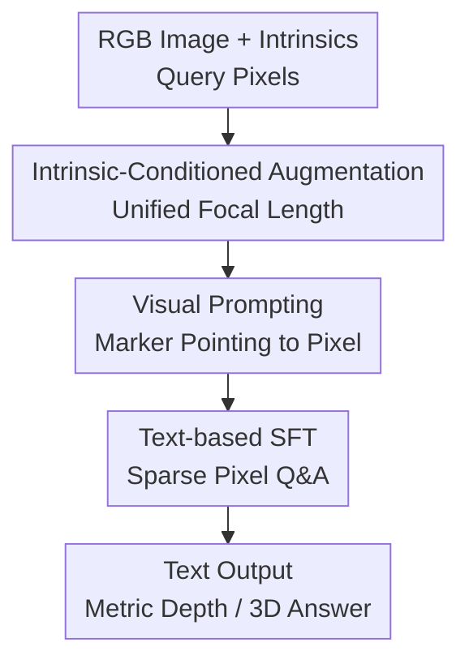

# DepthLM: Metric Depth from Vision Language Models

**Conference**: ICLR2026  
**OpenReview**: [https://openreview.net/forum?id=ObFVZGnSFN](https://openreview.net/forum?id=ObFVZGnSFN)  
**Code**: https://github.com/facebookresearch/DepthLM_Official  
**Area**: 3D Vision / Multimodal VLM  
**Keywords**: metric depth, VLM, visual prompting, camera intrinsics, 3D understanding  

## TL;DR
DepthLM demonstrates that a standard VLM does not require a dense prediction head or specialized depth losses. By relying solely on visual markers, intrinsic-conditioned data augmentation, and text-based SFT, it achieves pixel-level metric depth performance that approximates or even surpasses various specialized vision-only depth models for the first time.

## Background & Motivation
**Background**: Mainstream methods for monocular metric depth estimation are typically vision-only models, such as ZoeDepth, Metric3D, Depth Pro, and the UniDepth series. These models map input images to dense depth maps and learn depth in meters through specialized depth prediction heads, scale normalization, geometric constraints, and regression/regularization losses. These tasks are well-defined with stable outputs and are mature in fields like autonomous driving, robotics, and 3D reconstruction.

**Limitations of Prior Work**: While these expert models are highly accurate, their flexibility is limited. When tasked with more natural 3D Q&A, such as calculating the distance between two points, camera pose, or time given speed, they often require re-designing output heads, training objectives, or extra modules. Conversely, while VLMs can handle various visual tasks via text interaction, they lag significantly in 3D geometry: even powerful VLMs like GPT-5 or Gemini-2.5-Pro perform far below vision-only models in pixel-level metric depth.

**Key Challenge**: The advantage of VLMs lies in unified interfaces and language interaction, but metric depth requires precise knowledge of "which pixel on the image" and "the real-world scale corresponding to that pixel." If pixel localization and camera scale are not resolved, even larger models only provide semantically plausible but geometrically unreliable numbers. Adding dense heads and specialized losses would sacrifice the simplicity of the VLM as a unified model.

**Goal**: The authors treat pixel-level metric depth estimation as a representative 3D understanding task. They ask a direct question: Can a standard VLM achieve expert-level geometric precision without changing the architecture, adding regression heads, or altering the training paradigm? To answer this, the paper systematically analyzes prompts, training losses, and camera ambiguity in mixed-data training, constructing DepthLMBench to allow VLMs to be compared with vision-only models using the same metrics.

**Key Insight**: The paper observes that VLM failures are not necessarily due to an inability to regress continuous depth, but likely because the input representation makes it difficult to locate pixels and the mixed data causes confusion regarding camera scale. Postulating that the bottleneck lies not in the model architecture or loss functions, but in translating geometric problems into stable vision-text interactions that the VLM can understand.

**Core Idea**: Use visual markers on the image instead of text coordinates to point at target pixels, use intrinsic-conditioned data augmentation to unify focal lengths, and enable standard VLMs to learn depth in meters through sparse text-based SFT.

## Method
The approach of DepthLM is restrained: it does not transform the VLM into a depth estimation network but repackages metric depth as a visual question-answering task that VLMs can perform. Given an RGB image and a query pixel, the system first scales the image to a unified focal length based on camera intrinsics, renders a marker pointing at the query point, and finally asks a text question about the distance from the point to the camera. The answer is provided in plain text. During training, the standard next-token prediction is maintained, where the model learns to output responses like "The point is around X meters away from the camera."

### Overall Architecture
The input to DepthLM is an RGB image with camera intrinsics and one or more query points; the output is metric depth or other 3D numerical answers in text form. The full pipeline consists of three steps: first, eliminating scale ambiguity caused by different focal lengths via intrinsic-conditioned augmentation; second, transforming abstract pixel coordinates into visible image markers via visual prompting; and finally, using sparse SFT to let the model learn 3D numerical prediction through a standard language interface.

The actual contributions correspond to three key designs: intrinsic-conditioned augmentation solves camera scale ambiguity, visual prompting solves VLM insensitivity to pixel locations, and text-based SFT demonstrates that no extra dense head or complex regression loss is needed. DepthLMBench is the data benchmark supporting training and evaluation.

### Key Designs
**1. Visual Prompting: Turning Pixel Coordinates from Text Questions into Visual Targets**

Traditional VLMs often use text coordinates for pixel-level tasks, such as asking "How far is the pixel at $(X, Y)$ from the camera?". The paper finds this approach unfriendly to VLMs: the model must map language coordinates back to the image grid and locate specific object boundaries in complex scenes. Small errors can cause depth values to shift from a tabletop to a wall. DepthLM directly renders markers (like small arrows) on the image to point at the query pixel and asks in natural language how many meters the point is from the camera.

This design enables the VLM to use its strength in "understanding visible objects in images" instead of its weakness in "recovering pixel positions from text coordinates." Experiments show marker-based pixel reference outperforms text coordinates in both indoor and outdoor data, particularly in ScanNet++ where dense objects and occlusions make coordinate localization errors more likely to fall on different objects. Interestingly, the specific shape of the marker has little impact, suggesting the key is explicitly drawing the query point into the visual input.

**2. Intrinsic-Conditioned Augmentation: Unifying Focal Length to Eliminate Camera Ambiguity**

The difficulty of metric depth lies not just in "how far it looks" but also in the camera's scale. Two visually similar images can have very different real-world depth distributions if their focal lengths differ. While vision-only models handle this, VLMs trained on mixed datasets often learn a blurry average scale, leading to cross-dataset failures.

DepthLM scales images to a unified focal length $f_{uni}$. If the original size is $W \times H$ and focal parameters are $f_x, f_y$, the augmented size becomes $W' = \frac{f_{uni}}{f_x} W$ and $H' = \frac{f_{uni}}{f_y} H$. The paper defaults to $f_{uni}=1000$ pixels. During training, images are randomly cropped; during evaluation, they are not. Once the focal length is unified, the model does not need to guess the scale from text intrinsics or implicit visual cues.

Experiments show that unifying focal length through image augmentation is superior to mixing focal lengths, providing intrinsics in text prompts, or predicting camera ray directions. Explicit text intrinsics do not effectively solve the problem; instead, embedding camera differences into the geometric scale of visual inputs is more efficient for VLMs.

**3. Sparse Text-based SFT: Learning Continuous Depth with Standard Tokens**

Contrary to the intuition that pixel-level depth requires dense heads or regression losses, DepthLM finds standard text SFT sufficient. Samples consist of an image and a question, with answers being text depth rounded to two decimal places (e.g., "The point is around 3.42 meters away from the camera."). The model uses cross-entropy for next-token prediction without L1, L2, or scale regularization on depth values.

The paper also compared SFT with GRPO-style RL. RL can use negative L1, negative AbsRel, or $\delta_1$ as rewards. While it learns reasonable 3D predictions, the computational cost per sample is $8$ to $16$ times higher. Since SFT and GRPO yield similar accuracy with the same number of samples, SFT is chosen for its scalability. Furthermore, training on 16M images with only 1 annotated pixel per image allows the model to exceed $0.8$ in $\delta_1$, indicating that image diversity is more critical than dense labels per image.

**4. DepthLMBench: Aligning VLMs and Expert Depth Models on Geometric Tasks**

To avoid evaluating VLMs only on object-level spatial Q&A, the paper compiles multiple public 3D/depth datasets into DepthLMBench. Training data includes Argoverse2, Waymo, NuScenes, ScanNet++, Taskonomy, HM3D, and Matterport3D. Evaluation data includes Argoverse2, DDAD, NuScenes, ETH3D, ScanNet++, sunRGBD, iBims1, and NYUv2, avoiding overlap with training scenes.

This benchmark brings VLMs into the metric depth evaluation system (using $\delta_1$) long used by vision-only models. $\delta_1$ measures the ratio of predictions within $25\%$ error of the ground truth. This comparison answers "how far VLMs are from expert depth models" rather than just checking if language responses sound plausible.

### Main Results
DepthLM was first compared against general VLMs, spatial VLMs, and VLMs previously trained on metric depth. General VLMs can "speak" but fail to provide stable metric geometry; DepthLM 3B/7B leads significantly in $\delta_1$.

| Method | Model Type | Avg $\delta_1$ | Key Conclusion | Gain |
|------|----------|----------------|----------|------|
| Qwen2.5-VL 3B | General VLM | 0.106 | Base VLMs lack metric depth capability | DepthLM 3B ~7.8x |
| GPT-5 | General VLM | 0.370 | Strong closed-source VLMs still below 0.4 | DepthLM 7B ~2.3x |
| SpatialRGPT 8B | Spatial VLM | 0.205 | Object-level training $\neq$ pixel-level depth | DepthLM 7B ~4.1x |
| Seed1.5-VL (our prompt) | Depth VLM | 0.400 | Performance improves with markers but remains insufficient | DepthLM 7B ~2.1x |
| DepthLM 3B | Ours | 0.824 | Small models reach expert-level VLM depth | - |
| DepthLM 7B | Ours | 0.838 | Slight improvement over 3B; >0.9 on iBims1/NYUv2 | - |

Compared to vision-only models, DepthLM enters the precision range of expert metric depth models. DepthLM 7B outperforms ZoeDepth, Depth Pro, and Metric3Dv2 across several datasets, trailing UniDepthV2's average by only $9.2\%$.

| Method | DDAD | NuScenes | ETH3D | sunRGBD | iBims1 | Relative to DepthLM 7B |
|------|------|----------|-------|---------|--------|------------------|
| ZoeDepth | 0.272 | 0.283 | 0.350 | 0.867 | 0.580 | -42.8% |
| Depth Pro | 0.299 | 0.566 | 0.397 | 0.831 | 0.823 | -29.1% |
| Metric3Dv2 | - | 0.841 | 0.900 | 0.812 | 0.684 | -3.8% |
| UniDepthV2 | 0.882 | 0.870 | 0.852 | 0.964 | 0.945 | +9.2% |
| DepthLM 7B | 0.747 | 0.865 | 0.718 | 0.859 | 0.920 | - |

### Ablation Study
The ablation experiments explain why DepthLM is effective.

| Configuration / Question | Key Metric or Phenomenon | Explanation |
|-------------|----------------|------|
| Text coords vs Visual marker | Marker is better; ScanNet++ gap ~0.15 | VLMs understand visual indicators better than text coordinates |
| SFT vs GRPO | Similar accuracy for same samples | GRPO is $8$-$16$x slower; SFT is more scalable |
| Camera ambiguity handling | Unified focal length accuracy is ~2x others | Image-level augmentation is better than text prompts or ray direction |
| $f_{uni}$ size | Benefits continue up to 1000 pixels | Method is stable within a range |
| Annotation density | 1 point/image exceeds 0.8 $\delta_1$ | Image diversity is more important than dense labels |
| Increasing label density (fixed 80K) | 1 pt/img > 10 pts/img > 100 pts/img | Reducing image variety hurts generalization for a fixed sample count |

### Key Findings
- VLM geometry bottlenecks are due to input interfaces and camera scale representation rather than inherent model limitations.
- Marker prompts significantly improve other models like Seed1.5-VL, showing cross-model generalizability.
- SFT is sufficient for 3D understanding, avoiding expensive RL or specialized heads.
- Point cloud visualizations show DepthLM has clearer boundaries with fewer "flying points" compared to some vision-only models.
- Multitask experiments show DepthLM 7B achieves an average $\delta_1=0.804$ across six tasks (distance, speed, etc.), while GPT-5 averages only 0.210.

## Highlights & Insights
- **Attributing problems to interfaces rather than capability**: Instead of adding larger models or complex heads, the authors diagnosed how VLMs see pixels and scales, leading to a simple but effective fix.
- **Visual markers as a high-leverage trick**: Binding coordinates to visual space is an insight applicable to any VLM task requiring localization.
- **Handling intrinsics in visual geometry**: Scaling images to handle intrinsics is more effective than providing numbers in prompts, as it performs deterministic geometric transformations for the model.
- **Sparse supervision activates 3D capability**: Strong generalization from 1 point per image suggests VLMs rely more on cross-scene statistics and semantic-geometric associations than dense pixel supervision.

## Limitations & Future Work
- Dependency on camera intrinsics limits application to "in-the-wild" internet images where intrinsics are unknown.
- Inference costs for dense prediction are high, as generating a dense map requires per-pixel queries.
- Training requires significant 3D data and compute resources (millions of samples on H100s).
- Point clouds in smooth regions are noisier than vision-only models due to the lack of local consistency constraints.

## Related Work & Insights
- **vs Metric3D/UniDepth**: While specialized models are better for dense, smooth depth maps, DepthLM offers a unified interface for language-defined tasks like speed or distance between points.
- **vs SpatialVLM**: Unlike object-level spatial models, DepthLM achieves pixel-level metric precision comparable to expert depth models.
- **Insight for future work**: Geometric tasks can be decomposed into "geometric pre-processing + visual prompting + text numerical supervision" rather than architectural changes to VLMs.

## Rating
- Novelty: ⭐⭐⭐⭐⭐ Proving standard VLMs can reach expert-level metric depth without architecture changes is highly impactful.
- Experimental Thoroughness: ⭐⭐⭐⭐⭐ Includes extensive comparisons and ablation studies across prompts, losses, and camera ambiguity.
- Writing Quality: ⭐⭐⭐⭐☆ Logical and clear, though some Appendix details are needed for full replication.
- Value: ⭐⭐⭐⭐⭐ High value for VLM-based robotics and 3D tasks.

<!-- RELATED:START -->

## Related Papers

- [\[CVPR 2026\] Zero-Shot Depth Completion with Vision-Language Model](../../CVPR2026/3d_vision/zero-shot_depth_completion_with_vision-language_model.md)
- [\[CVPR 2026\] MonoVLM: Monocular 3D Visual Grounding with Vision Language Models](../../CVPR2026/3d_vision/monovlm_monocular_3d_visual_grounding_with_vision_language_models.md)
- [\[CVPR 2025\] Vision-Language Embodiment for Monocular Depth Estimation](../../CVPR2025/3d_vision/vision-language_embodiment_for_monocular_depth_estimation.md)
- [\[CVPR 2026\] The Midas Touch for Metric Depth](../../CVPR2026/3d_vision/the_midas_touch_for_metric_depth.md)
- [\[CVPR 2026\] TR2M: Transferring Monocular Relative Depth to Metric Depth with Language Descriptions and Dual-Level Scale-Oriented Contrast](../../CVPR2026/3d_vision/tr2m_transferring_monocular_relative_depth_to_metric_depth_with_language_descrip.md)

<!-- RELATED:END -->
