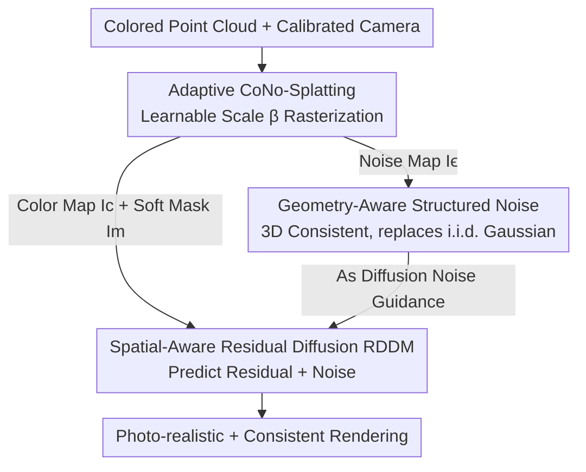

# DiffPBR: Point-Based Rendering via Spatial-Aware Residual Diffusion

**Conference**: ICLR2026  
**OpenReview**: [https://openreview.net/forum?id=tqOBZbW6j8](https://openreview.net/forum?id=tqOBZbW6j8)  
**Code**: To be confirmed  
**Area**: 3D Vision / Neural Rendering / Diffusion Models  
**Keywords**: Point Cloud Rendering, Novel View Synthesis, Residual Diffusion, Geometrically Consistent Noise, Adaptive Rasterization

## TL;DR
DiffPBR directly renders colored point clouds into photo-realistic, cross-view consistent images: first using adaptive CoNo-Splatting to rasterize sparse point clouds into "just-right" initial color maps and geometry-aware noise maps, then employing Spatial-Aware Residual Diffusion (RDDM) to supplement only the missing high-frequency details. It outperforms SOTA by 3–5 dB PSNR across three datasets, reduces training from 41 to 8 GPU hours, and increases rendering speeds from 3.6 to 10 FPS.

## Background & Motivation
**Background**: Rendering photo-realistic images directly from colored point clouds is a classic problem in graphics with applications in VR, film, robotics, and autonomous driving. Traditional methods project 3D points to 2D followed by z-buffer rasterization (e.g., PyTorch3D), which is efficient but suffers from holes, aliasing, and surface fractures when point clouds are sparse. Neural point rendering (NPBG, RPBG) improves this by attaching learnable neural descriptors to each point and refining the rasterized output via CNNs. NPBG++ uses online aggregation for cross-scene capability, while PFGS represents points as adaptive Gaussians with differentiable splatting to improve view consistency.

**Limitations of Prior Work**: This "descriptor-learning" paradigm faces two inherent issues. First, multi-view images are inherently inconsistent, leading to blurry results when aggregating features; even with multi-view fine-tuning, rasterization in discrete space still produces artifacts due to sparsity. Second, to mitigate these artifacts, mainstream methods introduce additional representations (3D CNNs in NPCR, 3D Gaussians in PFGS), making the pipeline heavy and dependent on time-consuming per-scene or per-descriptor optimization.

**Key Challenge**: The fundamental difficulty of pure point-cloud pipelines is simultaneously repairing rasterization artifacts and ensuring multi-view consistency. Point clouds lack explicit surface connectivity and are extremely sensitive to per-point parameters like scale; simply increasing point size cannot recover missing regions accurately.

**Goal**: The authors explore a counter-intuitive question—are points truly "poor" rendering primitives? As depth sensing and 3D/4D reconstruction become ubiquitous, point clouds have become a common modality alongside RGB. Can a pure point-cloud, generalizable, and cross-view consistent renderer be built without secondary representations?

**Key Insight**: Diffusion models in image restoration offer strong generalization and high output quality, making them natural candidates for a "universal renderer." However, applying them directly to rendering faces three hurdles: (1) standard restoration processes images independently, lacking view constraints and leading to flickering; (2) diffusion assumes pure noise input, whereas degraded point-cloud renderings already retain significant structure/color; (3) point clouds are sensitive to parameters like scale, which can introduce unreliable supervision if poorly chosen.

**Core Idea**: Use "view-projected noise explicitly constrained by scene geometry and visibility" to guide diffusion. By making the noise itself carry 3D-consistent geometric cues, the diffusion process naturally maintains cross-view consistency under camera motion. Additionally, the process is shifted from "reconstruction from pure noise" to "residual refinement," supplementing only missing details.

## Method

### Overall Architecture
Given a colored point cloud $P=\{(x_i, c_i)\}$ and calibrated cameras, DiffPBR renders photo-realistic, cross-view consistent images in two steps. Step one, **Adaptive CoNo-Splatting**: each point is assigned a zero-mean Gaussian noise vector $\epsilon_i$ and an isotropic scale $s_i$. Differentiable rasterization simultaneously projects the color map $I_c$, noise map $I_\epsilon$, and a soft mask $I_m$ (identifying holes)—crucially using a learnable global scale multiplier $\beta$ to project sparse points such that they are "neither too blurry nor too sparse." Step two, **Spatial-Aware Residual Diffusion (RDDM)**: using $I_c$ and $I_m$ as conditions and the 3D-consistent $I_\epsilon$ to construct supervision targets, the network predicts the "residual between the rendering and ground truth + noise." Starting from information-rich renderings rather than pure noise, it restores high-frequency details and ensures consistency in a few steps. The entire framework is trained end-to-end.

### Key Designs

**1. Adaptive CoNo-Splatting: Using a learnable global scale for "just-right" initialization**

Point clouds are sparse; splats that are too small leave holes, while those too large cause blurring. The optimal scale depends on scene density. The authors first calculate a heuristic scale $\bar s_i = \frac{1}{k}\sum_{x_j\in K_i}\|x_i-x_j\|_2$ using KNN, then apply a **learnable** global multiplier $\beta$ with median-based clipping: $s_i = \mathrm{clamp\_max}(\bar s_i,\ \beta\cdot\mathrm{median}(\{\bar s_j\}))$. This is lighter than PFGS's per-point scale prediction. To learn $\beta$, a soft mask $I_m=\alpha(I_c)$ is defined alongside a spatial distribution $p(i,j)=I_m(i,j)/(\sum I_m+\delta)$, and two adversarial regularizations are used:

$$L_{cov}=\mathbb{E}_{(i,j)\sim p}\big[\|I_c-I_0\|_1\big],\qquad L_{cmp}=\mathbb{E}_{(i,j)\sim p}\big[-\log(p(i,j)+\delta)\big]$$

The coverage loss $L_{cov}$ encourages larger spatial coverage to prevent holes, while the compactness loss $L_{cmp}$ penalizes over-spread masks. The tug-of-war between these two stabilizes $\beta$ into a well-structured solution.

**2. Geometry-Aware Structured Noise: Replacing i.i.d. Gaussian with 3D-consistent noise**

Standard diffusion starts from i.i.d. pixel-wise Gaussian noise, causing independent sampling and flickering across views. DiffPBR "renders" the noise from the point cloud. Point-wise noise $\epsilon_i$ follows the same differentiable splatting formula as color $c_i$, weighted by depth and visibility:

$$F(p)=\frac{\sum_i \kappa\big((p-\pi(K_v,M_v,x_i))/s_i\big)\,v(z_i)\,f_i}{\sum_j \kappa(\cdots)\,v(z_j)+\delta},\qquad I_c=[F]_{1:3},\ I_\epsilon=[F]_{4:6}$$

Since $I_\epsilon$ originates from the same 3D point cloud, it remains geometrically consistent across views. The diffusion model decodes these geometric cues, achieving spatial awareness without explicit depth supervision.

**3. Spatial-Aware Residual Diffusion RDDM: Predicting residual + noise**

Instead of reconstructing from pure noise, RDDM predicts a weighted combination of "residual + noise." Let $I_r=I_c-I_0$ be the difference between the rendering and ground truth. The target is $\mathrm{res}_\epsilon = I_\epsilon + \frac{\gamma_t}{\beta_t}I_r$:

$$L_{rdm}=\mathbb{E}_{I_0,I_\epsilon,t}\big[\|\mathrm{res}_\epsilon-F_\theta(\hat I_t, I_c, I_m, t)\|^2\big]$$

This simplifies the learning objective to only supplementing missing details or correcting distortions. Inference starts from the information-rich $I_c$, reducing denoising steps from 50+ (DDPM) to 5 or even 1 step. 

### Loss & Training
The system optimizes $L_{cns}=\lambda_{cov}L_{cov}+\lambda_{cmp}L_{cmp}$ (for $\beta$) and the residual diffusion loss $L_{dm}$ (i.e., $L_{rdm}$) end-to-end. Training uses 8 RTX 3090 GPUs with random $256\times256$ crops and no staged pre-training. Inference is performed at original resolution. The starting step for sampling is determined automatically via $T'=\arg\min_T|\sum\sqrt{\bar\alpha_i}-\frac12|$.

## Key Experimental Results

### Main Results
Evaluated on ScanNet (interior), DTU (objects), and THuman2.0 (humans) against traditional rendering (PyTorch3D), point rendering (NPBG++), NeRF-based (TriVol), and Gaussian (PFGS) methods.

| Dataset | Metric | DiffPBR-Q | Prev. SOTA (PFGS) | Gain |
|--------|------|-----------|----------------|------|
| ScanNet | PSNR↑ | 23.28 | 19.86 | +3.42 dB |
| DTU | PSNR↑ | 28.45 | 25.44 | +3.01 dB |
| THuman2.0 | PSNR↑ | 41.27 | 35.88† | +5.39 dB |
| THuman2.0 | LPIPS↓ | 0.003 | 0.006† | -50% |

The single-step variant (DiffPBR-E) performs nearly as well as the 5-step version (DiffPBR-Q). Performance on THuman2.0 (80k points) shows training reduced from 41 to 8 hours and inference speed reaching 10 FPS (~3× faster than PFGS).

### Ablation Study

| Config | Key Metric | Description |
|------|---------|------|
| KNN Scale only | 22.05 (ScanNet PSNR) | Splatting alone only yields 13.43 PSNR |
| + Adaptive Scale (Full β) | 23.28 | Splatting yields 15.14, final result is best |
| MLP / CNN Scale prediction | 21.47 / 21.08 | Better splatting PSNR but worse final refinement |
| DDPM + 2D Random Noise | 19.22, 104k iter | Standard diffusion baseline |
| RDDM + 3D Consistent Noise | 22.15, 37k iter | Residual adds ~2 dB, 3D noise adds ~0.75 dB |

### Key Findings
- **"Better initialization" can hinder diffusion**: While CNN-predicted scales achieve higher splatting PSNR (19.42), the final refinement is lower. Weaker KNN-based initialization provides stronger gradients, forcing the model to learn more complex geometric and texture mappings.
- **Antagonistic relationship of $L_{cov}$ and $L_{cmp}$**: Using diffusion loss alone to tune $\beta$ is ineffective. $L_{cmp}$ creates holes to drive detail learning, while $L_{cov}$ prevents collapse; their balance is vital for convergence.
- **Efficiency**: Analytical scale calculation via KNN+Adaptive Regularization is ~100× faster than MLP/CNN and significantly reduces VRAM usage (0.097 GB vs 0.911 GB).
- **Cross-dataset Generalization**: When trained on DTU and tested on THuman2.0, DiffPBR retains high detail, whereas PFGS suffers due to dependence on learned point priors.

## Highlights & Insights
- **Noise as a geometric carrier**: Using noise rendered from the 3D point cloud ensures view consistency "for free" without needing explicit temporal or depth supervision—a transferable concept for multi-view diffusion.
- **First application of Residual Diffusion to point rendering**: Shifting from "generation" to "restoration" improves generalization and allows for high-quality single-step inference.
- **Counter-intuitive benefit of "weak initialization"**: Avoiding local optima in the splatting stage leads to better overall performance.
- **Purely point-based**: Eliminating auxiliary 3D CNNs or Gaussians results in a cleaner, end-to-end pipeline suitable for the growing prevalence of point cloud data.

## Limitations & Future Work
- Dependency on input point cloud density: Performance improves with point count (60k to 120k); behavior under extremely sparse or noisy conditions is not fully explored.
- Evaluation focuses on relatively structured datasets; generalization to large-scale outdoor or autonomous driving scenes remains to be verified.
- $\beta$ is a global multiplier; it might not be granular enough for scenes with highly non-uniform density.
- Residual diffusion supervision requires paired ground truth images, which may not be available for all point cloud datasets.

## Related Work & Insights
- **vs PFGS**: PFGS uses adaptive Gaussians and per-point CNN prediction. DiffPBR uses analytical scales + residual diffusion, training 5× faster, inferring 3× faster, and improving PSNR by 3–5 dB with better generalization.
- **vs NPBG/NPBG++/RPBG**: These rely on neural descriptors and CNN refinement, which often struggle with blurring due to discrete rasterization. DiffPBR operates in original color space and uses diffusion to restore high-frequency details.
- **vs Standard DDPM Restoration**: Standard diffusion lacks view constraints and is slow. RDDM uses 3D-consistent noise guidance for speed and consistency.

## Rating
- Novelty: ⭐⭐⭐⭐⭐ Uses residual diffusion for point rendering and solves multi-view consistency via "rendered 3D consistent noise."
- Experimental Thoroughness: ⭐⭐⭐⭐ Strong results on three datasets plus efficiency and cross-domain tests, though scene variety is somewhat limited.
- Writing Quality: ⭐⭐⭐⭐ Clear motivation, complete technical details, and easy-to-read diagrams.
- Value: ⭐⭐⭐⭐⭐ A pure point-cloud, generalizable, high-performance renderer with strong practical appeal.

<!-- RELATED:START -->

## Related Papers

- [\[ICLR 2026\] ReSplat: Degradation-agnostic Feed-forward Gaussian Splatting via Self-guided Residual Diffusion](resplat_degradation-agnostic_feed-forward_gaussian_splatting_via_self-guided_res.md)
- [\[ICCV 2025\] Spatial-Temporal Aware Visuomotor Diffusion Policy Learning](../../ICCV2025/3d_vision/spatial-temporal_aware_visuomotor_diffusion_policy_learning.md)
- [\[CVPR 2025\] Sparse Point Cloud Patches Rendering via Splitting 2D Gaussians](../../CVPR2025/3d_vision/sparse_point_cloud_patches_rendering_via_splitting_2d_gaussians.md)
- [\[ICLR 2026\] TIGaussian: Disentangle Gaussians for Spatial-Aware Text-Image-3D Alignment](tigaussian_disentangle_gaussians_for_spatial-awared_text-image-3d_alignment.md)
- [\[CVPR 2026\] PARSE: Part-Aware Relational Spatial Modeling](../../CVPR2026/3d_vision/parse_part-aware_relational_spatial_modeling.md)

<!-- RELATED:END -->
