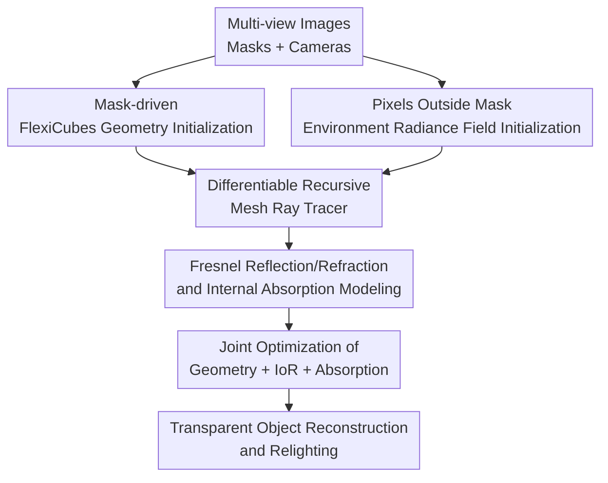

# DiffTrans: Differentiable Geometry-Materials Decomposition for Reconstructing Transparent Objects

**Conference**: ICLR2026  
**OpenReview**: [https://openreview.net/forum?id=H4VySIfvZE](https://openreview.net/forum?id=H4VySIfvZE)  
**Code**: To be confirmed  
**Area**: 3D Vision  
**Keywords**: Transparent object reconstruction, differentiable rendering, refractive index estimation, absorptive materials, multi-view reconstruction

## TL;DR
DiffTrans targets transparent objects with complex topologies and internal absorption textures. It initializes geometry and environment light from multi-view images and masks, then jointly optimizes geometry, index of refraction (IoR), and absorption via a differentiable recursive mesh ray tracer, achieving superior geometric reconstruction and relighting performance in both synthetic and real-world scenes.

## Background & Motivation
**Background**: Transparent object reconstruction is a perennially difficult class of inverse rendering problems in 3D vision. The appearance of opaque objects is primarily determined by surface geometry, reflective materials, and lighting. In contrast, transparent objects involve refraction, reflection, total internal reflection, and absorption within the medium. A pixel in a multi-view image of a transparent object does not represent the color of the surface itself, but rather the result of environment light being bent, attenuated, and mixed through the transparent medium.

**Limitations of Prior Work**: Existing methods can be broadly categorized into eikonal/neural field approaches and surface/mesh approaches. The former can describe refraction paths but often struggle to derive reliable meshes due to a lack of strong geometric constraints, leading to unstable shapes for objects with holes, fine details, or complex topologies. The latter provides editable explicit geometry, yet many methods assume ideal transmission, surface specularities, or surface-only materials, failing to model the colored internal absorption textures common in real-world glass, resin, or gemstones.

**Key Challenge**: The appearance of transparent objects is simultaneously influenced by geometry, environment, and materials, which are highly coupled. Optimizing only geometry leads to internal textures being misinterpreted as shape noise; optimizing only surface materials fails to express the color attenuation as light propagates through the object. Direct end-to-end optimization of all variables from a random state is prone to local optima due to the ill-posed nature of transparent rendering.

**Goal**: The authors aim to recover the explicit mesh, global IoR, and a spatially-varying absorption field of transparent objects from multi-view RGB images, object masks, and camera parameters. Beyond novel view synthesis, the model enables relighting under new environment lights, demonstrating successful decomposition of geometry, material, and environment rather than mere memorization of training-view appearances.

**Key Insight**: DiffTrans adopts progressive training. It first obtains a stable initial mesh using masks and differentiable rasterization while learning the environment radiance field from regions outside the masks. It then employs a physically-grounded recursive ray tracer to combine refraction, reflection, medium absorption, and environment sampling to jointly refine geometry and materials. The key is not to model every physical phenomenon at maximum complexity, but to retain critical refraction and absorption while ensuring exportable and editable results through explicit meshes.

**Core Idea**: A two-stage framework consisting of "mask-driven geometry and environment initialization" followed by "differentiable recursive ray tracing for material decomposition," replacing pipelines that only perform surface reconstruction or pure neural radiance field fitting.

## Method
DiffTrans takes multi-view images, masks, and camera parameters as input and outputs the object mesh, global IoR, spatially-varying absorption, and an environment radiance field. The paper makes three simplifying assumptions: uniform IoR within the object (light travels in straight lines internally); material description via IoR and absorption only; and purely specular transparent surfaces without modeling roughness. While these limit the scope, they allow for efficient differentiable recursive ray tracing and avoid complex path solving required by eikonal rendering.

### Overall Architecture
The pipeline is divided into an initialization phase and a refinement phase. The initialization phase uses multi-view masks to supervise FlexiCubes for extracting the initial mesh and trains the environment radiance field using pixels outside the masks. The refinement phase places this mesh into a recursive ray tracer: each camera ray splits into reflection and refraction branches at the surface according to Fresnel equations, accumulates light attenuation based on the absorption field inside the object, and queries the environment radiance field for colors outside. Geometry, IoR, and absorption are jointly updated via backpropagation of rendering errors.

### Key Designs
**1. Mask-driven FlexiCubes Geometry Initialization: Providing a stable, explicit starting point via silhouette constraints.**

The RGB appearance of transparent objects is unreliable for initial geometry optimization as environment textures, refractive distortions, and object shape are confounded. DiffTrans uses only masks for initialization: representing the surface via FlexiCubes and projecting the 3D mesh onto the 2D plane via a differentiable rasterizer. The initial shape is supervised by an $L_1$ loss between the rendered mask $\hat{M}_i$ and the ground truth mask $M_i$: $L_{geo-init}=\frac{1}{N}\sum_{i\in B}\|\hat{M}_i-M_i\|_1$.

To address the lack of direct geometric gradients inside the mask and handle holes or occlusions, the authors introduce dilation regularization to push SDF values toward the surface. Smoothness regularization using screen-space gradients of depth and normal maps is applied to suppress high-frequency noise.

**2. Environment Radiance Field Initialization: Learning background lighting first to avoid misattributing environment light to object materials.**

Since transparent appearance is largely transformed environment light, failing to model the environment results in the optimizer incorrectly embedding background color variations into the absorption or geometry. DiffTrans trains an environment radiance field (using coarse dense grids, fine triplanes, and proposal grids) using only pixels outside the mask: $L_{env-init}=\sum_i \| (\hat{I}_i-I_i)\circ(1-M_i)\|_1$. This field serves as the reference for appearance decomposition in the subsequent ray tracing stage.

**3. Fresnel Reflection/Refraction and Internal Absorption Modeling: Decoupling transparent appearance into directional changes and medium attenuation.**

 DiffTrans decomposes the imaging process into surface interaction and internal absorption. When a ray hits a surface, the reflection direction $\omega_r$ and refraction direction $\omega_t$ are determined by the normal and IoR ratio $\eta$. Reflectance $R$ and transmittance $T=1-R$ are calculated via Fresnel equations. Internal color changes are controlled by an absorption field $\mu_t(x)$ following the non-scattering absorption model: $L(x,\omega)=L(x_0,\omega)\exp(-\int_{x_0}^{x}\mu_t(s)ds)$.

**4. Differentiable Recursive Mesh Ray Tracer: Updating mesh, IoR, and absorption via physical rendering errors.**

In the refinement stage, rays are recursively traced until they exit the object or reach a maximum depth $D_{max}$. Errors between the rendered and real images are propagated to update the mesh vertices, IoR, and material field. This process is implemented in OptiX and CUDA to maintain computational efficiency for the analysis-by-synthesis training.

### Loss & Training
The strategy involves two stages: Initialization and Ray Tracing Refinement.

In the initialization stage, geometry is optimized using mask loss and various regularizations (BCE, surface area, developability, Laplacian). The environment field is trained concurrently on background pixels.

In the refinement stage, mesh vertices, IoR, and absorption are jointly optimized. The color loss is weighted by the ground truth color: $L_{color}=\frac{1}{|B|}\sum_{i\in B}\| (\hat{c}_i-c_i)\cdot c_i\|_2^2$. A tone regularization $L_{tone}=(1-\frac{\hat{c}\cdot c}{\|\hat{c}\|\|c\|})^2-var(c)$ is added to constrain color channel ratios, mitigating gradient bias caused by incorrect background modeling.

## Key Experimental Results

### Main Results
Evaluations were conducted on 6 synthetic scenes (bunny, cow, monkey, etc.) and real-world scenes. Indicators include Chamfer Distance (CD), F1-score, and relighting performance (PSNR, SSIM, LPIPS).

| Task | Metric | DiffTrans | Prev. SOTA / Baselines | Gain |
|------|------|-----------|----------------------|------|
| Avg. Geometry (Synthetic) | CD $\times 10^{-4}$ ↓ | 3.264 | NU-NeRF 7.891 / NeRRF 13.341 | ~58.6% improvement over best baseline |
| Avg. Geometry (Synthetic) | F1 $\times 10^{-1}$ ↑ | 8.386 | Ours(S1) 8.088 / NU-NeRF 8.026 | Refinement improves over init by 0.298 |
| Avg. Relighting (Synthetic) | PSNR ↑ | 23.17 | NeRO 19.64 / NeRRF 19.25 | +3.53 dB over best baseline |
| Avg. Relighting (Synthetic) | LPIPS ↓ | 0.0678 | NeRRF 0.0812 / NeRO 0.0856 | Lowest perceptual error |

### Ablation Study
The study highlights the role of tone regularization in stabilizing color ratios, preventing background brightness differences from being misattributed to absorption.

| Configuration | Scene | PSNR ↑ | SSIM ↑ | LPIPS ↓ | Note |
|------|------|--------|--------|---------|------|
| w/o $L_{tone}$ | horse | 27.00 | 0.9208 | 0.0514 | Higher perceptual error without tone constraint |
| Full | horse | 27.03 | 0.9278 | 0.0457 | Improvement across all metrics |
| Full | hand | 23.39 | 0.8736 | 0.1420 | Significant aid in complex texture scenes |

### Key Findings
- While mask-based initialization provides a strong baseline (F1 8.088), recursive ray tracing refinement further improves geometry (F1 8.386).
- DiffTrans outperforms baselines especially in scenes with complex topologies and internal textures where baselines often produce rough surfaces or incorrect hole geometry.
- The method yields highly accurate IoR estimates (e.g., 1.484 for a GT of 1.485 on the "hand" scene).

## Highlights & Insights
- Modeling internal textures as an absorption field rather than surface property is the standout contribution, enabling reconstruction of resin and gemstones.
- FlexiCubes provides a practical, stable explicit starting point using silhouettes, effectively decoupling shape from refractive distortion early on.
- Pre-training the environment field from background pixels provides a necessary reference frame for material decomposition.
- The differentiable mesh ray tracer yields results that are inherently exportable and compatible with standard graphics pipelines for relighting.

## Limitations & Future Work
- The uniform IoR assumption prevents modeling of inhomogeneous media or layered materials.
- The absence of scattering, roughness, and polarization limits the handling of frosted glass or turbid liquids.
- Performance depends on high-quality multi-view masks and camera poses; failures in environment modeling or pose estimation propagate to geometry and material errors.

## Related Work & Insights
- **vs NeRRF/NU-NeRF**: DiffTrans offers better geometry exportability and explicit internal texture modeling compared to pure neural field approaches.
- **vs NeRO**: While NeRO targets reflective objects, DiffTrans’s modeling of refraction and internal absorption provides significantly more realistic relighting for transparent objects.
- **Insight**: For ill-posed inverse rendering, using reliable weak supervision (masks) to establish a stable structure before applying physical differentiable rendering to solve coupled variables is a robust strategy.

## Rating
- Novelty: ⭐⭐⭐⭐⭐ 
- Experimental Thoroughness: ⭐⭐⭐⭐☆ 
- Writing Quality: ⭐⭐⭐⭐☆ 
- Value: ⭐⭐⭐⭐⭐ 

<!-- RELATED:START -->

## Related Papers

- [\[CVPR 2026\] Opti-NeuS: Neural Reconstruction for Dual-Layered Transparent and Opaque Objects](../../CVPR2026/3d_vision/opti-neus_neural_reconstruction_for_dual-layered_transparent_and_opaque_objects.md)
- [\[CVPR 2026\] RHINO: Reconstructing Human Interactions with Novel Objects from Monocular Videos](../../CVPR2026/3d_vision/rhino_reconstructing_human_interactions_with_novel_objects_from_monocular_videos.md)
- [\[CVPR 2025\] PICO: Reconstructing 3D People In Contact with Objects](../../CVPR2025/3d_vision/pico_reconstructing_3d_people_in_contact_with_objects.md)
- [\[CVPR 2026\] 3DReflecNet: A Large-Scale Dataset for 3D Reconstruction of Reflective, Transparent, and Low-Texture Objects](../../CVPR2026/3d_vision/3dreflecnet_a_large-scale_dataset_for_3d_reconstruction_of_reflective_transparen.md)
- [\[ICLR 2026\] MultiMat: Multimodal Program Synthesis for Procedural Materials using Large Multimodal Models](multimat_multimodal_program_synthesis_for_procedural_materials_using_large_multi.md)

<!-- RELATED:END -->
