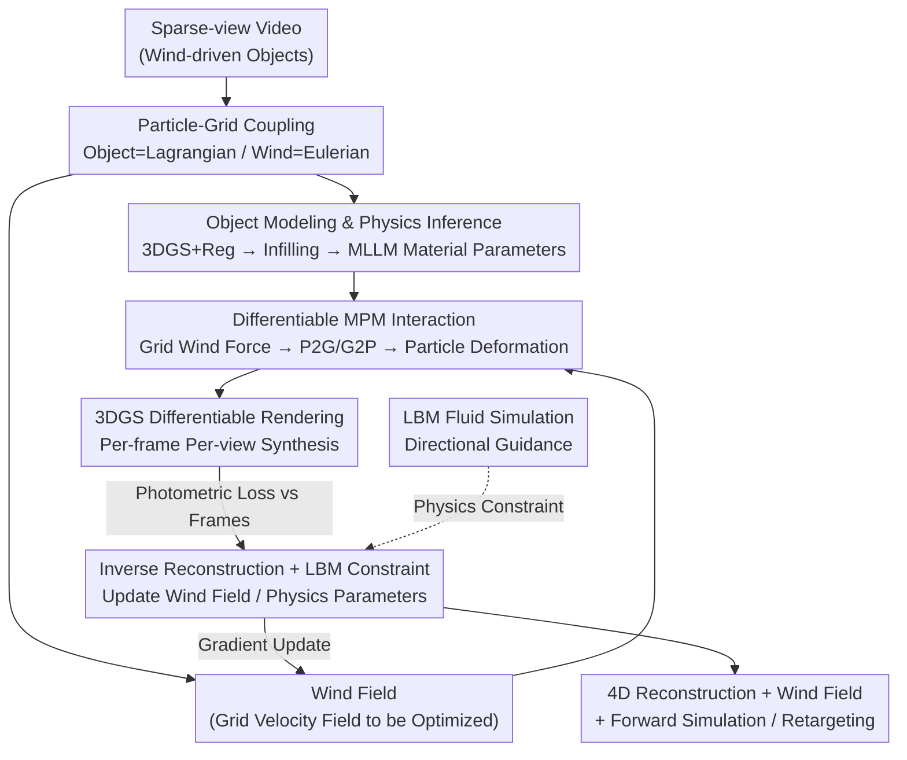

# DiffWind: Physics-Informed Differentiable Modeling of Wind-Driven Object Dynamics

**Conference**: ICLR 2026  
**arXiv**: [2603.09668](https://arxiv.org/abs/2603.09668)  
**Code**: None (Project page mentioned in paper)  
**Area**: 3D Vision / Physics Simulation  
**Keywords**: physics-informed, differentiable simulation, wind modeling, 3D Gaussian Splatting, Material Point Method

## TL;DR
Ours proposes DiffWind, a physics-constrained differentiable framework that jointly reconstructs wind fields and object motion from videos by modeling wind as a grid-based physics field, representing objects as 3D Gaussian Splatting (3DGS) particle systems, and utilizing the Material Point Method (MPM) for wind-object interaction. By incorporating the Lattice Boltzmann Method (LBM) as a physical constraint, the framework supports forward simulation under novel wind conditions and wind retargeting, significantly outperforming existing dynamic scene modeling methods on the self-built WD-Objects dataset.

## Background & Motivation

**Background**: Extensive work exists for modeling object dynamics from video observations, such as dynamic scene reconstruction based on NeRF and 3D Gaussian Splatting (3DGS). However, these methods primarily focus on self-motion or simple interactions, while research remains limited regarding complex deformations driven by invisible external forces like wind.

**Limitations of Prior Work**:
   - **Invisibility of Wind**: Unlike collision forces, wind lacks clear contact points; it is continuously distributed in space and varies over time, making it impossible to observe directly from video.
   - **Spatio-temporal Variability**: Wind fields vary across both space and time—wind speed and direction may differ at various locations in the same scene and evolve continuously.
   - **Complex Deformations**: Wind-driven objects (e.g., flags, leaves, cloth) produce complex non-rigid deformations that are difficult to describe with simple motion models.
   - **Lack of Physical Grounding**: Existing dynamic reconstruction methods (e.g., Dynamic 3DGS) only fit appearance changes without modeling underlying physical forces, thus failing to generalize to new wind conditions or perform forward simulation.

**Key Challenge**: Recovering wind-driven object dynamics from video requires simultaneously estimating the invisible wind field and the physical response of the object—a highly under-constrained inverse problem. Data fitting alone can reconstruct appearance but fails to capture physical laws required for simulation and generalization.

**Goal**: Propose a unified framework to recover wind fields and object motion from video while ensuring physical validity, supporting downstream applications such as forward simulation and wind retargeting.

**Key Insight**: Combine physics simulation primitives (particle systems + MPM) with neural rendering (3DGS + differentiable rendering). Use a differentiable pipeline to back-optimize the wind field from video, while employing LBM fluid dynamics constraints to ensure the recovered wind field satisfies physical laws.

**Core Idea**: Differentiable rendering for appearance supervision + MPM for physical dynamics modeling + LBM for fluid physics constraints = physically consistent reconstruction of wind-object interaction from video.

## Method

### Overall Architecture

DiffWind solves a highly under-constrained inverse problem: simultaneously inferring invisible spatio-temporal wind fields and physical responses from sparse-view videos. The Mechanism represents the two media according to their physical properties—objects are represented as Lagrangian particles derived from 3DGS, while wind is represented as an Eulerian grid-based velocity/force field. MPM is used to apply wind forces from the grid to the particles to compute deformation. The entire forward chain (wind field $\rightarrow$ MPM simulation $\rightarrow$ particle deformation $\rightarrow$ 3DGS rendering) is fully differentiable, allowing pixel-level photometric losses to propagate back to the wind field and material parameters. Simultaneously, an LBM simulation provides directional guidance at each time step to push the optimization toward fluid-dynamically valid solutions.

### Key Designs

**1. Particle-Grid Coupling: Lagrangian for Objects, Eulerian for Wind**
A major challenge is that wind and objects have opposing physical properties. DiffWind uses Lagrangian particles for objects (where each particle carries appearance and material properties) and an Eulerian grid for wind (representing density, velocity, and force). These are coupled via MPM, where the wind grid aligns with the MPM background grid, allowing wind forces to be directly applied. This ensures both media use their most suitable discretization while allowing gradients from appearance supervision to flow seamlessly into physical states.

**2. Object Modeling & Physics Inference: Transforming 3DGS into Simulatable Particles**
To treat Gaussians as physical particles, appearance alone is insufficient. Ours applies two regularizations during static 3DGS optimization: an anisotropy loss $L_{aniso}$ to suppress needle-like artifacts and an opacity loss $L_o$ to force opacities toward 0 or 1. Internal points are added using Kaolin's octree voxel filling for geometric support. Material properties (density, Poisson's ratio $\nu_p$, and Young's modulus $E$) are inferred by a "physics agent" using 3D-consistent feature fields and Multi-modal Large Language Models (MLLM) to map regions to material parameters.

**3. Differentiable MPM Interaction: Translating Wind Forces to Particle Deformation**
DiffWind employs the Material Point Method (MPM) as a differentiable engine. In each time step, particle mass and velocity are projected to the grid (P2G), material internal forces and wind external forces are applied to update grid velocity, and the updated velocity is interpolated back to particles (G2P) to update positions. Gaussian covariances are updated via $\Sigma_p(t)=F_p(t)\,\Sigma_p\,F_p(t)^{T}$, where $F_p$ is the deformation gradient, ensuring appearance and deformation remain synchronized.

**4. Differentiable Inverse Reconstruction + LBM Constraints: Inferring Physically Valid Wind**
To prevent the optimizer from finding physically impossible wind fields that merely fit the pixels, DiffWind incorporates LBM (specifically HOME-LBM). While the primary supervision comes from the photometric loss $L_{render}$ between rendered images and video frames, LBM provides directional guidance at each time step. By solving the discretized Boltzmann equation to recover Navier-Stokes behavior, LBM constrains the wind field to follow fluid dynamics, narrowing the search space to physically plausible solutions.

### Loss & Training

Training consists of two stages. The **Static Stage** optimizes 3DGS on static frames with $L_{static}=L_{color}+\lambda_a L_{aniso}+\lambda_o L_o$. The **Dynamic Stage** jointly optimizes the wind field and object deformation over the sequence. The main supervision is the photometric loss $L_{render}$, while LBM provides directional guidance as a physical constraint. Wind and physical parameters (e.g., elasticity) are updated concurrently in the same differentiable loop.

## Key Experimental Results

### Main Results

| Task | Metric | Ours | Prev. SOTA | Gain |
|------|------|----------|----------|------|
| Dynamic Recon (Syn) | PSNR↑ | **Significant** | Dynamic 3DGS | Large |
| Dynamic Recon (Syn) | SSIM↑ | **Significant** | Dynamic 3DGS | Large |
| Dynamic Recon (Syn) | LPIPS↓ | **Significant** | Dynamic 3DGS | Large |
| Wind Estimation (Syn) | Velocity Error | Physically Valid | N/A | — |
| Forward Sim | Visual Quality | High Fidelity | Not Supported | — |

### Ablation Study

| Configuration | Key Metric | Description |
|------|---------|------|
| w/o LBM Constraint | Wind Physicality Drops | Wind fields become physically inconsistent without fluid dynamics constraints. |
| w/o MPM (Appearance only) | No Simulation | Degenerates to pure 3DGS reconstruction; loses physical semantics. |
| Different Materials | Validated | Framework generalizes across cloth, thin plates, and foliage. |

### Key Findings
- **Superiority over data-driven methods**: Physics constraints not only improve reconstruction quality but also enable simulation and generalization.
- **Criticality of LBM**: Without LBM, optimized wind fields may match the video but exhibit physically impossible abrupt velocity changes.
- **Forward Simulation Advantage**: Once reconstructed, one can change wind parameters (direction, intensity) to generate new motion sequences.
- **Wind Retargeting**: Wind fields recovered from one scene can be applied to new objects to generate physically plausible animations.

## Highlights & Insights

- **Recovery from Invisible Forces**: Wind is a classic "invisible force." DiffWind infers it indirectly through its effects on objects via a differentiable chain (Video $\rightarrow$ Rendering $\rightarrow$ Simulation $\rightarrow$ Wind Field).
- **Seamless Integration**: 3DGS particles serve as both rendering and simulation primitives, avoiding expensive conversion between heterogeneous representations.
- **LBM as Physical Regularizer**: Instead of hard-solving Navier-Stokes, LBM is used as soft guidance, which is more flexible for optimization while ensuring physical trends remain reasonable.
- **Beyond Reconstruction**: The ability to perform forward simulation and retargeting positions this as a creative tool for VFX and VR rather than just an analysis tool.

## Limitations & Future Work

- **Computational Cost**: Joint optimization of MPM and differentiable rendering is computationally intensive.
- **Single Fluid Type**: Currently limited to air (wind); does not yet model water or sand flows.
- **Topology Limits**: MPM handles large deformations well but has limited support for tearing or fracturing without specific modifications.
- **Real-world Evaluation**: Lacks ground truth for wind fields in real videos, necessitating qualitative evaluation or external sensor validation.

## Related Work & Insights

- **Differentiable Physics**: Frameworks like DiffTaichi or Warp provide the foundation for this work's inverse problem solving.
- **3D Gaussian Splatting**: While vanilla 3DGS is static and Dynamic 3DGS is data-driven, PhysGaussian introduced physics but did not address external wind forces.
- **Fluid-Structure Interaction (FSI)**: A classic engineering problem. Unlike traditional FSI which requires known boundary conditions, DiffWind infers them from observations.

## Rating
- Novelty: ⭐⭐⭐⭐⭐
- Experimental Thoroughness: ⭐⭐⭐⭐
- Writing Quality: ⭐⭐⭐⭐
- Value: ⭐⭐⭐⭐⭐

<!-- RELATED:START -->

## Related Papers

- [\[ICLR 2026\] Learning Physics-Grounded 4D Dynamics with Neural Gaussian Force Fields](learning_physics-grounded_4d_dynamics_with_neural_gaussian_force_fields.md)
- [\[ICLR 2026\] PAINET: A Principled Efficient Transformer for 3D Dynamics Modeling](painet_a_principled_efficient_transformer_for_3d_dynamics_modeling.md)
- [\[AAAI 2026\] Physics-Informed Deformable Gaussian Splatting: Towards Unified Constitutive Laws for Time-Evolving Material Field](../../AAAI2026/3d_vision/physics-informed_deformable_gaussian_splatting_towards_unified_constitutive_laws.md)
- [\[CVPR 2026\] D-Prism: Differentiable Primitives for Structured Dynamic Modeling](../../CVPR2026/3d_vision/d-prism_differentiable_primitives_for_structured_dynamic_modeling.md)
- [\[CVPR 2026\] Dynamic Black-hole Emission Tomography with Physics-informed Neural Fields](../../CVPR2026/3d_vision/dynamic_black-hole_emission_tomography_with_physics-informed_neural_fields.md)

<!-- RELATED:END -->
## Related Papers

- [\[ICLR 2026\] Learning Physics-Grounded 4D Dynamics with Neural Gaussian Force Fields](learning_physics-grounded_4d_dynamics_with_neural_gaussian_force_fields.md)
- [\[CVPR 2026\] D-Prism: Differentiable Primitives for Structured Dynamic Modeling](../../CVPR2026/3d_vision/d-prism_differentiable_primitives_for_structured_dynamic_modeling.md)
- [\[AAAI 2026\] Physics-Informed Deformable Gaussian Splatting: Towards Unified Constitutive Laws for Time-Evolving Material Field](../../AAAI2026/3d_vision/physics-informed_deformable_gaussian_splatting_towards_unified_constitutive_laws.md)
- [\[CVPR 2026\] Dynamic Black-hole Emission Tomography with Physics-informed Neural Fields](../../CVPR2026/3d_vision/dynamic_black-hole_emission_tomography_with_physics-informed_neural_fields.md)
- [\[NeurIPS 2025\] MPMAvatar: Learning 3D Gaussian Avatars with Accurate and Robust Physics-Based Dynamics](../../NeurIPS2025/3d_vision/mpmavatar_learning_3d_gaussian_avatars_with_accurate_and_robust_physics-based_dy.md)

<!-- RELATED:END -->
