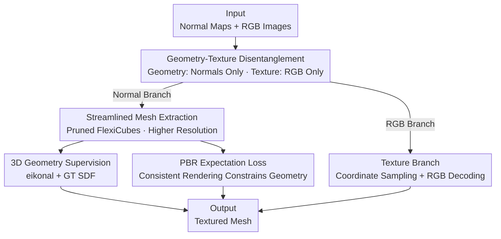

# DiMeR: Disentangled Mesh Reconstruction Model with Normal-only Geometry Training

**Conference**: ICLR2026  
**OpenReview**: [https://openreview.net/forum?id=fK2pCgoavb](https://openreview.net/forum?id=fK2pCgoavb)  
**Code**: Yes (Public on project page, noted as Project Page in the paper)  
**Area**: 3D Vision  
**Keywords**: Mesh Reconstruction, Geometry-Texture Disentanglement, Normal Maps, Feed-forward LRM, 3D Supervision

## TL;DR
DiMeR decomposes feed-forward mesh reconstruction from sparse views into two non-interfering branches: geometry relies solely on normal maps, while texture relies solely on RGB images. By equipping the geometry branch with a streamlined FlexiCubes extractor and genuine 3D supervision (eikonal + GT SDF + PBR expectation loss), it reduces Chamfer Distance by over 30% on GSO and OmniObject3D.

## Background & Motivation

**Background**: Since LRM demonstrated the feasibility of feed-forward NeRF generation from a single image, numerous works (InstantMesh, MeshLRM, PRM, etc.) have extended this to mesh representations. The typical pipeline involves encoding multi-view RGB with ViT, decoding features into a Triplane, extracting an SDF grid, using differentiable isosurface algorithms like FlexiCubes to extract the mesh, and supervising with differentiable rasterization. This "feed-forward + RGB input + FlexiCubes" paradigm has become mainstream.

**Limitations of Prior Work**: The authors identify two persistent issues. First, **texture masks geometry**—visually plausible rendered images may hide incorrect geometry paired with "over-fitted" textures. This means a single RGB image corresponds to several equivalent solutions in the joint geometry-texture space, leading the network to learn an over-smoothed average. Second, the **FlexiCubes extraction chain is both redundant and unstable**: the defined SDF grid only ensures meaningful signs for surface extraction rather than being a true SDF, making 3D supervision difficult; its two MLPs (vertex/edge weight and mesh deformation networks) incur high computational costs with minimal gains; and its inherent regularization losses often cause training collapse around 10k iterations.

**Key Challenge**: The root cause is that using RGB as the input signal for geometry is inherently ambiguous—RGB encodes both geometry and appearance. The network cannot distinguish whether a change in shading is due to shape variation or material pattern, leading to competing optimization objectives in the same solution space (a one-to-many ill-posed mapping).

**Goal**: (1) Eliminate input ambiguity during geometry reconstruction; (2) Streamline and stabilize the mesh extraction chain, enabling it to utilize 3D supervision.

**Key Insight**: The authors leverage a simple but crucial inductive bias—**normal maps are strictly consistent with geometry**. Normals are uniquely determined by the surface and faithfully encode local curvature changes, unlike RGB which is mixed with appearance. Based on Occam's razor, since normals can unambiguously determine geometry, the geometry branch should only be fed with normals.

**Core Idea**: **Disentangle** the entangled joint geometry-texture space into two independent spaces—geometry is predicted solely from normal maps, while texture is predicted solely from RGB images, each with its own supervision. Concurrently, FlexiCubes is streamlined and replaced with true 3D-based regularization and supervision. By utilizing off-the-shelf normal prediction models (e.g., Lotus, StableNormal, which generate maps in ~200ms), DiMeR still only requires RGB input externally, maintaining interface consistency with baselines.

## Method

### Overall Architecture
DiMeR is a dual-branch feed-forward mesh reconstruction model: the top **geometry branch** takes only normal maps to reconstruct the shape; the bottom **texture branch** takes only RGB images to color the reconstructed shape. The two branches are structurally symmetrical (both using ViT encoding and Triplane decoding), but their inputs, supervision, and outputs are completely separated, finally merging into a textured mesh.

Geometry Branch: $K$ normal maps $N \in \mathbb{R}^{K\times H\times W\times 3}$ from random views plus camera embeddings $\zeta$ are processed by a ViT normal encoder to obtain patch features. A Triplane decoder then aggregates these into triplane features $F_g$, from which an SDF grid is extracted and passed to a streamlined FlexiCubes to produce mesh vertices and faces. The reconstructed (untextured) mesh can be rasterized into normal/depth/mask maps from any view or used for PBR rendering under random lighting and materials to produce specular/diffuse maps for supervision. Texture Branch: RGB images $I$ are processed by a ViT image encoder and Triplane decoder to obtain features $F_c$. Using the world coordinates $\text{Coord}_I$ of pixels rasterized from the geometry branch, the model samples per-pixel texture features from $F_c$, which are finally decoded into colors.

### Key Designs

**1. Geometry-Texture Disentanglement: Severing RGB Ambiguity**

This is the core of the paper, directly addressing "texture masking geometry" and "conflicting training objectives." Since a single RGB image corresponds to multiple solutions in the joint space, the authors split the joint space into two independent ones. The geometry branch **only** receives normal maps, and the texture branch only receives RGB. Because normals are uniquely determined by the surface, the mapping from input to output becomes clear, reducing training complexity. Supervision is also decoupled—the geometry branch uses only geometry-related losses (normal, depth, mask, SDF, PBR) and omits RGB rendering terms that introduce ambiguity. Texture uses only RGB loss $L_t = (\hat I - I_{GT})^2 + \text{LPIPS}(\hat I, I_{GT})$. Ablations (Table 3) confirm that switching from "RGB+Normal → Geometry" to "Only Normal → Geometry" drops CD from 0.041 to 0.028, proving that removing RGB input and supervision brings significant gains.

**2. Streamlined Mesh Extraction: Pruning Redundant MLPs in FlexiCubes**

Original FlexiCubes requires two MLPs: one for edge/vertex weights and one for mesh deformation. For an $N^3$ grid, this requires calculating $N^3$ deformations, $12N^3$ edge weights, and $8N^3$ vertex weights, which is computationally expensive. The authors found (Table 5) that **directly removing** these networks from a pre-trained model results in almost no drop in CD/F1 (0.045/0.964 → 0.045/0.963), while reducing memory from 73GB to 48GB and inference time from 0.5s to 0.2s (approx. 2.5× speedup, 1.5× memory saving). The saved budget is used to **increase extraction resolution**, allowing for finer detail reconstruction.

**3. 3D Geometry Supervision: Turning Pseudo-SDF into True SDF**

FlexiCubes' SDF grid only guarantees sign meaningfulness, not true distance fields, and its original regularization losses often cause training collapse. The authors introduce the **eikonal loss** to regularize the space into a true SDF field, requiring the gradient norm of the SDF relative to coordinates to be 1:

$$L_{eik} = \mathbb{E}_x\big(\|\nabla_x \text{SDF}(x)\|_2 - 1\big)^2,\quad x \sim \text{Uniform}(-1,1)$$

Calculating derivatives for all $N^3$ grid points is expensive and prone to overfitting, so the authors use **random sampling** (200K points per iteration) to approximate the expectation. They also use GT mesh SDF values to supervise the grid points directly: $L_{sdf} = \|\text{SDF}(v) - \text{SDF}_{GT}(v)\|_2^2$ (caching GT SDFs to save costs). This allows the training to remain stable past 10,000 iterations.

**4. PBR Expectation Loss: Ensuring Correct Geometry via Rendering Consistency**

Inspired by photometric stereo, if a mesh renders correct specular and diffuse maps under various lighting and materials, its geometry must be correct. The authors introduce PBR expectation loss, placing the predicted mesh $\hat O$ in environments with randomly sampled lighting $e$, metallicity $m$, and roughness $r$, constraining consistency with the GT mesh $O$:

$$L_{spec} = \mathbb{E}_{e,m,r}\Big[\|\text{Spec}(\hat O,e,m,r) - \text{Spec}(O,e,m,r)\|^2 + \text{LPIPS}(\cdot)\Big]$$

The diffuse term $L_{diff}$ is similar. This adds a "statistical expectation" constraint—incorrect geometry might pass under a single lighting condition but cannot maintain consistency across multiple random lightings/materials. The total loss for the geometry branch is $L_g = L_{eik} + L_{sdf} + L_{spec} + L_{diff} + L_{nor} + L_{dep} + L_{mask}$.

### Loss & Training
The geometry branch uses normal loss $L_{nor} = M_{GT}\otimes(1 - \hat N\cdot N_{GT})$, depth loss $L_{dep} = M_{GT}\otimes|\hat D - D_{GT}|$, mask loss $L_{mask} = (\hat M - M_{GT})^2$, combined with eikonal, GT SDF, and PBR expectation losses. The texture branch uses only RGB + LPIPS. Training data includes 98,526 objects from Objaverse. Input views are randomly sampled with slight camera noise. Noise is also injected into input normal maps to adapt to errors from normal foundation models during inference.

## Key Experimental Results

### Main Results
Sparse view reconstruction on GSO / OmniObject3D (6 random view inputs), CD (Lower is better):

| Dataset | Method | CD ↓ | F1 ↑ | PSNR ↑ | LPIPS ↓ |
|--------|------|------|------|--------|---------|
| GSO | InstantMesh | 0.045 | 0.964 | 18.51 | 0.150 |
| GSO | PRM | 0.041 | 0.977 | 21.68 | 0.126 |
| GSO | DiMeR (StableNormal) | 0.032 | 0.988 | 22.89 | 0.103 |
| GSO | **DiMeR (GT Normal)** | **0.028** | **0.992** | **23.40** | **0.095** |
| OmniObject3D | PRM | 0.034 | 0.991 | 21.65 | 0.135 |
| OmniObject3D | **DiMeR (GT Normal)** | **0.024** | **0.996** | **23.04** | **0.112** |

Using GT normals reduces CD by ~31.7% compared to PRM on GSO; even with predicted normals, the Gain is ~22%. In single-image-to-3D tasks (Table 2), DiMeR achieves CD 0.052, outperforming PRM's 0.059.

### Ablation Study

| Configuration | CD ↓ | F1 ↑ | Description |
|------|------|------|------|
| RGB+Normal → Geo+Tex | 0.043 | 0.976 | Fully entangled |
| RGB+Normal → Geo | 0.041 | 0.981 | Separate Geo/Tex outputs |
| **Normal Only → Geo (Ours)** | **0.028** | **0.992** | Decoupled input |
| w/o 3D Reg (Eq.1-2) | 0.037 | 0.975 | No eikonal/GT SDF |
| w/o PBR Expect (Eq.3-4) | 0.039 | 0.973 | No PBR loss |
| Full Model | 0.028 | 0.992 | — |

FlexiCubes MLP ablation (Table 5): CD/F1 remained almost unchanged (0.045→0.045 / 0.964→0.963), while VRAM dropped 73GB→48GB and inference 0.5s→0.2s.

### Key Findings
- **Gains from disentanglement primarily come from removing RGB input**: Separating the output heads only improved CD from 0.043 to 0.041. Restricting geometry input to normals only caused the leap to 0.028—demonstrating that resolving input ambiguity is the cure.
- **3D supervision and PBR loss are both essential**: Omitting either leads to a significant CD increase. They complement each other by constraining the distance field and lighting-rendering consistency respectively.
- **FlexiCubes' two MLPs are pure overhead**: For feed-forward reconstruction, they offer extremely low ROI. Cutting them to save budget for higher resolution is more effective.

## Highlights & Insights
- **"Changing the input signal" is more fundamental than "changing the architecture"**: DiMeR does not invent a new geometry backbone; it simply replaces RGB with normals for the geometry branch, resolving the ambiguity plaguing the feed-forward paradigm.
- **Using PBR consistency as geometry supervision is clever**: Converting "is the geometry correct" into "does it render correctly under any lighting" creates a physical inspector that is much stronger than single-view normal supervision.
- **Cost-benefit audit of existing components**: Removing FlexiCubes' MLPs to trade for resolution is a practical engineering insight—not every "universally powerful" module is worth its cost in specific tasks.
- **Backward compatibility**: By relying on normal foundation models, DiMeR only requires RGB externally. It enjoys the benefits of normal inputs without increasing user burden and improves as normal models evolve.

## Limitations & Future Work
- **High dependency on normal prediction quality**: There is a visible gap between DiMeR (GT) and DiMeR (Predicted) (GSO CD 0.028 vs 0.032). Geometry is capped by the external normal model; errors in reflective/transparent materials propagate.
- **Single-Image-to-3D still limited by multi-view diffusion**: This pipeline relies on zero123++/Era3D, where errors can accumulate. The paper only evaluates on 500 "relatively clear" samples, suggesting issues with ill-posed views.
- **Topologically complex objects**: While qualitative results highlight advantages in holes and rings, there is less quantitative analysis on extremely thin or high-genus structures.

## Related Work & Insights
- **vs InstantMesh / PRM / MeshLRM**: These feed RGB multi-view directly into a network, suffering from entanglement and FlexiCubes instability. DiMeR leads significantly in CD due to input decoupling and 3D supervision.
- **vs Hi3DGen**: Also noted that normals improve geometry, but Hi3DGen uses a slow diffusion-based approach. DiMeR is feed-forward and supports dynamic view counts.
- **vs Trellis (3D Diffusion)**: Trellis offers high quality but often lacks consistency with the input (incorrect hole/pillar counts). DiMeR, as a reconstruction model, maintains better input alignment.

## Rating
- Novelty: ⭐⭐⭐⭐ Solving joint-space ambiguity via input-level disentanglement is novel and convincing.
- Experimental Thoroughness: ⭐⭐⭐⭐ Covers three task types with key ablations, though single-image evaluation is somewhat selective.
- Writing Quality: ⭐⭐⭐⭐ Clear motivation; Figure 2 illustrates the pain points intuitively.
- Value: ⭐⭐⭐⭐ 30%+ reduction in CD and plug-and-play normal interface offer high practical value for feed-forward mesh reconstruction.

<!-- RELATED:START -->

## Related Papers

- [\[ICLR 2026\] YoNoSplat: You Only Need One Model for Feedforward 3D Gaussian Splatting](yonosplat_you_only_need_one_model_for_feedforward_3d_gaussian_splatting.md)
- [\[ICML 2026\] Future Dynamic 3D Reconstruction: A 3D World Model with Disentangled Ego-Motion](../../ICML2026/3d_vision/future_dynamic_3d_reconstruction_a_3d_world_model_with_disentangled_ego-motion.md)
- [\[ICLR 2026\] PAGE-4D: VGGT-4D Perception via Disentangled Pose and Geometry Estimation](page-4d_vggt-4d_perception_via_disentangled_pose_and_geometry_estimation.md)
- [\[CVPR 2025\] Feature-Preserving Mesh Decimation for Normal Integration](../../CVPR2025/3d_vision/feature-preserving_mesh_decimation_for_normal_integration.md)
- [\[ICLR 2026\] ReLi3D: Relightable Multi-View 3D Reconstruction with Disentangled Illumination](reli3d_relightable_multi-view_3d_reconstruction_with_disentangled_illumination.md)

<!-- RELATED:END -->
