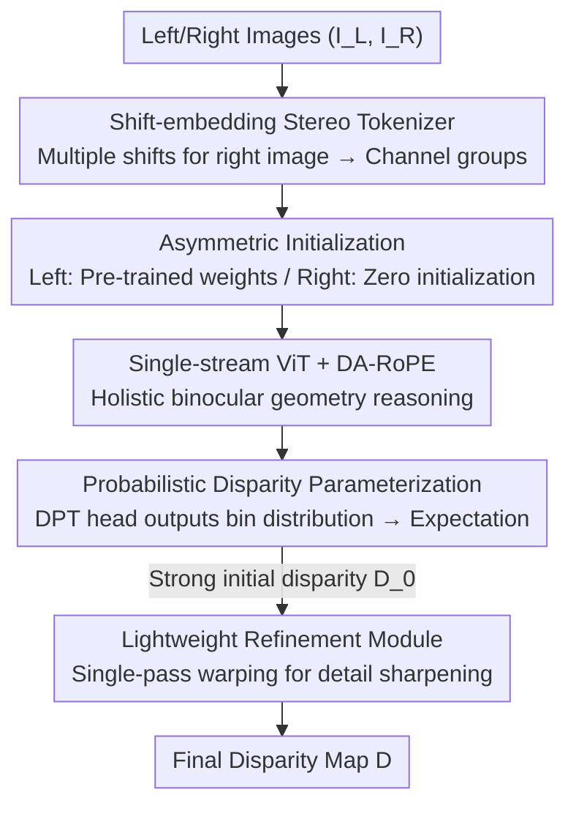

# DispViT: Direct Stereo Disparity Regression with a Single-Stream Vision Transformer

**Conference**: ICLR2026  
**OpenReview**: [https://openreview.net/forum?id=c21yqwf02V](https://openreview.net/forum?id=c21yqwf02V)  
**Code**: https://github.com/aeolusguan/DispViT  
**Area**: 3D Vision / Stereo Matching  
**Keywords**: Stereo disparity estimation, single-stream ViT, direct regression, stereo tokenization, relative position encoding

## TL;DR
DispViT discards the "cost volume construction + iterative refinement" paradigm dominated by the stereo matching field for decades. It utilizes a single-stream ViT to tokenize left and right images into a single sequence for **direct disparity regression**. Supported by lightweight designs like shift-embedding tokenizer, asymmetric initialization, probabilistic disparity parameterization, and disparity-aware RoPE, it achieves SOTA accuracy on benchmarks like Scene Flow. It is significantly more robust and faster in ambiguous scenarios such as occlusion, reflection, and transparency.

## Background & Motivation
**Background**: Deep stereo disparity estimation has long been dominated by the "matching-centric" paradigm. Mainstream approaches (GC-Net, PSMNet, RAFT-Stereo, IGEV, etc.) first extract features for left and right views separately, then explicitly establish pixel-level correspondence—either by constructing 3D/4D cost volumes aggregated by 3D convolutions or by using recurrent decoders to iteratively refine disparity in multi-scale correlation spaces.

**Limitations of Prior Work**: Matching itself is **ill-posed** in visually ambiguous scenes. When encountering transparency, occlusion, repetitive textures, or non-Lambertian surfaces (reflections), reliable correspondences cannot be found between the left and right views, leading to incorrect matches. Worse, these errors are difficult to recover via subsequent local refinement, making the entire pipeline most fragile in scenarios where robustness is most needed.

**Key Challenge**: The root of the problem lies in the "explicit matching" action itself—as long as pixel-level correlation search is performed, incorrect correspondences in ambiguous regions are unavoidable. Recent hybrid methods (DEFOM-Stereo, Monster, BridgeDepth) have hinted at a solution: they use **monocular depth regression** to initialize iterative refinement. Monocular regression naturally does not depend on matching and is thus immune to ambiguity, significantly enhancing robustness. This suggests that "regression" is more resistant to ambiguity than "matching."

**Goal**: Can we simply eliminate the matching stage and regress disparity directly from binocular input? This requires solving two sub-problems: (1) how to tokenize left and right images for ViT input such that a single-stream network can effectively reason about binocular geometry; (2) how to ensure that "direct regression"—traditionally considered ill-posed—is trained stably with sufficient accuracy.

**Key Insight**: The global attention of ViT is already powerful in geometric regression tasks like monocular depth and feed-forward 3D reconstruction. However, in stereo networks, ViT has only been used as a feature extractor within matching pipelines; its potential for "direct disparity regression" remains untapped. Early attempts like DispNetS tried concatenating left and right images along the channel dimension for CNN regression. While the idea was elegant, it was limited by the local receptive field of convolutions, failing to handle large disparities and complex global contexts. ViT's global attention perfectly fills this gap.

**Core Idea**: Replace "cost volume + iterative matching" with a **single-stream ViT for direct disparity regression**, reformulating stereo matching as a holistic regression problem. The single-stream backbone provides a strong initial disparity, followed by a lightweight refinement module for details.

## Method

### Overall Architecture
Given a rectified binocular pair $(I_L, I_R) \in \mathbb{R}^{H\times W\times 3}$, the goal is to predict the left-view disparity map $D \in \mathbb{R}^{H\times W}$. DispViT formulates the process as $\hat{D}_0 = \text{DPT}\big(\Phi \circ \mathcal{T}(I_L, I_R)\big)$: first, a stereo tokenizer $\mathcal{T}$ merges binocular inputs into a **single** token sequence; then, a single-stream ViT $\Phi$ with disparity-aware RoPE performs global reasoning; finally, a DPT head fuses multi-scale features to regress the initial disparity $\hat{D}_0$, which is sharpened into the final $\hat{D}$ by a lightweight refinement module.

The pipeline consists of four steps: ① Stereo tokenization—the left view uses a pre-trained PatchEmbed, while the right view uses shift-embeddings + asymmetric initialization, summed pixel-wise into a single sequence; ② Single-stream ViT backbone (DINOv2/DAv2 initialization) with DA-RoPE for holistic reasoning; ③ DPT head + probabilistic parameterization outputting initial disparity; ④ Lightweight refinement module sharpening details via a single-pass geometric warping. The entire process **involves no explicit cost volume or correlation search**, completely skipping the matching step.

### Key Designs

**1. Shift-embedding Stereo Tokenizer: Encoding alignment cues into channels without degrading into a cost volume**

Directly concatenating left and right views along the channel dimension for ViT faces a critical issue: large disparities cause token-level **pre-attention misalignment**—at the same token position, the left and right views originate from unrelated image regions. Concatenating them introduces noise. The authors' solution is to provide a set of horizontal shift offsets $\{s_k\}_{k=1}^K$ for the right image. Each offset $s_k$ shifts the right image then passes it through a dedicated convolution $E_R^k$, yielding a set of channels: $T_R^{(k)} = E_R^k\big(\text{Shift}(I_R, s_k)\big)$. These are concatenated along the channel dimension to form the right-view embedding $T_R = \text{Concat}(\{T_R^{(k)}\})$. The left view uses the standard pre-trained PatchEmbed $E$ to obtain $T_L$, and finally, they are summed pixel-wise: $T = T_L + T_R$. Thus, each spatial token embeds a "spectrum of potential alignment hypotheses," allowing ViT to find cues even under large displacements. In practice, $T_R$ is computed efficiently via group convolution. Key clarification: shift-embedding **neither constructs nor approximates a cost volume**—it performs no pairwise feature similarity calculation or correlation aggregation; it merely encodes coarse-grained alignment cues as "alignment priors," while disparity is still directly regressed by the ViT. In experiments, $K=8$ with shifts of 24 pixels each, where each shifted view occupies $d/8$ channels.

**2. Asymmetric Initialization: Distinguishing left and right views from the first layer**

When adapting a single-view PatchEmbed for binocular input, the natural approach (e.g., as in Marigold's adaptation of Stable Diffusion) is to duplicate convolution weights and multiply by 1/2. However, the authors found this symmetric initialization performs poorly. They adopt "half-zero" initialization: the new kernel is formed by **concatenating pre-trained weights with a zero tensor of the same shape**, rather than duplicating and halving. The intuition is that this provides a crucial inductive bias—the pre-trained branch treats the left view as a clear, stable reference, while the zero-initialized branch is forced to learn "complementary right-view features." This asymmetry forces the model to distinguish the two views from the first layer, preventing early degradation; symmetric initialization lacks this inherent property. In the shift-tokenizer, $E$ retains pre-trained weights, while $\{E_R^k\}$ are all zero-initialized. Ablations show removing this increases EPE from 0.89 to 0.97 (approx +10%).

**3. Probabilistic Disparity Parameterization: Stabilizing training via bin distributions**

Directly regressing a scalar disparity value is unstable. The authors discretize the disparity range into uniform bins and have the DPT head output a **probability distribution over bins** (inspired by Zholus et al.). The final disparity is the expectation within a local window around the peak probability. This offers two benefits: it fits the "bounded disparity" fact, providing a well-structured output space; and it expresses uncertainty in ambiguous regions rather than collapsing into a scalar. Training uses a combined loss: cross-entropy for discrete distribution + L1 for continuous estimation, $L_{regress} = \text{CE}\big(P, \text{bilinear}(D^*)\big) + \lambda_1 L_1(\hat{D}_0, D^*)$, where $\text{bilinear}(D^*)$ allocates ground-truth disparity to discrete bins via bilinear interpolation. The implementation uses 128 bins uniformly dividing $[0, 381]$ with $\lambda_1=0.1$. The authors highlight this as **one of the most important components**: removing it causes EPE to jump from 0.89 to 1.07 (approx +17% degradation) at the cost of ~30% latency.

**4. Disparity-Aware RoPE (DA-RoPE): Injecting translation equivariance into the value path**

DINOv2 defaults to learnable absolute position encoding (APE), but the authors found APE unsuitable for disparity—disparity is essentially a **relative offset**, while APE only encodes absolute coordinates and lacks mechanisms to capture relative displacement (lacks translation equivariance). Switching to RoPE makes attention dependent on relative offsets, fitting stereo geometry where "disparity manifests as horizontal translation." However, standard RoPE only makes attention weights translation-equivariant; **value vectors remain unaware of relative positions**. For disparity estimation, a feature's semantics are tied to its position relative to the observer. Thus, the authors propose DA-RoPE, injecting relative positions into values: each $v_j$ is rotated by its position $R(p_j)$, aggregated by attention weights, then anti-rotated by the query position $R(-p_i)$,

$$\tilde{z}_i = R(-p_i)\Big(\sum_j \alpha_{ij}R(p_j)v_j\Big) = \sum_j \alpha_{ij}R(p_j - p_i)v_j$$

This is equivalent to rotating each $v_j$ by the relative position $p_j - p_i$ before aggregation—re-expressing features in the query's local reference frame, making both attention weights and aggregated features **disparity-aware**. Combined with asymmetric frequencies (1000 for horizontal, 100 for vertical) to better encode horizontal displacement, adding DA-RoPE and asymmetric frequencies reduced EPE from 0.84 to 0.76.

### Loss & Training
The single-stream regression backbone is first pre-trained with a combined loss (Eq. 4, CE + L1) on a mixture of datasets (FSD, Scene Flow, TartanAir, CREStereo, InStereo2K, etc.) to obtain a robust direct disparity regressor. Subsequently, the **ViT regressor is frozen**, and the refinement module is trained separately following the NMRF protocol (decoupled two-stage training). This decoupling allows the ViT regressor to be deployed independently in efficiency-sensitive scenarios or seamlessly connected to external refinement. The refinement module is borrowed from NMRF but only retains its feature extractor and refinement network, discarding the disparity proposal network and multi-hypothesis reasoning, focusing on "single-pass warping sharpening" rather than RAFT-style iterative cost volume indexing.

## Key Experimental Results

### Main Results
Scene Flow test set (GT disparity ≤ 192 pixels): Single-stream DispViT competes with leading matching methods; with the ~25ms lightweight refinement, DispViT+ significantly outperforms them.

| Method | Type | EPE ↓ | BP-1 ↓ | Time(s) |
|------|------|------|--------|---------|
| RAFT-Stereo | Matching | 0.56 | 6.63 | 0.40 |
| Selective-IGEV | Matching | 0.44 | 4.98 | 0.25 |
| NMRF | Matching | 0.45 | 4.50 | 0.10 |
| DEFOM-Stereo | Hybrid | 0.42 | 5.10 | 0.63 |
| BridgeDepth | Hybrid | 0.37 | 3.67 | 0.14 |
| **DispViT** | Regression | 0.53 | 5.30 | **0.092** |
| **DispViT+** | Reg.+Refine | **0.34** | **3.50** | 0.118 |

Key point: The refinement module is borrowed from NMRF, yet DispViT+ is +24% better than NMRF, indicating the gain comes from **robustness** provided by DispViT as a reliable regression prior, not the refinement architecture itself.

Zero-shot cross-domain generalization (Evaluating on training sets of four real-world datasets without dataset-specific fine-tuning):

| Method | KITTI-12 (D1) | KITTI-15 (D1) | Middlebury (BP-2) | ETH3D (BP-1) |
|------|---------------|---------------|-------------------|--------------|
| NMRF | 4.2 | 5.1 | 7.5 | 3.8 |
| DEFOM-Stereo | 3.8 | 5.0 | 5.7 | 2.4 |
| BridgeDepth | 3.6 | 4.5 | 4.3 | 1.3 |
| DispViT | 3.9 | 4.1 | 5.5 | 4.9 |
| **DispViT+** | 3.2 | 3.5 | 2.4 | 2.3 |

DispViT+ is highly competitive on KITTI and Middlebury; slightly weaker on ETH3D (Note: ETH3D lacks ground truth for non-Lambertian surfaces, which is critical for robustness).

### Ablation Study
ViT-B backbone, Scene Flow training, including "removal study" and "addition study".

| Configuration | EPE ↓ | BP-1 ↓ | Note |
|------|-------|--------|------|
| Baseline (ViT-B) | 0.89 | 10.05 | Incl. DAv2 + Prob. + RoPE + Asym. Init |
| - From scratch (No DAv2) | 1.81 | 20.13 | Worst degradation, significant overfitting |
| - No Prob. Param. | 1.07 | 15.56 | ~17% drop, critical component |
| - No Asym. Init | 0.97 | 11.88 | ~10% drop |
| - No RoPE (Use APE) | 0.96 | 13.34 | ~10% drop |
| + shift-embedding | 0.84 | 9.22 | Progressive addition |
| + DA-RoPE | 0.82 | 8.84 | Progressive addition |
| + Asymmetric Freq. | 0.76 | 8.27 | Cumulative +15% gain |

### Key Findings
- **Large-scale Pre-training is the Foundation**: Training from scratch increased EPE from 0.89 to 1.81. Pre-training aids convergence and provides strong regularization; DAv2 initialization is slightly better than DINOv2.
- **Probabilistic Parameterization contributes most**: Removing it causes ~17% degradation (the most critical single component).
- **Shift-embedding has a small trade-off**: It improves large disparities but slightly loses accuracy in small disparity regions (< 32 pixels) due to reduced channel capacity per shift.
- **Residual Failure Modes**: DispViT still fails on strong specular illusions caused by glass reflections, which are rare in current synthetic datasets.

## Highlights & Insights
- **Paradigm Shift**: Clarifies the "matching vs regression" thread in stereo matching, proving for the first time that a pure-regression single-stream ViT can match or exceed meticulously designed matching pipelines.
- **Restrained Shift-embedding**: Encodes "alignment hypotheses" into channels as priors without performing correlation calculations, retaining geometric cues without introducing the fragility of the matching paradigm.
- **DA-RoPE injecting relative positions into the value path** is a clean extension of RoPE—beneficial for any task where semantics are tied to relative geometric positions.
- **Decoupled Training + Single-pass Warping Refinement**: Backbone can be deployed independently; refinement uses single-pass warping instead of RAFT-style iteration, balancing efficiency (DispViT 0.092s vs RAFT 0.40s).

## Limitations & Future Work
- **Acknowledged Limitations**: Fails on extreme visual illusions like glass reflections; shift-embedding loses slight accuracy in small disparity regions.
- **Fairness Caveat**: DispViT's training regime (ViT-L + large-scale pre-training) differs from comparison methods; zero-shot comparisons are for transparent reference.
- **Efficiency Cost**: Probabilistic parameterization is critical but adds ~30% latency.
- **Future Directions**: Increasing diversity in stereo pre-training data or distilling monocular depth prior into stereo to further improve robustness on non-Lambertian surfaces.

## Related Work & Insights
- **vs RAFT-Stereo / IGEV / NMRF (Matching-centric)**: DispViT skips explicit matching for holistic regression; faster and more robust against ambiguity, though fine details require refinement.
- **vs DEFOM-Stereo / Monster / BridgeDepth (Hybrid)**: These use monocular initialization but keep a matching-driven refinement core. DispViT maximizes the "regression immunity" advantage.
- **vs DispNetS (Early Regression-centric)**: DispViT solves the local receptive field bottleneck of CNNs using ViT's global attention.

## Rating
- Novelty: ⭐⭐⭐⭐⭐ Prove single-stream ViT regression can challenge the matching paradigm.
- Experimental Thoroughness: ⭐⭐⭐⭐⭐ Comprehensive datasets and ablations.
- Writing Quality: ⭐⭐⭐⭐⭐ Clear logic, well-explained shift-embedding.
- Value: ⭐⭐⭐⭐⭐ Provides a robust regression-based baseline for stereo and cross-view tasks.

<!-- RELATED:START -->

## Related Papers

- [\[CVPR 2026\] 240FPS Stereo Vision from Monocular Mixed Spikes](../../CVPR2026/3d_vision/240fps_stereo_vision_from_monocular_mixed_spikes.md)
- [\[ICLR 2026\] Reducing Class-Wise Performance Disparity via Margin Regularization](reducing_class-wise_performance_disparity_via_margin_regularization.md)
- [\[ICLR 2026\] Fast Estimation of Wasserstein Distances via Regression on Sliced Wasserstein Distances](fast_estimation_of_wasserstein_distances_via_regression_on_sliced_wasserstein_di.md)
- [\[ECCV 2024\] BeNeRF: Neural Radiance Fields from a Single Blurry Image and Event Stream](../../ECCV2024/3d_vision/benerf_neural_radiance_fields_from_a_single_blurry_image_and_event_stream.md)
- [\[ICLR 2026\] DepthLM: Metric Depth from Vision Language Models](depthlm_metric_depth_from_vision_language_models.md)

<!-- RELATED:END -->
## Related Papers

- [\[CVPR 2026\] 240FPS Stereo Vision from Monocular Mixed Spikes](../../CVPR2026/3d_vision/240fps_stereo_vision_from_monocular_mixed_spikes.md)
- [\[ICLR 2026\] Reducing Class-Wise Performance Disparity via Margin Regularization](reducing_class-wise_performance_disparity_via_margin_regularization.md)
- [\[ICLR 2026\] Fast Estimation of Wasserstein Distances via Regression on Sliced Wasserstein Distances](fast_estimation_of_wasserstein_distances_via_regression_on_sliced_wasserstein_di.md)
- [\[ECCV 2024\] BeNeRF: Neural Radiance Fields from a Single Blurry Image and Event Stream](../../ECCV2024/3d_vision/benerf_neural_radiance_fields_from_a_single_blurry_image_and_event_stream.md)
- [\[ICCV 2025\] Fish2Mesh Transformer: 3D Human Mesh Recovery from Egocentric Vision](../../ICCV2025/3d_vision/fish2mesh_transformer_3d_human_mesh_recovery_from_egocentric_vision.md)

<!-- RELATED:END -->
