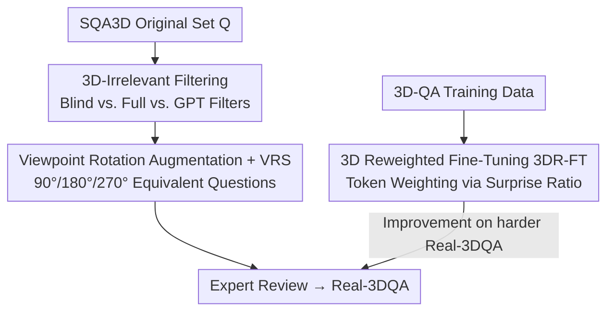

# Do 3D Large Language Models Really Understand 3D Spatial Relationships?

**Conference**: ICLR2026  
**OpenReview**: [https://openreview.net/forum?id=3vlMiJwo8b](https://openreview.net/forum?id=3vlMiJwo8b)  
**Code**: https://real-3dqa.github.io/ (Project page for Code & Dataset)  
**Area**: 3D Vision / 3D-LLM / Evaluation Benchmark  
**Keywords**: 3D-LLM, spatial reasoning, language shortcuts, diagnostic benchmark, viewpoint rotation

## TL;DR
The authors find that the high scores of existing 3D Large Language Models (3D-LLMs) on benchmarks like SQA3D are largely driven by "language shortcuts"—a **"blind model" that ignores 3D input and fine-tunes only on text QA pairs** can match or even outperform SOTA models. Consequently, they construct the more rigorous Real-3DQA benchmark (filtering questions guessable without 3D and introducing viewpoint rotation consistency evaluation) and propose 3D Reweighted Fine-Tuning (3DR-FT) to compel models to utilize 3D cues.

## Background & Motivation

**Background**: 3D-LLMs concatenate 3D representation tokens (e.g., point clouds) with text tokens for 3D captioning, grounding, and question answering (3D-QA), particularly first-person "Situated QA" (SQA). SQA3D is the most common evaluation, with accuracies rising from 30% to over 50% recently, which is widely cited as evidence of progress in 3D spatial reasoning.

**Limitations of Prior Work**: The authors debunk this "progress" by training a "blind model" using only text QA pairs without 3D input. This blind model matches or surpasses 3D-LLMs that actually consume 3D input on SQA3D, ScanQA, and MSR3D (Figure 2). This indicates that many questions can be answered via language priors, and high scores do not necessarily imply 3D understanding.

**Key Challenge**: The issue lies in **data bias**. 3D-QA data, whether human-annotated or LLM-generated, embeds language/common-sense priors (e.g., a "black rectangular object on the wall" is almost certainly a TV, independent of spatial context). While SQA3D attempts to mitigate this by balancing answer distributions, this surface-level fix cannot eliminate deeper biases (preferences for salient objects, typical layouts, easily guessable answers). Consequently, models undergo **shortcut learning** rather than true 3D understanding.

**Goal**: The research is divided into three sub-problems: (1) building a benchmark that truly tests 3D reasoning; (2) verifying whether models "understand" rather than memorize surface patterns; (3) forcing models to utilize 3D cues during training.

**Key Insight**: Rather than manual bias auditing, the authors use **model comparison** to automatically identify bias—if an item can be answered correctly by both a "3D-aware model" and a "blind model," it likely does not depend on 3D data and should be removed. This represents a debiasing approach without fine-grained manual intervention.

**Core Idea**: Filter questions based on the consistency between "blind models vs. full models," use consistency across different viewpoints to verify true understanding, and employ token-level reweighting to push training attention toward samples that depend on 3D information.

## Method

### Overall Architecture
The paper follows two trajectories: constructing the **Real-3DQA benchmark** (evaluation) and **3D Reweighted Fine-Tuning (3DR-FT)** (training).

Benchmark construction starts from the original SQA3D set $Q$ and involves two steps: ① **Filtering 3D-irrelevant questions** using three filters—the "full vs. blind" versions of three 3D-LLMs and GPT-4o-mini—to remove questions answerable without 3D; ② **Viewpoint rotation augmentation**, creating logically equivalent questions with different reference frames (90°/180°/270° rotation) and defining the Viewpoint Rotation Score (VRS). Expert review ensures quality. For training, tokens are reweighted during standard SFT based on the "surprise ratio" between the blind model and the current model, pushing loss toward 3D-dependent tokens.

### Key Designs

**1. 3D-Irrelevant Question Filtering: Automatic Debiasing via "Blind Model Consistency"**

To address "language prior gaming," the authors use model behavior rather than manual rules to determine 3D dependence. For each 3D-LLM $M_X$ (representing models like 3D-LLM, LEO, and Chat-Scene), a blind version $M_X^{blind}$ is trained using identical text QA pairs but **no 3D context**. A question $q$ is deemed 3D-independent if it is correctly answered by both the full and blind models ($M_X(q)=M_X^{blind}(q)=\text{correct}$). Such questions across all three models ($Q_{\text{3D-filtered}}=Q_A\cup Q_B\cup Q_C$) are removed to obtain $Q'=Q\setminus Q_{\text{3D-filtered}}$. GPT-4o-mini is then used as a further filter to remove remaining text-guessable items $Q_{GPT}$, resulting in $Q_{final}=Q'\setminus Q_{GPT}$. This implicitly mitigates various biases (salient objects, typical layouts) using the unified signal of "3D-independence."

**2. Viewpoint Rotation Augmentation and VRS: Making "Consistency Across Views" a Metric**

To ensure remaining questions require true understanding, a **cross-question consistency** test is introduced. The assumption is that if a model understands a 3D scene, it should correctly answer logically equivalent questions when the agent's position is fixed but its orientation rotates. Questions and environments are rotated (90°/180°/270°), adjusting directional words (e.g., "right") using GPT and SQA3D metadata. For example, "What is to my right?" might change from "whiteboard" to "window" or "table" as the orientation shifts, while the underlying spatial relationships remain constant.

The **Viewpoint Rotation Score (VRS)** quantifies this: for a batch of 4 related questions (original + 3 rotations), the proportion of instances with at least $k$ correct answers is $P_k=\frac{N_k}{N_{total}}\times100$ ($k\in\{1,2,3,4\}$). $\text{VRS}=\frac{1}{4}\sum_{k=1}^{4}P_k$. To score high, a model must be consistent across views, effectively penalizing models that rely on specific reference frame patterns.

**3. 3D Reweighted Fine-Tuning (3DR-FT): Pushing Training toward 3D Dependence**

Standard SFT encourages the model to mimic language patterns. 3DR-FT adjusts the importance of each token based on how difficult it is to predict using only text. After training a blind model $p_\phi$, the **surprise ratio** between the blind model and the current model $p_\theta$ determines the weight for each ground-truth token $y_j$:

$$w_j(y, x_{text}) := \frac{S_\phi(y, x_{text})}{S_\theta(y, x_{text})} = \frac{\log p_\phi(y_j \mid y_{<j}, x_{text})}{\log p_\theta(y_j \mid y_{<j}, x_{text})}$$

Tokens that "surprise" the blind model more than the 3D-aware model require spatial context and are assigned higher weights. The 3DR-FT loss multiplies the standard cross-entropy by this weight while providing full 3D context $x_{3D}$:

$$\mathcal{L}_{\text{3DR-FT}}(\theta) := \mathbb{E}_D\Big[-\sum_{j=1}^{T} w_j(y, x_{text})\log p_\theta(y_j \mid y_{<j}, x_{text}, x_{3D})\Big]$$

## Key Experimental Results

The authors evaluated five representative 3D-LLMs (3D-LLM, Chat-3D v2, LEO, Chat-Scene, GPT4Scene) on SQA3D and Real-3DQA, applying their training strategy to LEO and Chat-Scene.

### Main Results

The new benchmark causes significant performance drops and widens the gap between models:

| 3D-LLM | SQA3D EM | SQA3D EM_R | Real-3DQA EM | Real-3DQA EM_R |
|--------|----------|-----------|--------------|----------------|
| 3D-LLM (NeurIPS'23) | 47.8 | 49.6 | 7.5 | 10.4 |
| Chat-3D v2 (Arxiv'24) | 45.0 | 48.1 | 3.4 | 9.7 |
| LEO (ICML'24) | 49.4 | 52.2 | 14.3 | 19.1 |
| Chat-Scene (NeurIPS'24) | 54.4 | 57.2 | 17.0 | 22.1 |
| GPT4Scene (ICLR'26) | 60.6 | 63.3 | 33.1 | 36.9 |

Absolute EM decreases range from 27.5 to 41.6 points (drops of over 60%), indicating that existing 3D-LLMs are fragile when simple cues are removed.

Viewpoint rotation tests (Table 3, refined EM) show even sharper declines; as the requirement for consistent answers increases from 1 to 4, performance collapses to near zero:

| 3D-LLM | 1 Match | 2 Matches | 3 Matches | 4 Matches | VRS% |
|--------|---------|-----------|-----------|-----------|------|
| 3D-LLM | 33.2 | 4.1 | 1.1 | 0.1 | 9.6 |
| Chat-3D v2 | 23.2 | 2.7 | 0.5 | 0.0 | 6.6 |
| LEO | 46.9 | 8.1 | 1.6 | 0.4 | 14.3 |
| Chat-Scene | 43.3 | 7.1 | 1.2 | 0.1 | 12.9 |
| GPT4Scene | 55.5 | 14.3 | 2.5 | 0.5 | 18.2 |

The strongest model, GPT4Scene, drops from 55.5% (single match) to 0.5% (four matches). This collapse is observed across both point-cloud and object-centric architectures.

### Ablation Study (Training Strategy)

| Training Strategy | LEO ScanQA | LEO Real-ScanQA | LEO SQA3D | LEO Real-3DQA |
|-------------------|------------|-----------------|-----------|---------------|
| Supervised FT | 32.3 | 6.1 | 52.2 | 19.1 |
| Blind FT | 33.0 | 5.9 | 50.6 | 13.6 |
| 3D-reweighted FT | 31.3 | **13.9** | 48.2 | **29.3** |

3DR-FT yields the largest gains on highly 3D-dependent sets like Real-3DQA (e.g., LEO 19.1→29.3), though SQA3D scores decrease slightly.

### Key Findings
- **Blind models matching SOTA is the core evidence**: The ability of models to perform well without 3D input proves that existing benchmarks fail to differentiate "language shortcuts" from reasoning.
- **Direction/Distance questions are hardest**: Across all architectures, these categories consistently show the lowest scores, suggesting a lack of viewpoint-invariant spatial representations.
- **3DR-FT increases 3D dependence**: Attention analysis shows average attention to 3D tokens increases significantly after fine-tuning, correlating with gains on Real-3DQA.
- **Why SQA3D scores drop**: For Chat-Scene, 441 of the 591 questions that changed from correct to incorrect belonged to the "3D-irrelevant" subset. Forcing the model to use 3D cues causes it to "fail" on questions where language shortcuts were previously sufficient, confirming the bias in the original benchmark.

## Highlights & Insights
- **Automatic debiasing via "blind model consistency"** is clever. It uses the model's own behavior to filter biases (salient objects, frequency patterns) without needing explicit per-bias rules.
- **VRS operationalizes "understanding" as "viewpoint consistency"**: By requiring consistent performance across equivalent rotations, it prevents inflated scores from single-view guessing.
- **Surprise-ratio reweighting** is a practical token-level trick: Using a blind model as a reference to measure the 3D-dependency of each token can be transferred to any multi-modal QA scenario aiming to suppress shortcut modalities.
- The most significant "Aha!" moment is the revelation that years of benchmark progress might be largely illusory—a simple control experiment reveals the systematic blind spots of contemporary benchmarks.

## Limitations & Future Work
- **Derived from SQA3D**: The filtering and augmentation rely on SQA3D's scene graphs and templates, inheriting its scene diversity constraints.
- **Filtering depends on reference models**: The 3D-irrelevant set is determined by the specific models used (3D-LLM, LEO, Chat-Scene, GPT-4o-mini). Different reference models might yield different filtered sets.
- **GPT augmentation costs**: Generating viewpoint-rotated questions requires multi-stage expert review and verification to suppress hallucinations, which is costly to scale.
- **3DR-FT trade-offs**: Improvements on Real-3DQA come at the cost of original SQA3D scores. Balancing "true 3D reasoning" with "overall question coverage" remains an open problem.

## Related Work & Insights
- **vs. SQA3D**: SQA3D de-biases via answer distribution, but cannot eliminate deep annotation bias. This work uses model-level contrastive filtering and consistency, moving from "per-item accuracy" to "cross-question consistency."
- **vs. Beacon3D**: Beacon3D uses **cross-task consistency** (matching QA with grounding). This paper uses **cross-viewpoint consistency**, which more directly tests viewpoint-invariant spatial representation.
- **vs. 2D-VLM De-biasing**: While language bias has been studied extensively in 2D-VQA, this work represents the first systematic "diagnosis + mitigation" paradigm for 3D-LLMs.

## Rating
- Novelty: ⭐⭐⭐⭐⭐ Decoupling "fake progress" via blind model comparison and introducing VRS + 3DR-FT is original and self-consistent.
- Experimental Thoroughness: ⭐⭐⭐⭐ Covers various architectures and datasets, though scenes remain restricted to indoor environments inherited from SQA3D.
- Writing Quality: ⭐⭐⭐⭐⭐ Problem motivation is exceptionally clear; evidence regarding rotation collapse and surprise ratios is highly persuasive.
- Value: ⭐⭐⭐⭐⭐ Serves as a wake-up call for the 3D-LLM evaluation community; both the benchmark and training strategy are highly reusable.

<!-- RELATED:START -->

## Related Papers

- [\[ECCV 2024\] PointLLM: Empowering Large Language Models to Understand Point Clouds](../../ECCV2024/3d_vision/pointllm_empowering_large_language_models_to_understand_point_clouds.md)
- [\[CVPR 2026\] Scalable Object Relation Encoding for Better 3D Spatial Reasoning in Large Language Models](../../CVPR2026/3d_vision/scalable_object_relation_encoding_for_better_3d_spatial_reasoning_in_large_langu.md)
- [\[ICLR 2026\] DepthLM: Metric Depth from Vision Language Models](depthlm_metric_depth_from_vision_language_models.md)
- [\[ICCV 2025\] Learning 3D Object Spatial Relationships from Pre-trained 2D Diffusion Models](../../ICCV2025/3d_vision/learning_3d_object_spatial_relationships_from_pre-trained_2d_diffusion_models.md)
- [\[ICLR 2026\] Part-X-MLLM: Part-aware 3D Multimodal Large Language Model](part-x-mllm_part-aware_3d_multimodal_large_language_model.md)

<!-- RELATED:END -->
