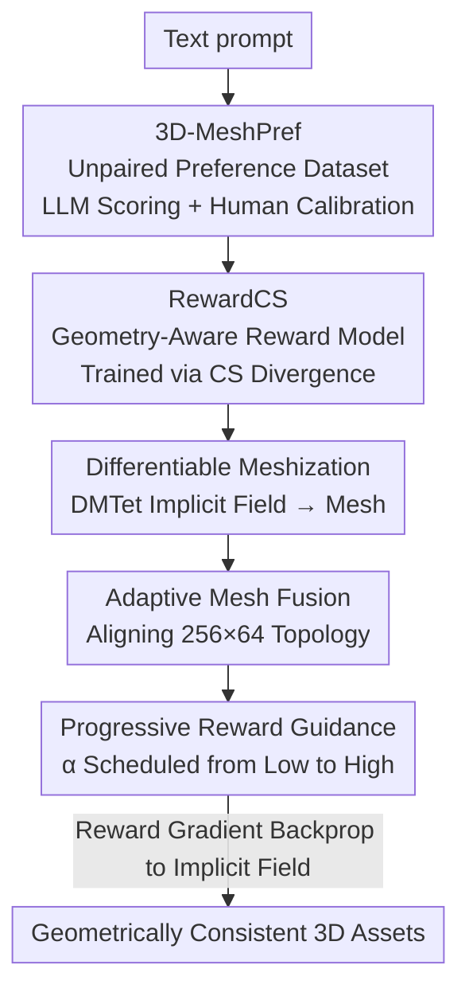

# DreamCS: Geometry-Aware Text-to-3D Generation with Unpaired 3D Reward Supervision

**Conference**: ICLR2026  
**OpenReview**: [https://openreview.net/forum?id=PoU33ZdtCP](https://openreview.net/forum?id=PoU33ZdtCP)  
**Code**: TBD  
**Area**: 3D Vision / Text-to-3D Generation  
**Keywords**: Text-to-3D, Preference Alignment, 3D Reward Model, Unpaired Learning, Cauchy-Schwarz Divergence

## TL;DR
DreamCS proposes the first preference alignment framework that **directly provides supervision on 3D geometry**. It first constructs 3D-MeshPref, an unpaired 3D mesh preference dataset with 30,000 samples via LLMs and human annotation. It then trains RewardCS, a geometry-aware reward model that does not require paired samples, using Cauchy-Schwarz divergence. Finally, it integrates this into the SDS text-to-3D pipeline via differentiable meshization, adaptive mesh fusion, and progressive reward guidance, significantly alleviating Janus (multi-face) issues and geometric incompleteness.

## Background & Motivation

**Background**: Text-to-3D generation (e.g., DreamFusion, MVDream, Magic3D) primarily relies on pre-trained 2D diffusion models, distilling 2D denoising gradients into implicit 3D representations like NeRF/SDF through Score Distillation Sampling (SDS). To align results with human preferences, recent works (e.g., DreamReward, DreamDPO) have adapted RLHF/DPO by using reward models to guide the generation.

**Limitations of Prior Work**: Existing 3D preference alignment suffers from two major drawbacks. First, it relies on **paired** preference annotations: for every prompt, multiple 3D assets must be rendered from multiple views and manually labeled as "better/worse," which is expensive and difficult to scale—furthermore, paired samples with significant quality gaps are naturally scarce. Second, they provide **2D view-dependent** supervision: rewards are derived from rendered images (e.g., ImageReward). As long as certain views look good, the model gives high scores, potentially ignoring structural defects from other angles, which leads to artifacts like Janus faces, geometric incompleteness, and floaters.

**Key Challenge**: The root cause is the **lack of 3D-aware reward signals**. 2D lifting pipelines excel at semantic alignment but lack explicit global geometric supervision to ensure the 3D structure is consistent and reasonable. An example in the paper illustrates this: 2D reward models like ImageReward give high scores to assets with clear geometric defects, whereas only a reward model that understands 3D geometry can align with human judgment.

**Goal**: The objective is to create a reward guidance framework that provides feedback directly at the 3D geometry level **without requiring paired data**. This is decomposed into three sub-problems: (1) Where to obtain 3D preference data? (2) How to train a reward model without paired samples? (3) How to integrate the reward model into existing text-to-3D pipelines while allowing end-to-end gradient backpropagation?

**Key Insight**: The authors observe that preference learning does not strictly require pairwise comparison. If "preferred meshes" and "dispreferred meshes" are viewed as samples from two different **distributions**, the training goal shifts from "making $m^+$ score higher than $m^-$" to "pushing these two distributions apart in the embedding space," which naturally eliminates the need for pairing.

**Core Idea**: Use Cauchy-Schwarz (CS) divergence for distribution-level preference learning to learn geometry-aware rewards from unpaired 3D mesh data. These are then injected into the SDS pipeline via a differentiable approach to correct generation using 3D geometric priors.

## Method

### Overall Architecture
The workflow of DreamCS consists of three stages: **Data Generation → Reward Training → Guided Generation**. The first stage builds 3D-MeshPref, an unpaired 3D mesh preference dataset with 30k+ samples, each containing a "text prompt + 3D asset + preference score." The second stage trains RewardCS on this dataset, using CS divergence to separate high-quality and low-quality meshes in the embedding space, resulting in a geometry-aware reward model that maps a "mesh + text" pair to a scalar reward. The third stage, DreamCS itself, integrates RewardCS into the SDS pipeline. It uses differentiable meshization to convert implicit fields to meshes, adaptive mesh fusion to align topology with the reward model's requirements, and progressive reward guidance to schedule reward weights, optimizing the implicit 3D representation via 3D reward gradients end-to-end.

### Key Designs

**1. 3D-MeshPref: Large-scale Unpaired 3D Preference Dataset via LLM Scoring + Human Calibration**

3D preference alignment lacks available data, and paired annotations are nearly impossible to produce due to the complexity of 3D representations and high generation/annotation costs. The authors opt for **unpaired** data. Specifically: 8,000 ABO and 15,000 Objaverse samples are selected from Cap3D, converted to high-quality meshes using MeshAnythingV2, and simplified to a maximum of 16,384 triangular faces using the QEM algorithm, resulting in 20,000+ meshes. To enable the reward model to judge the geometry of **intermediate states** during SDS optimization, an additional 10,000+ meshes are sampled from the early stages of DreamFusion/MVDream. Scoring is performed by Llama-Mesh on a 0–5 Likert scale across three dimensions: prompt alignment, structural realism, and visual fidelity. Since LLMs tend to overestimate quality, human review is added. Finally, a threshold interval (3.5–4.0) is used: scores ≥4.0 are labeled as preferred (47%), and ≤3.5 as dispreferred (53%), with the ambiguous middle range excluded to ensure clean labels. This approach provides RewardCS with clear signals and balanced training material.

**2. RewardCS with CS Divergence: Reformulating Preference Learning as Distribution Matching**

Traditional preference alignment (DPO variants, Reward3D) requires paired tuples $\{m_i^+, m_i^-, c_i\}$, which fail in unpaired scenarios. The core modification of RewardCS is to treat the preferred set $\{n_i^+\}$ and dispreferred set $\{n_j^-\}$ as samples from two distributions $p^+(\cdot|c)$ and $p^-(\cdot|c)$. An encoder $r_{\theta_e}$ maps them to embeddings $\{x_i\}\sim p(x)$ and $\{y_j\}\sim p(y)$, and the training objective becomes "pushing $p(x)$ and $p(y)$ apart in the embedding space." The difference between the two distributions is measured using Cauchy-Schwarz divergence:

$$D_{CS}(p \parallel q) = -\log \frac{\left(\int p(\omega)q(\omega)\,d\omega\right)^2}{\int p(\omega)^2 d\omega \int q(\omega)^2 d\omega}.$$

Since the true density is unknown, an empirical version is derived using Kernel Density Estimation (KDE), involving sums of kernel values $\kappa(x_i, x_j)$, $\kappa(y_i, y_j)$, and $\kappa(x_i, y_j)$. Crucially, it is **symmetric, differentiable, and allows $m \neq n$**, making it compatible with varying numbers of preferred and dispreferred samples. Compared to KL divergence, CS divergence has tighter generalization bounds; compared to JS divergence, it has a closed-form and more stable solution for Gaussians. Intuitively, maximizing CS divergence forces the model to capture semantic and geometric cues that distinguish good from bad assets without requiring paired supervision for every prompt. t-SNE visualizations confirm that with $L_{div}$ ($\lambda=1$), preferred and dispreferred embeddings are clearly separated, whereas they are clustered together when $\lambda=0$.

**3. Theoretical Guarantee: Asymptotic Equivalence of Unpaired and Paired Supervision**

The authors prove that unpaired training is not a second-best option. By reformulating CS divergence in the Reproducing Kernel Hilbert Space (RKHS), it is shown to be equivalent to a quantity involving the kernel mean embeddings $\mu_x$ and $\mu_y$ (specifically $-2\log \frac{\langle\mu_x,\mu_y\rangle}{\|\mu_x\|\|\mu_y\|}$). Under standard kernel method assumptions, the paper proves Theorem 1: the difference between $\hat{D}_{CS}^{paired}$ (calculated from paired data) and $\hat{D}_{CS}^{unpaired}$ (from unpaired data) satisfies:

$$\hat{D}_{CS}^{paired} - \hat{D}_{CS}^{unpaired} \le C \cdot \left(\frac{1}{\sqrt{m}} + \frac{1}{\sqrt{n}}\right) \xrightarrow{p} 0,$$

converging to zero at a rate of $O(1/\sqrt{m} + 1/\sqrt{n})$ as the sample size increases. This demonstrates that maximizing CS divergence with unpaired data asymptotically achieves the same reward separation as paired preference supervision.

**4. The DreamCS Trio: Differentiable Integration of the Reward Model into SDS**

To integrate the reward model into text-to-3D pipelines, two obstacles must be overcome: existing rewards are designed for 2D pairs and cannot handle explicit 3D meshes; additionally, meshes generated during training often do not meet the topology requirements of the reward model (256 non-overlapping patches, 64 faces per patch). DreamCS solves this with three modules:

- **Differentiable Meshization**: SDS pipelines optimize implicit fields (NeRF/SDF), which must be converted to explicit meshes. The authors use DMTet to differentiably extract isosurfaces, providing higher fidelity than Marching Cubes and maintaining the gradient flow to implicit parameters.
- **Adaptive Mesh Fusion**: Extracted mesh topologies often mismatch the reward model's expectations. A differentiable fusion algorithm simplifies and reorganizes topology while preserving geometric detail. It iteratively merges adjacent faces based on normal similarity and topological adjacency. This fusion process is differentiable and embedded in the training loop.
- **Progressive Reward Guidance**: At each optimization step, the current differentiable mesh $d(\psi_t)$ is scored by RewardCS, and the gradient is backpropagated. The optimization objective is $L(\psi_t) = L_{SDS}(\psi_t) - \alpha(t)\cdot r_\theta(d(\psi_t)|c)$, where the weight $\alpha(t)$ is linearly scheduled from $\alpha_{min}$ to $\alpha_{max}$. A small initial $\alpha$ allows SDS to dominate shapes exploration, while a larger $\alpha$ later provides fine-tuning via 3D structural priors, avoiding early-stage biases from the reward model.

### Loss & Training
The RewardCS training objective is a combination of regression loss and CS divergence loss: $L_{RewardCS}(\theta) = L_{MSE}(\theta) + \lambda L_{div}(\theta)$, where $L_{MSE}$ is the mean squared error of reward prediction and $L_{div} = -\hat{D}_{CS}(p(x); p(y))$ encourages embedding separation ($\lambda=1$ typically). The encoder $r_{\theta_e}$ includes: a 3D Mesh Encoder using MeshMAE (splitting meshes into 256 patches of 64 faces with 10D geometric features), a MeshCLIP text encoder (frozen), and cross-attention for fusion. The generation side is initialized with ShapeNet pre-training and fine-tuned on 3D-MeshPref for 20,000 steps, with rendering resolution increasing from 64x64 to 256x256.

## Key Experimental Results

### Main Results
Evaluated on 110 prompts from GPTEval3D across one-stage (DreamFusion, MVDream) and two-stage (Magic3D, Fantasia3D) pipelines. Metrics: CP = CLIP Similarity, VR = VisionReward, GA = Geometric-Asset Alignment Reward (a standalone evaluator based on RewardCS with different configurations).

| Pipeline | Variant | CP ↑ | VR ↑ | GA ↑ |
|------|------|------|------|------|
| DreamFusion | Original | 0.22 | -3.21 | 2.53 |
| DreamFusion | +Reward3D (2D) | 0.23 | -3.11 | 2.77 |
| DreamFusion | +RewardCS (Ours) | 0.25 | -2.11 | 2.96 |
| DreamFusion | +Reward3D+RewardCS | 0.25 | -2.77 | **3.22** |
| MVDream | Original | 0.24 | -3.31 | 2.79 |
| MVDream | +Reward3D (2D) | 0.27 | -3.12 | 2.87 |
| MVDream | +RewardCS (Ours) | **0.29** | -2.11 | 2.96 |
| Fantasia3D | Original | 0.22 | -3.03 | 2.95 |
| Fantasia3D | +RewardCS (Ours) | 0.25 | **-1.01** | **3.33** |

Key findings: (1) RewardCS improves all baselines and generally outperforms 2D-guided variants in CP/GA/VR; (2) High compatibility across backbones, benefiting both implicit optimization and explicit mesh rendering; (3) 3D and 2D guidance are complementary, with 2D handling multi-view consistency and 3D (RewardCS) handling geometric alignment.

### MiniCPM-o Evaluation + User Study
Scored using the VLM MiniCPM-o (110 prompts) and a 30-person user study (60 prompts). Metrics: T-A = Text-Asset alignment, 3DP = 3D Plausibility, G-T = Geometry-Texture consistency.

| Evaluation | Method | T-A ↑ | 3DP ↑ | G-T ↑ |
|------|------|-------|-------|-------|
| MiniCPM-o | MVDream | 2.97 | 3.12 | 3.08 |
| MiniCPM-o | +Reward3D | 3.38 | 3.35 | 3.22 |
| MiniCPM-o | +RewardCS | 3.59 | **4.05** | **3.95** |
| User Study | MVDream | 2.90 | 2.87 | 2.91 |
| User Study | +DreamDPO | 3.15 | 3.19 | 3.00 |
| User Study | +RewardCS | 3.21 | **3.72** | **3.59** |

### Janus Artifact Ratio
User study (60 prompts) tracking the ratio of assets with Janus faces (lower is better):

| Backbone | Method | Janus Ratio ↓ |
|----------|------|--------------|
| MVDream | Original | 0.52 |
| MVDream | +Reward3D | 0.44 |
| MVDream | +RewardCS | **0.30** |
| DreamFusion | Original | 0.61 |
| DreamFusion | +RewardCS | **0.41** |
| DreamFusion | +Reward3D+RewardCS | **0.39** |

### Key Findings
- **Geometric improvements outweigh texture improvements**: GA, VR, and 3DP metrics show much larger gains than CP, supporting the hypothesis that 3D rewards address structural weaknesses.
- **$L_{div}$ is essential**: Without the CS divergence term ($\lambda=0$), the reward model loses its discriminative power.
- **Complementarity of 2D + 3D**: Combining both often yields the best GA and lowest Janus ratios.

## Highlights & Insights
- **Shifting Preference Learning from Comparison to Distribution Separation**: This clever step reduces 3D preference data costs by eliminating the need for pairing, a concept transferable to other high-cost annotation domains like video or long-form document generation.
- **Theoretical and Practical Completeness**: Theorem 1 provides the mathematical justification for using unpaired data, rather than treating it merely as an empirical trick.
- **Geometry-Level Feedback**: Supervision on 3D meshes avoids the "view bias" of 2D rewards, addressing the root cause of Janus artifacts.
- **End-to-End Differentiability**: Differentiable meshization and fusion ensure that 3D reward gradients flow back to the implicit field, enabling "plug-and-play" integration into existing SDS pipelines.

## Limitations & Future Work
- **Reliance on Labeling Pipeline**: RewardCS quality is capped by the reliability of the Llama-Mesh + human annotation process.
- **Mesh Topology Constraints**: The requirement for a specific patch structure (256x64) necessitates adaptive fusion; its performance on extremely complex or open-surface assets remains to be fully explored.
- **Metric Self-Reference**: The GA metric is partly based on RewardCS, though user studies and VLM evaluations mitigate this concern.
- **Computational Overhead**: The differentiable meshization and fusion steps add training time.

## Related Work & Insights
- **vs Reward3D / DreamReward (2D Reward)**: These use rendered images for 2D reward models, often missing global 3D structure. DreamCS supervises the 3D mesh directly, outperforming them in geometric metrics.
- **vs DreamDPO (Paired DPO)**: DreamDPO still requires paired data and 2D supervision. DreamCS uses CS divergence for unpaired distribution-level learning, significantly lowering annotation costs.
- **vs Standard SDS (DreamFusion/SJC)**: Original SDS lacks 3D structural priors. DreamCS adds explicit geometric regularization to correct Janus and inconsistency issues.

## Rating
- Novelty: ⭐⭐⭐⭐⭐ First unpaired 3D preference dataset + first CS divergence 3D reward model.
- Experimental Thoroughness: ⭐⭐⭐⭐ Extensive benchmarks across backbones and human studies; GA metric has slight self-reference.
- Writing Quality: ⭐⭐⭐⭐ Clear logic, addressing three challenges with three specific contributions.
- Value: ⭐⭐⭐⭐⭐ The unpaired distribution alignment approach captures the real pain point of 3D data and is widely applicable.

<!-- RELATED:START -->

## Related Papers

- [\[ICLR 2026\] Learning Hierarchical and Geometry-Aware Graph Representations for Text-to-CAD](learning_hierarchical_and_geometry-aware_graph_representations_for_text-to-cad.md)
- [\[ECCV 2024\] JointDreamer: Ensuring Geometry Consistency and Text Congruence in Text-to-3D Generation via Joint Score Distillation](../../ECCV2024/3d_vision/jointdreamer_ensuring_geometry_consistency_and_text_congruence_in_text-to-3d_gen.md)
- [\[CVPR 2026\] GaussianGrow: Geometry-aware Gaussian Growing from 3D Point Clouds with Text Guidance](../../CVPR2026/3d_vision/gaussiangrow_geometry-aware_gaussian_growing_from_3d_point_clouds_with_text_guid.md)
- [\[ICLR 2026\] PAT3D: Physics-Augmented Text-to-3D Scene Generation](pat3d_physics-augmented_text-to-3d_scene_generation.md)
- [\[CVPR 2026\] Text–Image Conditioned 3D Generation](../../CVPR2026/3d_vision/text-image_conditioned_3d_generation.md)

<!-- RELATED:END -->
