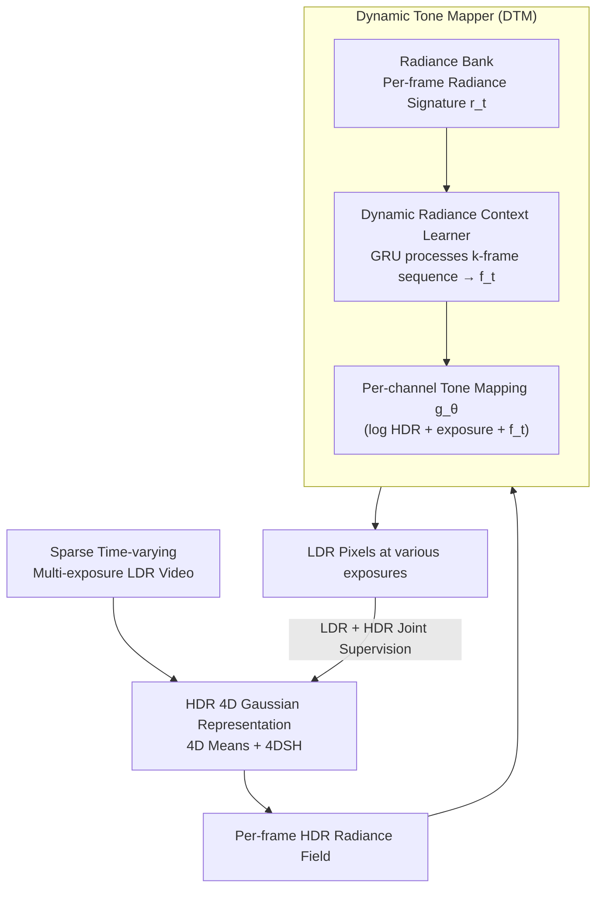

# Dynamic Novel View Synthesis in High Dynamic Range

**Conference**: ICLR2026  
**arXiv**: [2509.21853](https://arxiv.org/abs/2509.21853)  
**Code**: [prinasi/HDR-4DGS](https://github.com/prinasi/HDR-4DGS)  
**Area**: 3D Vision  
**Keywords**: HDR, Dynamic Novel View Synthesis, 4D Gaussian Splatting, Tone Mapping, Radiance Field  

## TL;DR

The first paper to formalize the HDR Dynamic Novel View Synthesis (HDR DNVS) problem and design the HDR-4DGS framework. By introducing a dynamic tone mapping module, the method achieves temporally consistent HDR radiance field reconstruction in time-varying scenes, outperforming existing methods on both synthetic and real-world datasets.

## Background & Motivation

**Background**: Existing novel view synthesis methods are limited by two core assumptions: **static scenes** and **Low Dynamic Range (LDR) inputs**.

**Key Challenge**: While Dynamic Novel View Synthesis (DNVS) can handle time-varying scenes (e.g., moving objects, changing lighting), it is restricted to LDR images. Under high-contrast conditions (e.g., direct sunlight, low-light environments), it loses information in overexposed or underexposed regions.

**Limitations of Prior Work**: HDR version of Novel View Synthesis (HDR NVS) can reconstruct HDR scenes from multi-exposure LDR images; however, existing methods (e.g., HDR-NeRF, HDR-GS, GaussHDR) all assume the scene is completely static.

**Real-world Needs**: Real-world HDR scenes are naturally dynamic, containing moving objects, changing illumination, and transient phenomena. Previous methods cannot simultaneously handle dynamic geometry and HDR radiance reconstruction. Although HDR-HexPlane made preliminary explorations into dynamic HDR, it failed to carefully evaluate HDR output quality or validate on real-world scenes, leaving significant gaps.

**Goal**: **HDR Dynamic Novel View Synthesis (HDR DNVS)**: Learning an HDR 4D radiance field model $\mathcal{F}_h$ from sparse, time-varying, multi-exposure LDR inputs, enabling the rendering of temporally consistent HDR images at any timestamp $t'$ and arbitrary viewpoint $V'$. The core challenges involve:

1. Jointly modeling evolving scene structure and HDR radiance.
2. Complex spatio-temporal inconsistencies caused by non-rigid motion and temporal changes.
3. Lack of reliable luminance priors in sparse LDR observations, leading to severe photometric ambiguity.

## Method

### Overall Architecture

HDR-4DGS addresses the joint reconstruction of "dynamic scenes + HDR radiance." The input consists of sparse, time-varying, multi-exposure LDR videos, and the output is a 4D radiance field capable of rendering temporally consistent HDR images at any timestamp and viewpoint. The approach decouples scene representation and color conversion into a two-stage pipeline: first, an HDR-extended 4D Gaussian Splatting reconstructs the time-evolving HDR radiance; then, a dynamic tone mapper, adaptive to scene brightness, converts HDR radiance back to LDR pixels for each exposure. This allows the entire HDR field to be supervised using pure LDR observations. Both stages are jointly optimized end-to-end under a unified objective.

### Key Designs

**1. HDR 4D Gaussian Representation: Integrating Dynamic Geometry and HDR Radiance**

To handle time-varying scenes, static 3DGS is insufficient because pixel observations $\mathbf{I}(u,v,t)$ depend not only on spatial coordinates but also on timestamps. HDR-4DGS utilizes 4D Gaussian Splatting as a backbone, extending the mean of each Gaussian from 3D to 4D $\mu = (\mu_x, \mu_y, \mu_z, \mu_t)$, and employs 4D Spherical Harmonics (4DSH) to model the evolution of appearance over time. This enables the same set of Gaussians to produce different radiance at different moments. The key modification over original 4DGS is expanding the color representation space from LDR directly to HDR. Gaussians store high-dynamic-range radiance, and a "radiance bank" is constructed to provide per-timestamp radiance statistics for subsequent tone mapping.

**2. Dynamic Tone Mapper (DTM): Adaptive HDR-to-LDR Conversion**

A fixed tone mapping curve suffices for static scenes, but dynamic HDR scenes involve constantly changing illumination, where fixed curves lose details in extreme regions. Inspired by the human visual adaptation mechanism, DTM adjusts the tone mapping based on the "recent brightness changes" of the scene. It operates in three steps: first, the radiance bank aggregates the average HDR color statistics $\mathbf{r}_t^h = \frac{1}{N}\sum_{i=1}^N \mathbf{c}_{i,t}^h$ as the frame's "radiance signature"; second, the Dynamic Radiance Context Learner (DRCL) uses a GRU to ingest a sequence of radiance signatures from a sliding window of $k$ frames $\{\mathbf{r}_{t-k:t}^h\}$, outputting a temporal radiance context embedding $\mathbf{f}_t \in \mathbb{R}^d$; finally, the log-domain HDR color, added with exposure time, is concatenated with this context and fed into a channel-wise tone mapping function $g_\theta$ to obtain the LDR color:

$$\mathbf{c}_t^l = g_\theta([\log \mathbf{c}_t^h + \log e_t, \mathbf{f}_t])$$

Since $\mathbf{f}_t$ encodes the brightness evolution of the last $k$ frames, the mapping curve shifts dynamically with scene brightness. This is essential for maintaining temporal consistency without losing details in extreme regions, marking a fundamental difference from the time-invariant static mapping used in HDR-NeRF/HDR-HexPlane.

### Loss & Training

The overall objective is a weighted sum of LDR and HDR supervision: $\mathcal{L}_{total} = \mathcal{L}_{ldr} + \alpha \mathcal{L}_{hdr}$. The LDR loss employs dual supervision: it constrains both pixel-level LDR after 2D tone mapping and ray-level LDR obtained via 3D rasterization to mitigate over-fitting of the 3D tone mapping. The HDR loss uses $\mu$-law compression to align HDR and LDR domains before comparison. Both reconstruction terms use the same image loss form: $(1-\lambda)\mathcal{L}_1 + \lambda \mathcal{L}_{\text{D-SSIM}}$ with $\lambda=0.2$. Notably, even with only LDR supervision (no HDR ground truth), the framework can learn a usable HDR field; quality further improves with joint HDR supervision.

## Key Experimental Results

### Datasets

| Dataset | # Scenes | Type | Characteristics |
|---------|----------|------|-----------------|
| HDR-4D-Syn | 8 | Synthetic | Multi-exposure video + synced multi-view LDR streams + HDR GT |
| HDR-4D-Real | 4 | Real | Synced capture with 6 iPhone 14 Pro, three exposures |

### Main Results on HDR-4D-Syn (LDR Supervision Only)

| Method | HDR PSNR↑ | HDR SSIM↑ | HDR LPIPS↓ | Inference (fps) |
|--------|-----------|-----------|------------|-----------------|
| HDR-NeRF | 8.54 | 0.062 | 0.552 | 0.061 |
| HDR-GS | 4.64 | 0.158 | 0.645 | 380.38 |
| HDR-HexPlane | 14.70 | 0.649 | 0.287 | 1.61 |
| **HDR-4DGS** | **25.88** | **0.865** | **0.076** | **40.80** |

- HDR PSNR is **11.18 dB** higher than the second-best method (HDR-HexPlane).
- Inference speed is ~**25×** faster than HDR-HexPlane and ~**669×** faster than HDR-NeRF.
- With joint LDR+HDR supervision, HDR PSNR further improves to **30.40 dB**.

### Ablation Study

- Independent HDR reconstruction (Ours vs. two-stage pipelines like 4DGS + KPNet) yielded a max PSNR of only 20.92, significantly lower than the joint optimization's 25.88.
- DTM vs. MLP static tone mapper: PSNR 25.88 vs 23.92, LPIPS 0.076 vs 0.142.
- Impact of pixel-level supervision: Removing it reduced PSNR by 1.03 dB.
- A temporal context window of $k=20$ is optimal; performance drops with windows that are too small (5/10) or too large (30).

## Highlights & Insights

1. **High Problem Definition Value**: Formally defines the HDR DNVS problem for the first time, filling the gap in HDR synthesis for dynamic scenes.
2. **Elegant Dynamic Tone Mapper**: Inspired by human visual adaptation, using a GRU to model temporal radiance context ensures adaptive HDR-LDR conversion. The learned tone mapping curves are interpretable (monotonically increasing and shifting with scene brightness).
3. **Comprehensive Benchmarking**: Constructs both synthetic and real-world datasets, providing a standardized evaluation platform for future research.
4. **Dual Supervision Strategy**: The joint constraint of pixel-level and ray-level LDR effectively alleviates over-fitting in 3D tone mapping.
5. **Significant Efficiency Advantage**: Achieves real-time inference speeds while substantially improving reconstruction quality.

## Limitations & Future Work

1. **Structural Degradation in Motion**: Structural artifacts still exist in highly mobile regions, which the authors attribute to the inherent limitations of the underlying 4DGS representation. Future work could explore more robust dynamic representations.
2. **Real-world HDR Metrics**: On HDR-4D-Real, the HDR PSNR (14.50 with LDR-only supervision) is lower than HDR-HexPlane (9.306 was lower than expected, comparing to 14.50); however, the authors note this is due to HDR ground truth noise and PSNR's preference for blurred reconstructions, while visual quality is superior.
3. **Fixed Temporal Window**: $k=20$ is a fixed hyperparameter; adaptive window lengths were not explored.
4. **Limited Deployment Scenarios**: The real-world dataset only includes 4 indoor scenes, lacking coverage of large outdoor scenes or extreme weather.
5. **Relatively Long Training Time**: HDR-4DGS takes ~69-99 minutes to train, slower than HDR-GS (14-38 minutes).

## Related Work & Insights

| Dimension | HDR-NeRF / HDR-GS | HDR-HexPlane | HDR-4DGS (Ours) |
|-----------|-------------------|--------------|-----------------|
| Dynamics | Static | Dynamic | Dynamic |
| Tone Mapping | MLP Static | Sigmoid Static | GRU Dynamic Adaptive |
| Temporal Consistency | N/A | Weak | Strong (Radiance Context) |
| HDR Evaluation | Yes | No | Yes (Full Benchmark) |
| Speed | NeRF Slow / GS Fast | Slow (~1.6 fps) | Fast (~41 fps) |

- **Transferable Tone Mapping**: The "radiance bank + sequence model" paradigm of DTM can be extended to other tasks requiring temporal adaptive color/radiance conversion, such as video HDR reconstruction or relighting.
- **General Dual Supervision**: The joint pixel-level and ray-level supervision strategy can be applied to other 3DGS-based color space transformation tasks.
- **Benchmark Value**: The HDR-4D-Syn and HDR-4D-Real datasets serve as a valuable foundation for future dynamic HDR research.

## Rating

- Novelty: ⭐⭐⭐⭐ — Novel problem definition and creative dynamic tone mapping module.
- Experimental Thoroughness: ⭐⭐⭐⭐ — Synthetic and real datasets with extensive ablations and visualizations.
- Writing Quality: ⭐⭐⭐⭐ — Clear structure, well-motivated, and standardized formulas.
- Value: ⭐⭐⭐⭐ — Opens the HDR DNVS direction, provides a solid benchmark, and open-source code.

<!-- RELATED:START -->

## Related Papers

- [\[ICLR 2026\] Mono4DGS-HDR: High Dynamic Range 4D Gaussian Splatting from Alternating-exposure Monocular Videos](mono4dgs-hdr_high_dynamic_range_4d_gaussian_splatting_from_alternating-exposure_.md)
- [\[CVPR 2026\] PhysGaia: A Physics-Aware Benchmark with Multi-Body Interactions for Dynamic Novel View Synthesis](../../CVPR2026/3d_vision/physgaia_a_physics-aware_benchmark_with_multi-body_interactions_for_dynamic_nove.md)
- [\[ICML 2025\] High Dynamic Range Novel View Synthesis with Single Exposure](../../ICML2025/3d_vision/high_dynamic_range_novel_view_synthesis_with_single_exposure.md)
- [\[ICLR 2026\] HDR-NSFF: High Dynamic Range Neural Scene Flow Fields](hdr-nsff_high_dynamic_range_neural_scene_flow_fields.md)
- [\[CVPR 2026\] Dynamic-Static Decomposition for Novel View Synthesis of Dynamic Scenes with Spiking Neurons](../../CVPR2026/3d_vision/dynamic-static_decomposition_for_novel_view_synthesis_of_dynamic_scenes_with_spi.md)

<!-- RELATED:END -->
