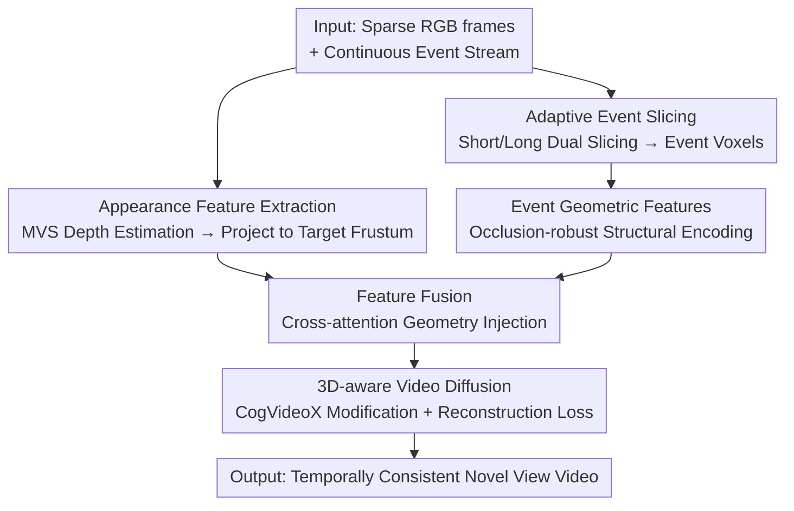

# EA3D: Event-Augmented 3D Diffusion for Generalizable Novel View Synthesis

**Conference**: ICLR2026  
**OpenReview**: [https://openreview.net/forum?id=YwawhlWdtm](https://openreview.net/forum?id=YwawhlWdtm)  
**Code**: To be confirmed  
**Area**: 3D Vision / Diffusion Models  
**Keywords**: Event camera, Novel View Synthesis, Video Diffusion, Generalizable, Cost Volume  

## TL;DR
EA3D integrates continuous geometric cues from event cameras with appearance cues from sparse RGB frames into view-dependent 3D features. These are then decoded by a 3D-aware video diffusion model (modified from CogVideoX) to generate temporally consistent novel view videos. This enables generalizable novel view synthesis **without per-scene optimization** under fast camera motion, wide baselines, and cross-scene settings.

## Background & Motivation
**Background**: Current mainstream Novel View Synthesis (NVS) relies on NeRF and 3DGS, which learn continuous radiance fields or Gaussian representations through dense sampling and per-scene optimization, achieving high rendering quality.

**Limitations of Prior Work**: These methods struggle under **fast camera motion**. First, fast motion reduces available training views, making reconstruction under-constrained and prone to overfitting or trivial solutions. Second, large gaps between adjacent frames violate smooth motion assumptions for feature matching, rendering SfM-estimated camera poses unreliable. While event cameras improve robustness (temporally dense, low latency, robust to fast motion and extreme lighting), existing "Event + RGB" methods still rely on optimization-based 3D representations (E-NeRF, Event3DGS, EF-3DGS) and require re-optimization for every new scene, lacking **generalization capability**.

**Key Challenge**: Generalization capability and event geometric priors are currently mutually exclusive. Generalizable NVS methods (learning priors from large-scale multi-view data) can work across scenes but **only use RGB**, degrading sharply under wide baselines and fast motion. Methods utilizing events are locked into per-scene optimization.

**Goal**: Develop an NVS framework that **leverages event geometric priors, generalizes across scenes, and avoids per-scene optimization**, supporting synthesis along arbitrary camera trajectories (even those not aligned with the event camera trajectory).

**Key Insight**: The two modalities are naturally complementary—event streams provide temporally dense, occlusion-robust **geometric** cues but lack color/texture, whereas RGB frames provide rich **appearance** but sparse geometry that is often incomplete during fast motion. Unifying both into a "3D-aware feature" within the target camera frustum allows feeding both geometric robustness and appearance realism into a generative prior.

**Core Idea**: Use a learnable "Event-Augmented Feature Renderer" to project event geometry and RGB appearance into target-view 3D features, then use a conditional video diffusion model to decode these features into temporally consistent novel views—replacing "per-scene optimized 3D representations" with a "train-once, generalize-anywhere generative 3D prior."

## Method

### Overall Architecture
EA3D solves the problem of "synthesizing realistic and temporally consistent novel view videos along a new trajectory given sparse RGB frames and the continuous event stream between them." The pipeline consists of two stages: first, the **EA-Renderer (Event-Augmented Feature Renderer)** projects inputs into 3D features $\{F_{3D}\}_{i=1}^N$ for each target frustum; then, a **3D-aware video diffusion model** takes these features as conditions to iteratively denoise and decode the novel view sequence $\{I_i\}_{i=1}^N$. The general multi-view case is decomposed into "two-view sub-problems" using two frames $(I_{t_0}, I_{t_1})$ and the event stream $E(t_0, t_1)$ between them.

The EA-Renderer comprises three stages: **appearance feature extraction** (estimating pose/depth with a pre-trained MVS model to project RGB into target frustums), **event feature extraction** (adaptive slicing to encode event streams into occlusion-robust geometric features), and **feature fusion** (cross-attention to inject pose-free event features into posed appearance features). The fused 3D features replace the original image conditions in CogVideoX to guide diffusion decoding.

### Key Designs

**1. EA-Renderer Appearance Extraction: Anchoring RGB to Target Frustums**

While event streams are geometrically robust, they lack color and texture. Thus, appearance information must come from RGB. The authors use a pre-trained Multi-View Stereo (MVS) model to estimate camera parameters and depth for the RGB frames, projecting them onto each target frustum in the novel trajectory $\{T_i\}_{i=1}^N$ to obtain view projections $\{P_i\}_{i=1}^N$. These are passed through an appearance encoder $E_{appr}$: $\{F_{appr}^i\}_{i=1}^N = E_{appr}(\{P_i\}_{i=1}^N)$. This adopts the cost-volume NVS approach—rather than direct generation, it brings known observations into the target frustum to establish an appearance prior. However, due to large baselines and occlusions, appearance alone provides incomplete geometry, which the next step addresses.

**2. Adaptive Event Slicing: Stable Geometry Extraction from Non-uniform Event Streams**

Event streams are asynchronous and non-uniform; high motion produces dense events while static scenes produce sparse ones. Fixed time slicing leads to overfilled or empty voxels, destabilizing geometric signals. The authors use **event-count-based adaptive slicing**: $E(t_0, t_1)$ is divided into $N$ segments, each constructing two overlapping slices—a short slice with $m$ events for short-term scene information, and a long slice with $2m$ events for broader temporal context. The duration of each slice is **dynamically stretched until the required number of events is reached**, ensuring voxel density. $N$ short and $N$ long slices are concatenated to form temporally augmented event voxels $\{E_i\}_{i=1}^N$, encoded by $E_{event}$ as $F_{event} = E_{event}(\{E_i\}_{i=1}^N)$. Ablations show performance drops without this (T&T PSNR 23.50 → 22.96), proving "count-based" slicing is superior to "time-based" for extracting clean geometry under fast motion.

**3. Cross-Attention Feature Fusion: Aligning Pose-free Event Geometry with Posed Appearance**

Event features $F_{event}$ encode structural continuity and occlusion-robust geometry. However, precise poses and depths for event streams are difficult to obtain, preventing direct projection like RGB; furthermore, they lack appearance. The authors use cross-attention for "soft alignment": querying with each posed appearance feature $F_{appr}^i$ against the entire event feature sequence $F_{event}$ as key/value pairs: $\{F_{3D}\}_{i=1}^N = \{\mathrm{Attention}(Q(F_{appr}^i), K(F_{event}), V(F_{event}))\}_{i=1}^N$. This allows geometric priors to be "picked" into the correct positions without explicit poses. The resulting $F_{3D}$ carries both geometry and appearance, serving as a strong 3D prior. This design is key to merging pose-free events with posed appearance; removing geometric features (event encoder and fusion module) caused the largest performance drop in the 2-view setting (T&T PSNR 23.50 → 18.87).

**4. 3D-aware Video Diffusion: 3D Features as Conditions, CogVideoX for Temporal Consistency**

To ensure multi-frame consistency, the authors model the conditional distribution $I \sim p(I \mid F_{3D})$ using a **video** diffusion model (rather than frame-by-frame image diffusion). They use an image-to-video variant of CogVideoX, which utilizes Diffusion Transformers with 3D self-attention for spatio-temporal coherence. Two key modifications were made: first, replacing the original image condition features with $F_{3D}$ from the EA-Renderer, using a newly initialized patch embedding to concatenate it with Gaussian noise tokens; second, **reusing CogVideoX's spatio-temporal VAE encoder as the appearance encoder $E_{appr}$**. This minimizes domain shift and leverages its temporal compression to reduce appearance features to $\frac{N}{4}$, matching the DiT input shape of $\frac{N}{4}\times\frac{H}{8}\times\frac{W}{8}\times C$. Reusing the pre-trained backbone allowed convergence in just 12,000 steps.

### Loss & Training
The model is trained end-to-end with a weighted sum of diffusion and reconstruction losses. The diffusion loss follows CogVideoX's noise schedule: $L_{diffusion} = \mathbb{E}_{I,F_{3D},t,\epsilon}[\|\epsilon - \epsilon_\theta(I,t,F_{3D})\|_2^2]$. To stabilize training and accelerate convergence, an additional reconstruction loss constrains the EA-Renderer's $F_{3D}$ to approximate features extracted by the VAE encoder from ground-truth novel views: $L_{recon} = \|F_{3D} - E_{appr}(I)\|_2^2$. Training jointly optimizes the event encoder, fusion module, patch embedding, and DiT blocks at a resolution of $384\times672$. Sequences are 49 frames long, and event count $m$ is sampled uniformly from $[1\times10^5, 3\times10^5]$ to enhance robustness to event fluctuations. Training used batch size 8 on 8x 80GB GPUs with a learning rate of $1\times10^{-5}$. The **Event-DL3DV** dataset was constructed for training: real multi-view sequences (DL3DV) + event streams simulated with random contrast thresholds + per-view depth maps.

## Key Experimental Results

### Main Results
Evaluation was conducted on in-the-wild scenes (140 DL3DV test scenes + 10 Tanks-and-Temples scenes) and real event data (7 DSEC static sequences), comparing against optimization-based baselines (E-NeRF, Event3DGS) and RGB-only generalizable baselines (ViewCrafter, NVS-Solver) using 2/4/6 input views. Note: Optimization-based baselines synthesize views along the event camera trajectory with perfectly aligned simulated events, whereas EA3D uses event streams **deliberately misaligned with ground-truth novel views**, a more challenging and general setting.

| Dataset | Setting | Metric | EA3D | Strongest Baseline |
|--------|------|------|------|----------|
| DL3DV | 2 Views | PSNR ↑ | **22.82** | 19.10 (ViewCrafter) |
| T&T | 2 Views | PSNR ↑ | **23.50** | 22.96 (E-NeRF) |
| DSEC (Real Events) | 2 Views | PSNR ↑ | **24.89** | 18.71 (ViewCrafter) |
| DSEC (Real Events) | 6 Views | PSNR ↑ | **26.87** | 23.25 (E-NeRF) |

The advantage is most pronounced in the highly challenging 2-view wide-baseline setting, while remaining competitive or superior in 4/6-view settings. Superiority across all metrics on real event data demonstrates successful transfer from "simulated training" to "real-world inference."

### Ablation Study
Ablations conducted on T&T and DSEC real events in the 2-view setting:

| Configuration | T&T PSNR ↑ | Real Event PSNR ↑ | Description |
|------|-----------|----------------|------|
| Full model | 23.50 | 24.85 | Complete model |
| w/o Geometry Feature | 18.87 | 18.90 | Removed event encoder/fusion; appearance only. Largest drop. |
| w/o Reconstruction Loss | 20.39 | 19.82 | Dropped 3+ points due to poor convergence. |
| w/o Adaptive Slicing | 22.96 | 23.06 | Fixed-duration slicing; noisier geometry. |

### Key Findings
- **Geometry features contribute most**: Removing event geometry (leaving only appearance) caused T&T PSNR to plummet from 23.50 to 18.87 in the 2-view wide-baseline setting, confirming that event data is essential when appearance overlap is minimal.
- **Event geometry becomes more critical as view distance increases**: As the gap between two input frames was widened to 1.5×~3×, the full model's performance decayed much slower than the "w/o geometry" variant, proving events maintain structure when appearance overlap approaches zero.
- **Reconstruction loss is vital**: Its removal leads to a ~3 point drop, showing that aligning $F_{3D}$ with VAE ground-truth features is crucial for stabilizing training.

## Highlights & Insights
- **Decoupled "Feature Rendering + Generative Decoding"**: The EA-Renderer maps multi-modal observations into the target frustum to build a 3D prior, while the diffusion model "completes the photo." One manages geometric alignment, the other manages realism and temporal consistency.
- **Bypassing event pose issues with Cross-Attention**: Rather than trying to estimate difficult event poses/depths, the model uses posed appearance as a query to attend to pose-free event geometry, turning alignment into a learnable soft matching task.
- **Dual benefits of reusing a video diffusion backbone**: Using CogVideoX's VAE as the appearance encoder reduces feature count for DiT alignment and minimizes domain shift, facilitating convergence in only 12k steps. "Condition features being homologous with backbone features" is a practical training tip.
- **Superiority in harder test settings**: EA3D outperforms optimization-based baselines in the 2-view setting despite using misaligned event streams, proving it learns a truly generalizable prior rather than overfitting to a trajectory.

## Limitations & Future Work
- **Dependency on external MVS**: Appearance branch poses and depths come from a pre-trained MVS model. If the MVS fails under extreme motion or low texture, the projection will be biased.
- **Simulated training events**: Event-DL3DV uses vid2e for simulations. While it validated on DSEC real events, the sim-to-real gap may be larger under complex lighting or different sensors.
- **Resolution and sequence length limits**: Fixed at $384\times672$ and 49 frames. Scalability for higher resolutions or longer trajectories involves significant memory costs (runtime analysis is in the appendix).
- **Future Directions**: End-to-end learning of event poses or introducing explicit 3D consistency constraints to further reduce inter-frame drift.

## Related Work & Insights
- **vs. E-NeRF / Event3DGS (Optimization-based Event NVS)**: These optimize NeRF/3DGS per scene. They yield good quality but require re-training for each scene and are limited to the event camera's trajectory. EA3D generalizes across scenes and supports arbitrary trajectories.
- **vs. ViewCrafter / NVS-Solver (RGB-only Generalizable NVS)**: These use video diffusion for generalizable synthesis from sparse RGB but ignore events, leading to geometric distortion under fast motion and wide baselines. EA3D fills this gap with event geometry.
- **vs. Frame-based Diffusion NVS (ZeroNVS / ReconFusion)**: These generate frames independently without modeling temporal dependencies, leading to flickering. EA3D uses video diffusion with 3D self-attention to explicitly constrain consistency.

## Rating
- Novelty: ⭐⭐⭐⭐⭐ First generalizable NVS framework for events + sparse RGB. The combination of "feature rendering + video diffusion," adaptive slicing, and cross-attention fusion is highly effective.
- Experimental Thoroughness: ⭐⭐⭐⭐ Dual evaluation on in-the-wild and real event data across 2/4/6 views. Robust ablations and challenging settings are impressive, though still focused on static scenes.
- Writing Quality: ⭐⭐⭐⭐ Clearly structured modules, complete figures/tables, and consistent notation.
- Value: ⭐⭐⭐⭐ Advances event NVS from "per-scene optimization" to a "generalizable generative prior," providing the Event-DL3DV benchmark for the community.

<!-- RELATED:START -->

## Related Papers

- [\[ICLR 2026\] True Self-Supervised Novel View Synthesis is Transferable](true_self-supervised_novel_view_synthesis_is_transferable.md)
- [\[ICLR 2026\] Dynamic Novel View Synthesis in High Dynamic Range](dynamic_novel_view_synthesis_in_high_dynamic_range.md)
- [\[CVPR 2026\] Splatent: Splatting Diffusion Latents for Novel View Synthesis](../../CVPR2026/3d_vision/splatent_splatting_diffusion_latents_for_novel_view_synthesis.md)
- [\[CVPR 2025\] Novel View Synthesis with Pixel-Space Diffusion Models](../../CVPR2025/3d_vision/novel_view_synthesis_with_pixel-space_diffusion_models.md)
- [\[ICLR 2026\] CylinderSplat: 3D Gaussian Splatting with Cylindrical Triplanes for Panoramic Novel View Synthesis](cylindersplat_3d_gaussian_splatting_with_cylindrical_triplanes_for_panoramic_nov.md)

<!-- RELATED:END -->
