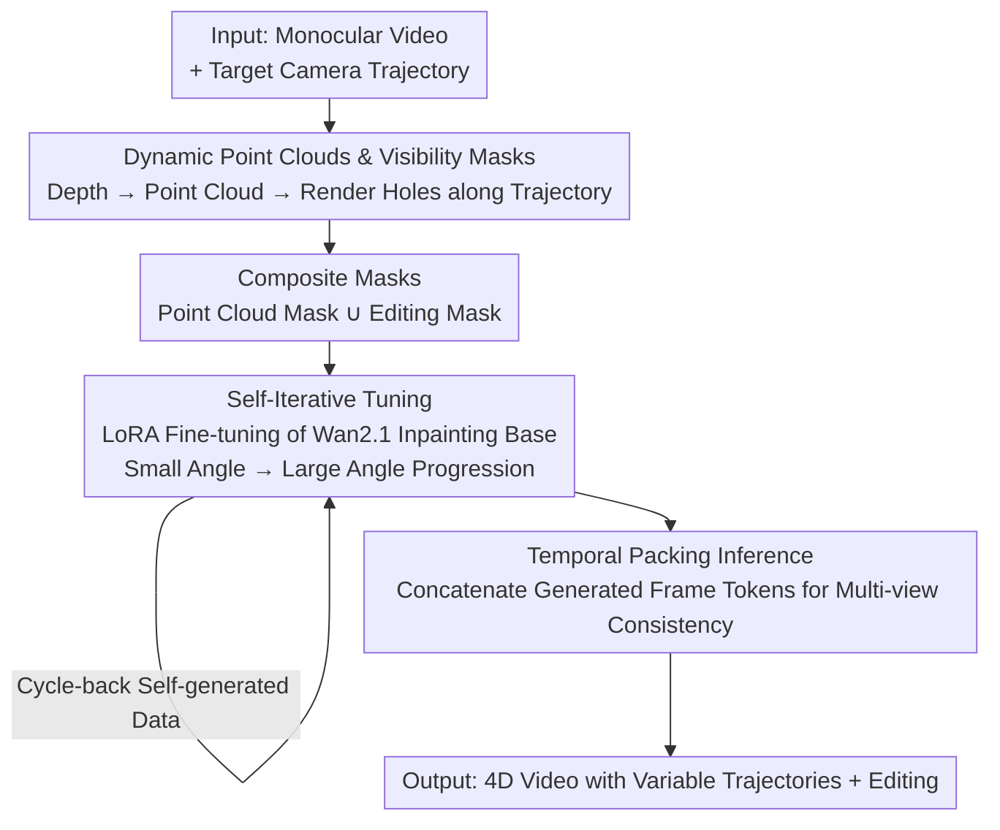

# EasyCreator: Empowering 4D Creation through Video Inpainting

**Conference**: ICLR2026  
**OpenReview**: [https://openreview.net/forum?id=mU8Ubd8aNK](https://openreview.net/forum?id=mU8Ubd8aNK)  
**Code**: To be confirmed  
**Area**: 3D Vision / 4D Generation / Video Diffusion  
**Keywords**: 4D Video Generation, Video Inpainting, Dynamic Point Clouds, Camera Trajectory Control, Multi-view Consistency

## TL;DR
EasyCreator reformulates the task of "generating 4D video with variable camera trajectories and editable content from monocular video" as a **video inpainting task**. It renders visibility masks of occluded regions using dynamic point clouds and employs a strong video inpainting base (Wan2.1) for completion. Combined with composite masks, self-iterative tuning, and temporal packing inference, it outperforms several camera redirection SOTAs with minimal additional large-scale training.

## Background & Motivation
**Background**: 4D video generation (synthesizing dynamic content along user-specified camera trajectories to create cinematic effects like zoom, tilt, pan, or bullet time) has gained significant attention. Mainstream approaches encode camera trajectories as embeddings (similar to text prompts) into pre-trained video generation bases, followed by fine-tuning on multi-view datasets, synthetic renderings, or monocular videos with camera pose annotations.

**Limitations of Prior Work**: These methods face three critical issues: heavy reliance on large-scale training data; restricted input modalities (typically only text or images); and poor camera controllability. Most importantly, they **do not support video input**, making it impossible to convert existing monocular videos into coherent 4D representations.

**Key Challenge**: The "two-stage" pipeline (using depth predictors to lift monocular video to dynamic point clouds, rendering videos with holes along target trajectories, and using inpainting to fill them) is conceptually sound but fails at the second step. **Video inpainting models specialized for such rendering holes are almost non-existent**. Existing practices often fine-tune general T2V models as ad-hoc inpainters, which lack temporal consistency and realism and typically do not support text-driven editing during generation, limiting flexibility.

**Key Insight**: The authors identified Wan2.1, a newly emerged strong video inpainting base trained on large-scale data, which is highly capable of hole filling. However, direct application to point-cloud-rendered holes fails as these masks fall out of its training distribution. The problem thus becomes: **how to adapt a general video inpainting base into a model capable of 4D hole filling and editing with minimal cost.**

**Core Idea**: Completely restructure 4D generation as a **specialized video inpainting task**. By feeding "composite masks + self-iterative tuning" to the inpainting base for lightweight fine-tuning (LoRA, approx. 2 hours on a single A800), the model unlocks 4D reconstruction potential without sacrificing its original capabilities.

## Method

### Overall Architecture
Given a monocular input video, EasyCreator aims to produce 4D video with variable camera trajectories (zoom/tilt/pan) and editable content. The pipeline consists of two stages: **Training side**: Lift the video into dynamic point clouds, create composite masks spatially aligned with the original video via "double reprojection," and fine-tune a frozen video inpainting base (Wan2.1 with LoRA) using "missing video + mask → clean video" pairs. To handle large camera movements, **self-iterative tuning** is used—learning small angles first, then generating larger-angle training data progressively. **Inference side**: A **temporal packing** strategy is employed, where token frames from previously generated trajectories are concatenated into the input of the next trajectory. The base's global self-attention ensures consistency in overlapping regions across multiple views.

### Key Designs

**1. Reformulating 4D Generation as Video Inpainting: Dynamic Point Clouds + Visibility Masks**

This is the fundamental motivation of the work. After changing camera perspectives, single-frame monocular depth cannot reconstruct the entire scene, inevitably leading to occlusions or missing regions. The authors treat these "holes" as targets for completion, connecting 4D generation to a mature inpainting base. Specifically, for input video $V=[I_0,\dots,I_{N-1}]$, per-frame depth $D_i$ is estimated via DepthCrafter. Using camera intrinsics $K$, each frame is lifted to a 3D point cloud $P_i=\phi([I_i,D_i],K)$. Given a camera extrinsic sequence $T=\{T_i\}$, point clouds are projected back to the image plane $I_i^a=\psi(P_i,K,T_i)$. Simultaneously, a binary visibility mask $M\in\mathbb{R}^{N\times1\times H\times W}$ is generated: pixels with valid projections are marked 1, while those falling outside the original field of view due to camera motion are marked 0. Thus, 4D generation is translated into the standard inpainting problem of completing regions where $M=0$.

**2. Composite Mask: Enabling "Filling" and "Editing" in a Single Fine-tuning**

Directly using the visibility mask for supervision is problematic because the rendered frames $I_i^a$ lack ground truth in occluded areas. The authors use **double reprojection** to circumvent this: project the rendered view $V'$ back into a new point cloud $P'$, then re-render back to the original view using the inverse transform $T^{-1}$ to obtain $V''$. This yields a pair of "degraded video $V''$ + mask $M''$ labeling artifacts," while the **original input video serves as the clean ground truth** $V_s$, as both share the original camera trajectory. On top of this, two mask types are superimposed: **Point cloud masks** (geometric holes) and **Editing masks** (randomly selected regions for mask sequences, with the first frame mask set to 0 to represent "first-frame guidance"). During training, one of these three types (or their union) is randomly sampled for each instance to predict $V_s$ using standard flow matching loss. This allows the base to learn geometric hole filling and content editing based on the first frame simultaneously.

**3. Self-Iterative Tuning: Progressive Perspective Expansion via Self-Generated Data**

Naive video inpainting diffusion models struggle with large-angle ($>40°$) hole completion due to limited generalization of fine-tuning and a lack of robust 3D awareness. The solution is **angle progression + self-generated data**: first, LoRA fine-tuning is performed on small-angle ($<30°$) video-mask pairs $\{(V^{(k)},M^{(k)})\}$. Using the updated weights $W^*_{\text{LoRA}}=\arg\min_W \mathcal{L}(V_k,M_k,\Delta W)$, the model generates videos $\tilde V$ for larger angles, which are then used in the next round. In each round $j$, larger-angle degraded videos $\tilde I^j_i=\psi(P^j_i,K,T^j_i)$ are generated, and weights are cumulatively updated as $W^{(j)}_{\text{LoRA}}=W^{(j-1)}_{\text{LoRA}}+\eta\nabla_W \mathcal{L}_{\text{cycle}}(\tilde V^j,M^j,\Delta W)$, where $\mathcal{L}_{\text{cycle}}$ is a spatio-temporal consistency MSE. The core idea is to **use the output of the previous stage as training data for the next**, allowing the model to "climb" toward larger angles.

**4. Temporal Packing Inference: Cross-Trajectory Token Concatenation for Multi-view Consistency**

During inference, independent inpainting of different camera trajectories results in inconsistent content in overlapping regions. Observing the overlap mask between trajectories $T^a$ and $T^b$, the authors propose **temporal packing**: first generate video $\tilde V^a$ for $T^a$, and select top-$K$ frames $F=\text{top-k-argmax}(S[\tilde V^a,M^a])$ based on the repaired area per frame. During inference for $T^b$, tokens from these selected frames are concatenated with $T^b$'s tokens along the temporal dimension: $x_{\text{input}}=[\text{patchify}(E(F)),\text{patchify}(E(V^b))]_{\text{temporal}}$, where $E(\cdot)$ is a pre-trained 3D-VAE. This requires **no additional fusion attention layers**, as the pre-trained spatio-temporal self-attention naturally treats the "previously generated frames" as priors to align overlapping regions.

### Loss & Training
The base is the open-source WAN-2.1 T2V model, fine-tuned with LoRA (rank=128). Input resolution is $512\times512$, video length 81 frames. Training lasts 2000 steps with a learning rate of $1\times10^{-5}$ and weight decay of 0.1, taking approx. 2 hours on one NVIDIA A800. The objective is the standard flow matching inpainting loss; the self-iterative stage adds spatio-temporal consistency MSE $\mathcal{L}_{\text{cycle}}$. Inference uses DPM solver (30 steps), text guidance scale 6.5, and LoRA weight fixed at 0.7.

## Key Experimental Results

### Main Results
Comparison with SOTAs like GCD, Trajectory-Attention, ReCamMaster, and TrajectoryCrafter on three benchmarks.

VBench Multi-dimensional Consistency (Higher is better):

| Metric | TrajectoryCrafter | Ours |
|------|------|------|
| Subject Consis. | 0.8632 | **0.9026** |
| Background Consis. | 0.8674 | **0.8931** |
| Temporal Flicker. | 0.7925 | **0.8818** |
| Motion Smooth. | 0.8815 | **0.9242** |
| Overall Consis. | 0.2463 | **0.2915** |

Visual Quality / Camera Accuracy / View Sync:

| Metric | Prev. SOTA | Ours |
|------|------|------|
| FID ↓ | 61.57 | **58.26** |
| FVD ↓ | 154.23 | **145.71** |
| RotErr ↓ | 1.43 | **1.37** |
| TransErr ↓ | 5.52 | **4.47** |
| FVD-V ↓ | 148.71 | **119.52** |
| CLIP-V ↑ | 88.53 | **89.87** |

Improvements on Kubric-4D are significant: PSNR increased from 15.82 to **22.15**, LPIPS dropped from 0.532 to **0.381**, and SSIM rose from 0.487 to **0.523**, indicating much higher similarity to GT in novel view synthesis.

### Ablation Study

| Configuration | FID ↓ | FVD ↓ | CLIP-V ↑ | Description |
|------|------|------|------|------|
| w/o composite mask | 78.27 | 153.28 | 85.25 | Fails at both hole filling and editing |
| w/o iterative tuning | 86.29 | 197.24 | 81.26 | Temporal collapse at large angles; worst FID |
| w/o temporal pack | 62.46 | 168.91 | 84.71 | Inconsistent overlap regions across views |
| **Ours** | **58.26** | **145.71** | **89.87** | Full Model |

### Key Findings
- **Self-iterative tuning is the most critical component**: Removing it degrades FID from 58.26 to 86.29 and FVD to 197.24, confirming that the base needs progressive "re-education" for 3D awareness.
- **Composite mask is the "switch" for editing**: Without it, simultaneous 4D generation and first-frame editing (e.g., placing "fries" on ice) fails.
- **Temporal packing solves multi-view inconsistency**: Without it, CLIP-V drops significantly, and content in overlapping trajectories fails to align.

## Highlights & Insights
- **Smart Task Reformulation**: Translating "4D generation" to "inpainting point cloud holes" leverages a strong existing base for a difficult task lacking massive data. This bypasses the need for large-scale 4D training.
- **Self-Generated Data for Angle Expansion**: Using the model's own output to generate next-stage training samples is a cost-effective "curriculum bootstrapping" that can be applied to other generation fine-tunings.
- **Zero-Parameter Multi-view Fusion**: Temporal packing uses no additional layers, relying purely on the base's global self-attention. This "re-using pre-trained attention" trick is highly valuable.

## Limitations & Future Work
- **Dependency on Monocular Depth**: Quality relies on off-the-shelf depth estimators; inaccurate depth directly contaminates masks and geometry.
- **Per-video One-shot Fine-tuning**: Requires approx. 2 hours of tuning for each new video, which is far from "zero-shot" or real-time.
- **Large-angle Upper Bound**: While self-iteration mitigates the $>40°$ issue, the maximum angle possible before quality collapse is not systematically analyzed.
- **Mathematical Simplification**: Self-iterative recursion and $\mathcal{L}_{\text{cycle}}$ are described somewhat briefly in the main text; details should be verified in the appendix.

## Related Work & Insights
- **vs ReCamMaster / TrajectoryCrafter**: These encode camera trajectories into the base and fine-tune on massive video data, focusing on input-output consistency. EasyCreator requires less data and addresses **multi-view consistency**.
- **vs GCD (4D Novel View Synthesis)**: GCD uses implicit camera pose embeddings, often resulting in over-smoothing and pose misalignment. EasyCreator is superior in fidelity and pose accuracy.
- **vs General Video Inpainting**: Traditional inpainting focuses on intra-video content; this work unlocks inpainting for **4D reconstruction** by enabling it to handle geometric holes from perspective shifts.

## Rating
- Novelty: ⭐⭐⭐⭐⭐ Unique perspective in reformulating 4D generation as inpainting.
- Experimental Thoroughness: ⭐⭐⭐⭐ Solid benchmarks and ablations, though lacking failure analysis and angle-quality curves.
- Writing Quality: ⭐⭐⭐⭐ Clear storyline, though some iterative formulas are simplified.
- Value: ⭐⭐⭐⭐⭐ Strong practicality in converting monocular video to 4D at low cost.

<!-- RELATED:START -->

## Related Papers

- [\[ICCV 2025\] Vivid4D: Improving 4D Reconstruction from Monocular Video by Video Inpainting](../../ICCV2025/3d_vision/vivid4d_improving_4d_reconstruction_from_monocular_video_by_video_inpainting.md)
- [\[ICLR 2026\] WorldTree: Towards 4D Dynamic Worlds from Monocular Video Using Tree-Chains](worldtree_towards_4d_dynamic_worlds_from_monocular_video_using_tree-chains.md)
- [\[ICLR 2026\] UFO-4D: Unposed Feedforward 4D Reconstruction from Two Images](ufo-4d_unposed_feedforward_4d_reconstruction_from_two_images.md)
- [\[CVPR 2026\] Vista4D: Video Reshooting with 4D Point Clouds](../../CVPR2026/3d_vision/vista4d_video_reshooting_with_4d_point_clouds.md)
- [\[ICLR 2026\] Uncertainty Matters in Dynamic Gaussian Splatting for Monocular 4D Reconstruction](uncertainty_matters_in_dynamic_gaussian_splatting_for_monocular_4d_reconstructio.md)

<!-- RELATED:END -->
