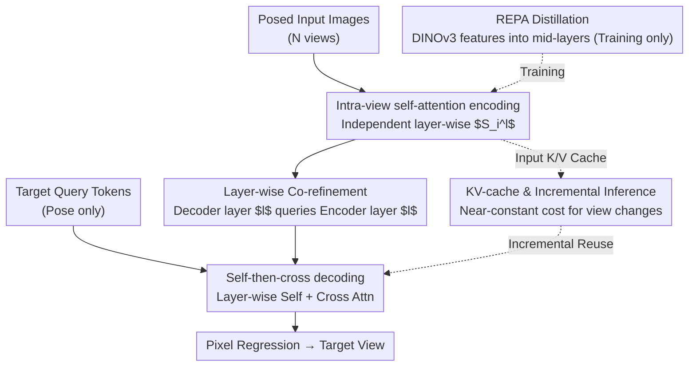

# Efficient-LVSM: Faster, Cheaper, and Better Large View Synthesis Model via Decoupled Co-Refinement Attention

**Conference**: ICLR2026  
**arXiv**: [2602.06478](https://arxiv.org/abs/2602.06478)  
**Code**: [efficient-lvsm.github.io](https://efficient-lvsm.github.io/)  
**Area**: 3D Vision  
**Keywords**: novel view synthesis, Transformer, Dual-Stream Architecture, KV-Cache, Attention Decoupling

## TL;DR

Ours proposes Efficient-LVSM, a dual-stream architecture that decouples input view encoding from target view generation, reducing the complexity of novel view synthesis from $O(N_{in}^2)$ to $O(N_{in})$. It achieves SOTA performance on RealEstate10K (29.86 dB PSNR) with 50% training time and a 4.4x speedup in inference.

## Background & Motivation

Novel View Synthesis (NVS), reconstructing 3D scenes from 2D images, is a core problem in computer vision. Recent developments have evolved from per-scene optimization like NeRF/3DGS to feed-forward Transformer methods like LVSM, which synthesize novel views directly from posed images, eliminating reliance on handcrafted 3D priors.

However, the decoder-only design of LVSM concatenates all input and target tokens for full self-attention, leading to two major bottlenecks:

1. **Low Efficiency**: It exhibits quadratic complexity $O(N^2)$ relative to the number of input views $N$; input representations are redundantly recalculated when generating multiple target views.
2. **Limited Performance**: Heterogeneous tokens (input views with content vs. target queries with only poses) share the same set of attention parameters, preventing the learning of specialized representations for each.

## Core Problem

How to decouple input encoding and target generation to improve both efficiency and quality while maintaining an end-to-end feed-forward NVS framework?

While encoder-decoder variants of LVSM avoid redundant calculations, compressing all inputs into a single latent vector leads to information loss and significant degradation in reconstruction quality. An architecture that preserves multi-level fine-grained features while supporting efficient inference is required.

## Method

### Overall Architecture

Efficient-LVSM addresses the "slow and mutual interference" issue caused by LVSM's full self-attention. The pipeline is split into two non-entangled streams: posed input images are processed by the **Input Encoder** into features, while target query tokens with only pose information pass through the **Target Decoder**. The decoder repeatedly queries the encoder features to progressively "fill in" the new view, finally regressing pixels. Crucially, input encoding is no longer affected by target tokens, and target generation only accesses input features via unidirectional cross-attention. This reduces input complexity from $O(N^2 M)$ to $O(NM + N)$, allowing input representations to be computed once and reused for all target views.

### Key Designs

**1. Intra-view self-attention encoding: Linear complexity scaling with view count**

To solve the quadratic complexity bottleneck where $N$ views are fully entangled, the encoder only performs self-attention between patches within the same input view. Features are updated layer-wise as $\mathbf{S_i}^l = \mathbf{S_i}^{l-1} + \text{Self-Attn}_{\text{input}}^l(\mathbf{S_i}^{l-1})$, isolating different views. This ensures total cost grows linearly with $N$. Furthermore, since each view is encoded independently of others, the model generalizes zero-shot to any number of input views at test time.

**2. Self-then-cross decoding: Scenario alignment and content retrieval via alternating attention**

Maintaining geometric consistency between target views while extracting content from inputs is difficult for cross-attention alone. The decoder alternates two steps per layer: first, $\mathbf{T_j}^l = \mathbf{T_j}^{l-1} + \text{Self-Attn}_{\text{target}}^l(\mathbf{T_j}^{l-1})$ allows target tokens to exchange scene-level information and align spatial relationships; then, $\mathbf{T_j}^l = \mathbf{T_j}^l + \text{Cross-Attn}_{\text{target}}^l(\mathbf{T_j}^l, \mathbf{S_1}^l, ..., \mathbf{S_N}^l)$ extracts the required content from input features. Ablations show this 6+6 layer alternating structure significantly outperforms a 12-layer pure cross-attention design.

**3. Co-refinement: Layer-wise alignment of encoder and decoder features**

Traditional encoder-decoder designs compress the input into a single representation from the last encoder layer, losing fine-grained details. This caused LVSM Enc-Dec variants to drop to 28.55 dB. Co-refinement allows the cross-attention in decoder layer $l$ to directly query features from encoder layer $l$ ($\mathbf{S_i}^l$). Consequently, fine-grained textures from early layers and high-level semantics from later layers are both accessible to the corresponding decoder layers.

**4. REPA Distillation: Injecting pre-trained features without inference overhead**

To further improve encoding quality, the authors use REPA to distill visual features from a pre-trained DINOv3 into the middle layers of the encoder. The loss maximizes patch-level similarity: $\mathcal{L}_{REPA} = \frac{1}{N}\sum_{i=1}^{N}\text{sim}(f(\mathbf{I}), h_\phi(\mathbf{X_k}))$, where $h_\phi$ is a projection head used only during training. REPA is discarded during inference. Notably, REPA significantly benefits Efficient-LVSM but is ineffective for the original LVSM, as the latter's full self-attention entangles features across views, preventing alignment of distillation signals.

**5. KV-cache and Incremental Inference: Realizing the "compute-once" dividend**

Since input encoding is target-independent and cross-attention is unidirectional, input view key/values are cached after the first computation. Adding a target view only requires the new target tokens to query the cached input features. Adding an input view only requires encoding that specific view and appending its key/values to the cache. Both operations incur near-constant latency and memory overhead, making the model ideal for interactive 3D browsing.

## Key Experimental Results

### Main Results (RealEstate10K, 2 Input Views)

| Method | PSNR ↑ | SSIM ↑ | LPIPS ↓ |
|------|--------|--------|---------|
| GS-LRM | 28.10 | 0.892 | 0.114 |
| LVSM Dec-Only (512) | 29.53 | 0.904 | 0.141 |
| **Efficient-LVSM (512)** | **29.86** | **0.905** | 0.147 |

### Object-level (ABO / GSO, 512 Res)

| Method | ABO PSNR | GSO PSNR |
|------|----------|----------|
| GS-LRM | 29.09 | 30.52 |
| LVSM Dec-Only | 32.10 | 32.36 |
| **Efficient-LVSM** | **32.65** | **32.92** |

### Key Findings

- **Training Speed**: Approximately **2×** faster convergence than LVSM.
- **Inference Speed**: **4.4×** faster than LVSM Dec-Only (up to 14.9× in specific cases).
- **Training Resources**: 64 A100 GPUs for 3 days, only **50%** of LVSM's training time.
- **Incremental Inference**: Latency and VRAM remain nearly constant when adding views.
- **Zero-shot Generalization**: Trained on 4 views, it generalizes well to varying view counts due to independent view processing.

## Highlights & Insights

1. **Profound Problem Analysis**: Systematically identifies flaws in LVSM's full self-attention regarding information heterogeneity and complexity.
2. **Elegant Co-Refinement**: Effectively utilizes multi-scale information by aligning encoder-decoder features layer-wise.
3. **High Practical Value**: KV-cache and incremental inference enable deployment in interactive 3D scene browsing.
4. **Efficiency/Quality Win**: Exceeds LVSM on all benchmarks while significantly reducing costs.
5. **Conditional REPA Discovery**: Reveals the coupling between distillation effectiveness and attention architecture.

## Limitations & Future Work

1. The encoder's intra-view attention lacks cross-view interaction; scene understanding relies entirely on the decoder's cross-attention, which may be insufficient for highly occluded scenes.
2. Scaling behavior for larger models or higher resolutions has not been explored.
3. Validated only on static scenes; applicability to dynamic scenes is unknown.
4. LPIPS at 512 resolution is slightly behind LVSM Dec-Only (0.147 vs 0.141), suggesting room for improvement in perceptual quality.

## Related Work & Insights

| Dimension | LVSM Dec-Only | LVSM Enc-Dec | Efficient-LVSM |
|------|--------------|--------------|----------------|
| Input Complexity | $O(N^2)$ | $O(N^2)$ | $O(N)$ |
| Parameter Sharing | Shared | Separate (last layer) | Separate + layer-wise Co-ref |
| KV-Cache | Not Supported | Not Supported | Supported |
| Incremental Inference | Not Supported | Not Supported | Supported |
| Variable View Gen | Poor | Poor | Strong (Zero-shot) |
| RealEstate10K PSNR | 29.53 | 28.55 | **29.86** |

Compared to Gaussian Splatting methods like pixelSplat/MVSplat, Efficient-LVSM is more end-to-end and provides higher quality without explicit 3D representations, though it requires more computation.

## Insights

1. **Dual-stream Decoupling**: Transformer tasks with heterogeneous inputs (e.g., multimodal understanding) can adopt this design to decouple providers from queries.
2. **Co-Refinement Generality**: The idea of layer-wise cross-querying is applicable to other encoder-decoder architectures beyond NVS.
3. **KV-Cache for 3D**: Adapting LLM KV-caching to 3D vision provides a path toward real-time interactive rendering.
4. **Distillation-Architecture Coupling**: The varying effectiveness of REPA suggests that distillation strategies should be co-designed with model architectures.

## Rating
- Novelty: ⭐⭐⭐⭐
- Experimental Thoroughness: ⭐⭐⭐⭐⭐
- Writing Quality: ⭐⭐⭐⭐
- Value: ⭐⭐⭐⭐⭐

<!-- RELATED:START -->

## Related Papers

- [\[CVPR 2026\] FlashMesh: Faster and Better Autoregressive Mesh Synthesis via Structured Speculation](../../CVPR2026/3d_vision/flashmesh_faster_and_better_autoregressive_mesh_synthesis_via_structured_specula.md)
- [\[ICLR 2026\] Aligned Novel View Image and Geometry Synthesis via Cross-modal Attention Instillation](aligned_novel_view_image_and_geometry_synthesis_via_cross-modal_attention_instil.md)
- [\[ICCV 2025\] RayZer: A Self-supervised Large View Synthesis Model](../../ICCV2025/3d_vision/rayzer_a_self-supervised_large_view_synthesis_model.md)
- [\[CVPR 2026\] From Rays to Projections: Better Inputs for Feed-Forward View Synthesis](../../CVPR2026/3d_vision/from_rays_to_projections_better_inputs_for_feed-forward_view_synthesis.md)
- [\[ICCV 2025\] Faster and Better 3D Splatting via Group Training](../../ICCV2025/3d_vision/faster_and_better_3d_splatting_via_group_training.md)

<!-- RELATED:END -->
