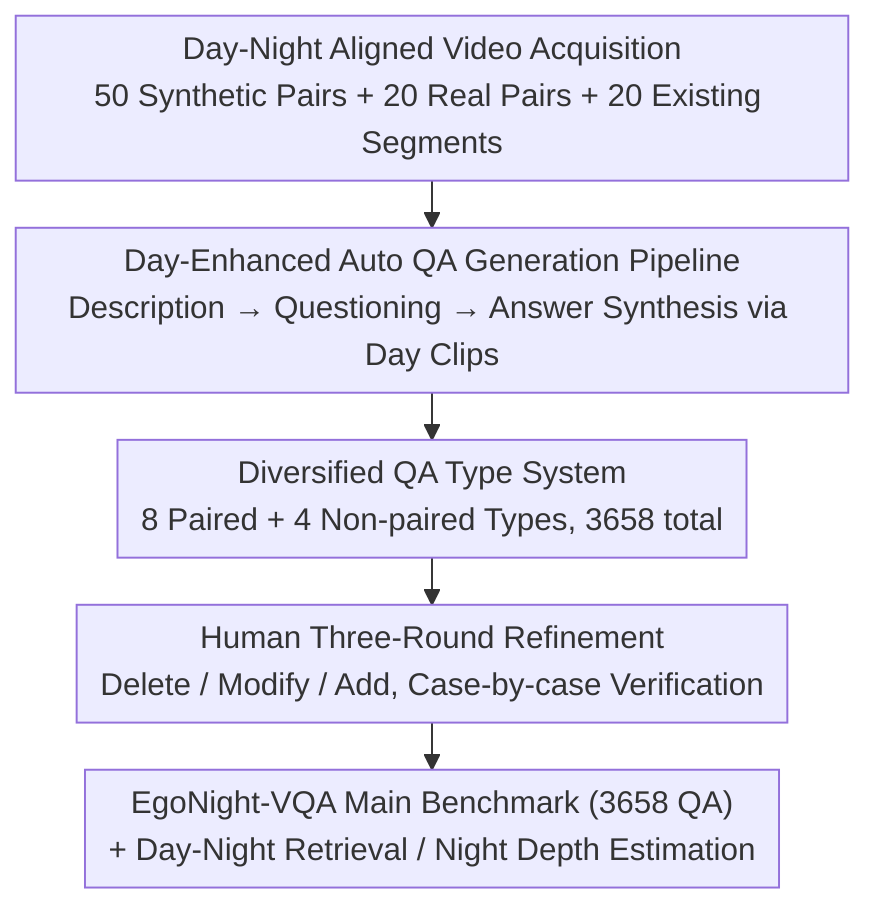

# EgoNight: Towards Egocentric Vision Understanding at Night with a Challenging Benchmark

**Conference**: ICLR 2026  
**arXiv**: [2510.06218](https://arxiv.org/abs/2510.06218)  
**Code**: [https://github.com/dehezhang2/EgoNight](https://github.com/dehezhang2/EgoNight)  
**Area**: 3D Vision / Egocentric Vision  

## TL;DR

Ours proposes EgoNight, the first nocturnal egocentric vision benchmark, featuring day-night aligned videos and 3658 human-verified QA pairs, revealing a performance degradation of up to 32.8% in MLLMs under low-light conditions.

## Background & Motivation

### Background

Egocentric vision understanding has achieved significant progress recently. Large-scale datasets such as EPIC-KITCHENS, Ego4D, and Ego-Exo4D have advanced tasks like action recognition, object detection, and video QA. MLLMs (e.g., GPT-4V, Gemini, Qwen-VL) have demonstrated powerful capabilities in video understanding, and specialized egocentric MLLMs (e.g., EgoGPT, Exo2Ego) have also emerged.

### Limitations of Prior Work

Almost all existing egocentric vision datasets and benchmarks are limited to daytime or well-lit scenes, ignoring nocturnal low-light scenarios that are inevitable in real-world applications. This leads to unknown robustness of current models in night environments, severely limiting the practical deployment of intelligent assistants and navigation systems.

### Key Challenge

In reality, egocentric vision systems (e.g., intelligent navigation assistants) must operate at night, facing challenges such as low light, non-uniform illumination, and severely restricted visibility. However, the lack of proper nocturnal benchmarks prevents researchers from evaluating nocturnal performance or making targeted improvements. Furthermore, nocturnal annotation is extremely difficult due to low visibility, making it hard to ensure annotation quality.

### Goal

Ours proposes EgoNight, the first systematic nocturnal egocentric vision benchmark. The core innovation lies in the introduction of day-night aligned videos: utilizing Blender to synthesize precisely aligned day-night video pairs (EgoNight-Synthetic), designing a video-guided recording strategy to collect real-world day-night aligned videos (EgoNight-Sofia), and integrating existing nocturnal data (EgoNight-Oxford). Based on this, the EgoNight-VQA benchmark and two auxiliary tasks are constructed.

---

## Method

### Overall Architecture

EgoNight addresses the contradiction between the "lack of nocturnal egocentric benchmarks" and the "extreme difficulty in ensuring nocturnal annotation quality." The core idea is to provide a corresponding daytime video as a reference for every nocturnal video. The pipeline is structured as follows: First, three types of day-night aligned video sources are collected (50 synthetic pairs from Blender, 20 real-world recorded pairs, and 20 existing nocturnal segments). Then, a three-stage "day-enhanced" automatic pipeline incorporates daytime information into nocturnal annotations, generating 3,658 QA pairs across a system of 12 types. Finally, in addition to the main VQA benchmark, two auxiliary tasks—day-night correspondence retrieval and nocturnal depth estimation—are derived. Day-night alignment serves as both the main thread for data collection and the foundation for all subsequent automatic annotation and quantitative analysis.

### Key Designs

**1. Day-Night Aligned Video Acquisition: Comparing Night Frames with Same-Trajectory Day Frames**

Nocturnal low visibility directly causes annotation difficulties and prevents quantitative attribution of model performance. The authors use two complementary paths to strictly align day and night frames. On the synthetic side (EgoNight-Synthetic), Infinigen is used to generate diverse indoor 3D scenes. Annotators clean the scenes and simulate a walking trajectory, then Blender renders both daytime and nighttime versions under the exact same trajectory, resulting in 50 pairs of pixel-level precisely aligned videos covering 100+ environment assets and 50+ object categories. On the real side (EgoNight-Sofia), where re-rendering is impossible, a video-guided recording strategy was designed: daytime videos are recorded first, then replayed on a phone as visual guidance during nighttime recording to help the wearer replicate walking speed, viewpoints, and actions. Spatiotemporal trimming is applied afterward for further alignment, resulting in 20 pairs of real aligned videos covering apartments, offices, supermarkets, and streets. These two paths solve "alignment precision" and "authenticity" respectively, allowing the day-night performance gap to be measured cleanly.

**2. Day-Enhanced Auto QA Generation Pipeline: Using Clear Daytime Information to Assist Vague Nocturnal Annotations**

Directly asking a model to generate questions and answers on nocturnal clips results in numerous errors due to poor visibility. The authors split generation into three steps and introduce daytime information at critical stages. Step 1: Prompt GPT-4.1 to generate detailed descriptions for nocturnal clips based on target QA types. Step 2: Feed the descriptions along with the nocturnal clips to an MLLM to produce diverse question candidates. Step 3: Synthesize pseudo-answers—for paired types, aligned daytime clips are used to generate more accurate answers; for non-paired types (e.g., illumination changes), answers are inferred directly from nocturnal clips. Thus, the reliability of the answers comes from the day, while the context of the questions remains faithful to the night. The generated results undergo three rounds of human refinement (deletion/modification/addition), with each QA pair verified at least once, totaling over 300 hours of manual effort to balance automation scale with human quality standards.

**3. Diversified QA Type System: Covering Unique Nocturnal and Previously Unexplored Understanding Dimensions**

To prevent the benchmark from becoming a mere nocturnal re-skin of daytime VQA, the authors defined 12 QA types, divided by the presence of day-night pairing. There are 8 paired types—Object Recognition, Text Recognition, Spatial Reasoning, Scene Sequencing, Navigation, Static Counting, Action Recognition, and Non-common-sense Reasoning—which leverage daytime clips for day-enhanced annotation. There are 4 non-paired types—Illumination Recognition, Illumination Change, Dynamic Detection, and Dynamic Counting—specifically designed to examine phenomena prominent only at night. Among these, Navigation, Scene Sequencing, Illumination Recognition/Change, and Non-common-sense Reasoning are newly proposed task dimensions that posed the greatest challenges to existing MLLMs in experiments.

---

## Key Experimental Results

### Main Results

Evaluation of 10 SOTA MLLMs on EgoNight-VQA:

| Model | Synthetic (Night) | Sofia (Night) | Oxford (Night) | Average Accuracy |
|------|--------------|-----------|------------|----------|
| GPT-4.1 | 30.73% | 26.33% | 35.72% | **30.93%** |
| Gemini 2.5 Pro | 27.18% | 25.00% | 33.21% | 28.46% |
| InternVL3-8B | 19.28% | 17.10% | 23.80% | **20.06%** |
| Qwen2.5-VL-72B | 18.56% | 16.73% | 22.41% | 19.23% |
| Qwen2.5-VL-7B | 14.58% | 13.28% | 16.71% | 14.86% |
| EgoGPT | 12.88% | 14.03% | 15.95% | **14.29%** |

Day-night performance gap: Average decrease of **32.8%** on EgoNight-Synthetic and **25.0%** on EgoNight-Sofia.

### Ablation Study

| Fine-tuning Strategy | Synthetic Accuracy | Real Accuracy | Gain |
|---------|----------------|------------|---------|
| Zero-shot (Baseline) | 14.83% | - | - |
| Full Model Fine-tuning | **24.67%** | **21.88%** | +9.84% |
| Vision Encoder Only | 19.23% | 18.56% | +4.40% |
| LLM Only | 21.15% | 19.02% | +6.32% |
| Synthetic Training → Real Test | - | 20.57% | +5.74% |

**Key Findings**:

1. Synthetic data is highly correlated with real data (Pearson $r = 0.9359$, $p = 6.847 \times 10^{-5}$); fine-tuning on synthetic data effectively improves performance in real-world scenarios.
2. Perception tasks perform better in the daytime but drop more at night, while reasoning tasks are overall more difficult but relatively less affected by illumination.
3. Newly proposed QA types (Illumination Recognition, Navigation, Non-common-sense Reasoning) pose significant challenges to existing MLLMs.
4. In auxiliary tasks, GPT-4.1 achieves 80%+ accuracy in spatial retrieval but performs poorly in temporal localization; fisheye depth estimation models outperform general-purpose models.

---

## Highlights & Insights

- Fills the gap in nocturnal egocentric vision understanding; the day-night alignment design is ingenious, allowing for quantitative analysis of performance gaps.
- Comprehensive QA type design, introducing multiple previously unexplored task dimensions such as navigation and illumination recognition.
- The day-enhanced annotation pipeline cleverly utilizes daytime information to assist nocturnal annotation, balancing efficiency and quality.
- Synthetic data is highly correlated with real-world data ($r = 0.9359$), validating the research value of synthetic data.

## Limitations & Future Work

- Small data scale (90 videos, 3658 QA pairs) compared to large-scale benchmarks.
- High proportion of synthetic data (approx. 55%), which may not fully reflect real-world complexity.
- Only VQA and two auxiliary tasks evaluated, not covering a broader range of nocturnal egocentric tasks.
- The day-enhanced annotation strategy relies on GPT-4.1, and generation quality is limited by the model's capabilities.

## Related Work & Insights

- **vs Ego4D/EPIC-KITCHENS**: These large-scale egocentric datasets focus on daytime scenes; EgoNight is the first benchmark focused on the night.
- **vs NightBench**: NightBench focuses on general nocturnal image understanding; EgoNight focuses on the egocentric perspective and provides day-night alignment.
- **vs Low-light Enhancement Methods**: Traditional methods focus on pixel-level enhancement, while ours focuses on semantic-level understanding gaps.

## Rating

- Novelty: ⭐⭐⭐⭐ First systematic nocturnal egocentric vision benchmark.
- Experimental Thoroughness: ⭐⭐⭐⭐ Covers 10 MLLMs, including fine-tuning analysis and auxiliary tasks.
- Writing Quality: ⭐⭐⭐⭐ Clear structure, standardized data presentation.
- Value: ⭐⭐⭐⭐ Fills an important research gap with high practical value.

<!-- RELATED:START -->

## Related Papers

- [\[ICLR 2026\] FlashWorld: High-quality 3D Scene Generation within Seconds](flashworld_high-quality_3d_scene_generation_within_seconds.md)
- [\[ICLR 2026\] Distractor-free Generalizable 3D Gaussian Splatting](distractor-free_generalizable_3d_gaussian_splatting.md)
- [\[ICCV 2025\] Egocentric Action-aware Inertial Localization in Point Clouds with Vision-Language Guidance](../../ICCV2025/3d_vision/egocentric_action-aware_inertial_localization_in_point_clouds_with_vision-langua.md)
- [\[AAAI 2026\] OpenScan: A Benchmark for Generalized Open-Vocabulary 3D Scene Understanding](../../AAAI2026/3d_vision/openscan_a_benchmark_for_generalized_open-vocabulary_3d_scene_understanding.md)
- [\[CVPR 2026\] AVA-Bench: Atomic Visual Ability Benchmark for Vision Foundation Models](../../CVPR2026/3d_vision/ava-bench_atomic_visual_ability_benchmark_for_vision_foundation_models.md)

<!-- RELATED:END -->
