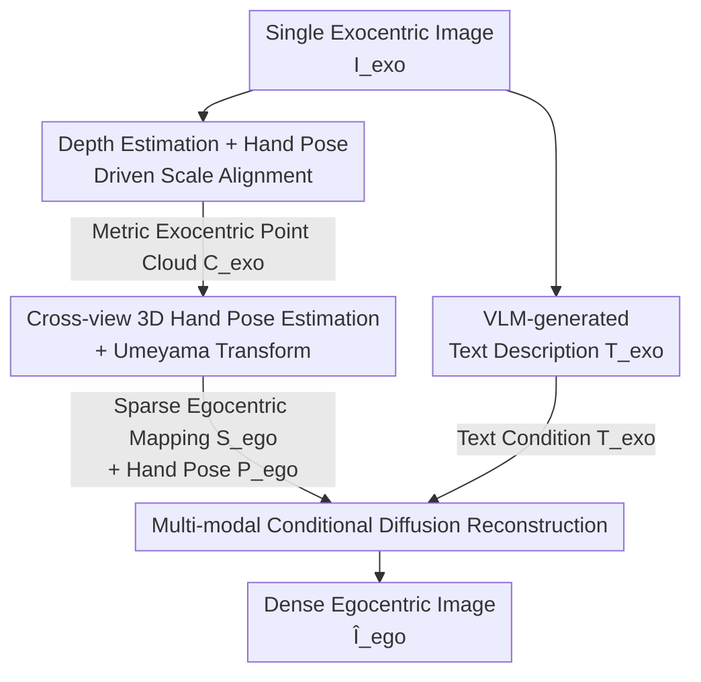

# EgoWorld: Translating Exocentric View to Egocentric View using Rich Exocentric Observations

**Conference**: ICLR 2026  
**arXiv**: [2506.17896](https://arxiv.org/abs/2506.17896)  
**Code**: [Available](https://redorangeyellowy.github.io/EgoWorld/)  
**Area**: 3D Vision  
**Keywords**: View Synthesis, Exocentric-to-Egocentric, Diffusion Models, Hand-Object Interaction, Point Cloud Projection

## TL;DR

EgoWorld proposes an end-to-end exocentric-to-egocentric view translation framework. It extracts three complementary observations—3D point clouds, hand poses, and text descriptions—from a single exocentric image. A sparse egocentric RGB mapping is obtained via point cloud re-projection, followed by high-fidelity egocentric image reconstruction using a diffusion model in an inpainting manner. The method outperforms SOTA across multiple unseen settings on four datasets, including H2O.

## Background & Motivation

**Background**: Egocentric vision is critical for AR/VR, robotic manipulation, and instructional videos, particularly for understanding hand-object interactions. However, most real-world video resources are exocentric, as the adoption of head-mounted cameras lags behind standard cameras. Thus, generating egocentric views from exocentric images is a highly practical problem.

**Limitations of Prior Work**: Existing exo-to-ego translation methods suffer from severe input constraints. Exo2Ego-V requires multi-view 360° inputs; 4Diff requires known relative camera poses; EgoExo-Gen requires an initial egocentric reference frame and text instructions. Exo2Ego, the closest work, requires only a single exocentric image but relies on 2D hand layout prediction for structural transformation—which is unreliable under occlusion, viewpoint ambiguity, and clutter, leading to poor generalization.

**Key Challenge**: There is a significant geometric and semantic gap between exocentric and egocentric views. Exocentric views provide global context but lack hand-object interaction details; egocentric views focus on close-up details but lack global information. This discrepancy results in substantial occlusion, appearance variation, and invisible regions that cannot be bridged by 2D alignment alone.

**Goal**: (1) To obtain sufficient 3D geometric information from a single exocentric image without multi-view or camera pose priors; (2) To complete sparse re-projected information into dense, semantically consistent egocentric images.

**Key Insight**: The authors observe that exocentric images contain rich 3D information: depth maps recover scene geometry, hand poses establish cross-view correspondences, and text provides semantic priors. Unifying these as conditional inputs for a diffusion model reframes view translation as a multi-modal conditional image inpainting problem.

**Core Idea**: Replace 2D layouts with 3D point cloud re-projection for sparse structural priors, and combine hand poses with text descriptions as multi-modal conditions to drive high-fidelity egocentric image reconstruction via a diffusion model.

## Method

### Overall Architecture

EgoWorld is a two-stage pipeline. **Stage 1 (Exocentric View Observation $\Phi_{exo}$)**: Takes a single exocentric image $I_{exo}$ and outputs three intermediate representations—a sparse egocentric RGB mapping $S_{ego}$, a 3D egocentric hand pose $P_{ego}$, and a text description $T_{exo}$. $S_{ego}$ is obtained by: first performing **depth estimation + hand-pose-driven scale alignment** to obtain a metric-scale exocentric point cloud, followed by **cross-view 3D hand pose estimation + Umeyama transform** to transform and project the point cloud. $T_{exo}$ is generated by a VLM to describe the scene and interaction. **Stage 2 (Egocentric View Reconstruction $\Phi_{ego}$)**: Uses these observations as conditions for **multi-modal conditional diffusion reconstruction**. It leverages a pre-trained Latent Diffusion Model (LDM) inpainting capability to complete the dense egocentric image $\hat{I}_{ego}$ from the sparse RGB mapping. The process requires no multi-view input, known camera poses, or egocentric reference frames.

### Key Designs

**1. Depth Estimation + Hand-Pose-Driven Scale Alignment: Hand as Anchor for Metric Depth**

Cross-view re-projection requires metric 3D geometry, but single-view depth estimation is relative. The authors use a monocular depth estimator (DepthAnythingV2) to get $D_{exo}$ from $I_{exo}$. To resolve scale ambiguity, they use the hand, which is almost always visible. A hand pose estimator (ACR) extracts a MANO mesh to obtain metric 3D exocentric hand pose $P_{exo}$ and corresponding depth $D_{hand}$. The global scale factor is determined by the median ratio within the hand region $\Omega_{hand}$:

$$s^* = \text{median}_{(u,v) \in \Omega_{hand}} \frac{D_{hand}(u,v)}{D_{exo}(u,v)}$$

The depth is calibrated as $D'_{exo} = s^* D_{exo}$, and combined with exocentric intrinsic $K_{exo}$ to build the RGBD point cloud $C_{exo} \in \mathbb{R}^{(H \times W) \times 6}$.

**2. Cross-view 3D Hand Pose Estimation + Umeyama Transform: Direct Ego-Pose Prediction**

The relative pose between exocentric and egocentric cameras is required. EgoWorld trains a model $\phi_{ego}$ to directly predict egocentric 3D hand poses from exocentric images using a ViT-224 backbone and a 2-layer MLP. Given $P_{exo}$ and the predicted $P_{ego}$, the Umeyama algorithm computes the optimal similarity transform $(s, \mathbf{R}, \mathbf{t})$. The inverse transform $X = (X_{ego \to exo})^{-1}$ maps $C_{exo}$ to the egocentric frame, forming $S_{ego}$ via projection with $K_{ego}$.

**3. Multi-modal Conditional Diffusion Reconstruction: View Translation as Inpainting**

Re-projected $S_{ego}$ is sparse due to occlusions. The authors treat this as an LDM inpainting task: $S_{ego}$ is encoded via VAE into a 4-channel latent $s_{ego}$; $P_{ego}$ is projected to a 2D pose map, VAE-encoded, and condensed to a 1-channel latent $p_{ego}$. These are concatenated with noise $z_t$ (forming a 9-channel input) for the U-Net. $T_{exo}$ (VLM-generated) is CLIP-encoded as $c_{exo} \in \mathbb{R}^{77 \times 768}$ for cross-attention guidance.

### Loss & Training

- **Hand Pose Estimator $\phi_{ego}$**: MSE loss (L2 regression), ViT-224 backbone + 2-layer MLP, batch size 64, lr $1 \times 10^{-4}$, Adam optimizer, 100 epochs (~20 hours).
- **Diffusion Model $\epsilon_\theta$**: Standard LDM denoising objective $\mathcal{L} = \mathbb{E}\|\epsilon_t - \epsilon_\theta(z'_t, t, c_{exo})\|_2^2$, fine-tuning pre-trained LDM inpainting, batch size 3, lr $1 \times 10^{-5}$, AdamW, 5 epochs (~10 hours).
- Inference uses Classifier-Free Guidance (CFG). All training performed on a single NVIDIA RTX 4090.

## Key Experimental Results

### Main Results: Four Unseen Scenarios on H2O

| Scenario | Method | FID ↓ | PSNR ↑ | SSIM ↑ | LPIPS ↓ | PA-MPJPE ↓ | CLIPScore ↑ |
|------|------|-------|--------|--------|---------|------------|-------------|
| Unseen Objects | pix2pixHD | 436.25 | 25.01 | 0.299 | 0.606 | 18.01 | 0.230 |
| Unseen Objects | CFLD | 59.62 | 25.92 | 0.431 | 0.454 | 7.997 | 0.266 |
| Unseen Objects | **Ours** | **41.33** | **31.17** | **0.481** | **0.348** | **7.318** | **0.273** |
| Unseen Actions | CFLD | 50.95 | 28.53 | 0.432 | 0.459 | 8.120 | 0.270 |
| Unseen Actions | **Ours** | **33.28** | **31.62** | **0.457** | **0.378** | **7.260** | **0.282** |
| Unseen Scenes | CFLD | 118.10 | 29.03 | 0.370 | 0.684 | 7.877 | 0.251 |
| Unseen Scenes | **Ours** | **90.89** | **31.00** | **0.410** | **0.652** | **7.409** | **0.259** |
| Unseen Subjects | CFLD | 129.30 | 21.05 | 0.400 | 0.627 | 9.561 | 0.246 |
| Unseen Subjects | **Ours** | **96.43** | **24.85** | **0.461** | **0.619** | **8.103** | **0.258** |

EgoWorld outperforms the strongest baseline CFLD (which uses ground-truth 2D layouts) in all settings. In the Unseen Objects scenario, FID decreased by 30% and PSNR increased by >5 dB.

### Ablation Study: Condition Modality Analysis

| Pose | Text | FID ↓ | PSNR ↑ | SSIM ↑ | LPIPS ↓ | PA-MPJPE ↓ |
|------|------|-------|--------|--------|---------|------------|
| ✗ | ✗ | 56.12 | 27.05 | 0.446 | 0.445 | 7.802 |
| ✓ | ✗ | 55.02 | 27.54 | 0.445 | 0.412 | 7.801 |
| ✗ | ✓ | 44.24 | 28.57 | 0.457 | 0.382 | 7.745 |
| ✓ | ✓ | **41.33** | **31.17** | **0.481** | **0.348** | **7.318** |

### Key Findings

- **Text descriptions contribute most**: Adding text alone reduced FID from 56.12 to 44.24 (21% reduction), emphasizing the importance of semantic info for object and scene reconstruction.
- **Multi-modal synergy**: Using both pose and text yielded a PSNR of 31.17, a 2.6 dB gain over text-only. Text controls "what to generate," while pose controls "where the hands are."
- **Geometric-semantic decoupling**: Even with incorrect text, the model maintains correct geometry (e.g., table tilt), suggesting sparse mapping anchors the framework.
- **ViT vs CNN**: ViT backbones significantly outperform ResNet50 in pose estimation (FID 42.32 vs 61.16) due to global context.

## Highlights & Insights

- **Paradigm Shift (2D to 3D)**: Unlike Exo2Ego's unreliable 2D layouts, EgoWorld uses 3D point cloud re-projection, which is more robust and naturally encodes 3D scene geometry.
- **View Translation as Inpainting**: Framing the problem as LDM inpainting allows the model to leverage "known pixels" from sparse mappings, significantly easing the generative task.
- **Novel Cross-view Pose Prediction**: The first to directly predict egocentric 3D hand poses from exocentric images, enabled by ViT's global feature representation.

## Limitations & Future Work

- **Error Propagation**: Dependence on multiple off-the-shelf models (depth, pose, VLM) allows errors to propagate, though the system shows relative robustness to noise.
- **Static Image Constraint**: The current method does not utilize temporal information from video sequences, which is a natural extension.
- **Invisible Region Hallucination**: Areas completely occluded in the exocentric view rely entirely on the diffusion model's "imagination," which may lack historical accuracy.

## Related Work & Insights

- **vs Exo2Ego**: EgoWorld is more robust by using 3D point clouds instead of 2D layouts.
- **vs 4Diff**: 4Diff lacks hand pose and text conditions; EgoWorld's ablation shows that missing these conditions degrades FID from 41.33 to 56.12.
- **vs EgoExo-Gen**: EgoWorld reduces constraints by requiring only a single exocentric image without initial egocentric frames.

## Rating

- **Novelty**: ⭐⭐⭐⭐ Effective use of 3D re-projection over 2D layouts; novel cross-view pose prediction.
- **Experimental Thoroughness**: ⭐⭐⭐⭐⭐ Extensive tests on four datasets with diverse unseen scenarios and comprehensive ablations.
- **Writing Quality**: ⭐⭐⭐⭐ Clear methodology and well-structured motivation.
- **Value**: ⭐⭐⭐⭐ High potential for AR/VR and robotics; low barrier to entry with single-GPU training.

<!-- RELATED:START -->

## Related Papers

- [\[NeurIPS 2025\] Look and Tell: A Dataset for Multimodal Grounding Across Egocentric and Exocentric Views](../../NeurIPS2025/3d_vision/look_and_tell_a_dataset_for_multimodal_grounding_across_egocentric_and_exocentri.md)
- [\[ICLR 2026\] EgoNight: Towards Egocentric Vision Understanding at Night with a Challenging Benchmark](egonight_towards_egocentric_vision_understanding_at_night_with_a_challenging_ben.md)
- [\[ICLR 2026\] Sharp Monocular View Synthesis in Less Than a Second](sharp_monocular_view_synthesis_in_less_than_a_second.md)
- [\[ICLR 2026\] ReconViaGen: Towards Accurate Multi-view 3D Object Reconstruction via Generation](reconviagen_towards_accurate_multi-view_3d_object_reconstruction_via_generation.md)
- [\[ICLR 2026\] TINKER: Diffusion's Gift to 3D--Multi-View Consistent Editing From Sparse Inputs without Per-Scene Optimization](tinker_diffusions_gift_to_3d--multi-view_consistent_editing_from_sparse_inputs_w.md)

<!-- RELATED:END -->
