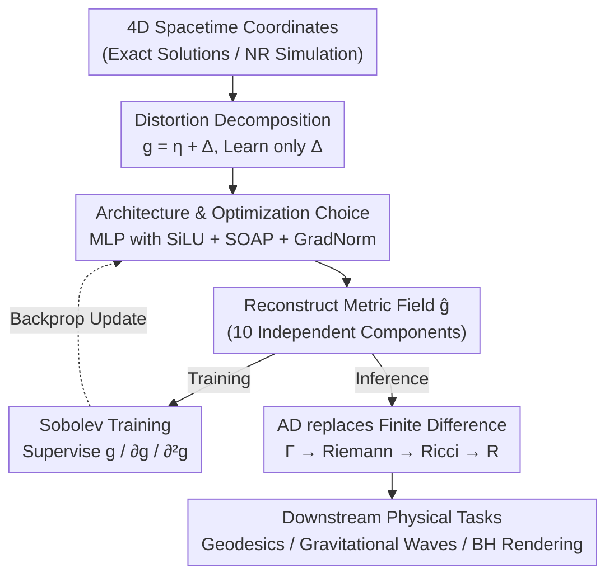

# Einstein Fields: A Neural Perspective To Computational General Relativity

**Conference**: ICLR 2026  
**arXiv**: [2507.11589](https://arxiv.org/abs/2507.11589)  
**Code**: [github.com/AndreiB137/EinFields](https://github.com/AndreiB137/EinFields)  
**Area**: 3D Vision  
**Keywords**: Neural Fields, General Relativity, Tensor Field Compression, Numerical Relativity, Automatic Differentiation

## TL;DR
The authors propose EinFields, the first framework to apply neural implicit representations to the compression of 4D General Relativity simulations. By encoding the metric tensor field into compact neural network weights, it achieves $4000\times$ storage compression and 5-7 bit numerical precision, while tensor derivatives obtained via automatic differentiation are five orders of magnitude more accurate than finite difference methods.

## Background & Motivation

**Background**: General Relativity (GR) describes gravity as the curvature of four-dimensional spacetime, governed by the Einstein Field Equations (EFEs). Exact solutions are only available for idealized cases, making Numerical Relativity (NR) essential for simulating celestial events such as black hole mergers and gravitational waves. NR is one of the most computationally intensive fields in scientific computing, requiring PB-scale storage and supercomputer-level parallel computing.

**Limitations of Prior Work**:
- NR simulations generate **PB-scale data**, which is difficult to store and distribute.
- Finite Difference (FD) methods on adaptive meshes are prone to numerical errors in sensitive regions.
- High-order FD stencils increase precision but raise communication costs.
- Discrete representations cannot be queried at arbitrary resolutions, and derivative calculations are limited by truncation errors.

**Key Challenge**: The physics of GR is entirely encoded by the metric tensor and its first two derivatives, but traditional methods of discretizing and storing continuous tensor fields result in massive storage overhead and loss of derivative precision.

**Goal**:
- Compress NR simulation data to manageable storage sizes.
- Provide a grid-independent, resolution-invariant continuous representation.
- Obtain high-precision tensor derivatives (Christoffel symbols, Riemann tensors, etc.) via automatic differentiation.
- Support downstream physical tasks (geodesics, curvature diagnostics, gravitational wave extraction).

**Key Insight**: Generalizing neural fields (NeRF/SDF, etc.) from computer vision to physical tensor fields, the authors propose the concept of "Neural Tensor Fields"—using MLPs to fit the 10 independent components of the metric tensor.

**Core Idea**: Represent the 4D spacetime metric tensor field using a compact neural implicit network (<2M parameters, ~7 MiB). Combined with Sobolev training and automatic differentiation, this achieves $4000\times$ compression and a $10^5\times$ improvement in derivative precision.

## Method

### Overall Architecture
This paper addresses the dual dilemma in Numerical Relativity (NR) where simulation data is excessively large and derivative precision is insufficient. The approach of EinFields is straightforward: a compact MLP fits the metric tensor field of 4D spacetime, allowing the network weights themselves to serve as a compressed storage of the spacetime geometry. Derivatives are then precisely read from this continuous representation using automatic differentiation.

The pipeline is divided into "fitting" and "readout." On the fitting side: the network receives 4D spacetime coordinates $x = (x^0, x^1, x^2, x^3)$ (from exact solutions or NR simulation data). Instead of learning the entire metric directly, it first subtracts a flat background and only learns the **distortion** $\Delta_{\alpha\beta}$. An MLP, specifically tuned for derivative supervision, outputs and reconstructs the 10 independent components of the metric tensor $\hat{g}_\theta: x \in \mathscr{M} \rightarrow g_{\alpha\beta}(x) \in \text{Sym}^2(T^*_x\mathscr{M})$. During training, a Sobolev loss constrains the metric and its first and second-order derivatives simultaneously. On the readout side: once this continuously differentiable metric is obtained, the entire differential geometry chain is handled by automatic differentiation—Metric $\rightarrow$ Christoffel symbols $\rightarrow$ Riemann tensor $\rightarrow$ Ricci tensor $\rightarrow$ Curvature scalar—for downstream tasks such as geodesic tracing, gravitational wave extraction, and black hole rendering. The network, with <2M parameters (approx. 7 MiB), replaces the original PB-scale discrete grids.

### Key Designs

**1. Distortion Decomposition: Forcing the network to learn only curvature**

The metric tensor values are often dominated by flat spacetime terms—for example, components like $g_{tt} \sim 1/r$ and $g_{\theta\theta} \sim r^2$ change drastically with coordinates, causing the network to waste capacity fitting a known background. EinFields decomposes the metric into a flat background and a distortion $\Delta_{\alpha\beta} = g_{\alpha\beta} - \eta_{\alpha\beta}$, training the network only on the physically non-trivial distortion $\Delta_{\alpha\beta}$. During inference, the flat background $\eta_{\alpha\beta}$ is added back. This concentrates network capacity on meaningful curvature deviations, leading to faster convergence and more stable numerical scaling—ablation studies show that removing this decomposition degrades precision by $15\times$.

**2. Architecture and Optimization: Specifically tuned for high-order derivative supervision**

Distortion decomposition alone is insufficient; the MLP must withstand first and second-order derivative supervision. Conventional INR configurations are suboptimal for this. The activation function used is SiLU, which performs best under derivative supervision (SIREN or WIRE performed worse in ablations). The optimizer used is SOAP (a quasi-Newton method) rather than Adam, providing an approximately $30\times$ precision boost. Multi-task gradients are balanced using GradNorm across the metric, Jacobian, and Hessian losses to prevent any single term from dominating. Network scales range from $64 \times 3$ to $512 \times 8$, with total parameters kept under 1.9 million.

**3. Sobolev Training: Supervise the metric and its derivatives simultaneously**

Physical quantities in GR are determined by derivatives of the metric: Christoffel symbols from the first derivative, and Riemann/Ricci tensors from the second derivative. Fitting the metric accurately is not enough if the derivatives remain noisy. EinFields pushes the supervision signal to higher orders, constraining the metric, Jacobian (40 components), and Hessian (100 components) simultaneously:

$$\mathcal{L}^g_{\text{Sob}}(\theta) = \mathbb{E}_x[\lambda_0\|g - \hat{g}\|^2 + \lambda_1\|\partial g - \partial\hat{g}\|^2 + \lambda_2\|\partial^2 g - \partial^2\hat{g}\|^2]$$

The three terms weigh the errors of the metric, first derivative, and second derivative respectively. This Sobolev loss improves the precision of Christoffel symbols by 2 orders of magnitude.

**4. Automatic Differentiation instead of Finite Difference: Eliminating truncation errors**

A trained network is continuously differentiable, so derivative readout does not require returning to a discrete grid. Traditional NR uses Finite Difference (FD) on grids, where accuracy is capped by truncation error $O(h^n)$. EinFields uses JAX's forward-mode AD to compute derivatives precisely along the differential geometry chain: $g_{\alpha\beta} \xrightarrow{\texttt{jacfwd}} \Gamma^\gamma_{\alpha\beta} \xrightarrow{\nabla} R^\delta_{\alpha\beta\gamma} \xrightarrow{\text{Tr}_g} R_{\alpha\beta} \xrightarrow{\text{Tr}_g} R$. AD has no truncation error. In FLOAT32, the precision gain over FD can reach 5 orders of magnitude (up to $14000\times$ for the Riemann tensor).

### Loss & Training
The training objective is the Sobolev loss described above. A Cosine learning rate scheduler is employed. Training time varies with the order of supervision: approximately 100s without Sobolev and 2000s with Hessian supervision (on an NVIDIA H200 GPU).

## Key Experimental Results

### Main Results (Schwarzschild Black Hole Solution)

| Representation | Rel. $\ell_2$ | MAE | Storage | Compression Rate |
|----------|-------------|-----|------|--------|
| Explicit Grid | - | - | 343 MiB | $1\times$ |
| EinFields | 1.08e-6 | 2.11e-6 | **85 KiB** | **4035×** |
| EinFields (+Jac) | 3.37e-7 | 9.49e-7 | 1.1 MiB | 311× |
| EinFields (+Jac+Hess) | **1.88e-7** | **9.07e-7** | 202 KiB | 1698× |

### Derivative Precision (vs High-order FD, FLOAT32)

| Geometric Quantity | FD (h=0.01) MAE | EinFields AD MAE | Precision Gain |
|--------|-----------------|-----------------|---------|
| Christoffel Symbols | 5.37e-6 | **9.98e-7** | $5\times$ |
| Riemann Tensor | 1.78e-2 | **1.25e-6** | **14000×** |
| Ricci Tensor | 4.81e-2 | **9.66e-6** | **5000×** |
| Kretschmann Scalar | 1.33e-2 | **1.07e-5** | **1200×** |

### Ablation Study

| Configuration | Rel. $\ell_2$ | Training Time |
|------|-------------|---------|
| Baseline (Distortion+Jac+Hess+SiLU+SOAP+Cosine) | **1.40e-7** | 1400s |
| Full Metric → Distortion | 2.13e-6 | 1407s |
| SOAP → Adam | 4.16e-6 | 1150s |
| SiLU → WIRE | 4.12e-6 | 3045s |
| Remove Hessian supervision | 1.51e-7 | 509s |
| Remove all Sobolev | 2.37e-7 | 364s |

### Key Findings
- **Neutron Star NR Simulation**: On a real BSSN-evolved neutron star oscillation simulation, EinFields achieved $2121\times$ compression (2.9GiB $\rightarrow$ 1.4MiB) with Rel. $\ell_2 = 3.60e-5$.
- **Distortion Decomposition is Critical**: Removing it degrades precision by 15 times.
- **SOAP Optimizer outperforms Adam**: Providing a $30\times$ precision boost.
- **Comprehensive Validation**: Geodesic reconstruction in Schwarzschild/Kerr spacetime is highly consistent with analytical solutions.

## Highlights & Insights
- **Pioneering "Neural Tensor Fields"**: Extending NeF from computer vision to physical tensor fields. The key difference in EinFields is that **dynamics emerge naturally**—because the metric encodes spacetime geometry, its derivatives directly yield the equations of motion.
- **Paradigm Shift (AD vs FD)**: In FLOAT32, AD is 5 orders of magnitude more accurate than 6th-order FD for the Riemann tensor. This is instructive for any scientific computing field requiring high-order derivatives.
- **Neural Black Hole Rendering**: As a proof of concept, light rays are traced directly using the metric represented by EinFields to render black hole images, demonstrating compatibility with complex downstream tasks.

## Limitations & Future Work
- Compression is lossy: Even with FLOAT64 training, Rel. $\ell_2 < 1e-9$ is currently unreachable.
- It has not yet surpassed FD in FLOAT64 precision.
- Query latency is non-trivial (several milliseconds for $10^5$ points), which may be a bottleneck for sequential evaluations.
- Error accumulation exists in long-term rollouts for geodesic solvers.
- **Future Directions**: Extending to large-scale NR simulations like binary black hole or binary neutron star mergers; systematic performance comparison with spectral methods.

## Related Work & Insights
- **vs SIREN (Sitzmann et al., 2020)**: Classic INRs use sine activation, but EinFields finds that SiLU performs better under derivative supervision.
- **vs PINNs (Raissi et al., 2019)**: PINNs solve PDEs from scratch using physical losses; EinFields **compresses existing solutions** rather than solving them—a more practical application scenario.
- **vs Traditional NR (Einstein Toolkit)**: EinFields is a downstream supplement to traditional NR pipelines, enhancing them rather than replacing them by providing compressed storage and high-precision continuous queries.

## Rating
- Novelty: ⭐⭐⭐⭐⭐ First to introduce neural fields to Numerical Relativity.
- Experimental Thoroughness: ⭐⭐⭐⭐ Good coverage across analytical solutions and neutron star simulations, though lacking the most challenging binary merger scenarios.
- Writing Quality: ⭐⭐⭐⭐⭐ Clear physical background, smooth transition between method and results.
- Value: ⭐⭐⭐⭐ Significant reference value for both NR and Scientific ML communities.

<!-- RELATED:START -->

## Related Papers

- [\[ICLR 2026\] Splat the Net: Radiance Fields with Splattable Neural Primitives](splat_the_net_radiance_fields_with_splattable_neural_primitives.md)
- [\[ICLR 2026\] Learning Physics-Grounded 4D Dynamics with Neural Gaussian Force Fields](learning_physics-grounded_4d_dynamics_with_neural_gaussian_force_fields.md)
- [\[ECCV 2024\] Omni-Recon: Harnessing Image-Based Rendering for General-Purpose Neural Radiance Fields](../../ECCV2024/3d_vision/omni-recon_harnessing_image-based_rendering_for_general-purpose_neural_radiance_.md)
- [\[ICLR 2026\] SpatialHand: Generative Object Manipulation from 3D Perspective](spatialhand_generative_object_manipulation_from_3d_prespective.md)
- [\[ICLR 2026\] Augmented Radiance Field: A General Framework for Enhanced Gaussian Splatting](augmented_radiance_field_a_general_framework_for_enhanced_gaussian_splatting.md)

<!-- RELATED:END -->
