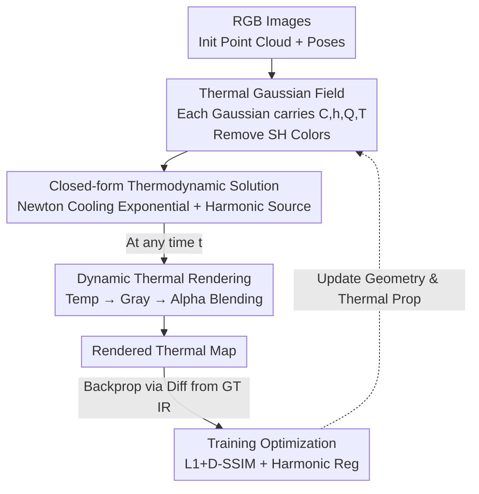

# ETGS: Explicit Thermodynamics Gaussian Splatting for Dynamic Thermal Reconstruction

**Conference**: ICLR 2026  
**OpenReview**: [https://openreview.net/forum?id=P2Nw2LMkjH](https://openreview.net/forum?id=P2Nw2LMkjH)  
**Code**: https://github.com/jankin-wang/ETGS  
**Area**: 3D Vision  
**Keywords**: Gaussian Splatting, Thermal Reconstruction, Dynamic Scenes, Thermodynamic Modeling, Closed-form Solution

## TL;DR
ETGS embeds an explicit thermodynamic model, where each Gaussian follows a first-order heat transfer ODE, into 3D Gaussian Splatting. By deriving an analytical closed-form solution for the ODE that can be directly evaluated at any time, ETGS reconstructs rapidly changing dynamic thermal scenes with training and rendering efficiency close to static 3DGS, achieving an average PSNR ~5 dB higher than previous state-of-the-art methods on the self-built RHD dataset.

## Background & Motivation
**Background**: Thermal imaging is a non-contact temperature measurement method providing both geometry and temperature distribution. Combining this with 3D reconstruction to create "temperature scene models that evolve over time" is a recent hot topic. Early works followed a two-step approach (RGB for geometry, then mapping thermal textures). Later, Thermal-NeRF / ThermoNeRF extended NeRF to infrared, and Thermal3D-GS / TGA-GS extended 3DGS to thermal imaging.

**Limitations of Prior Work**: Existing methods like Thermal3D-GS and TGA-GS **can only reconstruct static thermal scenes**, learning only the average temperature of the scene while failing to capture temperature variations over time, thus precluding thermodynamic analysis. Solutions introducing the temporal dimension have shortcomings: 4DGS uses deformation fields for dynamic appearance but ignores thermal physical processes; ThermalGS uses time embeddings to drive temperature evolution but remains essentially data-driven and lacks thermodynamic consistency; NTR-Gaussian embeds thermodynamic equations into the Gaussian framework but relies on implicit neural networks and numerical integration for inference, leading to slow training and rendering (68 FPS, 1469 s training).

**Key Challenge**: There is a conflict between "physical consistency" and "efficiency" in dynamic thermal reconstruction. Achieving physical plausibility requires solving thermodynamic equations, but solutions based on implicit networks and numerical integration are slow and accumulate errors, neutralizing the high-efficiency advantages of 3DGS.

**Goal**: To provide each Gaussian with a physically interpretable temperature state without sacrificing 3DGS efficiency, allowing accurate temperature derivation at any time, even with irregularly spaced or out-of-order observation timestamps.

**Key Insight**: The authors noted that first-order linear heat transfer ODEs (Newton’s law of cooling + heat source excitation) actually have **analytical closed-form solutions**. By expanding the heat source using a set of harmonic bases, the temperature evolution over time can be written as an analytical expression that can be evaluated at any given $t$—eliminating the need for numerical integration or implicit network regression.

**Core Idea**: Replace "spherical harmonic colors" with "explicit thermal physical parameters." Each Gaussian is assigned a set of parameters (equivalent heat capacity, heat transfer coefficient, heat source harmonic coefficients). The closed-form solution of the first-order heat transfer ODE is used to directly calculate the temperature at any $t$, followed by standard alpha-blending for thermal map rendering.

## Method

### Overall Architecture
ETGS solves the problem of "how to express a time-evolving temperature field while maintaining the efficiency of 3DGS." It removes optical attributes from Gaussians and replaces them with thermodynamic attributes: first, point clouds and camera poses are initialized using RGB images; then, each Gaussian is defined as a **Thermal Gaussian** carrying an equivalent heat capacity $C_i$, a heat transfer coefficient $h_i$, a heat source excitation $Q_i(t)$, and a temperature state $T_i(t)$. The temperature state is not a freely learned parameter but is given by the closed-form solution of the first-order heat transfer ODE. Newton's cooling exponential term accounts for tendencies toward ambient temperature, while the harmonic-expanded heat source term captures periodic or complex external energy inputs. Once the temperature $T$ is solved at any time $t$, it is linearly mapped to grayscale and rendered into a thermal map via standard alpha blending. The gradients are backpropagated using the difference between the rendered map and the ground truth infrared map to update both geometry and thermal attributes.

### Key Designs

**1. Thermal Gaussian Field: Replacing SH Colors with Interpretable Thermal Parameters**

In static 3DGS, each Gaussian is $G_i=\{\mu_i,\Sigma_i,R_i,\alpha_i,f_i\}$, where $f_i$ represents colors/radiance coefficients expanded by spherical harmonics. However, for thermal scenes, temperature determines thermal radiation, making optical colors both insufficient and burdensome. ETGS redefines Gaussians as Thermal Gaussians $\tilde{G}_i=\{\mu_i,\Sigma_i,R_i,\alpha_i,C_i,h_i,Q_i(t),T_i(t)\}$: removing SH colors and adding four thermal attributes—equivalent heat capacity $C_i$ (representing temperature inertia and response speed to external stimuli), heat transfer coefficient $h_i$ (rate of heat exchange between the Gaussian and the environment), heat source excitation $Q_i(t)$ (energy input over time, expanded using Fourier bases to capture complex/periodic processes), and temperature state $T_i(t)$. Crucially, $T_i(t)$ is not a free parameter but is analytically derived from the thermodynamic model, preserving the explicit controllability of 3DGS while hard-coding "physical consistency" into the representation itself.

**2. Closed-form Solution for Thermodynamic Evolution: First-order Heat Transfer ODE + Harmonic Source**

This is the core of the paper. For the $i$-th Thermal Gaussian, a first-order linear ODE is written based on energy conservation: $C_i \frac{dT_i(t)}{dt}=-h_i(T_i(t)-T_{env})+Q_i(t)$. Defining the time constant $\tau_i=C_i/h_i$, it simplifies to $\frac{dT_i}{dt}=-\frac{1}{\tau_i}(T_i-T_{env})+\frac{1}{C_i}Q_i(t)$. Using the integrating factor method, the solution is $T_i(t)=T_{env}+(T_{i,0}-T_{env})e^{-t/\tau_i}+\frac{1}{C_i}\int_0^t e^{-(t-s)/\tau_i}Q_i(s)\,ds$, where the first two terms represent Newton's cooling (exponential decay toward ambient temperature) and the third term is the convolution of the heat source. To turn the integral into an analytical expression, the authors expand the heat source $Q_i(t)$ on a globally shared frequency grid using harmonic bases $Q_i(t)=\sum_{k=1}^{K}A_{i,k}\sin(\omega_k t)+B_{i,k}\cos(\omega_k t)$, where frequencies $\omega_k$ are sampled from a log-uniform grid $\omega_k=\omega_{min}(\omega_{max}/\omega_{min})^{(k-1)/(K-1)}$. Substituting this back and integrating term-by-term yields the closed-form solution for the temperature of each Gaussian at any $t$:

$$T_i(t)=T_{env}+(T_{i,0}-T_{env})e^{-t/\tau_i}+\sum_{k=1}^{K}\frac{\tau_i/C_i}{1+(\omega_k\tau_i)^2}\Big[A_{i,k}\big(\sin(\omega_k t)-\omega_k\tau_i\cos(\omega_k t)+\omega_k\tau_i e^{-t/\tau_i}\big)+B_{i,k}\big(\cos(\omega_k t)+\omega_k\tau_i\sin(\omega_k t)-e^{-t/\tau_i}\big)\Big]$$

The value of this step is transforming "solving for temperature at time $t$" from a numerical integration or network forward pass into a single analytical evaluation. Consequently, it **does not accumulate integration errors and naturally handles irregular or out-of-order timestamps**. Furthermore, the entire expression is differentiable with respect to time, allowing it to be integrated directly into the 3DGS differentiable rendering pipeline. This is why it is both faster and more accurate than NTR-Gaussian (implicit net + numerical integration).

**3. Dynamic Thermal Rendering: Linear Temperature-to-Grayscale Mapping + Alpha Blending**

After solving for temperature, it must be converted into renderable pixels. ETGS uses the temperature bounds $[T_{min}, T_{max}]$ measured during acquisition to linearly normalize temperature to grayscale $I_i(t)=\text{clip}\big(\frac{T_i(t)-T_{min}}{T_{max}-T_{min}},0,1\big)$. During training, continuous grayscale values participate in differentiable loss; during visualization, they are mapped to pseudo-color. Rendering follows the standard 3DGS alpha blending along rays, replacing the SH color term with $I_i(t)$: $C=\sum_{i=1}^{N}Tr_i\alpha_i I_i(t)$. This minimal modification maximizes the reuse of efficient 3DGS rasterization, which is why it maintains rendering speeds close to static 3DGS.

**4. RHD Dataset: Pixel-aligned RGB-IR Acquisition and Rapid Heat Dynamics Benchmark**

Dynamic thermal reconstruction lacks data, so the authors built the Rapid Heat Dynamics (RHD) dataset. Mechanically, they designed a **pixel-level aligned RGB-IR acquisition platform**: using a 45° coated glass (Zinc Sulfide, Silver) as a beam splitter, visible light is transmitted to a front-facing RGB camera, while infrared light is reflected to a side-facing infrared camera, achieving coaxial imaging with zero-baseline splitting. Synchronization is handled by a Jetson Orin NX with timestamps. After calibration, the alignment error is 0.4869 pixels (sub-pixel accuracy). The dataset includes 10 dynamic thermal scenes, 2363 views, 512×410 resolution, covering typical thermodynamic processes like cooling, heating, and heat transfer across materials like metal, fabric, and organics, with temperatures ranging from -1.0°C to 101.0°C.

### Loss & Training
Using 3DGS as the backbone, all settings are consistent with the original version, training for 30k iterations with a regularization weight $\lambda_{reg}=1\times10^{-5}$. The total loss is $L_{total}=(1-\lambda)L_1+\lambda L_{D\text{-}SSIM}+\lambda_{reg}\sum_{i,k}(A_{i,k}^2+B_{i,k}^2)$. RGB images provide initial point clouds and poses. Training uses raw grayscale thermal maps as ground truth for differentiable loss, with pseudo-color mapping used only for visualization.

## Key Experimental Results

### Main Results
Average results (PSNR / SSIM / LPIPS) across 10 scenes in RHD, comparing static methods (3DGS, Mip-Splatting, Thermal3D-GS) and dynamic methods (4DGS, NTR-Gaussian):

| Method | PSNR↑ | SSIM↑ | LPIPS↓ |
|------|-------|-------|--------|
| 3DGS | 32.16 | 0.978 | 0.078 |
| Mip-Splatting | 31.51 | 0.976 | 0.085 |
| Thermal3D-GS | 34.68 | 0.983 | 0.072 |
| 4DGS | 33.94 | 0.972 | 0.076 |
| NTR-Gaussian | 34.96 | 0.981 | 0.089 |
| **Ours** | **40.68** | **0.989** | **0.050** |

ETGS leads across all three metrics, with an average PSNR ~5.7 dB higher than the second-best, NTR-Gaussian. Static methods only learn average temperatures, resulting in significant deviations; dynamic methods struggle with temporal consistency due to implicit modeling, leading to artifacts at object edges.

Efficiency comparison (Average across scenes):

| Method | VRAM(MB)↓ | Training Time(s)↓ | FPS↑ |
|------|-----------|--------------|------|
| 3DGS | 2429 | 166 | 557 |
| Thermal3D-GS | 3265 | 470 | 342 |
| 4DGS | 2290 | 1159 | 278 |
| NTR-Gaussian | 4439 | 1469 | 68 |
| **Ours** | **2391** | **197** | **458** |

ETGS trains in 197 s, close to static 3DGS and roughly an order of magnitude faster than 4DGS / NTR-Gaussian. VRAM usage is also comparable to static methods—the closed-form solution avoids repetitive neural field evaluations.

### Ablation Study
On the Cooling Checkboard scene, removing the heat source term $Q$ and the regularization term:

| Config | PSNR↑ | SSIM↑ | LPIPS↓ | Note |
|------|-------|-------|--------|------|
| Ours w/o Q | 43.70 | 0.986 | 0.055 | No heat source excitation |
| Ours w/o Regular | 42.58 | 0.982 | 0.064 | No regularization |
| Ours (Full) | 44.73 | 0.987 | 0.054 | Full model |

Effect of number of frequencies $K$ (Average PSNR): $K=8$ is 40.57, $K=24$ is 40.68, $K=64$ is 40.95—Increasing $K$ yields marginal gains; as the improvement for $K>32$ is <0.2 dB, $K=24$ is used for the main experiments.

### Key Findings
- **Regularization is more critical than the heat source term**: Removing regularization dropped PSNR from 44.73 to 42.58, while removing $Q$ dropped it to 43.70. Without $Q$, the model only captures exponential decay, missing external drivers and losing detail; without regularization, harmonic coefficients can grow uncontrollably, causing non-physical oscillations and rendering artifacts.
- **Insensitivity to frequency count $K$**: 8–16 frequencies are sufficient to capture major components; $K=24$ balances precision and computation, suggesting real thermal processes are dominated by few frequencies.
- **Defects of static methods summarized**: Static models only learn average temperatures, leading to systematic deviations when temperatures change sharply over time—this validates the benefit of dynamic modeling.

## Highlights & Insights
- **From ODE solving to analytical evaluation**: The cleverest part is using harmonic bases to expand the heat source, making the convolution integral of the first-order heat transfer ODE closed-form. Temperature calculation becomes an analytical substitution rather than numerical integration—eliminating error accumulation and supporting unsynchronized sampling.
- **Physical parameters over SH colors**: Replacing appearance coefficients with thermodynamic states (heat capacity/transfer/source) introduces physical consistency with minimal changes, fully reusing the 3DGS rasterization pipeline. This "swap attributes, keep framework" approach is transferable to other physics-informed Splatting tasks.
- **Zero-baseline RGB-IR alignment**: Using beam splitting for coaxial imaging produces sub-pixel alignment (0.4869 px), avoiding the need for late-stage cross-modal registration—a clean and effective hardware contribution.

## Limitations & Future Work
- **Independent Gaussian modeling**: Each Gaussian’s thermodynamic evolution is modeled independently. Heat coupling between Gaussians is only **implicitly** handled via overlapping projection in the same pixels and dense infrared supervision; explicit inter-Gaussian conduction is not modeled as it would introduce global coupling and break the closed-form solution.
- **Limited to first-order linear models**: To maintain closed-form solutions, the model uses "Newton's cooling + harmonic source," which cannot express non-linear effects like temperature-dependent conductivity, radiative coupling, or phase changes.
- **Controlled scenes and static sources**: RHD currently features controlled dynamic scenes with static heat sources. Future plans involve moving heat sources and more complex environments (outdoor, heterogeneous materials) while exploring joint RGB-Thermal supervision.

## Related Work & Insights
- **vs NTR-Gaussian**: Both introduce thermodynamics. However, NTR-Gaussian relies on implicit nets + numerical integration, which is slow (68 FPS, 1469 s training) and prone to error accumulation. ETGS uses explicit parameters + closed-form solutions, training ~7.5× faster with ~5 dB higher PSNR.
- **vs 4DGS**: 4DGS uses deformation fields for dynamic appearance but ignores thermal physics, leading to edge artifacts and poor temporal consistency in thermal scenes. ETGS ensures thermodynamic consistency via ODE solutions.
- **vs Thermal3D-GS / TGA-GS**: These extend 3DGS to thermal imaging but remain static, learning only occupancy/average temperature. ETGS introduces the temporal dimension through ODE solutions to capture rapid thermal changes.

## Rating
- Novelty: ⭐⭐⭐⭐⭐ Embedding closed-form solutions of first-order heat transfer ODEs into Gaussian Splatting is a novel "physics-consistent + efficient" solution for dynamic thermal reconstruction.
- Experimental Thoroughness: ⭐⭐⭐⭐ Significant leads in three metrics across 10 scenes + efficiency analysis + ablations, though ablations were limited to single scenes.
- Writing Quality: ⭐⭐⭐⭐⭐ Clear derivations, intuitive architecture diagrams, and a solid logical chain from motivation to methodology.
- Value: ⭐⭐⭐⭐⭐ Provides both an efficient reconstruction method and the pixel-aligned RHD benchmark, serving as foundational infrastructure for research in this direction.

<!-- RELATED:START -->

## Related Papers

- [\[CVPR 2026\] Learning Explicit Continuous Motion Representation for Dynamic Gaussian Splatting from Monocular Videos](../../CVPR2026/3d_vision/learning_explicit_continuous_motion_representation_for_dynamic_gaussian_splattin.md)
- [\[ICLR 2026\] Fracture-GS: Dynamic Fracture Simulation with Physics-Integrated Gaussian Splatting](fracture-gs_dynamic_fracture_simulation_with_physics-integrated_gaussian_splatti.md)
- [\[ICLR 2026\] Frequency-Aware Dynamic Gaussian Splatting](frequency-aware_dynamic_gaussian_splatting.md)
- [\[CVPR 2026\] AeroGS: Scale-Aware Gaussian Splatting for Pose-Free Dynamic UAV Scene Reconstruction](../../CVPR2026/3d_vision/aerogs_scale-aware_gaussian_splatting_for_pose-free_dynamic_uav_scene_reconstruc.md)
- [\[ICLR 2026\] Mango-GS: Enhancing Spatio-Temporal Consistency in Dynamic Scenes Reconstruction using Multi-Frame Node-Guided 4D Gaussian Splatting](mango-gs_enhancing_spatio-temporal_consistency_in_dynamic_scenes_reconstruction_.md)

<!-- RELATED:END -->
