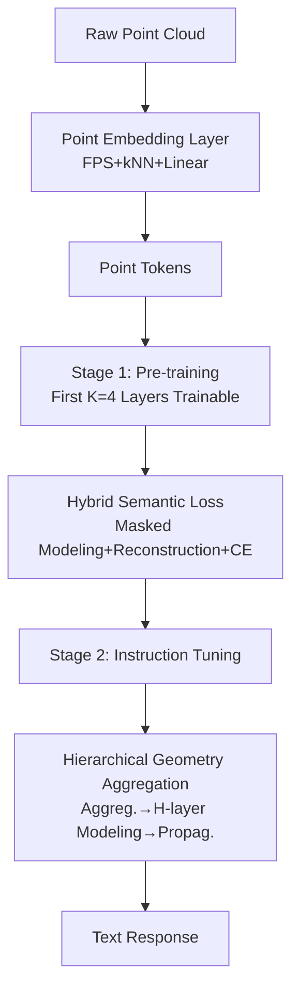

# Exploring the Potential of Encoder-free Architectures in 3D LMMs

**Conference**: ICLR 2026  
**OpenReview**: [https://openreview.net/forum?id=22Hh0Vj5Dd](https://openreview.net/forum?id=22Hh0Vj5Dd)  
**Code**: [Ivan-Tang-3D/ENEL](https://github.com/Ivan-Tang-3D/ENEL)  
**Area**: 3D Vision / 3D Multimodal Large Language Models  
**Keywords**: encoder-free, 3D LMM, point cloud understanding, self-supervised loss, geometric aggregation  

## TL;DR
This paper proposes **ENEL**, the first **encoder-free 3D Large Multimodal Model**. It delegates "high-level semantic extraction" and "local geometric inductive bias"—tasks previously handled by pre-trained 3D encoders—directly to the LLM. The 7B model matches the performance of PointLLM-PiSA-13B in classification, captioning, and VQA.

## Background & Motivation
- **Background**: Mainstream 3D LMMs (e.g., PointLLM, ShapeLLM) follow an encoder-based architecture: heavyweight pre-trained 3D encoders (e.g., Point-BERT, I2P-MAE) encode point clouds into high-level embeddings, which are fed into the LLM via projection layers.
- **Limitations of Prior Work**: This paradigm faces two persistent issues. First, **Point Cloud Resolution Limitation**: 3D encoders are pre-trained on fixed resolutions (e.g., 8192 pts), losing spatial information when resolution varies during inference (4K/12K); captioning GPT-4 scores drop from ~44 at 8K to ~42 at 16K and ~33 at 2K. Second, **Embedding Semantic Discrepancy**: Encoders trained with self-supervised targets (e.g., MAE, contrastive learning) extract features that may not align with LLM semantic requirements, and simple MLP projection layers cannot bridge this semantic gap.
- **Key Challenge**: Encoders provide ready-made knowledge, but their fixed resolution and self-supervised priors create a performance ceiling. The challenge is whether and how to remove the encoder entirely and let the LLM serve as the 3D encoder itself.
- **Goal**: To remove the 3D encoder without performance degradation by systematically addressing two questions: (1) How to compensate for the high-level 3D semantics originally extracted by the encoder? (2) How to inject local geometric inductive bias into an LLM that inherently lacks local modeling capabilities?
- **Core Idea**: **[Semantic Compensation]** Use "LLM-embedded Semantic Encoding + Hybrid Semantic Loss" to compress high-level semantics into early LLM layers during pre-training; **[Geometric Compensation]** Use "Hierarchical Geometry Aggregation" to inject local-to-global hierarchical geometric modeling during instruction tuning.

## Method

### Overall Architecture
ENEL uses PointLLM as a baseline and Vicuna-7B as a backbone, maintaining the "pre-training + instruction tuning" stages but completely removing the 3D encoder. Input point clouds are transformed into point tokens via a lightweight **Point Embedding Layer** (a Point-PN variant: FPS downsampling + k-NN local aggregation + linear layer, optimal with 3 layers) and fed directly into the LLM. The first **$K=4$** layers of the LLM are unfrozen for multimodal alignment. Stage 1 focuses on high-level semantics via Hybrid Semantic Loss, and Stage 2 focuses on local structural capture via Hierarchical Geometry Aggregation.

### Key Designs

**1. LLM-embedded Semantic Encoding: Utilizing early layers as encoders.** Without an encoder, point clouds lack context modeling. High-level semantic encoding is delegated to the LLM by unfreezing the first $K$ layers, allowing early fusion between 3D tokens and text tokens in a shared semantic space. Experiments found that unfreezing 4 layers with a lower learning rate ($4\text{e-}4$ vs. default $2\text{e-}3$) stabilizes optimization. Classification/Captioning GPT-4 scores improve from 35.5/33.4 (vanilla encoder-free) to 47.9/43.5.

**2. Hybrid Semantic Loss: Tailored self-supervision for encoder-free architectures.** Four classes of point cloud self-supervised losses were evaluated: masked modeling (MSE predicting masked point tokens), reconstruction (Chamfer distance), contrastive (geometric transformations), and knowledge distillation (aligning with Uni3D-L teacher features). Masked modeling was found to be the strongest. The proposed hybrid loss uses a mask ratio $r=30\%$, performing **masked modeling on masked tokens and reconstruction on visible tokens**, added to the cross-entropy loss with unit coefficients:
$$\mathcal{L}_{\text{mask}}=\frac{1}{Mr}\sum_{i=1}^{Mr}\lVert F_{\text{pre}_i}-F_{\text{gt}_i}\rVert_2^2,\quad \mathcal{L}_{\text{recon}}=\frac{1}{M}\sum_i\Big(\min_j\lVert a_i-b_j\rVert_2^2+\min_j\lVert b_i-a_j\rVert_2^2\Big)$$
This design exploits point cloud **permutation invariance**, allowing learnable tokens to append to visible tokens, and LLM **causal masking**, which creates a unique information flow compared to bidirectional 3D encoders. This loss boosts scores to 52.0/47.65.

**3. Hierarchical Geometry Aggregation: Injecting local-to-global hierarchy.** Transformer layers maintain constant token counts, lacking the local-to-global inductive bias of 3D encoders. During instruction tuning, **Dynamic Grid Sampling** aggregates tokens based on coordinates starting from the second LLM layer, scaling grid sizes cumulatively:
$$s_i=\alpha\cdot e^{\sum_{j=1}^{i}\beta_j},\quad \beta_j=\gamma\cdot\tanh(\theta_j)+\beta_{\text{ctr}},\quad s_i\in[0.02,1]\text{ m}$$
Tokens within a grid undergo **gated self-attention** followed by mean pooling to derive aggregated tokens. After $l$ aggregations with $H$ LLM layers for semantic modeling, features are **propagated** back to the original distribution via grid unpooling to preserve fine-grained detail. Optimal settings: $l=3$ (~1/8 sampling), $H=2$, with gated self-attention (final performance 55.55/51.03).

## Key Experimental Results

### Main Results (Objaverse benchmark, GPT-4 score)

| Model | Cap (GPT-4) | Cls Avg (GPT-4) | QA (GPT-4) |
|------|:----:|:----:|:----:|
| PointLLM-7B | 44.85 | 53.00 | 41.20 |
| PointLLM-13B | 48.15 | 54.00 | 46.60 |
| ShapeLLM-13B | 48.94 | 54.00 | 53.10 |
| PointLLM-PiSA-13B | 50.52 | 55.00 | 46.80 |
| **Ours (ENEL-7B)** | **51.03** | **55.55** | 43.80 |
| **ENEL-7B\*** (Qwen2.5-7B + ShapeLLM Data) | **57.91** | **61.00** | **55.20** |

ENEL-7B at the 7B scale outperforms or matches 13B encoder-based SOTA models. Using the Qwen2.5-7B backbone and ShapeLLM training data (\*) yields further significant gains.

### Ablation Study

| Module | Configuration | Cls (Avg) | Cap |
|------|------|:----:|:----:|
| Token Embedding | Vanilla encoder-free | 35.50 | 33.37 |
| Token Embedding | +3-layer T.E. (Best) | 45.55 | 41.36 |
| Self-supervised Loss | Hybrid Semantic Loss_feat | 52.00 | 47.65 |
| Geometric Aggregation | l=3 | 53.00 | 48.93 |
| Geometric Aggregation | H=2 | 54.25 | 49.56 |
| Geometric Aggregation | + gated Self-Attn. (Final) | 55.55 | 51.03 |

### Key Findings
- Self-supervised point cloud losses generally benefit encoder-free models; **masked modeling is the most effective**, while contrastive loss is the least.
- A 30% mask ratio is superior to 60%. Aggregation depth $l$ must balance local capture and spatial simplification.
- Attention visualizations show that point tokens in encoder-free architectures have stronger semantic correlation with text tokens, suggesting that using the LLM as an encoder mitigates semantic misalignment.

## Highlights & Insights
- **First systematic encoder-free 3D LMM study**: Rather than task-specific optimization, this work decomposes the encoder's role into semantic and geometric compensation, providing a reproducible empirical path.
- **Leveraging architectural features for loss design**: The Hybrid Semantic Loss modifies 2D encoder-free concepts for 3D by explicitly utilizing permutation invariance and causal masking.
- **7B matches 13B**: Outperforming larger encoder-based models with a lighter architecture suggests that dedicated 3D encoders are not mandatory for robust 3D understanding.

## Limitations & Future Work
- Validation focuses on **object-level point clouds** (Objaverse); scalability to scene-level 3D understanding remains unproven.
- Hierarchical Geometry Aggregation introduces several hyperparameters (grid size scheduling, gated attention) requiring per-dataset tuning.
- Peak performance relies on switching backbones (Qwen2.5-7B) and data (ShapeLLM); decoupling pure algorithmic contributions from data gains could be clearer.
- The model still relies on a two-stage training process; end-to-end simplification is a future direction.

## Related Work & Insights
- **2D encoder-free LMMs** (EVE/EVEv2, SAIL, Mono-InternVL, Fuyu-8B): These explore the removal of visual encoders; this work extends the concept to 3D by adding geometric and semantic compensation.
- **3D LMMs** (PointLLM, ShapeLLM, MiniGPT-3D): Standard encoder-based baselines.
- **Point cloud self-supervision** (Point-MAE, Point-BERT, Uni3D, Point-PN): Sources for token embedding and self-supervised losses.
- **Insights**: As LLMs grow stronger, the role of modality encoders can be internalized through appropriate loss design, early layer unfreezing, and explicit geometric modules. This trajectory may extend to other structured modalities like graphs or meshes.

## Rating
- Novelty: ⭐⭐⭐⭐ First encoder-free 3D LMM with targeted innovations in loss and aggregation.
- Experimental Thoroughness: ⭐⭐⭐⭐ Extensive ablations on losses, layers, and aggregation, though focused on object-level data.
- Writing Quality: ⭐⭐⭐⭐ Clear "two-question driven" structure with logical organization and complete visualizations.
- Value: ⭐⭐⭐⭐ Establishes a viable paradigm for encoder-free 3D multi-modal modeling.

<!-- RELATED:START -->

## Related Papers

- [\[ICLR 2026\] Weight Space Representation Learning on Diverse NeRF Architectures](weight_space_representation_learning_on_diverse_nerf_architectures.md)
- [\[CVPR 2026\] VENI: Variational Encoder for Natural Illumination](../../CVPR2026/3d_vision/veni_variational_encoder_for_natural_illumination.md)
- [\[CVPR 2025\] 3D-LLaVA: Towards Generalist 3D LMMs with Omni Superpoint Transformer](../../CVPR2025/3d_vision/3d-llava_towards_generalist_3d_lmms_with_omni_superpoint_transformer.md)
- [\[ICCV 2025\] GaussianProperty: Integrating Physical Properties to 3D Gaussians with LMMs](../../ICCV2025/3d_vision/gaussianproperty_integrating_physical_properties_to_3d_gaussians_with_lmms.md)
- [\[CVPR 2025\] DUNE: Distilling a Universal Encoder from Heterogeneous 2D and 3D Teachers](../../CVPR2025/3d_vision/dune_distilling_a_universal_encoder_from_heterogeneous_2d_and_3d_teachers.md)

<!-- RELATED:END -->
