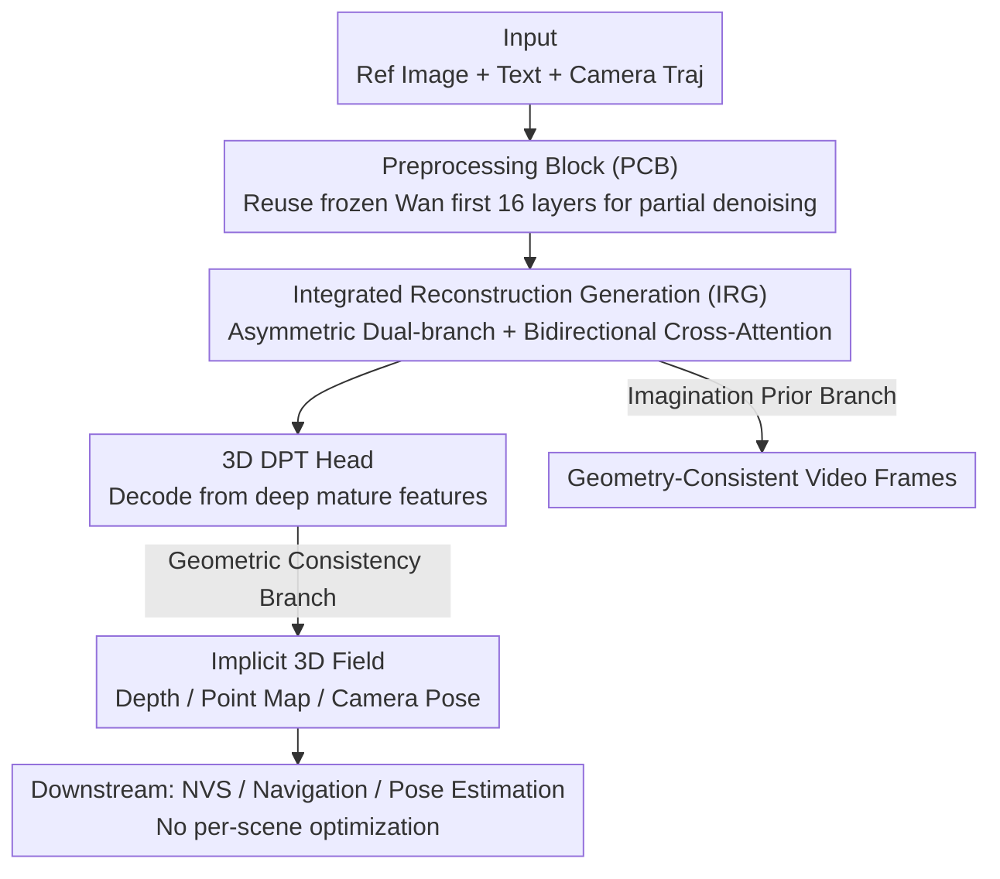

# FantasyWorld: Geometry-Consistent World Modeling via Unified Video and 3D Prediction

**Conference**: ICLR 2026  
**OpenReview**: [https://openreview.net/forum?id=3q9vHEqsNx](https://openreview.net/forum?id=3q9vHEqsNx)  
**Project Page**: [Project Page](https://fantasy-amap.github.io/fantasy-world/)  
**Code**: None (Project page only)  
**Area**: 3D Vision / World Models / Video Generation  
**Keywords**: World models, Geometry-consistent, Video diffusion, Feed-forward 3D reconstruction, Cross-branch supervision

## TL;DR
FantasyWorld attaches a trainable geometric branch alongside a frozen video foundation model (Wan2.1). In a single forward pass, it simultaneously outputs camera-conditioned video frames and an implicit 3D field (depth/point maps/camera poses). Through bidirectional cross-attention, geometric constraints guide the video while video priors complement the geometry, exceeding recent geometry-consistent baselines in Multi-view and Style Consistency on WorldScore.

## Background & Motivation

**Background**: Generating 3D worlds using video diffusion models is a current mainstream approach—using camera trajectories as conditions to generate multi-view images where frames implicitly encode the 3D structure of the scene (e.g., ReconX, Gen3C, DimensionX, ViewCrafter). Simultaneously, another line of work involves feed-forward 3D foundation models (e.g., DUSt3R, Fast3R, VGGT), which directly predict point clouds/depth/cameras in a single forward pass without per-scene reconstruction.

**Limitations of Prior Work**: The authors identify three specific issues. First, features of pure video generation models exist only in the video domain and do not directly support 3D reasoning; obtaining explicit 3D still requires expensive per-scene optimization via NeRF/3DGS. Second, video "imagination" and 3D "perception" are only weakly coupled during inference—for example, while Voyager predicts both RGB and depth, the two pipelines run largely independently without mutual reinforcement. Third, common methods for injecting 3D priors into video (e.g., Geometry Forcing) require fine-tuning the video foundation model itself, which is costly and risks damaging the large model's generative creativity.

**Key Challenge**: How to inject reliable geometric grounding into video generation without sacrificing the creativity of the video model (i.e., without fine-tuning the backbone), while ensuring that geometry and video truly assist each other bidirectionally during inference rather than being spliced post-hoc.

**Goal**: Divided into three sub-problems: (i) producing reusable 3D consistent features without fine-tuning the video backbone; (ii) achieving tight coupling where geometry supervises video and video priors regularize geometry; (iii) ensuring implicit features from the geometric branch directly serve downstream tasks like novel view synthesis and navigation without per-task adaptation.

**Key Insight**: The authors observe that denoising diffusion reveals structure not only along timesteps but also along network depth—at the same timestep, deeper WanDiT layers yield clearer spatial structures. Thus, rather than predicting depth from RGB images, it is better to infer camera and 3D signals directly from video latents, completing geometry and video generation in the same feature domain.

**Core Idea**: Freeze the video backbone and attach a trainable geometric branch. The backbone is split into "Preprocessing Blocks (PCB)" and "Integrated Reconstruction Generation (IRG) blocks." Bidirectional cross-attention is used to stitch video imagination and 3D perception together in a single forward pass for mutual supervision.

## Method

### Overall Architecture

FantasyWorld is a unified feed-forward model: given a reference image, an optional text prompt, and a target camera trajectory, it outputs a video along the specified view while constructing an implicit 3D representation. Images are encoded with CLIP, text with umT5, and cameras using Wan's Plücker-ray design; these three signals jointly condition the video and geometric branches.

The pipeline consists of three stages. The front end is the **Preprocessing Block (PCB)**: it reuses the first 16 frozen layers of the Wan2.1 denoiser to partially denoise pure noise latents into features with geometric cues, ensuring the geometric branch does not start from pure noise. The main body consists of stacked **IRG blocks**: each contains an asymmetric dual-branch structure—the "Imagination Prior Branch" reuses Wan2.1 to propagate appearance-rich spatio-temporal features, while the "Geometric Consistency Branch" projects them into a geometry-aligned latent space. The two branches are coupled via lightweight adapters and bidirectional cross-attention. Finally, there are two outputs: the imagination branch generates geometry-consistent video frames along the trajectory, and the geometric branch produces task-agnostic 3D features decoded by a custom 3D DPT head into depth maps, point maps, and camera poses. This design supports downstream tasks like novel view synthesis, pose estimation, and depth prediction without per-scene optimization.

### Key Designs

**1. Preprocessing Block (PCB): Starting the Geometric Branch from "Structured Latents" rather than Pure Noise**

The geometric branch suffers most when consuming high-noise latents directly—gradient variance is high, and training is dominated by noise, preventing the learning of stable structures. Based on the observation that "denoising progresses bidirectionally along timesteps and network depth" (PCA in Fig. 3 shows clearer structures in deeper WanDiT layers even at fixed timesteps), the authors reuse the first 16 frozen layers of the Wan2.1 denoiser to partially denoise video latents before feeding them to the geometric branch. Thus, the geometric branch input contains geometry-related cues rather than pure noise, reducing gradient variance and preventing the geometric branch from being overwhelmed by high noise, allowing it to focus on "refining structure" rather than "extracting structure from noise." Essentially, PCB acts as a bridge between noise initialization and geometry-aware processing.

**2. Asymmetric Dual-branch + Bidirectional Cross-Attention in IRG Blocks: Mutual Reinforcement in the Same Domain**

This is the core of the paper, addressing the "weak coupling" between video and 3D. In each IRG block, the imagination prior branch reuses the pretrained Wan2.1 backbone to pass appearance spatio-temporal features, while the geometric consistency branch projects these features into a geometry-aligned latent space. Critically, unlike VGGT which uses DINO features, the geometry here is bridged directly to Wan latents, ensuring that geometry and video generation are inferred in the same feature domain, avoiding feature mismatch. The two branches are bidirectionally coupled via MM-BiCrossAttention: for video tokens $X_v$ and geometric tokens $X_g$, $A = \mathrm{softmax}(Q_v K_g^\top / \sqrt{d_k})$ is computed, and updates are made using learnable gates:

$$X_v^+ = X_v + \gamma_v A V_g, \qquad X_g^+ = X_g + \gamma_g A^\top V_v$$

The geometry-to-video update enforces 3D consistency (constraining multi-view coherence), while the video-to-geometry update injects generative priors (completing occluded regions and refining geometry). The stacked IRG blocks serve as collaborative units where "imagination and structure converge," enhancing both layer by layer.

**3. Reversed 3D DPT Head: Decoding Geometry from Semantically Mature Deep Features**

Traditional DPT reassemble blocks typically extract fine-grained features from early encoding layers, but in diffusion backbones, early layers are dominated by noise. Following the observation in Section 3.2 that "structure emerges with depth," the authors reverse this strategy: instead of fishing for details in early layers, they extract features from later diffusion blocks where semantics are stronger and denoising is more mature. Anchoring predictions on these stable features improves depth accuracy, stabilizes pose estimation, and enhances the consistency of the implicit 3D field. This head also performs temporal decoding aligned with WanVAE video frames, ensuring the decoded geometry and video frames are temporally synchronized.

**4. Two-stage Training: Latent Bridging followed by Unified Co-Optimization**

To stabilize training under the constraints of a frozen backbone, the authors employ two stages. **Stage 1 (Latent Bridging)** freezes the entire Wan2.1 and trains only the geometric branch: it takes latent features from block 16, maps them to the geometry-aligned latent space via a lightweight transformer adapter, and decodes cameras, depth, and point maps, supervised by $L_{geo} = \alpha L_{depth} + \beta L_{pmap} + \gamma L_{camera}$ (depth follows Video Depth Anything, point maps follow VGGT, cameras use Huber penalty). **Stage 2 (Unified Co-Optimization)** inserts a bidirectional cross-attention adapter after each of the 24 transformer blocks starting from block 16, fine-tuning only these lightweight interaction modules (bidirectional cross-attention + camera control adapter) while the backbone remains frozen. The camera adapter is modified to predict only displacements $\beta_i$ with additive injection $f_i = f_{i-1} + \beta_i$ (applied to the first 24 of the 40 blocks). The total objective adds standard diffusion loss to geometric supervision:

$$L_{total} = \mathbb{E}_{z_0,\epsilon,t,c}\big[\|\epsilon_\theta(z_t,t,c)-\epsilon\|_2^2\big] + \lambda L_{geo}$$

The weight $\lambda$ balances video generation and geometric learning, ensuring both multi-view coherence and cross-branch synergistic adaptation. Freezing the backbone and training only lightweight interaction modules directly achieves the goal of "not damaging the video model's creativity."

### Loss & Training
- Geometric Supervision $L_{geo}$: Weighted sum of depth (Video Depth Anything) + point map (VGGT-style) + camera (Huber).
- Total Loss: Diffusion denoising loss + $\lambda L_{geo}$.
- Optimizer AdamW, learning rate $10^{-5}$. Stage 1: 20,000 steps, global batch 64, using 64 H20 GPUs for 36 hours; Stage 2: using 81 frames, 592×336 / 336×592 segments, 10,000 steps, global batch 112, using 112 H20 GPUs for 144 hours, with the backbone frozen throughout.
- Training corpus includes approximately 180,000 video segments. Geometric labels come from two strategies: RealEstate10K/ACID use reconstruction-based pipelines to generate multi-view consistent depth; DL3DV/WildRGB/ScanNet/TartanAir use Cut3R to extract geometric labels.

## Key Experimental Results

### Main Results

Evaluated world generation on the WorldScore static photorealistic subset (1,000 samples) and a self-created "Large" setting (100 samples with large encircling/panning trajectories up to 90°) to test robustness. FantasyWorld is optimal across all consistency metrics (3D / Photo / Style Consist.) and has the lowest standard deviation across samples (more stable).

| Setting | Method | 3D Consist.↑ | Photo Consist.↑ | Style Consist.↑ |
|------|------|------|------|------|
| Small | WonderWorld | 82.85 | 67.86 | 55.79 |
| Small | Uni3C | 78.59 | 85.48 | 88.32 |
| Small | Voyager | 56.00 | 80.68 | 72.89 |
| Small | AETHER | 79.84 | 58.68 | 72.09 |
| Small | **Ours w/ 3D** | **83.31** | **86.11** | **94.22** |
| Large | Uni3C | 73.95 | 46.78 | 71.43 |
| Large | WonderWorld | 63.70 | 3.22 | 35.95 |
| Large | **Ours w/ 3D** | **74.83** | **60.61** | **82.02** |

Note: FantasyWorld does not directly optimize instruction-following metrics like Camera Ctrl. / Content Align. (scores are not dominant there) because its focus is embedding geometric perception into video features to produce reusable 3D representations, which can be followed by explicit reconstruction for camera controllability if needed.

For geometric fidelity, using 3DGS to reconstruct 100 RealEstate10K samples and reporting PSNR/SSIM/LPIPS:

| Method | Initialization | PSNR↑ | SSIM↑ | LPIPS↓ |
|------|--------|-------|-------|--------|
| Ours w/o 3D | VGGT | 26.89 | 0.84 | 0.17 |
| Ours w/ 3D | VGGT | 28.24 | 0.86 | 0.14 |
| Ours w/ 3D | Self Feed-forward Point Cloud | 26.54 | 0.85 | 0.19 |

Under the same VGGT initialization, adding the geometric branch consistently improves PSNR/SSIM and reduces LPIPS; using its own predicted point cloud for initialization is slightly lower than VGGT but still competitive, proving the geometric branch can produce meaningful 3D structures without external supervision.

### Ablation Study

| Config | 3D Consist.(Small) | PSNR(3DGS) | Description |
|------|------|------|------|
| Full（w/ 3D） | 83.31 | 28.24 | Complete Model |
| w/o Geometric Branch + Bi-CrossAttention | 79.77 | 26.89 | 3D consistency significantly drops, reconstruction quality weakens |

Without the geometric branch and bidirectional cross-attention, Photo/Style Consist. declines, 3D Consist. drops significantly, and 3DGS reconstruction PSNR falls from 28.24 to 26.89—confirming that the unified backbone and cross-branch information exchange are the sources of benefit.

### Key Findings
- The geometric branch and bidirectional cross-attention contribute the most: removing them causes the sharpest drop in multi-view consistency, indicating the "geometry constraining video" loop is key to multi-view coherence.
- Advantages are more pronounced under large camera movements (Large setting): baselines collapse under large view offsets (WonderWorld tearing/holes; Uni3C/Voyager's first-frame point cloud priors quickly move out of view causing style drift and misalignment; AETHER content has low detail). FantasyWorld remains stable because its implicit 3D representation evolves with the video rather than being a static prior.
- The geometric branch's point clouds can independently support reconstruction (competitive even without VGGT initialization), indicating it learns true 3D structure rather than just relying on external supervision.

## Highlights & Insights
- **"Denoising progresses along depth" is utilized in reverse**: Conventional DPT extracts details from early layers; this paper reverses it—extracting geometric features from semantically mature late diffusion blocks, turning a generally overlooked diffusion property (clearer deep structures) into a source of geometric precision.
- **Frozen backbone + external branch** avoids the trap of damaging generative creativity, obtaining geometric grounding by training only lightweight interaction modules, which is cost-effective.
- **Bidirectional gated updates** ($\gamma_v, \gamma_g$ learnable gates) allow the intensity of geometry→video and video→geometry information flows to adaptively balance rather than being hard-coded, a mechanism transferable to any scenario coupling heterogeneous branches.
- The geometric branch outputs "task-agnostic 3D features" without per-scene optimization, meaning a single forward pass result can be directly reused for novel view synthesis/navigation—unifying generation and perception outputs into a reusable representation.

## Limitations & Future Work
- Does not excel in instruction-following/camera control metrics like Camera Ctrl. / Content Align.; the authors acknowledge this focus and suggest relying on post-processing explicit reconstruction for camera controllability—meaning the controllability of pure feed-forward outputs still has an upper bound.
- Evaluation is intentionally limited to the photorealistic subset, excluding stylized videos (on the grounds that 3D consistency in stylized video is poorly defined), so geometric consistency in stylized/non-realistic scenes remains unknown.
- Strongly dependent on the specific Wan2.1 backbone and its Plücker-ray camera design; empirical settings like PCB reusing the first 16 layers and IRG acting on blocks 24/40 are tied to this backbone and would need recalibration for other video foundation models.
- Geometric labels themselves are "pseudo-labeled" using Cut3R/reconstruction pipelines; label noise propagates to the geometric branch, so real geometric accuracy is limited by the quality of these automated annotations.

## Related Work & Insights
- **vs Geometry Forcing**: It aligns video intermediate representations to a frozen geometric foundation model and **fine-tunes the VFM**; this paper freezes the VFM and trains only an external geometric branch, preserving creativity and saving compute.
- **vs Voyager**: Voyager jointly predicts RGB + depth and relies on cache/geometric injection to maintain consistency, but the video and 3D pipelines are largely independent; this paper uses bidirectional cross-attention for true mutual assistance in a single forward pass.
- **vs VGGT**: The geometric branch architecture borrows from VGGT’s feed-forward multi-attribute prediction but bridges geometry to Wan latents instead of DINO features, ensuring domain alignment and avoiding feature mismatch.
- **vs WonderWorld / Uni3C**: They rely on first-frame static point cloud priors, which collapse when large view movements move the prior out of sight; this paper's implicit 3D representation evolves with the video, hence the stability advantage in the Large setting.

## Rating
- Novelty: ⭐⭐⭐⭐ Innovative use of "denoising depth" for geometric decoding and bidirectional coupling of a frozen backbone with an external branch.
- Experimental Thoroughness: ⭐⭐⭐⭐ Duel-dimension evaluation via WorldScore + 3DGS, both Small/Large camera movements, and clear geometric branch ablation; however, lack of code and exclusion of stylized subsets are drawbacks.
- Writing Quality: ⭐⭐⭐⭐ Clear motivation points, well-illustrated methods; some implementation details are relegated to the appendix.
- Value: ⭐⭐⭐⭐ Unifying video imagination and 3D perception to produce optimization-free reusable 3D features is highly practical for world models and embodied AI.

<!-- RELATED:START -->

## Related Papers

- [\[ICLR 2026\] Unified 3D Scene Understanding Through Physical World Modeling](unified_3d_scene_understanding_through_physical_world_modeling.md)
- [\[ICLR 2026\] CHROMA: Consistent Harmonization of Multi-View Appearance via Bilateral Grid Prediction](chroma_consistent_harmonization_of_multi-view_appearance_via_bilateral_grid_pred.md)
- [\[ICLR 2026\] OmniWorld: A Multi-Domain and Multi-Modal Dataset for 4D World Modeling](omniworld_a_multi-domain_and_multi-modal_dataset_for_4d_world_modeling.md)
- [\[CVPR 2026\] Towards Realistic and Consistent Orbital Video Generation via 3D Foundation Priors](../../CVPR2026/3d_vision/orbital_video_3d_foundation_priors.md)
- [\[ICLR 2026\] Lyra: Generative 3D Scene Reconstruction via Video Diffusion Model Self-Distillation](lyra_generative_3d_scene_reconstruction_via_video_diffusion_model_self-distillat.md)

<!-- RELATED:END -->
