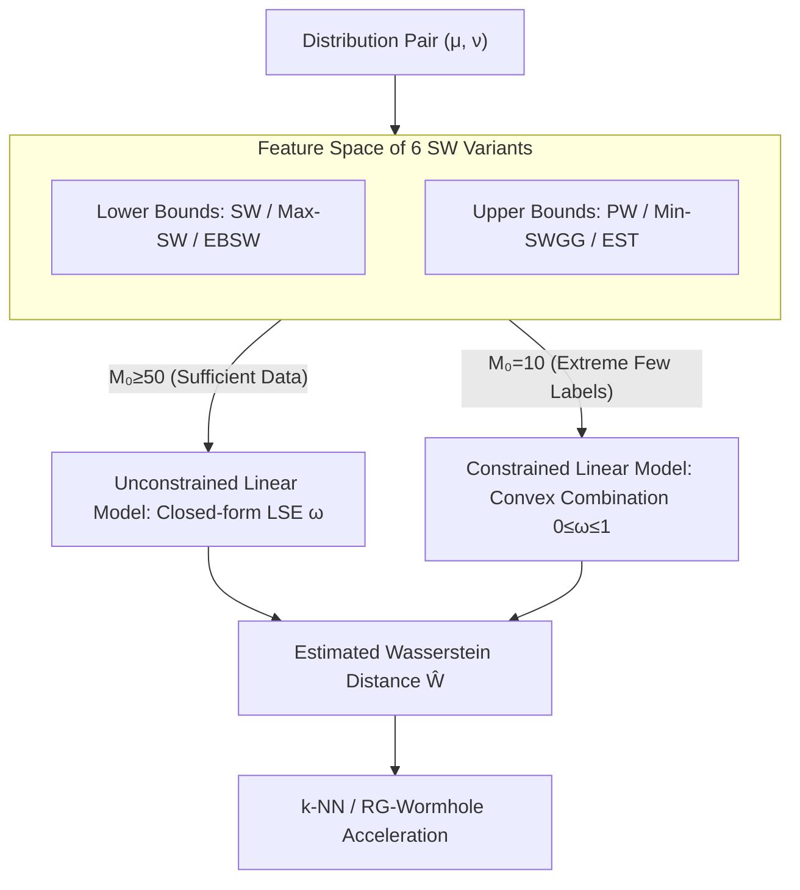

# Fast Estimation of Wasserstein Distances via Regression on Sliced Wasserstein Distances

**Conference**: ICLR 2026  
**arXiv**: [2509.20508](https://arxiv.org/abs/2509.20508)  
**Code**: [Available](https://github.com/hainn2803/Regression-Wasserstein)  
**Area**: 3D Vision  
**Keywords**: Wasserstein Distance, Sliced Wasserstein, Optimal Transport, Linear Regression, Point Cloud Classification

## TL;DR

By leveraging the mathematical property that Sliced Wasserstein (SW) variants provide lower bounds of the Wasserstein distance while lifted SW variants provide upper bounds, the authors construct a minimalist linear regression model (RG framework). Trained with a small number of accurate Wasserstein pairs as supervision, this high-precision proxy estimator significantly outperforms the Transformer-based method, Wasserstein Wormhole, in low-data scenarios.

## Background & Motivation

**Background**: The Wasserstein distance is a core metric in Optimal Transport (OT) theory, widely used in generative modeling, computational biology, 3D point cloud processing, and dataset comparison due to its ability to capture geometric structures. Practical applications often require repeated calculations of Wasserstein distances between numerous distribution pairs, such as k-NN classification or batch-wise distance computations in training.

**Limitations of Prior Work**: Calculating the exact Wasserstein distance has a complexity of $O(n^3 \log n)$, which is infeasible for large-scale datasets. Existing acceleration schemes have drawbacks: Sinkhorn regularization reduces complexity to $O(n^2)$ but introduces systematic approximation bias; deep learning methods like Wasserstein Wormhole use Transformers to encode distributions into Euclidean embeddings but require massive training data (hundreds to thousands of exact Wasserstein pairs) and suffer significantly in low-data regimes; Sliced Wasserstein projects high-dimensional problems to 1D ($O(n \log n)$) but serves only as a lower bound with limited accuracy.

**Key Challenge**: There is a fundamental trade-off between speed and accuracy—fast methods (SW) lack precision, precise methods (Exact WD) are too slow, and intermediate deep learning methods (Wormhole) demand excessive data and compute.

**Goal**: (1) Accurately recover the Wasserstein distance from SW distances without neural networks. (2) Train a high-quality estimator using extremely few (10-100) exact Wasserstein labels. (3) Accelerate existing deep methods like Wormhole.

**Key Insight**: The authors observe a neglected mathematical structure: the standard SW family (SW, Max-SW, EBSW) provides lower bounds, while the lifted SW family (PW, Min-SWGG, EST) provides upper bounds, with strict partial ordering relationships existing between them. Since the true Wasserstein distance is "sandwiched" between these bounds, using a linear combination of these features for regression is a natural and theoretically sound approach.

**Core Idea**: Use 6 SW variants (3 lower bounds + 3 upper bounds) as features to fit the true Wasserstein distance via a least-squares linear regression. This allows for closed-form solutions without iteration or neural networks.

## Method

### Overall Architecture

The pipeline of the RG (Regression) framework is simple: input a pair of probability distributions $(\mu, \nu)$, extract features in a **feature space composed of six SW variants** (three lower bounds: SW, Max-SW, EBSW; and three upper bounds: PW, Min-SWGG, EST), all of which are $O(n \log n)$. Then, calculate a weighted sum using pre-calibrated linear weights to output the estimated Wasserstein distance. The model has two forms: an **unconstrained linear model** for sufficient data (higher degrees of freedom and accuracy) and a **constrained linear model** for extreme few-shot scenarios (using convex combinations of bounds to reduce parameters and prevent overfitting). Calibration is performed by randomly sampling $M_0 \ll N$ pairs to compute exact Wasserstein distances once and solving the least-squares problem.

### Key Designs

**1. Feature Space of Six SW Variants: Approximation from Both Sides**

A single SW variant only approaches Wasserstein from one side, resulting in a low accuracy ceiling. The authors treat the fast-calculable SW family as regression features. The lower bound family includes SW (expectation of 1D Wasserstein over uniform directions), Max-SW (the maximized projection distance), and EBSW (energy-weighted directions). The upper bound family includes PW (expectation of lifted cost over uniform directions), Min-SWGG (minimized lifted cost), and EST (energy-weighted lifted cost). A strict partial ordering holds:

$$\text{SW} \leq \text{EBSW} \leq \text{Max-SW} \leq W_p \leq \text{Min-SWGG} \leq \text{EST} \leq \text{PW}$$

The "clamping" effect of these bounds allows the regression to be far more accurate than single-variant methods.

**2. Unconstrained Linear Model and Closed-form Solution**

The reconstruction is modeled as $W_p(\mu,\nu) = \sum_{k=1}^K \omega_k S_p^{(k)}(\mu,\nu) + \varepsilon$. The least-squares estimate provides the closed-form solution $\hat{\omega}_{LSE} = (\hat{S}^\top \hat{S})^{-1} \hat{S}^\top \hat{W}$, where $\hat{S} \in \mathbb{R}^{M \times K}$ is the SW distance matrix and $\hat{W} \in \mathbb{R}^M$ is the vector of exact Wasserstein distances. This is geometrically equivalent to projecting $\hat{W}$ onto the linear subspace spanned by SW features. This avoids iterative training and hyperparameter tuning.

**3. Constrained Linear Model (Midpoint Method) as Inductive Bias**

For extreme cases ($M_0=10$), the unconstrained model may overfit. The constrained version uses a convex weighting $\omega_k \cdot SL^{(k)} + (1-\omega_k) \cdot SU^{(k)}$ subject to $0 \leq \omega_k \leq 1$. This halves the number of parameters and forces the estimate to reside between the bounds, embedding the "sandwich" property into the model architecture.

### Loss & Training

The training uses Mean Squared Error (MSE), solvable via closed-form equations. The total cost is split into: (1) Training phase: calculating $M_0$ exact Wasserstein distances ($O(M_0 n^3 \log n)$, one-time cost), and (2) Inference phase: calculating $K$ SW variants ($O(KLn(\log n + d))$) plus a linear combination ($O(K)$), which is significantly faster than exact WD.

Additionally, the **RG-Wormhole** hybrid scheme is proposed: use a small sample to calibrate RG weights, then replace all Wasserstein distance calls during Wormhole training (e.g., pairwise batch distances, decoder reconstruction loss) with RG proxies. This keeps the architecture identical while reducing training step complexity from $O(n^3)$ to $O(n \log n)$.

## Key Experimental Results

### Main Results: k-NN Classification on ShapeNetV2

On ShapeNetV2 point clouds (10 classes), using 500 training samples and only 10 labels for RG calibration ($M_0=10$):

| Method | $R^2$ | k=1 | k=3 | k=5 | k=10 | k=15 |
|------|-------|------|------|------|------|------|
| WD (Exact) | - | 83.6% | 83.5% | 84.2% | 82.9% | 79.2% |
| SW (Lower only) | - | 72.2% | - | - | - | - |
| RG-s (SW+PW) | 0.868 | 82.1% | 81.7% | 80.8% | 79.4% | 75.5% |
| RG-seo (All 6) | 0.937 | 82.8% | 83.3% | **83.5%** | 82.3% | 77.9% |

At k=5, RG-seo reaches 83.5%, nearly matching exact WD (84.2%).

### Comparison with Wormhole in Low-Data Scenarios ($M_0=100$)

$R^2$ comparison across four datasets (2D to 2500D) with 100 training samples:

| Method | MNIST (2D) | ShapeNetV2 (3D) | MERFISH (254D) | scRNA-seq (2500D) |
|------|-----------|----------------|-------------|---------------|
| Wormhole | 0.28 | 0.65 | -3.6 | 0.04 |
| RG-se (Unconstrained) | **0.93** | **0.95** | **0.98** | **1.00** |

Wormhole fails on MERFISH ($R^2=-3.6$), whereas RG-se maintains 0.98.

### Ablation Study

| Dimension | Conclusion |
|---------|------|
| Constrained vs. Unconstrained | Unconstrained is superior when $M_0 \geq 50$; constrained is more stable for $M_0=10$ |
| Single vs. Multi-variant | RG-seo (6 features) > RG-se (4) > RG-s (2). More variants provide richer information |
| RG-Wormhole Speedup | Training time for Wormhole increases exponentially with batch size, while RG-Wormhole remains nearly linear |

### Key Findings

- **10 Samples are Sufficient**: The constrained RG-s model achieves $R^2 > 0.8$ with only 10 distributions, where Wormhole is unusable.
- **Consistent Across Dimensions**: Maintains high $R^2$ from 2D to 2500D, suggesting the linear relationship holds across scales.
- **RG-Wormhole as a Replacement**: Successfully retains all Wormhole capabilities (embedding, interpolation, reconstruction) with visually identical quality but much faster training.

## Highlights & Insights

- **Surprising Efficacy of Simplicity**: A basic linear regression with a closed-form solution outperforms a complex Transformer method across multiple datasets. This highlights the value of exploiting mathematical structures.
- **Leveraging the "Sandwich" Property**: The core insight is that lower and upper bounds of SW create an "information-complete" feature space for Wasserstein estimation. 
- **Plug-and-play Design**: RG-Wormhole demonstrates that replacing expensive subroutines with RG proxies is a viable strategy for any OT-based deep learning model.

## Limitations & Future Work

- **Linearity Assumption**: The relationship between SW and Wasserstein may have non-linear components. Though linear models are already effective, kernel regression could be explored.
- **Meta-distribution Dependency**: RG weights are calibrated for a specific distribution family. Transferability (e.g., from ShapeNet to ModelNet) is unverified.
- **No Independent Embedding**: Standalone RG only estimates distance and requires integration with Wormhole for generative tasks.

## Related Work & Insights

- **vs. Wasserstein Wormhole**: Wormhole requires massive data. RG leads in low-data regimes. However, Wormhole provides an embedding space; RG focuses on the distance scalar.
- **vs. Sinkhorn Distance**: Sinkhorn is $O(n^2)$. RG inference is $O(Ln \log n)$ and avoids the systematic bias of entropy regularization.
- **Insight**: This "regression on bounds" framework can be extended to other expensive metrics where efficient upper and lower bounds are available.

## Rating

- Novelty: ⭐⭐⭐⭐ Simple but novel core idea with clear mathematical motivation.
- Experimental Thoroughness: ⭐⭐⭐⭐⭐ Comprehensive tests across dimensions (2D-2500D) and tasks.
- Writing Quality: ⭐⭐⭐⭐ Clear notations and rigorous derivation.
- Value: ⭐⭐⭐⭐⭐ Practical, zero-tuning acceleration for Wasserstein distances.

<!-- RELATED:START -->

## Related Papers

- [\[ECCV 2024\] WaSt-3D: Wasserstein-2 Distance for Scene-to-Scene Stylization on 3D Gaussians](../../ECCV2024/3d_vision/wast-3d_wasserstein-2_distance_for_scene-to-scene_stylization_on_3d_gaussians.md)
- [\[ICLR 2026\] PatchRefiner V2: Fast and Lightweight Real-Domain High-Resolution Metric Depth Estimation](patchrefiner_v2_fast_and_lightweight_real-domain_high-resolution_metric_depth_es.md)
- [\[ICML 2026\] Streaming Sliced Optimal Transport](../../ICML2026/3d_vision/streaming_sliced_optimal_transport.md)
- [\[ICLR 2026\] FastVGGT: Fast Visual Geometry Transformer](fastvggt_fast_visual_geometry_transformer.md)
- [\[ICLR 2026\] UP2You: Fast Reconstruction of Yourself from Unconstrained Photo Collections](up2you_fast_reconstruction_of_yourself_from_unconstrained_photo_collections.md)

<!-- RELATED:END -->
