# FastAvatar: Towards Unified and Fast 3D Avatar Reconstruction with Large Gaussian Reconstruction Transformers

**Conference**: ICLR 2026  
**OpenReview**: [https://openreview.net/forum?id=P7zBSCs4Xt](https://openreview.net/forum?id=P7zBSCs4Xt)  
**Code**: [https://github.com/TyrionWuYue/FastAvatar](https://github.com/TyrionWuYue/FastAvatar)  
**Area**: 3D Vision / Digital Human Avatar Reconstruction  
**Keywords**: 3D Avatar, 3D Gaussian Splatting, Feed-forward Reconstruction, Variable-length Input, Incremental Reconstruction, VGGT  

## TL;DR
Using a unified feed-forward Transformer (LGRT), FastAvatar reconstructs drivable high-quality 3DGS avatars from an arbitrary number (1~16 frames) of facial observations—single images, multi-view setups, or monocular videos—within seconds. It achieves incremental reconstruction where "more observations lead to better quality" for the first time.

## Background & Motivation
**Background**: 3D avatar reconstruction has progressed from NeRF to 3DGS, significantly improving image quality and rendering speed. However, mainstream methods still rely on per-scene optimization, requiring iterative training on multi-view videos of a single person for dozens of seconds. Recent feed-forward methods (e.g., LAM for single images, Avat3r for 4 images) represent a new paradigm capable of producing results in seconds.

**Limitations of Prior Work**: The authors identify three bottlenecks. First is the **inability to utilize priors**: optimization-based methods derive all information from current observations; without sufficient data, they cannot hallucinate missing parts, creating a high dependency on complete 3D observations. Second is **low alignment precision**: existing methods generally rely on parametric proxy models like FLAME/3DMM for coarse alignment. These proxies are often non-robust due to limited expressive power, lighting, or data quality, making it difficult to unify inputs from light fields, smartphones, or DSLRs. Third is the **inability to handle variable-length data**: optimization methods require at least 30 seconds of video (failing otherwise), while feed-forward methods fix input lengths for training convenience (LAM uses 1 frame, Avat3r uses 4). This wastes observations in real-world scenarios where frame counts vary.

**Key Challenge**: There is a trade-off between **image quality, speed, and data utilization efficiency**. Single-image feed-forward methods can hallucinate plausible details but fail to strictly utilize additional observations, while multi-frame optimization methods accurately fit observations but are slow and cannot handle sparse inputs. No unified model exists to reconcile single-view, multi-view, and video inputs simultaneously.

**Goal**: To develop a data-efficient, high-quality, and fast unified feed-forward framework that accepts arbitrary input lengths and progressively improves quality as observations increase.

**Key Insight**: Adapt the successful architecture of the general-purpose 3D reconstruction model VGGT to the avatar task, **transforming it into an LGRT (Large Gaussian Reconstruction Transformer) specifically for predicting canonical-space 3DGS**. This involves using alternating global/intra-frame attention for variable-length alignment, multi-granularity positional encodings (camera/expression/pose) to resolve misalignment in dynamic faces, and sliced fusion plus landmark tracking losses to enable smooth incremental integration of multi-frame 3DGS.

## Method

### Overall Architecture
FastAvatar is a feed-forward function $A \leftarrow G(I, \pi, z^{exp}, z^{pose})$. Given an arbitrary number $N$ (1~16) of unordered RGB observations with internal parameters $\pi$, expression coefficients $z^{exp}$, and head poses $z^{pose}$ (coarsely estimated via multi-view FLAME tracking), it outputs a canonical-space 3DGS avatar drivable by any expression/viewpoint. The core is the **Large Gaussian Reconstruction Transformer (LGRT)**, which connects six stages: face feature extraction → face encoding → aggregation and registration → 3DGS attribute generation → canonical 3DGS fusion → rasterization.

```mermaid
flowchart LR
    A[N Face Observations<br/>1-16 frames] --> B[DINOv2 extracts<br/>tokens x_i]
    B --> C[Multi-granularity Encoding<br/>Concats camera/exp/pose → h_i]
    C --> D[L Layers of Alternating<br/>Intra-frame + Global Attention]
    D --> E[GS Head MLP<br/>Predicts per-frame 3DGS g_i]
    E --> F[Canonical 3DGS Fusion<br/>g_f = U·g_1...g_N]
    F --> G[Gumbel-Softmax Pruning<br/>Removes 50% redundant points]
    G --> H[Drivable 3DGS Avatar]
    E -.Lmk Tracking + Sliced Fusion.-> D
```

### Key Designs

**1. Transforming VGGT into an Avatar-specific LGRT: Alternating Attention for Variable-length Registration.** Avatar tasks require finer granularity than SLAM-style environment reconstruction, and faces are dynamic (changing expressions/poses). LGRT encodes each observation into tokens via DINOv2, followed by $L$ pairs of alternating **intra-frame** and **global attention**. Intra-frame attention (dual-stream DiT blocks) extracts single-frame features and incorporates 3D positional prompts to accelerate convergence. Global attention aligns face tokens from different frames into the same canonical 3D space for registration. Unlike VGGT, the authors replace the unstable DPT head with an MLP that directly predicts canonical 3DGS and uses FLAME mesh vertices as 3D positional prompts to initialize Gaussian positions. This is the most critical component: removing global attention causes the 16-view PSNR to plummet from 22.04 to 20.06 and Identity error to worsen from 0.118 to 0.210.

**2. Multi-granularity Positional Encoding to Eliminate Dynamic Face Misalignment.** Camera pose encoding alone is insufficient to align dynamic faces; indiscriminate aggregation leads to over-smoothing and aliasing. FastAvatar processes camera pose $\pi_i$, expression coefficients $z^{exp}_i$, and head pose $z^{pose}_i$ through a lightweight MLP and concatenates them into the tokens: $h_i = U\big(x_i, \text{MLP}([\pi_i, z^{exp}_i, z^{pose}_i])\big)$. These labels distinguish tokens of the "same face with different expressions/angles," enabling precise cross-frame aggregation and allowing the model to handle unordered variable-length inputs.

**3. Sliced Fusion Loss + Landmark Tracking Loss for Incremental Fusion.** Directly concatenating per-frame predicted 3DGS $g_i$ into $g_f = U(g_1, \dots, g_N)$ results in point cloud misalignment, ghosting, and color inconsistency. During training, a single frame is randomly sampled to obtain $g_i$, and $N_{sliced}$ frames are randomly selected to fuse into $g_{sliced}$. Both are rendered using input/target frame parameters for supervision: $\hat I_i = \Psi(g_i, \pi_i, z^{exp}_i, z^{pose}_i)$ and $\hat I_{sliced} = \Psi(g_{sliced}, \cdots)$. This forces consistency across any frame combination, supporting arbitrary fusion. Simultaneously, a landmark tracking loss directly supervises facial landmark localization on input frames: $L_{track} = \sum_{j}\sum_{i}\|y_{j,i} - \hat y_{j,i}\|$. Total loss: $L = \lambda_1 L_{rgb} + \lambda_2 L_{ssim} + \lambda_3 L_{lpips} + \lambda_4 L_{track} + \lambda_5 L_{mask}$. Sliced fusion loss is pivotal; removing it drops 16-view PSNR from 22.04 to 20.62.

**4. Gumbel-Softmax Gaussian Pruning to Control Point Cloud Inflation.** In incremental reconstruction, the number of Gaussian points grows linearly with input frames, taxing memory and slowing rendering. Borrowing from LP-3DGS and MaskGaussian, a differentiable 0/1 mask $M_i$ is sampled via Gumbel-Softmax and embedded in rasterization. This decouples the "existence" of a Gaussian from its opacity/shape. An L1 regularization $L_{mask} = \frac{1}{N}\sum_i |m|$ is applied to the mask. This mechanism prunes over 50% of Gaussian primitives with negligible quality loss, reducing the 16-view point count from 346.8K to 138.9K.

## Key Experimental Results

Training used NeRSemble (multi-view facial videos), with 16 frames sampled per pair (1~16 frames randomly used as input). Testing was conducted on unseen subjects for single-view, monocular video, and multi-view reconstruction. All experiments were performed on a single 48GB RTX 4090.

### Main Results (Reconstruction Quality and Speed vs. Input Frames)

| Input | Method | PSNR↑ | SSIM↑ | LPIPS↓ | Identity↓ | FPS↑ | Recon Time (s)↓ |
|------|------|-------|-------|--------|-----------|------|--------------|
| 1 View | LAM | 17.30 | 0.773 | 0.149 | 0.135 | 125 | 0.31 |
| 1 View | GaussianAvatars | 16.35 | 0.740 | 0.332 | 0.299 | <10 | >100 |
| 1 View | **Ours** | **20.08** | **0.860** | **0.143** | **0.116** | **240.17** | 1.33 |
| 8 View | LAM* | 16.59 | 0.718 | 0.235 | 0.206 | 24 | 0.43 |
| 8 View | GaussianAvatars | 20.35 | 0.820 | 0.320 | 0.252 | <10 | >100 |
| 8 View | **Ours** | **22.19** | **0.880** | **0.093** | **0.097** | 52.28 | 8.56 |
| 16 View | LAM* | 16.49 | 0.697 | 0.265 | 0.238 | 13 | 0.69 |
| 16 View | GaussianAvatars | 21.48 | 0.873 | 0.281 | 0.185 | <10 | >100 |
| 16 View | **Ours** | **22.29** | **0.881** | **0.092** | **0.095** | 17.65 | 26.06 |

### Ablation Study (16 View)

| Variant | PSNR↑ | SSIM↑ | LPIPS↓ | Identity↓ | #GS(K)↓ |
|------|-------|-------|--------|-----------|---------|
| w/o sliced fusion loss | 20.62 | 0.839 | 0.159 | 0.180 | 330.5 |
| w/o tracking loss | 21.66 | 0.865 | 0.123 | 0.129 | 164.2 |
| w/o global attention | 20.06 | 0.830 | 0.167 | 0.210 | 155.7 |
| w/o GS fusion | 16.25 | 0.811 | 0.196 | 0.259 | 12.4 |
| w/o GS pruning | 21.61 | 0.867 | 0.110 | 0.136 | 346.8 |
| **Ours full** | **22.04** | **0.876** | **0.102** | **0.118** | **138.9** |

### Key Findings
- **Monotonic Quality Improvement**: PSNR increases from 20.08 to 22.29 as input goes from 1 to 16 frames, validating the "incremental reconstruction" hypothesis. Optimization methods also improve with more frames but are slow (>100s), while LAM's quality actually degrades (due to lack of registration and single-view hallucination bias).
- **Comprehensive Speed Advantage**: Single-view reconstruction takes 1.33s with 240 FPS rendering, far faster than the >100s required by optimization-based methods.
- **GS Fusion and Global Attention are Structural Pillars**: Removing GS fusion drops 16-view PSNR to 16.25; removing global attention drops it to 20.06.
- **Lossless Pruning Acceleration**: GS pruning reduces point count from 346.8K to 138.9K (a 60% reduction), while PSNR slightly increases from 21.61 to 22.04.
- **Scalability to Long Sequences**: Using a FramePack-like approach to compress frames beyond the 16-frame sparse window into aggregated tokens, the model can handle hundreds of frames (e.g., 512 views to refine details like the oral cavity) without OOM.

## Highlights & Insights
- **Unified model for arbitrary inputs** is the primary value proposition: single images, multi-view, and videos share one feed-forward model, and any number of unordered inputs can be used, solving the "wasted data" structural flaw of fixed-length feed-forward methods.
- **"Incremental Reconstruction" paradigm**: Shifts avatar reconstruction from "one-time fitting of fixed data" to "progressive refinement as observations arrive," aligning better with real-world spontaneous capture.
- **Clever Reuse of Large Model Priors**: Initializes intra-frame attention using the VGGT architecture and LAM block weights, migrating general 3D reconstruction knowledge to avatars to avoid training from scratch.
- **Adjustable Quality-Speed Paradigm**: Provides immediate usable results with minimal data while offering high-quality models when more data is available, allowing users to trade compute for quality.

## Limitations & Future Work
- While single-frame PSNR (20.08) exceeds baselines, the absolute quality floor remains lower than multi-frame per-scene optimization; balancing feed-forward "hallucination" with strict fitting remains an open problem.
- Memory and compute for global attention grow with frame count; ultra-long sequences rely on token compression (FramePack), which is an approximation.
- Dependency on FLAME tracking for coarse camera/expression/pose estimation; poor tracking quality could affect alignment (though dependency is weaker than previous works).
- Training used only NeRSemble; generalization to extreme accessories, exaggerated expressions, or cross-domain capture devices requires further validation.

## Related Work & Insights
- **Feed-forward Avatars**: LAM (single-view) and Avat3r (fixed 4-view) are direct competitors; FastAvatar's "variable-length + incremental" nature is the core advancement.
- **General Feed-forward 3D**: DUSt3R and VGGT represent large model reconstruction without calibration; this work migrates VGGT to avatars by modifying the output head for 3DGS.
- **Optimization 3DGS Avatars**: GaussianAvatars and MonoGaussianAvatar use FLAME proxies with per-scene optimization; they offer high quality but are slow and cannot handle sparse data.
- **Mechanism**: The template "General Large Reconstruction Model + Task-specific Output Head + Task-specific Positional Encoding + Task-specific Fusion Loss" could be extended to other drivable assets like hands or full bodies.

## Rating
- **Novelty**: ⭐⭐⭐⭐ First to achieve incremental feed-forward 3DGS avatar reconstruction with variable-length inputs.
- **Experimental Thoroughness**: ⭐⭐⭐⭐ Comprehensive gradient testing (1-16 frames), thorough ablation, and extension to long sequences (512 frames).
- **Writing Quality**: ⭐⭐⭐⭐ Logic flow from pain points to design solutions is clear; excellent synergy between formulas and diagrams.
- **Value**: ⭐⭐⭐⭐ Practical, unified, and incremental solution for low-cost digital human deployment.

<!-- RELATED:START -->

## Related Papers

- [\[ICLR 2026\] Signal Structure-Aware Gaussian Splatting for Large-Scale Scene Reconstruction](signal_structure-aware_gaussian_splatting_for_large-scale_scene_reconstruction.md)
- [\[CVPR 2026\] Uni3R: Unified 3D Reconstruction and Semantic Understanding via Generalizable Gaussian Splatting from Unposed Multi-View Images](../../CVPR2026/3d_vision/uni3r_unified_3d_reconstruction_and_semantic_understanding_via_generalizable_gau.md)
- [\[ICLR 2026\] SkyEvents: A Large-Scale Event-Enhanced UAV Dataset for Robust 3D Scene Reconstruction](skyevents_a_large-scale_event-enhanced_uav_dataset_for_robust_3d_scene_reconstru.md)
- [\[ICLR 2026\] Learning Unified Representation of 3D Gaussian Splatting](learning_unified_representation_of_3d_gaussian_splatting.md)
- [\[ICLR 2026\] Splat and Distill: Augmenting Teachers with Feed-Forward 3D Reconstruction for 3D-Aware Distillation](splat_and_distill_augmenting_teachers_with_feed-forward_3d_reconstruction_for_3d.md)

<!-- RELATED:END -->
