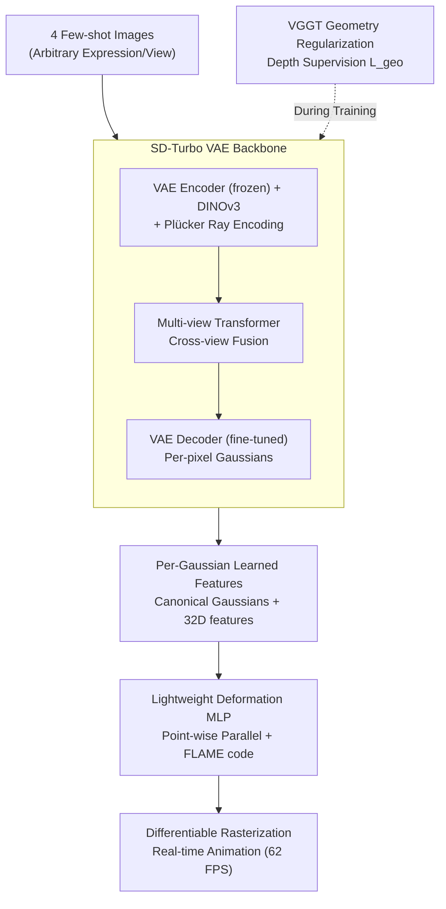

# FastGHA: Generalized Few-Shot 3D Gaussian Head Avatars with Real-Time Animation

**Conference**: ICLR 2026  
**arXiv**: [2601.13837](https://arxiv.org/abs/2601.13837)  
**Code**: To be confirmed  
**Area**: 3D Vision / Head Reconstruction  
**Keywords**: 3D Gaussian Splatting, head avatar, few-shot, real-time animation, feed-forward

## TL;DR
Ours proposes FastGHA, a feed-forward few-shot 3D Gaussian head avatar framework. It reconstructs animatable 3D Gaussian heads from 4 arbitrary expression/viewpoint images in ~1 second, supports real-time animation at 62 FPS, and achieves a PSNR of 22.5 dB on Ava-256 (surpassing Avat3r's 20.7 dB while being 7.75x faster).

## Background & Motivation

**Background**: 3D head avatar generation methods are divided into optimization-based and feed-forward approaches. Optimization-based methods (e.g., per-identity fitting) require large multi-view datasets and long optimization times, making them unsuitable for real-time deployment. Feed-forward methods (e.g., Avat3r, GPAvatar) can generate avatars from few-shot images but either lack controllable animation, suffer from slow animation speeds (Avat3r reaches only 8 FPS), or demonstrate limited reconstruction quality.

**Limitations of Prior Work**: (a) Avat3r utilizes skip-connections for geometry priors, causing geometric errors to propagate directly to the final output; (b) existing methods struggle to balance expression transfer accuracy (AKD) and identity preservation (CSIM); (c) a trade-off exists between animation speed and quality—high-quality methods are typically slow.

**Key Insight**: A two-stage design is adopted—first, feed-forward reconstruction of a canonical Gaussian head (with learned per-Gaussian features) from few-shot images, followed by expression-driven deformation using a lightweight MLP to achieve fast animation.

**Core Idea**: The framework employs an SD-Turbo VAE + DINOv3 feature-based multi-view Transformer to reconstruct the canonical Gaussian head. Real-time animation is realized through per-Gaussian learned features combined with a lightweight deformation MLP.

## Method

### Overall Architecture
The Key Challenge FastGHA addresses is the conflict between fast few-shot feed-forward reconstruction and high-quality animatable performance, where previous methods often sacrificed one for the other. The task is decoupled into two stages: "modeling" the identity as a static standard head and "driving" expressions onto it. The first stage performs feed-forward reconstruction of a canonical (neutral) Gaussian head from 4 images of arbitrary expressions/views. This head carries additional learned features for each Gaussian point alongside standard attributes. The second stage feeds target FLAME expression codes into a lightweight MLP to calculate point-wise position and color offsets, deforming the standard head into any expression for real-time rendering. Consequently, the expensive multi-view reconstruction occurs only once, while subsequent animation is reduced to low-cost point-wise MLP forward passes.

### Key Designs

**1. SD-Turbo VAE Backbone: Filling the few-shot information gap with pre-trained generative priors**

Reconstructing a complete renderable head from only 4 images involves inherently insufficient input information, requiring strong priors to hallucinate unobserved regions. FastGHA leverages the SD-Turbo VAE instead of training an encoder from scratch. The encoder is frozen to retain high-level semantic features from pre-training, while the decoder is fine-tuned to produce per-pixel Gaussian parameters from fused multi-view features. Specifically, input images extract color features via the VAE encoder and semantic features via DINOv3, while camera poses are encoded using Plücker rays. These are processed by a multi-view Transformer for cross-view fusion and finally restored by the fine-tuned VAE decoder into the canonical Gaussian head $\mathcal{G}^c_f$. Ablations indicate these pre-trained weights are the most critical component—training from scratch results in a 0.49 dB drop in PSNR and a 0.023 drop in CSIM.

**2. Per-Gaussian Learned Features $\mathbf{f}\in\mathbb{R}^{32}$: Providing expression cues for the deformation stage**

If the first stage only outputted standard Gaussian attributes (position, color, rotation, scale, opacity), the deformation MLP would have to guess expression dynamics based solely on low-level geometry. FastGHA enables the decoder to learn an additional 32-dimensional feature vector for each Gaussian, encoding high-level semantics related to expressions. This is used as input for the deformation MLP, essentially pre-storing information about "what role this point plays on the face and how it should respond to expression changes." This feature overhead is minimal, yet removing it leads to a 0.22 drop in PSNR and a 0.014 drop in CSIM.

**3. VGGT Geometry Regularization: Downgrading geometry priors from "input" to "supervision"**

Avat3r feeds geometry priors directly into the network via skip-connections, which allows errors in the priors to propagate to the final output. FastGHA changes the "access point" of geometry priors: point clouds generated by a pre-trained VGGT model are used as a depth supervision signal $\mathcal{L}_{geo}$ in the loss function rather than as network input. Thus, the geometry prior only guides convergence during training and is not involved in inference, preventing prior errors from contaminating the output. This is the fundamental difference in geometry utilization between FastGHA and Avat3r, emphasizing the principle that geometry priors should serve as regularization.

**4. Lightweight Deformation MLP: Transforming animation into fully parallelizable point-wise operations**

The bottleneck of real-time animation lies in the computational cost of the deformation stage. FastGHA designs deformation as an MLP that processes each Gaussian independently. The input consists of the Gaussian's canonical attributes plus the FLAME expression code, and the output is the position and color offset $\delta_z$, with no interaction between Gaussian points. This lack of interaction allows for high levels of parallel computation. Combined with the one-time reconstruction design, the animation frame rate reaches 62 FPS (7.75x faster than Avat3r's 8 FPS). The trade-off is the absence of global consistency constraints across Gaussians, which is noted as a limitation.

### Mechanism
The complete process from capture to animation is as follows: given 4 photos of the same person with different expressions/views, color and semantic features are extracted via the SD-Turbo VAE encoder and DINOv3. These are combined with Plücker ray-encoded camera poses and fused in a multi-view Transformer. The fine-tuned VAE decoder then outputs per-pixel Gaussians to form the canonical head $\mathcal{G}^c_f$ with 32D per-Gaussian features—this step takes approximately 0.98 seconds. To animate, a target FLAME expression code is combined with the canonical attributes and 32D features of each Gaussian and fed into the deformation MLP to calculate $\delta_z$ offsets. The deformed Gaussians are rendered via differentiable rasterization. Since deformation is purely point-wise and parallel, this drive-and-render cycle maintains a stable 62 FPS.

### Loss & Training
The total loss combines pixel reconstruction, structural similarity, perception, silhouette, and geometry supervision:

$$\mathcal{L} = \mathcal{L}_{RGB} + \mathcal{L}_{SSIM} + 0.5\,\mathcal{L}_{perc} + \mathcal{L}_{sil} + 0.5\,\mathcal{L}_{geo}$$

Where $\mathcal{L}_{geo}$ is the depth supervision provided by VGGT point clouds. Training data includes Ava-256 (256 identities / 40 cameras) and NeRSemble (425 identities / 16 cameras). Each sample uses 4 images of the same person with different expressions/views as input, and 8 images with the same expression as supervision. Training was performed for 400k steps on 4×H800 GPUs, taking approximately 4 days.

## Key Experimental Results

### Main Results

| Method | PSNR↑ | SSIM↑ | LPIPS↓ | CSIM↑ | AKD↓ | FPS |
|---|---|---|---|---|---|---|
| InvertAvatar | 14.2 | 0.36 | 0.55 | 0.29 | 15.8 | - |
| GPAvatar | 19.1 | 0.70 | 0.32 | 0.26 | 6.9 | - |
| Avat3r | 20.7 | 0.71 | 0.33 | 0.59 | 4.8 | 8 |
| **Ours (FastGHA)** | **22.5** | **0.77** | **0.23** | **0.73** | **4.8** | **62** |

FastGHA outperforms Avat3r across all metrics: PSNR +1.8, LPIPS -0.10, CSIM +0.14, and 7.75x FPS.

### Ablation Study

| Configuration | PSNR | CSIM | AKD |
|---|---|---|---|
| w/o VAE Pre-training | 20.789 | 0.681 | 5.487 |
| w/o Geometry Loss | 21.132 | 0.687 | 5.049 |
| w/o Per-Gaussian Features | 21.053 | 0.690 | 5.216 |
| **Full FastGHA** | **21.274** | **0.704** | **4.996** |

### Key Findings
- **Pre-trained VAE weights are the most critical factor**: PSNR drops by 0.49 and CSIM drops by 0.023 without them.
- **Sub-second reconstruction**: 4 input images take only 0.98 seconds.
- **Image count trade-off**: 2 images result in 128 FPS but lower quality; 6 images result in 32 FPS with diminishing quality returns. 4 images is the optimal balance.
- **Stong performance on NeRSemble**: Achieved PSNR 24.0 and SSIM 0.81.

## Highlights & Insights
- **Correct usage of geometry priors**: Using depth as a regularization loss instead of a skip-connection input avoids error propagation seen in Avat3r. This is a generalizable design principle.
- **Per-Gaussian semantic features**: 32D learned features allow the deformation MLP to utilize high-level information beyond low-level geometry, providing high gains at low cost.
- **Key to real-time animation**: The deformation MLP processes each Gaussian independently, enabling full parallelization without the need for cross-Gaussian interaction.

## Limitations & Future Work
- Requires pre-acquired camera parameters and FLAME expression codes, which can be a bottleneck in practical applications.
- Evaluated only on laboratory multi-view datasets; robustness to low-quality in-the-wild inputs (e.g., selfies) is unverified.
- Does not support fine-grained modeling of hair and accessories (limited by the Gaussian representation).
- The deformation MLP lacks global consistency constraints as it processes points independently.

## Related Work & Insights
- **vs Avat3r**: Avat3r is also feed-forward but suffers from error propagation due to skip-connected geometry priors and only reaches 8 FPS. FastGHA replaces skip-connections with depth supervision and reaches 62 FPS.
- **vs GPAvatar**: GPAvatar has poor identity preservation (CSIM 0.26 vs 0.73) due to its lack of powerful semantic feature extraction.

## Rating
- Novelty: ⭐⭐⭐⭐ The two-stage design and per-Gaussian feature logic are clear and effective, though individual components are not entirely revolutionary.
- Experimental Thoroughness: ⭐⭐⭐⭐ Comprehensive evaluation across two datasets, multiple baselines, thorough ablation, and speed analysis.
- Writing Quality: ⭐⭐⭐⭐ Pipeline descriptions are clear, though motivations for certain design choices could be more in-depth.
- Value: ⭐⭐⭐⭐ High practical value as the first to achieve both few-shot and real-time animation for 3D Gaussian head avatars.

<!-- RELATED:START -->

## Related Papers

- [\[CVPR 2026\] RelightAnyone: A Generalized Relightable 3D Gaussian Head Model](../../CVPR2026/3d_vision/relightanyone_a_generalized_relightable_3d_gaussian_head_model.md)
- [\[CVPR 2026\] EmoTaG: Emotion-Aware Talking Head Synthesis on Gaussian Splatting with Few-Shot Personalization](../../CVPR2026/3d_vision/emotag_emotion-aware_talking_head_synthesis_on_gaussian_splatting_with_few-shot_.md)
- [\[ECCV 2024\] HeadGaS: Real-Time Animatable Head Avatars via 3D Gaussian Splatting](../../ECCV2024/3d_vision/headgas_real-time_animatable_head_avatars_via_3d_gaussian_splatting.md)
- [\[ICLR 2026\] Mobile-GS: Real-time Gaussian Splatting for Mobile Devices](mobile-gs_real-time_gaussian_splatting_for_mobile_devices.md)
- [\[CVPR 2026\] PhysHead: Simulation-Ready Gaussian Head Avatars](../../CVPR2026/3d_vision/physhead_simulation-ready_gaussian_head_avatars.md)

<!-- RELATED:END -->
