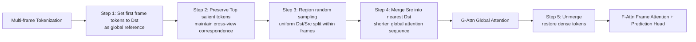

# FastVGGT: Fast Visual Geometry Transformer

**Conference**: ICLR 2026  
**OpenReview**: [https://openreview.net/forum?id=asl8NJlIMe](https://openreview.net/forum?id=asl8NJlIMe)  
**Code**: [https://mystorm16.github.io/fastvggt/](https://mystorm16.github.io/fastvggt/)  
**Area**: 3D Vision / Feed-forward 3D Reconstruction  
**Keywords**: VGGT, Feed-forward 3D Reconstruction, Token Merging, Global Attention, Long Sequence Acceleration, Training-free  

## TL;DR
Addressing the global attention bottleneck of the large-scale feed-forward 3D reconstruction model VGGT, this paper observes that its token attention maps are highly homogeneous ("token collapse"). Based on this, it proposes a training-free, 3D multi-view oriented three-partition token merging strategy, achieving a 4× speedup with 1000 input images while suppressing error accumulation in long sequences.

## Background & Motivation
**Background**: Feed-forward 3D reconstruction, represented by DUSt3R and VGGT, replaces traditional iterative optimization pipelines with end-to-end Transformers, directly regressing camera parameters, depth maps, point maps, and 2D trajectories from raw images. VGGT (1.2B parameters) has become the current SOTA due to its two-stage structure of alternating "Frame Attention + Cross-frame Global Attention."

**Limitations of Prior Work**: The scalability of VGGT is hindered by two factors. First, global attention requires dense interactions across tokens of all views. Even though Flash-Attention reduces memory complexity from $O(n^2)$ to $O(nd)$, the time complexity remains $O(n^2d)$, exploding quadratically with the number of frames. Component analysis shows that as the frame count increases from 20 to 200, Global Attention expands from being comparable to Frame Attention to consuming the vast majority of inference time. Second, as the token space expands with the number of frames, microscopic errors are continuously amplified in global attention, leading to prediction drift in long sequences. Additionally, the original VGGT encounters OOM errors when processing more than 300 frames.

**Key Challenge**: Global attention is indispensable for capturing cross-frame relationships, yet it is both a speed bottleneck and a source of error accumulation. The challenge lies in removing this computational redundancy without compromising VGGT's reconstruction capability.

**Core Idea**: By visualizing global attention maps, the authors discovered that **attention patterns of different tokens are highly similar** (feature degradation / token collapse), indicating significant redundancy in global computation. **[Training-free token merging]** can accelerate inference by merging redundant tokens; however, **[Customized partitioning for 3D]** is the key—directly applying 2D token merging to VGGT leads to a severe drop in performance (ToMeSD collapses when the merging ratio exceeds 0.3) because 3D reconstruction relies on cross-view correspondences. Consequently, this paper designs a three-partition strategy—preserving reference frames, protecting salient tokens, and region-uniform sampling—enabling VGGT to maintain baseline accuracy even at an aggressive merging ratio of 0.9.

## Method

### Overall Architecture
FastVGGT is a training-free inference framework built on top of VGGT, modifying only the input token set of the global attention layers while keeping VGGT weights intact. The pipeline performs "Partitioning → Merging → Attention → Unmerging" before each global attention block: tokens from all frames are categorized into salient, destination (dst), and source (src) types. Src tokens are merged into the most similar dst tokens to shorten the attention sequence. After computing global attention, an unmerging step restores the original token count for subsequent frame attention and dense prediction heads.

### Key Designs

**1. Reference Frame Token Selection: Anchoring the world coordinate system using the first frame to avoid merging.** VGGT defines the first frame as the world coordinate system, with all tokens registered relative to it. Visualizations confirm that activations of tokens toward the first frame are consistently stronger than toward others, suggesting it serves as a core anchor for scene-level representation. Therefore, the authors designate all tokens of the first frame as high-priority dst tokens that do not participate in merging, thereby preserving the spatial consistency of the entire sequence—a critical step for suppressing long-sequence drift and the most significant design in the ablation study.

**2. Salient Token Protection: Extracting "cross-view keypoints" for direct attention.** 3D reconstruction relies on cross-frame token interactions to establish correspondences. A few key tokens act like feature points in traditional matching algorithms; averaging them would destroy geometric correspondence. The authors introduce a third category, salient tokens, alongside the standard dst/src split, allowing them to bypass merging. While initial attempts used a token-norm-based top-k metric (which scales poorly with sequence length), the final design utilizes fixed-stride sampling to retain 10% of tokens per frame as salient. Experiments show this is as accurate as top-k but much cheaper. Interestingly, while top-k accurately captures semantic regions in shallow layers, it tends to over-concentrate in deep layers; fixed-stride sampling maintains a uniform spatial distribution.

**3. Region-Uniform Sampling: Partitioning by image grid to avoid local over-compression.** Dense prediction is vulnerable to entire regions being merged away. Borrowing from ToMeSD in diffusion models, the authors arrange each frame's tokens into a 2D image patch grid. Within each grid cell, dst tokens are sampled with a stride $K$ based on the merging ratio, while the rest are src tokens. This region-level random sampling ensures a spatially balanced merge within each frame, preventing artifacts from missing regions and maintaining the stability of the global scene structure.

**4. Merge/Unmerge: Cosine similarity matching + replication recovery.** After partitioning, cosine similarity $\text{sim}(x_s, x_d)=\frac{x_s\cdot x_d}{\lVert x_s\rVert\lVert x_d\rVert}$ is calculated between each source token $x_s$ and all dst tokens. $x_s$ is merged into the most similar $x_d$, updating it as $x_d' = \frac{x_d + x_s}{2}$, and $x_s$ is temporarily discarded. Since dense 3D reconstruction requires per-token output, an unmerge operation follows global attention: the merged representation $x^*_{1,2}=\frac{x_1+x_2}{2}$ is copied back to the original positions $x_1'=x_2'=x^*_{1,2}$ to restore the sequence length, ensuring full compatibility with the VGGT architecture. The accompanying VGGT* memory optimization retains intermediate outputs only for layers 4, 11, 17, and 23 (required for inference), discarding caches for the other 24 blocks, which extends the maximum processable frame count from ~300 to over 1000.

## Key Experimental Results

### Main Results
ScanNet-50 Point Cloud Reconstruction (CD = Chamfer Distance, lower is better; merging ratio fixed at 0.9):

| Method | 1000-frame CD / Time | 500-frame CD / Time | 300-frame CD / Time | 100-frame CD / Time |
|------|------|------|------|------|
| π³ | OOM | OOM | OOM | OOM |
| StreamVGGT | OOM | OOM | OOM | OOM |
| Fast3R | 0.684 / 397.8s | 0.701 / 97.3s | 0.711 / 34.9s | 0.723 / 4.8s |
| CUT3R | 0.786 / 34.8s | 0.774 / 18.8s | 0.775 / 11.1s | 0.767 / 3.6s |
| VGGT* (Baseline) | 0.471 / 724.6s | 0.420 / 177.5s | 0.416 / 131.4s | 0.423 / 9.1s |
| **FastVGGT** | **0.425 / 180.7s** | **0.411 / 55.2s** | 0.416 / 23.8s | 0.426 / 5.4s |

At 1000 frames, Ours achieves a **4× Gain** in speed (724.6s → 180.7s) compared to VGGT*, and the CD actually improves from 0.471 to 0.425—demonstrating that for long sequences, the method not only maintains performance but also suppresses error accumulation. Camera pose estimation follows a similar trend: for 1000 frames, ATE decreases from 0.196 to 0.164 and ARE from 4.636 to 3.860, significantly suppressing long-sequence drift. Performance on short sequences (100/300 frames) remains on par with the baseline.

### Ablation Study
Ablation of Token Partitioning Strategies (500-frame ScanNet-50, cumulative):

| Configuration | Description | Effect |
|------|------|------|
| (a) Random sampling for dst/src | Direct 2D approach | Worst |
| (b) + Intra-region uniform sampling | Spatial balance | Improved but suboptimal |
| (c) + First frame as dst | Anchored reference | Significant improvement |
| (d) + Salient token protection | Full FastVGGT | Best |

Merging Position and Intensity (Table 8): A higher merging ratio speeds up inference with only minor fluctuations in CD; an aggressive strategy of "90% merge ratio for all layers starting from block 0" is ultimately adopted. Salient token selection (Table 6): Fixed-stride 10% sampling is comparable in accuracy to TopK-15% (CD 0.423 vs 0.421 at 500 frames) but is faster.

### Key Findings
- **Quantification of Token Collapse**: The average pairwise cosine similarity for six representative tokens is very high across most global attention blocks, dropping significantly only near Blocks 1 and 14—applying a 0.9 merging ratio even in these lower-similarity layers results in negligible performance loss.
- Directly transferring 2D methods like ToMe-R / ToMe-S / PiToMe to VGGT causes CD to deteriorate from the baseline 0.416 to 0.45~0.63 even at a 0.3 merging ratio, proving that 3D scenes require customized partitioning.
- The memory-saving mechanism of 2D token merging does not apply to VGGT's frame attention (as there is no significant token similarity within frames, and the alternating structure requires unmerging). Thus, FastVGGT saves time through merging, while memory optimization is separately handled by VGGT*.

## Highlights & Insights
- **Clean "Diagnosis → Attribution → Remedy" Research Paradigm**: The work starts with a component-level time analysis to locate Global Attention, uses attention map visualization to uncover token collapse, and finally proposes the merging solution, creating a convincing logical chain.
- **Transferring "Feature Degradation" from DINO-like models to VGGT is a brilliant insight**: In DINO, token collapse toward the CLS token is detrimental (damaging dense prediction). However, in VGGT's two-stage structure, the collapse in global attention can be interpreted as an "intentional distillation of global semantics," with frame attention subsequently restoring local differences—the same phenomenon acts as both a flaw and a usable redundancy across different architectures.
- **Training-free, Plug-and-Play**: It requires no modification to VGGT weights, making the engineering deployment cost extremely low, with benefits scaling positively with sequence length (performance is maintained for short sequences and is both faster and more accurate for long ones).

## Limitations & Future Work
- The method inherently exploits the specific redundant structure of VGGT's global attention. Its generalizability to other feed-forward 3D models without obvious token collapse (e.g., π³, CUT3R) remains unverified.
- Crucial hyperparameters such as the 0.9 merging ratio, 10% saliency, and strides are largely fixed based on empirical observations and lack an adaptive mechanism; optimal configurations might vary across different datasets or scene densities.
- Unmerging uses simple replication; fine-grained information from merged tokens is irreversibly lost, potentially limiting the accuracy ceiling for tasks sensitive to extreme details (e.g., reconstruction of tiny structures).
- Evaluations are concentrated on indoor datasets (ScanNet/7Scenes/NRGBD). Robustness in outdoor, dynamic, or large-baseline scenarios has not been fully tested.

## Related Work & Insights
- **Feed-forward 3D Reconstruction**: DUSt3R pioneered end-to-end point map regression; VGGT scaled this to 1.2B parameters for joint prediction of pose/depth/points/trajectories. While VGGT-Long suppresses drift using sub-graph alignment at the cost of speed, this work achieves both speed and accuracy by reducing the number of global attention tokens.
- **Token Merging**: The ToMe series (including region-random sampling in ToMeSD) and PiToMe (energy score criterion) are primary training-free acceleration methods for 2D ViTs and diffusion models. This paper transfers the "src/dst division + unmerge" paradigm to 3D multi-view and identifies the failure points of direct 2D migration.
- **Attention Approximation**: Nyströmformer and Performer use landmarks or random features for linear attention, representing an orthogonal path for acceleration.
- **Insight**: For any large model combining "long sequences + global attention," it is more stable to first diagnose attention redundancy and then customize token reduction based on the task structure rather than blindly applying general sparsification. The perspective that "the same degradation phenomenon must be re-evaluated as beneficial or harmful in different architectures" is worth promoting.

## Rating
- **Novelty**: ⭐⭐⭐⭐ — The combination of token collapse diagnosis and the 3D multi-view oriented three-partition merging strategy is novel, successfully adapting 2D token merging to feed-forward 3D reconstruction.
- **Experimental Thoroughness**: ⭐⭐⭐⭐ — Covers three datasets (ScanNet/7Scenes/NRGBD), two tasks (reconstruction and pose), and scales from 100 to 1000 frames. Ablations break down the partitioning strategy with quantitative analysis of token collapse. Outdoor/dynamic scenes are missing.
- **Writing Quality**: ⭐⭐⭐⭐ — The narrative of diagnosis-attribution-method is clear, with strong supporting figures (component timing, attention maps, 5-step pipeline) and an insightful analogy to DINO.
- **Value**: ⭐⭐⭐⭐ — Training-free, plug-and-play, 4× acceleration for long sequences while suppressing drift; it has direct deployment value for VGGT-like feed-forward 3D reconstruction.

<!-- RELATED:START -->

## Related Papers

- [\[ICLR 2026\] Quantized Visual Geometry Grounded Transformer](quantized_visual_geometry_grounded_transformer.md)
- [\[ICLR 2026\] Streaming Visual Geometry Transformer](streaming_visual_geometry_transformer.md)
- [\[CVPR 2026\] Fast Spatial Tracking with Visual Geometry Transformer](../../CVPR2026/3d_vision/fast_spatial_tracking_with_visual_geometry_transformer.md)
- [\[ICLR 2026\] $\pi^3$: Permutation-Equivariant Visual Geometry Learning](pi3_permutation-equivariant_visual_geometry_learning.md)
- [\[CVPR 2026\] Emergent Outlier View Rejection in Visual Geometry Grounded Transformers](../../CVPR2026/3d_vision/emergent_outlier_view_rejection_in_visual_geometry_grounded_transformers.md)

<!-- RELATED:END -->
