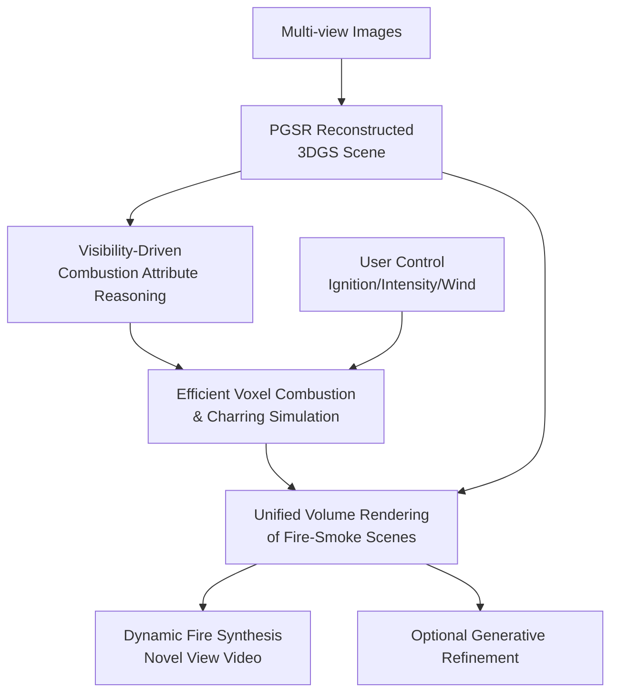

# FieryGS: In-the-Wild Fire Synthesis with Physics-Integrated Gaussian Splatting

**Conference**: ICLR2026  
**OpenReview**: [https://openreview.net/forum?id=ziKFH7whvy](https://openreview.net/forum?id=ziKFH7whvy)  
**Paper**: [Project Page](https://pku-vcl-geometry.github.io/FieryGS/)  
**Code**: To be released  
**Area**: 3D Vision  
**Keywords**: Gaussian Splatting, Fire Synthesis, Physics Simulation, Material Reasoning, Volume Rendering  

## TL;DR
FieryGS integrates 3D Gaussian Splatting (3DGS) reconstruction of real-world scenes, MLLM-based material property reasoning, controllable combustion simulation, and unified volume rendering. This pipeline allows users to automatically synthesize dynamic fire, smoke, and charring effects that are visually realistic and adhere to material and geometric constraints in multi-view scenes captured in-the-wild.

## Background & Motivation
**Background**: Fire synthesis has long followed two paths: physics-based or VFX-based workflows (e.g., CFD, Houdini, Blender) and recent image/video generative models that directly insert fire into frames. The former can represent fluid dynamics, temperature, smoke, and charring, but requires experts to manually model geometry, label materials, and tune simulation parameters to align with real scenes. The latter has a lower barrier for use and generates impactful visuals but often alters the original scene structure and struggles to ensure fire originates from combustible materials or propagates realistically according to wind and intensity.

**Limitations of Prior Work**: Fire in a real scene is neither a simple texture nor an isolated particle effect. It depends on scene geometry, object materials, ignition points, airflow, and combustion states, while simultaneously altering the scene's appearance—e.g., blackening wood, creating black smoke from plastic, or illuminating surrounding surfaces. The issue with traditional VFX/CFD pipelines is that almost all this information must be provided manually; the issue with video generative models is that they typically learn visual correlations without explicit physical states or controllable parameters.

**Key Challenge**: There is a gap between real-world alignment and physical controllability. While 3DGS can reconstruct real scenes with high quality from multi-view photos, it is essentially an appearance representation that lacks knowledge of which Gaussian points represent wood or metal. Conversely, combustion simulations know how to update velocity, temperature, and reaction coordinates but require usable geometry and material inputs. The core task of FieryGS is to bridge these ends: using 3DGS as the real-world base and supplementing it with combustion semantics via physical reasoning and simulation.

**Goal**: The paper addresses three sub-problems. First, how to obtain a scene representation from in-the-wild multi-view images that includes both geometry and combustion attributes. Second, how to simulate fire propagation, smoke diffusion, and surface charring without excessive efficiency loss. Third, how to unify the rendering of fire, smoke, charred 3DGS, and fire-induced lighting into a single frame while allowing user control over ignition, intensity, and wind.

**Key Insight**: Rather than attempting to "draw fire" end-to-end with a generative model, the authors decompose physical knowledge into modules compatible with 3DGS. PGSR provides accurate geometry/normals; SAM/SAGA/HDBSCAN-style 3D segmentation partitions the scene into material-consistent regions; an MLLM infers materials and burnability from the most visible viewpoints; a voxel grid hosts the combustion simulation; and a unified volume renderer converts simulation states into images. This design ensures every step has an interpretable physical meaning and maps user control variables directly to fire behavior.

**Core Idea**: Replace manual VFX pipelines with a unified workflow of "3DGS Reconstruction + MLLM Material Reasoning + Lightweight Combustion Simulation + Unified Volume Rendering," integrating combustible materials, fire dynamics, and visual synthesis.

## Method
### Overall Architecture
FieryGS takes multi-view images as input and outputs time-varying fire, smoke, charring, and lighting effects from any viewpoint. The pipeline first uses PGSR to reconstruct 3DGS with high geometric quality, then segments Gaussian points into material regions. Each region is rendered from its most visible viewpoint and sent to GPT-4o to reason about material types, burnability, and thermal diffusion properties. These attributes are projected back to the Gaussians and converted into a voxel occupancy grid. Subsequently, the combustion simulation updates fire/smoke states in air voxels and temperature/charring levels in combustible solid voxels. Finally, a unified renderer synthesizes the simulated fire/smoke with the 3DGS background.

Several boundaries are distinct here. Steps like PGSR, SAM, and HDBSCAN serve as scaffolding to obtain a reconstructible/simulatable 3D scene. The core contributions of FieryGS are: visibility-driven combustion attribute reasoning, efficient voxel combustion/charring simulation, and unified volume rendering. User controls are not post-processing buttons but parameters for physical equations—e.g., ignition location determines initial reaction coordinates, intensity affects fire height via buoyancy/reaction rates, and wind acts as an external force.

### Key Designs
**1. Visibility-Driven Combustion Attribute Reasoning: Transforming 3DGS to a Combustible Material Field**

Standard 3DGS only records Gaussian centers, covariances, opacity, and color; it lacks semantic knowledge. FieryGS trains a feature vector for each Gaussian, renders these features to 2D via alpha blending, and uses multi-view SAM masks for contrastive learning to cluster Gaussians in feature space. After training, HDBSCAN clustering yields instance-level 3D regions, assuming shared material properties within each.

The key to material reasoning is selecting the most reliable viewpoint rather than just any screenshot. In real scenes, objects may be occluded; GPT-4o can easily misidentify materials if viewing a small fragment or a background-confused area. The paper uses depth maps to count unoccluded Gaussians in the target region to select the viewpoint with the highest visibility. GPT-4o then receives a global view, a context view with masks/boxes, and a local crop. The output is a quadruple: region description, material type, burnability boolean, and relative thermal diffusivity. This assigns properties like material type, burnability, and smoke color to all Gaussians in a region.

This design solves the "scene initialization" problem in combustion simulation. While traditional CFD/VFX requires manual input, FieryGS automatically infers these from 3DGS reconstructed from real images. The authors report an average of 84 API calls per scene (~$0.55), with a material reasoning accuracy of approximately 89.31%, achieving a balance between automation and cost.

**2. Efficient Voxel Combustion and Charring Simulation: Capturing Key Visual Physical States**

Once attributed, 3DGS is mapped to an occupancy grid: voxels overlapping Gaussians with opacity above a threshold are marked "occupied," and those with combustible Gaussians are marked "combustible." Air regions handle fire/smoke simulation, while combustible solid regions handle heat conduction and charring.

For fire, an incompressible fluid approximation is used to update the velocity field $u$ and reaction coordinate $Y$:
$$
\frac{\partial u}{\partial t} + u \cdot \nabla u = -\frac{1}{\rho}\nabla p + f, \quad \nabla \cdot u = 0,
$$
$$
\frac{\partial Y}{\partial t} + u \cdot \nabla Y = -k.
$$
Here, $Y=1$ denotes active burning and $Y=0$ denotes unburned. External force $f$ includes buoyancy $f_{buo}=\alpha(T-T_{air})z$ and vorticity confinement. For efficiency, temperature $T$ is approximated as a quadratic function of $Y$ rather than solved via full heat conduction PDEs, preserving the visual correlation between combustion progress and temperature.

Charring updates material temperature $T_m$ and relative char mass $M_c$ in solid voxels using a simplified heat equation:
$$
\frac{\partial T_m}{\partial t}=\beta\nabla^2T_m + \gamma_m(T_{amb}^4-T_m^4)+S_{T_m}.
$$
When $T_m$ exceeds a threshold $T_{ign}$, it is clamped to $T_{burn}$, and charring accumulates via $\frac{\partial M_c}{\partial t}=\epsilon_c\xi(T_m)$. Gaussians inherit $M_c$ from their voxels to darken over time.

**3. Unified Volume Rendering: Integrating Fire, Smoke, Charring, and 3DGS**

To avoid a "foreground overlay" look, FieryGS integrates fire, smoke, charred 3DGS, and Phong illumination into one volume rendering formulation:
$$
L = L_{fire} + L_{smoke} + \hat{T}(L_{GS}+L_{phong}).
$$
$L_{fire}$ is accumulated self-emission (modeled via Planck’s law for black-body radiation), $L_{smoke}$ is the smoke contribution (color determined by MLLM reasoning, e.g., white for wood, black for plastic), $\hat{T}$ is the transmittance through fire/smoke, $L_{GS}$ is the char-corrected 3DGS radiance, and $L_{phong}$ is the direct illumination from high-temperature voxels acting as light sources.

**4. Controllable Parameter Interface and Generative Refinement**

Controllability stems from physical variables. Ignition only triggers for voxels pre-identified as combustible (e.g., a metal spoon will not ignite). Intensity is tuned by increasing buoyancy $\alpha$ or decreasing reaction rate $k$. Wind direction is added as an external force to the velocity field. An optional generative refinement module using Wan2.1 (SDEdit style) can be used to add high-frequency details, though it is not the primary source of physical consistency.

## Key Experimental Results
### Main Results
Evaluation was conducted on 6 real-world scenes (Firewood, Kitchen, Garden, etc.) against AutoVFX, Runway-V2V, and Instruct-GS2GS.

| Method | Aesthetic Quality↑ | Imaging Quality↑ | DINO Structure↓ | Meaning |
|------|--------------------|------------------|-----------------|----------|
| AutoVFX | 0.488 | 0.603 | 1.04 | Physics-capable but fire appearance is unrealistic in complex scenes; poor structural preservation. |
| Runway-V2V | 0.605 | 0.701 | 0.68 | Strong visuals but often alters background geometry and object identity. |
| Instruct-GS2GS | 0.451 | 0.394 | 0.66 | Editing is static and crude; struggles with dynamic fire. |
| **FieryGS** | **0.624** | **0.702** | **0.38** | Highest visual quality and best structure preservation. |

FieryGS significantly outperformed baselines in user studies for both perceptual realism and physical plausibility. Specifically, its win rate against Runway-V2V in physical plausibility for video reached 79.0%.

### Key Findings
- **Structure Preservation**: DINO Structure distance dropped from 0.68 (Runway) to 0.38, indicating FieryGS maintains the original 3D scene structure much better.
- **Physical Logic**: The simulation module provides a propagation logic (ignition to diffusion) often missing in generative models.
- **Material Accuracy**: MLLM reasoning achieved 89.31% accuracy, proving it is a viable automated initialization step.
- **Efficiency**: The total time is ~2.37s per frame, significantly faster than AutoVFX's minutes-per-frame range.

## Highlights & Insights
- **Bridging the Gap**: FieryGS cleverly fills the missing link between "reconstruction" and "physics" using "materials." Adding semantic reasoning allows fire to be a dynamic interaction rather than a static texture.
- **Visibility-Driven Strategy**: Prioritizing the best viewpoint for MLLMs specifically addresses occlusion in real scenes, stabilizing material identification.
- **Pragmatic Physics**: Using simplified CFD optimizes for visual plausibility and real-time interaction, which is often more valuable than extreme precision for XR and content creation.
- **Unified Integration**: The volume rendering approach (integrating emission, occlusion, and background) provides a template for other physical effects like rain, fog, or explosions in 3DGS.

## Limitations & Future Work
- **Lack of Geometric Change**: Current models do not simulate mass loss, shrinkage, or fracture. Objects can turn black but won't collapse.
- **Simplified Chemistry**: Omission of volatile release or insulation layer formation limits precision in scientific or high-fidelity engineering contexts.
- **Scale Constraints**: Not currently suitable for large-scale disasters like forest fires, which require multi-scale grid strategies.
- **Voxel Artifacts**: Non-uniform Gaussian distribution can lead to sampling artifacts in the voxelized grid.
- **Reasoning Errors**: Errors in MLLM material detection propagate downstream; future work could involve multi-view consistency checks or human-in-the-loop correction.

## Related Work & Insights
- Compared to **Traditional VFX**, FieryGS automates scene setup via 3DGS and MLLMs.
- Compared to **Runway-V2V**, it prioritizes structural integrity and physical diffusion over raw pixel-level "hallucination."
- Compared to **Instruct-GS2GS**, it introduces a temporal/state-based dimension required for physics, moving beyond static appearance editing.

## Rating
- **Novelty**: ⭐⭐⭐⭐⭐ (First framework to integrate 3DGS, MLLM material reasoning, and combustion simulation.)
- **Experimental Thoroughness**: ⭐⭐⭐⭐☆ (Strong cross-scene and baseline comparisons; user studies are robust.)
- **Writing Quality**: ⭐⭐⭐⭐☆ (Clear structure and well-formulated methodology.)
- **Value**: ⭐⭐⭐⭐⭐ (Direct impact on AR/VR, robotics data augmentation, and digital twins.)

<!-- RELATED:START -->

## Related Papers

- [\[ICLR 2026\] Fracture-GS: Dynamic Fracture Simulation with Physics-Integrated Gaussian Splatting](fracture-gs_dynamic_fracture_simulation_with_physics-integrated_gaussian_splatti.md)
- [\[ICLR 2026\] CylinderSplat: 3D Gaussian Splatting with Cylindrical Triplanes for Panoramic Novel View Synthesis](cylindersplat_3d_gaussian_splatting_with_cylindrical_triplanes_for_panoramic_nov.md)
- [\[CVPR 2026\] Hierarchical Visual Relocalization with Nearest View Synthesis from Feature Gaussian Splatting](../../CVPR2026/3d_vision/hierarchical_visual_relocalization_with_nearest_view_synthesis_from_feature_gaus.md)
- [\[CVPR 2026\] Scene Grounding In the Wild](../../CVPR2026/3d_vision/scene_grounding_in_the_wild.md)
- [\[ICLR 2026\] Station2Radar: Query-Conditioned Gaussian Splatting for Precipitation Field](station2radar_query_conditioned_gaussian_splatting_for_precipitation_field.md)

<!-- RELATED:END -->
