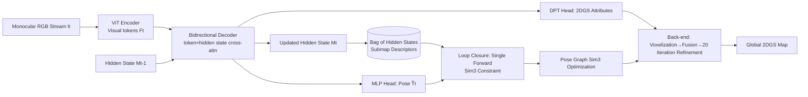

# Flash-Mono: Feed-Forward Accelerated Gaussian Splatting Monocular SLAM

**Conference**: ICLR 2026  
**OpenReview**: [https://openreview.net/forum?id=nv3q3crc5D](https://openreview.net/forum?id=nv3q3crc5D)  
**Code**: [https://victkk.github.io/flash-mono](https://victkk.github.io/flash-mono)  
**Area**: 3D Vision / Gaussian Splatting SLAM  
**Keywords**: Monocular SLAM, 2D Gaussian Splatting, Feed-Forward Reconstruction, Recurrent Transformer, Loop Closure Detection, Sim(3) Optimization  

## TL;DR
Utilizing a recurrent feed-forward model, the system directly predicts camera poses and pixel-aligned 2D Gaussian primitives for each frame. By shifting the monocular GS-SLAM paradigm from "training Gaussians from scratch" to "prediction + lightweight refinement," it achieves approximately a 10$\times$ speedup while maintaining SOTA rendering and tracking quality.

## Background & Motivation
**Background**: 3D Gaussian Splatting has become a popular map representation for monocular SLAM due to its differentiable rendering and high-fidelity novel view synthesis. Early works like MonoGS initialize Gaussians randomly and maintain maps through hundreds of iterations per frame; subsequent works (WildGS-SLAM, DepthGS) introduce depth or optical flow priors to initialize Gaussian geometric attributes.

**Limitations of Prior Work**: These methods encounter three unavoidable bottlenecks. First, the **Train-from-Scratch paradigm** requires dozens to hundreds of iterations per keyframe; with a single iteration taking $\sim$20ms, one frame takes $\sim$1 second, leading to a typical FPS of 1, which is insufficient for real-time applications. Second, single-frame geometric priors (monocular depth) possess inherent scale inconsistency, causing severe multi-view inconsistency and cumulative scale drift. Third, original 3DGS voxelized primitives lack surface constraints, resulting in significant geometric noise and floaters.

**Key Challenge**: Feed-forward methods like VGGT achieve excellent multi-view consistency via cross-frame cross-attention, but they require **offline processing of all frames simultaneously**, which is fundamentally incompatible with the streaming input and low-latency pose estimation required for SLAM. Integrating the multi-view consistency advantages of feed-forward models into online incremental scenarios is the core difficulty.

**Goal**: Construct a truly real-time (10 FPS+), globally consistent monocular GS-SLAM system.

**Core Idea**: **Convert "training Gaussians" into "predicting Gaussians" using a recurrent feed-forward model**. For each incoming frame, the model incrementally predicts the pose and pixel-aligned 2DGS based on a hidden state, with the back-end performing only lightweight refinement. Simultaneously, hidden states are reused as submap descriptors to achieve efficient loop closure and Sim(3) global optimization. Map primitives are replaced with 2D Gaussian surfels to enhance geometric fidelity.

## Method

### Overall Architecture
Flash-Mono consists of three interconnected modules: a **recurrent feed-forward front-end** that predicts poses and 2DGS attributes frame-by-frame while updating hidden states; a **hidden-state-based loop closure module** that generates Sim(3) constraints in a single forward pass upon revisiting areas for global pose graph optimization; and a **2DGS mapping back-end** that voxelizes, fuses, and refines predicted primitives into a global map within a separate thread. To combat catastrophic forgetting in recurrent models, the input stream is partitioned into submaps where hidden states are reset, and historical hidden states are cached in a "Bag of Hidden States" for loop closure retrieval.

### Key Designs

**1. Recurrent Feed-forward Front-end: Decomposing frames into "Pose + Pixel-level 2DGS + Hidden State"**. The model $f$ receives the current frame $I_t$ and the previous hidden state $M_{t-1}$, jointly outputting $\hat{T}_t, \hat{G}_t, M_t = f(I_t, M_{t-1})$, where $\hat{T}_t \in SE(3)$ is the pose relative to the first frame, $\hat{G}_t$ represents $H \times W$ pixel-aligned 2DGS surfels (defined in the current camera frame), and $M_t$ passes aggregated information to the next timestep. The architecture leverages a stateful Transformer inspired by CUT3R and Point3R: images are first encoded into visual tokens $F_t$ via ViT, and two interconnected decoders exchange information between $F_t$ and the persistent hidden state $M_{t-1}$ through cross-attention. A learnable pose token $z_t$ aggregates geometric cues alongside $F_t$ for pose estimation. Finally, two DPT heads decode 2DGS means and confidence $\{\hat{\mu}_t, \hat{C}_t\}$ and other attributes $\{\hat{\sigma}_t, \hat{r}_t, \hat{s}_t, \hat{c}_t\}$, while an MLP head regresses the pose from $z'_t$. Training utilizes datasets with GT depth/pose like DL3DV and ScanNet++, with a total loss $L_{total} = \lambda_{pose}L_{pose} + \lambda_{geo}L_{geo} + L_{render}$. The geometric loss is confidence-weighted: $L_{geo} = \sum_t \sum_n (\hat{c}_{t,n}\cdot\|\hat{\mu}_{t,n}-\mu_{t,n}\|^2 - \alpha\log(\hat{c}_{t,n}))$, allowing the model to learn which pixel geometries are reliable.

**2. Submap Partitioning to Combat Recurrent Forgetting**. Although the model can theoretically process arbitrary sequence lengths, cumulative drift increases with sequence length $L$—a direct consequence of catastrophic forgetting in recurrent models. The input stream is thus divided into shorter sub-sequences (submaps), where the hidden state is reset, and poses within each segment are expressed in the coordinate system of the segment's first frame. A one-frame overlap is maintained between adjacent submaps to calculate relative transforms and chain local poses into a continuous trajectory; this overlap also provides an explicit inter-segment alignment constraint for the pose graph. Ablation studies show that ATE is minimized at a clip length of 8 frames; too short lacks temporal context, while too long (>16) accumulates intra-segment drift.

**3. Hidden States as Long-term Memory for Single Forward Loop Closure**. This is the system's most ingenious design: the recurrent hidden state itself serves as a compact geometric/visual summary of a local scene. The final hidden state $M_a$ of each submap is cached in the Bag of Hidden States. When appearance retrieval triggers a loop candidate (current frame $I_j$ vs. historical frame $I_i$), the hidden state $M_a$ of the historical submap $C_a$ is retrieved, and a single forward pass $f(I_j, M_a)$ is performed. This effectively "forces the model to interpret the current frame using the previous submap's coordinate system," directly yielding the relocalization pose $T^a_j$ and point cloud $P^a_j$. By comparing this with the point cloud $P^b_j$ obtained through current incremental tracking (both originating from the same image and differing only by a scale factor), the scale is solved via least squares: $s^* = \arg\min_s \sum_k \|\mu^b_k - s\cdot\mu^a_k\|^2$. These are combined into a full Sim(3) loop constraint $H_{j\to i}$. The pose graph, containing intra-segment, inter-segment alignment, and loop closure edges, minimizes residuals on the Sim(3) Lie algebra using log mapping: $T^{W*} = \arg\min \sum \|\log(H^{-1}_{j\to i}\cdot((T^W_i)^{-1}T^W_j))\|^2_\Omega$, solved via GTSAM.

**4. Predict-and-Refine Back-end: Voxelization + 20 Iteration Refinement**. The back-end takes the globally optimized poses and front-end predicted 2DGS to build the map in four steps. Since pixel-wise 2DGS is often too dense, adaptive voxelization merges $2\times2$ primitive blocks by averaging attributes (rotations are aligned via quaternion consistency and normalized), while blocks with depth variance exceeding threshold $\tau_d$ retain detail. During fusion, the current map is rendered to prune primitives with high reconstruction error, and new primitives are transformed to the world frame and added only in under-reconstructed areas (accumulation map below $\tau_{accum}$) to avoid redundant densification. **Key acceleration point**: Because the front-end prediction provides a strong prior, only 20 iterations of refinement are needed for local regions of the $K$ most recent keyframes (compared to 250 in MonoGS/S3PO-GS, a 10$\times$ reduction). Post-loop map correction does not involve re-rendering; instead, 2DGS are rigidly bound to their source keyframes, and poses are updated by calculating the delta $\Delta T = T_{new}T_{old}^{-1}$ to warp all associated primitives.

## Key Experimental Results

### Main Results
Tracking accuracy (ATE RMSE, cm, lower is better) on ScanNetV1 + BundleFusion:

| Method | Scan0054 | Scan0059 | Scan0106 | Bundle apt0 | Bundle copyroom |
|------|---------|---------|---------|---------|---------|
| ORB-SLAM3 | 243.26 | 90.67 | 178.13 | 87.37 | 27.60 |
| DROID-SLAM | 161.22 | 69.92 | 89.11 | 89.38 | 19.71 |
| MonoGS | 70.19 | 97.24 | 150.89 | 122.59 | 53.41 |
| S3PO-GS | 69.36 | 16.52 | 26.15 | 92.49 | 21.88 |
| MASt3R-SLAM | 13.25 | 10.89 | 15.83 | 9.65 | 9.28 |
| **Ours** | **11.69** | **8.89** | **10.83** | 11.44 | **7.34** |

Rendering quality: Flash-Mono achieves PSNR 21.73 / LPIPS 0.39 on ScanNet0054 (MonoGS 19.24/0.61, S3PO-GS 20.79/0.62), with an FPS of $\sim$12.7 (competitors $\sim$1). Depth L1 (m, lower is better): Ours 0.34/0.21 vs. MonoGS 1.19/1.20 and S3PO-GS 0.52/0.85.

KITTI Outdoor (ATE RMSE, m): Ours scores 12.85/16.58/9.93/12.08/45.25/16.75 on sequences 00/05/06/07/08/28. S3PO-GS scores 32.49/34.76/16.43/fail/64.74/23.64, with S3PO-GS failing on seq07.

### Ablation Study

| Ablation Item | Setting | Result |
|--------|------|------|
| Back-end Refinement | 0 vs. 10 iters | PSNR 20.14 → 22.41 |
| Submap clip length | 8 frames (Optimal) | ATE 0.106; worse if shorter/longer |
| Loop Closure Method | Hidden State vs. PnP+RANSAC | Hidden state significantly superior |
| Adaptive Voxelization | 1.35M → 0.56M primitives | 58% reduction, PSNR stays 19.70→19.44 |

### Key Findings
Feed-forward prediction alone provides a strong initial PSNR of 20.14, which increases to 22.41 with only 10 iterations, validating the "Predict-and-Refine" strategy. Hidden state loop closure significantly outperforms traditional PnP+RANSAC, proving it generates more accurate Sim(3) constraints. The existence of an optimal submap length confirms that recurrent forgetting is a realistic constraint.

## Highlights & Insights
- **Paradigm Shift is Most Valuable**: Moving from Train-from-Scratch to Predict-and-Refine enables a 10$\times$ speedup by eliminating the per-frame optimization cost, addressing the fundamental $\sim$1 FPS bottleneck in GS-SLAM.
- **Multi-purpose Hidden States**: They serve as context carriers for feed-forward prediction, submap descriptors, and "coordinate system memory" for relocalization. This allows cross-submap constraints to be solved in one forward pass, avoiding the overhead of traditional matching and reprojection.
- **Clever Scale Ambiguity Solution**: The observation that point clouds derived from the same frame under historical and current hidden states differ only by a scale factor allows for a clean least-squares solution for Sim(3) restoration.

## Limitations & Future Work
- Submap partitioning is an engineering compensation for recurrent forgetting; clip length requires tuning (8 frames being optimal), and long-sequence robustness is still limited by RNN memory capacity.
- ATE on KITTI seq08 remains high (45.25m), indicating limited generalization in large-scale dynamic scenes; dynamic objects are not explicitly modeled.
- Dependency on large-scale datasets with GT depth/pose for training the feed-forward model poses risks for out-of-distribution scenarios (though the paper uses BundleFusion for out-of-domain testing).
- Adaptive voxelization saves memory at a slight PSNR cost; how map size and global optimization costs scale in ultra-large scenes remains insufficiently discussed.

## Related Work & Insights
- **Feed-forward 3D Foundation Models**: From DUSt3R/MASt3R (point maps from image pairs) $\to$ Fast3R (parallel multi-view) $\to$ CUT3R/Point3R (recurrent, variable length, streaming) $\to$ VGGT (large-scale multi-task). This work is a natural extension by integrating CUT3R-style stateful Transformers into SLAM; VGGT-SLAM is a parallel approach optimizing poses on SL(4) manifolds.
- **Monocular GS-SLAM**: MonoGS/PhotoSLAM (random initialization + ORB-SLAM3), SEGS-SLAM, DroidSplat, WildGS-SLAM/DepthGS/Dy3DGS (depth priors + uncertainty), S3PO-GS (scale-consistent point maps for outdoors). This work replaces their from-scratch training with feed-forward prediction.
- **Geometric Representation**: The planar surfel surface prior of 2DGS (Huang et al. 2024) is the source of this work's geometric fidelity.
- **Insight**: Hidden states of recurrent models can be reused as "addressable scene memory," a concept valuable for other online perception tasks requiring long-term consistency (mapping, relocalization, continual learning).

## Rating
- Novelty: ⭐⭐⭐⭐ First systematic integration of feed-forward recurrent reconstruction into online monocular GS-SLAM; the hidden-state loop closure design is ingenious.
- Experimental Thoroughness: ⭐⭐⭐⭐ Covers indoor in/out-of-domain + outdoor KITTI datasets with comprehensive comparisons on tracking, rendering, geometry, and efficiency.
- Writing Quality: ⭐⭐⭐⭐ Clear mapping between challenges and modules; pipeline and formulas are well-presented.
- Value: ⭐⭐⭐⭐ The 10$\times$ speedup directly addresses the real-time bottleneck of GS-SLAM, holding practical significance for embodied perception and real-time reconstruction.

<!-- RELATED:START -->

## Related Papers

- [\[ICLR 2026\] ReSplat: Degradation-agnostic Feed-forward Gaussian Splatting via Self-guided Residual Diffusion](resplat_degradation-agnostic_feed-forward_gaussian_splatting_via_self-guided_res.md)
- [\[ICLR 2026\] ARTDECO: High-Fidelity Online 3D Reconstruction with Hierarchical Gaussian Structure + Feed-forward Priors](artdeco_toward_high-fidelity_on-the-fly_reconstruction_with_hierarchical_gaussia.md)
- [\[CVPR 2026\] Z-Order Transformer for Feed-Forward Gaussian Splatting](../../CVPR2026/3d_vision/z-order_transformer_for_feed-forward_gaussian_splatting.md)
- [\[CVPR 2026\] AnchorSplat: Feed-Forward 3D Gaussian Splatting with 3D Geometric Priors](../../CVPR2026/3d_vision/anchorsplat_feed-forward_3d_gaussian_splatting_with_3d_geometric_priors.md)
- [\[CVPR 2026\] Off The Grid: Detection of Primitives for Feed-Forward 3D Gaussian Splatting](../../CVPR2026/3d_vision/off_the_grid_detection_of_primitives_for_feed-forward_3d_gaussian_splatting.md)

<!-- RELATED:END -->
