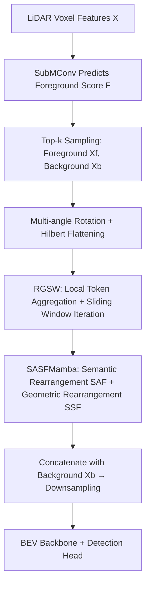

# Fore-Mamba3D: Mamba-based Foreground-Enhanced Encoding for 3D Object Detection

**Conference**: ICLR 2026  
**OpenReview**: [https://openreview.net/forum?id=e4t1775UJ1](https://openreview.net/forum?id=e4t1775UJ1)  
**Code**: [https://github.com/pami-zwning/ForeMamba3D](https://github.com/pami-zwning/ForeMamba3D)  
**Area**: 3D Object Detection / LiDAR Point Clouds / Mamba State Space Models  
**Keywords**: Mamba, Foreground Encoding, State Space Models, LiDAR 3D Detection, Linear Modeling, Hilbert Curve  

## TL;DR
The Mamba encoder is shifted from "scanning all scene voxels" to "encoding only foreground voxels." Through two mechanisms—sliding window propagation and semantic/geometric fusion—long-range dependencies and context lost due to foreground sparsity are recovered, achieving SOTA performance on nuScenes/KITTI/Waymo with lower FLOPs.

## Background & Motivation
**Background**: Dominant backbones for LiDAR 3D detection are Sparse Convolution (SpCNN) and Transformers. However, the former is hardware-unfriendly, and the latter has quadratic complexity, making real-time deployment difficult. Mamba, a linear modeling method, achieves global interaction with linear complexity. In 3D detection, it has split into two paradigms: group-based (partitioning voxels by X/Y axes, good for local context) and group-free (flattening all non-empty voxels into a sequence via Hilbert/Z-order curves, good for global context).

**Limitations of Prior Work**: Regardless of grouping, existing Mamba methods perform bidirectional encoding on the **entire sequence of non-empty voxels**. However, truly informative foreground voxels comprise only a small fraction—background voxels account for approximately 80% on nuScenes/KITTI. Encoding the entire scene is computationally expensive and memory-intensive, as mass background information is redundant.

**Key Challenge**: Intuitively, "encoding only foreground" saves computation, but the paper finds that **directly applying vanilla Mamba to pure foreground sequences leads to performance drops**. There are two reasons: (1) **Response Decay**—foreground voxels are sparsely scattered across different instances, and linear autoregressive models decay with sequence distance, making it hard to establish dependencies between distant instances; (2) **Limited Context**—perfect foreground sampling is impossible, and lost structural information leaves pure foreground sequences with insufficient contextual representation.

**Goal**: To retain the computational advantages of "encoding only foreground" while mitigating the side effects of response decay and limited context.

**Core Idea**: (1) **Foreground Sampling + Multiple Rotated Hilbert Flattening** to ensure spatial adjacency in the foreground sequence; (2) **Region-to-Global Sliding Window (RGSW)** to propagate local information across the sequence through local token aggregation and sliding window iterations, alleviating response decay; (3) **SASFMamba** to inject semantic and geometric reordering into state variables, transforming causal, distance-decayed linear encoding into non-causal, semantic/geometric-aware encoding.

## Method

### Overall Architecture
The 3D backbone of Fore-Mamba3D consists of 4 concatenated stages, each containing an **instance selection block** and a downsampling block. The instance selection block is the core, sequentially performing: foreground voxel sampling and flattening $\rightarrow$ RGSW sliding window encoding $\rightarrow$ SASFMamba semantic/geometric fusion. The backbone output is fed into a BEV backbone and detection head. Foreground scores and semantic categories are supervised by specialized focal losses during training.

### Key Designs

**1. Foreground Sampling + Rotated Hilbert Flattening: Maintaining Adjacency for Sparse Foreground.** Given voxel features $X \in \mathbb{R}^{L\times H\times W\times D}$, a submanifold convolution first predicts a foreground score $F$ for each non-empty voxel. After adding positional encoding and applying sparse convolution, the top-$k$ voxels (ratio $\alpha$, default 0.2) are selected as foreground features $X_f \in \mathbb{R}^{N\times D}$ based on $F$ in descending order; the rest are denoted as background $X_b$. After sampling, the foreground is flattened into a 1D sequence using a Hilbert curve. However, Hilbert curves suffer from "region truncation"—two voxels (e.g., $v_1, v_2$) adjacent in 3D coordinates might be far apart in the sequence, which bidirectional encoding cannot fix. The solution is to rotate the entire scene by multiple angles $\theta$ around the Z-axis before flattening: coordinate transformation $R(\theta, p) = (\lfloor x\cos\theta + y\sin\theta\rfloor, \lfloor y\cos\theta - x\sin\theta\rfloor, z)^T$, resulting in flattened features $X_{f,\theta} = H(X_f, \{R(\theta,p)\})$. The results from different rotation angles (default 2, $\theta=0, \pi/2$) are summed, passed through an MLP, and concatenated with the background: $X' = \text{Cat}[\text{MLP}(\sum_{i=1}^{r}\text{Enc}(X_{f,\theta_i})), X_b]$. Multi-view rotation mitigates truncation and improves robustness to viewpoint changes.

**2. Region-to-Global Sliding Window (RGSW): Using Local Tokens + Sliding Windows to Combat Response Decay.** Sparse distribution of foreground across instances causes Mamba's long-range dependencies to decay. RGSW first splits the sequence of length $N$ into $M$ patches processed in parallel. A **local token** $T_i \in \mathbb{R}^D$ is inserted at the end of each patch, expanding the sequence to $\mathbb{R}^{M\times(N/M+1)\times D}$ before entering SASFMamba. Due to Mamba's autoregressive nature, the encoded local token $T_i'$ naturally aggregates regional information of the patch. This information is then weighted and propagated back to each voxel within the patch using cosine similarity: $x'_{i,j} = x'_{i,j} + \text{Sim}(x'_{i,j}, T_i')\times T_i'$. To enable inter-patch interaction, a sliding window mechanism is used: the latter half of $x'_i$ and the first half of $x'_{i+1}$ are concatenated into a new patch $x_i^s = \text{Cat}(x'_i[\tfrac{N}{2M}:], x'_{i+1}[:\tfrac{N}{2M}])$, and fed back into SASFMamba. This is repeated $t$ times (default 2), allowing information to propagate across patches. Ablations show sliding windows are more effective for large objects (Vehicles +1.2%), while local tokens benefit small, sparse objects (Pedestrians +0.93%, Cyclists +0.35%).

**3. SASFMamba - Semantic-Assisted Fusion (SAF): Reordering States by Semantics to Break Locality Bias.** In standard SSM, the state $h_i = \sum_{j\le i}\bar{A}^\times_{j:i}\bar{B}_j x_j$ accumulates along the sequence; the further the distance, the smaller the product of transition matrices and the weaker the dependency. SAF uses a lightweight MLP to predict the semantic category $S$ for each voxel, then **groups and rearranges** the state variables $h$ by predicted category (retaining original relative order within groups). This places voxels with similar semantics but distant original positions adjacently in the sequence. A 1D convolution with a large effective receptive field aggregates semantic context on the rearranged sequence, which is then reversed to the original order to get $h'$. Theoretical derivation shows that after reordering, $h'_i = \sum_{k\in K}\alpha_k h_{N_k(i)}$. Expanding this, the correlation score between current state and distant input $x_j$ is $M_{i,j} = \sum_{k\in K'_{i,j}}\alpha_k \bar{A}^\times_{j:N_k(i)}\bar{B}_j$. As long as a semantic neighbor exists at original index $N_k(i) > j$, the term is non-zero, proving SAF allows the current state to effectively capture semantically similar long-range inputs, overcoming the locality bias of linear encoders.

**4. SASFMamba - State Space Fusion (SSF): Mapping 1D States back to 3D for Geometric Convolutions.** 3D-to-1D flattening inevitably causes geometric distortion. SSF maps the SAF output states $h'$ back to 3D space according to original coordinates to form a sparse tensor (L2S). Large-kernel dimension-wise convolutions are applied along different axes for spatial recognition, then flattened back into a sequence (S2L): $h'' = \text{S2L}(\text{DwConv}(\text{L2S}(h')))$. Finally, the output $x'$ is obtained by multiplying with the dynamic output matrix $\bar{C}$ according to the SSM observation equation. SSF, like SAF, ensures non-causal, geometrically-aware encoding. Training uses two focal losses $L_f, L_s$ ($\gamma=2$) to supervise foreground scores and semantic categories. The foreground is defined by expanding original boxes by 0.5 m in X/Y and 0.25 m in Z to retain boundary information. Total loss: $L = w(L_f+L_s) + L_{cls} + L_{reg}$ ($w=2$).

## Key Experimental Results

### Main Results

**nuScenes** (No CBGS, LiDAR-only):

| Method | Published | mAP | NDS |
|------|------|-----|-----|
| Voxel-Mamba | NIPS'24 | 67.5 | 71.9 |
| LION | NIPS'24 | 68.0 | 72.1 |
| FSHNet | CVPR'25 | 68.1 | 71.7 |
| **Fore-Mamba3D (val)** | – | **68.4** | **72.3** |
| LION (test) | NIPS'24 | 69.8 | 73.9 |
| **Fore-Mamba3D (test)** | – | **70.1** | **74.0** |

**KITTI** (val, R11, compared by backbone type, Moderate difficulty):

| Method | Backbone | Car | Ped. | Cyc. |
|------|------|-----|------|------|
| DSVT | Transformer | 77.8 | 59.7 | 66.7 |
| LION | Mamba | 78.3 | 60.2 | 68.6 |
| VoxelMamba | Mamba | 80.8 | 59.7 | 69.1 |
| **Fore-Mamba3D** | Mamba | **82.2** | **62.2** | **69.5** |

Waymo (20% training, full val): L2 mAP 71.9%, which is **7.4%** higher than the CenterPoint baseline, surpassing previous methods across L1 metrics.

### Ablation Study

Stepwise component addition (KITTI val, Moderate):

| HF | RGSW | SAF | SSF | Car | Ped. | Cyc. |
|----|------|-----|-----|-----|------|------|
| ✓ | | | | 79.4 | 59.2 | 66.0 |
| ✓ | ✓ | | | 80.6 | 60.5 | 66.8 |
| ✓ | ✓ | ✓ | | 81.8 | 61.9 | 67.3 |
| ✓ | ✓ | | ✓ | 81.0 | 61.3 | 68.2 |
| ✓ | ✓ | ✓ | ✓ | **82.6** | **62.2** | **69.5** |

Sampling ratio $\alpha$ and efficiency (vs LION):

| $\alpha$ | nuScenes mAP/NDS | FLOPs(G)↓ | FPS |
|------|------|------|-----|
| 0.1 | 67.4 / 71.0 | 22.62 | 70 |
| **0.2** | **68.4 / 72.3** | 26.04 | 67 |
| 0.5 | 68.0 / 71.8 | 38.62 | 58 |
| 1.0 | 67.8 / 71.6 | 52.17 | 50 |
| LION | 68.0 / 72.1 | 46.24 | 52 |

### Key Findings
- **Foreground ratio 0.2 is optimal**: It closely approximates the actual foreground distribution. Too low a ratio loses structure; too high introduces redundancy. Compared to LION, it reduces **FLOPs by 43.7% and increases FPS by 23.9%** while improving accuracy.
- **RGSW branches are complementary**: Sliding windows benefit large objects, while local tokens benefit small objects. Gains saturate after $t=2$ sliding window iterations.
- **SAF/SSF are both essential**: Adding either alone yields ~1% gain, but only together do they reach peak performance, indicating that semantic alignment and geometric restoration are orthogonal compensations.

## Highlights & Insights
- **Targets the true redundancy in Mamba 3D detection**: Explicitly removing the hidden waste in "full-scene non-empty voxel encoding" (where 80% is background) is a unified rethink of group-based and group-free paradigms.
- **Precise Diagnosis**: Instead of just observing that "foreground-only encoding drops performance," the authors attribute it to two specific mechanisms: response decay and context limitation, and provide targeted solutions (RGSW for decay, SASFMamba for context).
- **Substantive Theoretical Support**: The derivation of non-zero correlation scores in SAF transforms the argument of "why semantic rearrangement establishes long-range dependency" into a verifiable proposition rather than pure empirical observation.
- **Efficiency-Accuracy Win-win**: Achieving SOTA across three major benchmarks while significantly reducing FLOPs has practical significance for real-time deployment.

## Limitations & Future Work
- **Dependency on Foreground Scoring Quality**: Sampling accuracy directly determines downstream performance. If scoring fails on distant or small objects, the lost foreground cannot be recovered. Box expansion helps but does not fundamentally solve this.
- **Overhead of Multi-rotations and Iterations**: While overall more efficient than full-scene encoding, rotation count $r$, iteration count $t$, and sampling ratio $\alpha$ are hyperparameters that may require per-dataset tuning.
- **LiDAR-only Single Modality**: Whether foreground sampling remains effective under multi-modality (Image + LiDAR) and the consistency of foreground across sensors are open questions.
- **Waymo Subset**: Results on the full Waymo data scale are yet to be supplemented beyond the 20% training subset.

## Related Work & Insights
- **Mamba for 3D**: PointMamba (FPS grouping), LION (large group interaction), Voxel-Mamba (group-free dual-scale SSM), MambaDETR (query serialization)—this work is the first to implement "foreground-only encoding" within a Mamba backbone.
- **Foreground Sampling**: IA-SSD (instance-aware downsampling), RBGNet (foreground-biased sampling + ray grouping), DSASA (FPS-based density balancing)—most of these select foreground at the point level; this work migrates the concept to the voxel + linear encoding scenario with representation maintenance.
- **Insight**: Sparse selective encoding + sequence rearrangement is a general paradigm to transform linear models from "causal by position" to "aware by semantic/geometry," potentially transferable to tasks like point cloud segmentation or occupancy prediction.

## Rating
- **Novelty**: ⭐⭐⭐⭐ First combining foreground-only encoding with Mamba backbones and systematically solving the resulting response decay/context limitation.
- **Experimental Thoroughness**: ⭐⭐⭐⭐ Covers nuScenes/KITTI/Waymo benchmarks with full component/ratio/iteration ablations and complete efficiency metrics.
- **Writing Quality**: ⭐⭐⭐⭐ Logic flow from motivation to diagnosis to solution is clear, supported by SAF theoretical derivations and comprehensive diagrams.
- **Value**: ⭐⭐⭐⭐ Efficiency-accuracy gains are directly valuable for real-world LiDAR detection deployment; the sparse foreground encoding paradigm is extensible.

<!-- RELATED:START -->

## Related Papers

- [\[CVPR 2026\] RI-Mamba: Rotation-Invariant Mamba for Robust Text-to-Shape Retrieval](../../CVPR2026/3d_vision/ri-mamba_rotation-invariant_mamba_for_robust_text-to-shape_retrieval.md)
- [\[ICLR 2026\] Positional Encoding Field](positional_encoding_field.md)
- [\[CVPR 2026\] Towards Intrinsic-Aware Monocular 3D Object Detection](../../CVPR2026/3d_vision/towards_intrinsic-aware_monocular_3d_object_detection.md)
- [\[ICLR 2026\] UniUGG: Unified 3D Understanding and Generation via Geometric-Semantic Encoding](uniugg_unified_3d_understanding_and_generation_via_geometric-semantic_encoding.md)
- [\[CVPR 2026\] SPE-MVS: Spatial Position Encoding Enhanced Multi-View Stereo with Monocular Depth Priors](../../CVPR2026/3d_vision/spe-mvs_spatial_position_encoding_enhanced_multi-view_stereo_with_monocular_dept.md)

<!-- RELATED:END -->
