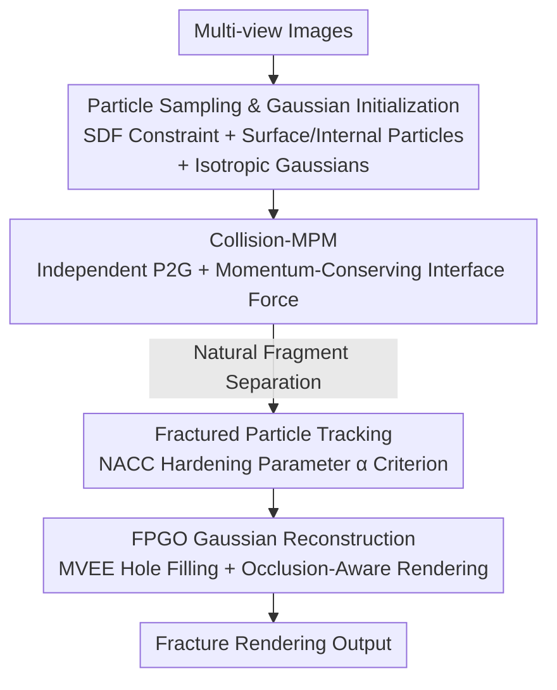

# Fracture-GS: Dynamic Fracture Simulation with Physics-Integrated Gaussian Splatting

**Conference**: ICLR 2026  
**OpenReview**: [https://openreview.net/forum?id=zcAwK50ft0](https://openreview.net/forum?id=zcAwK50ft0)  
**Code**: To be confirmed  
**Area**: 3D Vision / Gaussian Splatting / Physics Simulation  
**Keywords**: Gaussian Splatting, Material Point Method, Dynamic Fracture, Collision Simulation, Physical Rendering

## TL;DR
Fracture-GS unifies an "enhanced Collision-MPM" and a "fracture-aware 3D Gaussian continuum representation" into a pipeline from multi-view images to rendering. It specifically handles brittle fractures under extreme mechanical collisions. By using momentum-conserving interface forces to eliminate non-physical adhesion and MVEE Gaussian reconstruction to fill rendering holes at fracture interfaces, it significantly exceeds PhysGaussian and GIC in PSNR/LPIPS/FID and human-evaluated fracture fidelity.

## Background & Motivation
**Background**: Integrating physics simulation with differentiable rendering has been a hot topic in recent years. 3D Gaussian Splatting (3DGS) uses a collection of anisotropic Gaussian kernels to explicitly represent scenes with fast, differentiable rendering. The Material Point Method (MPM) is the primary numerical method in graphics for simulating continuum deformation and fracture. PhysGaussian (Xie et al., 2024) first treated 3D Gaussians as MPM material points for direct simulation and rendering; GIC (Cai et al., 2024) leveraged 3DGS differentiability to infer physical parameters like Young's modulus; GASP embedded per-point physical attributes into Gaussians. These works enable rendering without re-entering Houdini after simulation.

**Limitations of Prior Work**: However, these methods only excel at **gentle elastic deformation**. They fail during extreme mechanical collisions (high-energy brittle fragmentation, multi-body impacts), manifesting in two major flaws. First, MPM simulations exhibit **non-physical adhesion** at collision interfaces: fragments that should fly apart "stick" to surfaces. Second, fracture interfaces **cannot be rendered**: fragmentation pulls Gaussian particles apart, causing the overlap between neighbors to vanish and resulting in cracks, holes, and artifacts in the rendered field.

**Key Challenge**: The root cause is that existing methods treat "collision" as ordinary internal stress within a continuum (MLS-MPM updates particles from both objects within a single grid velocity set), lacking explicit constraints on momentum exchange at the interface, leading to adhesion. Meanwhile, the rendering side assumes Gaussians maintain their initial overlap, a hypothesis that collapses once fracture occurs. Both physical correctness on the simulation side and visual continuity on the rendering side are broken simultaneously in fracture scenarios.

**Goal**: Split into two specific sub-problems: (1) enable fractured fragments in multi-body collisions to **separate physically correctly** without sticking; (2) **reconstruct continuous and credible rendering** on fracture surfaces without any post-processing.

**Key Insight**: The authors noted that "collision forces" in fluid-solid coupling (Yan et al., 2018) are specifically designed to prevent interpenetration and adhesion. Simultaneously, the hardening parameter $\alpha$ in the NACC constitutive model naturally marks "which particles have plastically yielded and entered a fractured state." Integrating these existing mechanisms into the MPM+3DGS pipeline addresses both flaws.

**Core Idea**: Replace the mixed-grid update of MLS-MPM with "momentum-conserving interface collision forces" to eliminate adhesion, and use "fractured particle tracking via hardening parameters + MVEE cloned Gaussians" to repair fracture surface rendering.

## Method

### Overall Architecture
Fracture-GS is a serial pipeline from **multi-view images** to **fracture rendering**, divided into three stages: reconstructing collision objects into geometry+Gaussian representations with internal/external particles, running extreme collision simulations using enhanced Collision-MPM, and finally reconstructing Gaussian attributes for simulated fracture particles for rendering.

In the first stage, an implicit 3D reconstruction algorithm builds the SDF of the object from multi-view images, **sampling both surface and internal particles** within the SDF-constrained volume to ensure spatial coherence. 3DGS is used to learn **isotropic** Gaussian attributes for surface particles. Each object carries attributes $\{m, V, F, C, v, x, \theta\}$ (mass, volume, deformation gradient, velocity gradient, velocity, position, elastoplastic parameters), where $\theta$ includes Young’s modulus $E$, Poisson’s ratio $\gamma$, hardening parameter $\alpha$, cohesive coefficient $\beta$, and hardening factor $\xi$. In the second stage, Collision-MPM transfers particles of two objects **independently** to the grid, injects interface collision forces after grid updates, and writes back to particles, allowing natural separation. In the third stage, FPGO (Fracture Particle Gaussian Optimization) identifies fractured particles frame-by-frame via NACC hardening parameters. For each fractured particle, MVEE generates new Gaussians in the overlap zone between it and its neighbors, coupled with occlusion-aware sampling for rendering.

### Key Designs

**1. Particle Sampling and Gaussian Initialization: Simulating the Volume, Rendering the Skin**

To simultaneously run physics simulation and Gaussian rendering, one must solve "which particles for geometry and which Gaussians for rendering." If only surface particles are sampled, the object interior is empty, causing collapse during collision due to lack of volumetric support. If anisotropic Gaussians are learned for every particle, unnatural streaking occurs during fracture. The authors reconstruct an SDF from multi-view images and **sample both surface and internal particles** within the $\text{SDF}\le 0$ domain. Internal particles handle the continuum simulation to support volume, while surface particles use 3DGS to learn appearances. Crucially, surface Gaussians use **isotropic kernels** (instead of the 3DGS default anisotropic ones), ensuring Gaussians are not abnormally elongated during violent collisions, providing clean initial conditions for fracture rendering. This aligns the "simulatable volume" and "renderable skin" on the same particle set.

**2. Collision-MPM: Eliminating Non-physical Adhesion via Momentum-Conserving Interface Force**

MLS-MPM updates all particles on the **same** grid velocity, "welding" materials on both sides of an interface, causing fluids to stick to solids or fragments to neighbors. The authors adapt collision forces from fluid-solid coupling (Yan et al., 2018). Particles from objects $P_a, P_b$ perform P2G and grid updates **independently**. On grid node $G_i$, normalized mass distribution directions $\hat n_{ia}, \hat n_{ib}$ are calculated to define the interface normal tendency:

$$n_{ia} = -n_{ib} = \frac{\hat n_{ia} - \hat n_{ib}}{\lVert \hat n_{ia} - \hat n_{ib}\rVert}$$

The collision force activates only when objects **actually approach each other**, i.e., $(v_{ia}^{temp} - v_{ib}^{temp})\cdot n_{ia} > 0$. The node collision force is then calculated based on momentum conservation:

$$f_i^c = \frac{p_{ia}^{temp} m_{ia}^n - p_{ib}^{temp} m_{ib}^n}{(m_{ia}^n + m_{ib}^n)\Delta t}, \qquad f_{ia}^c = -f_{ib}^c = \mu (f_i^c \cdot n_{ib}) n_{ib}$$

Where $p^{temp}=m v^{temp}$ is the momentum after grid updates and $\mu$ controls collision intensity. Equal and opposite forces $f_{ia}^c=-f_{ib}^c$ ensure total momentum conservation. Finally, collision forces are added to grid velocities $v_{ia}^{n+1}=v_{ia}^{temp}+\frac{f_{ia}^c}{m_{ia}^n}\Delta t$. Since particles interact only through this **explicit and conserved** force, fragments bounce apart naturally.

**3. FPGO Fracture Particle Gaussian Optimization: Hardening Parameter Tracking + MVEE Hole Filling + Occlusion-Aware Rendering**

If the initial Gaussians are rendered directly after separation, artifacts appear because the overlap between separated neighbors $\{g_i, g_m\}$ vanishes, breaking the rendering field's continuity. FPGO fixes this in four steps. **Tracking**: It reuses the hardening parameter $\alpha$ from the NACC model; a particle is deemed fractured if its $\alpha$ exceeds a threshold. **Neighborhood Analysis**: For each fractured particle $g_i$, it finds intact neighbors $\{g_m, g_n\}$ within radius $d_c$. **MVEE Gaussian Reconstruction**: For the overlap $\Omega_{cross}$ between $g_i$ and a neighbor, it computes the **Minimum Volume Enclosing Ellipsoid (MVEE)** to generate two new Gaussians $g_{im}, g_{in}$ replacing $g_i$:

$$\{\mu_{new}, \Sigma_{new}\} = \text{MVEE}(\Omega_{cross}(g_i, g_j))$$

Optical attributes (opacity $\sigma$, color $c$) are inherited from $g_i$ for consistency, while spatial parameters are recalculated via MVEE. **Occlusion-Aware Sampling**: During rendering, if a ray passes through multiple optimized particles $(g_{im}, g_{in})$, only the **nearest** one contributes to shading to avoid double-counting. This creates "transition Gaussians" on fracture surfaces that restore visual continuity without breaking mechanical correctness.

### Loss & Training
Gaussian initialization follows standard 3DGS photometric optimization for surface Gaussians (isotropic kernels). The physics simulation is not trained; it uses the NACC constitutive model where four parameters $\alpha, \beta, \xi, M$ control plastic projection and volume maintenance. FPGO's Gaussian reconstruction is a per-frame geometric operation (MVEE calculation + attribute inheritance) without gradient training. Physical parameters ($E, \gamma$) are currently set manually.

## Key Experimental Results

### Main Results
Three objects were tested: Ficus (heterogeneous), Teapot (homogeneous), and Table (heterogeneous). Since dynamic fracture sequences lack ground truth, self-referencing metrics and a human-evaluated Fracture Simulation Fidelity (FSF, 1-5 scale) were used.

| Method | PSNR ↑ | LPIPS ↓ | FID ↓ | FSF ↑ |
|------|--------|---------|-------|-------|
| PhysGaussian | 17.2 | 0.43 | 120.92 | 1.5 |
| GIC | 16.8 | 0.45 | 129.33 | 1.2 |
| **Fracture-GS (Ours)** | **21.1** | **0.29** | **90.75** | **3.5** |

Fracture-GS leads in all four metrics: PSNR +3.9, LPIPS reduced from 0.43 to 0.29, and FSF increased from 1.5 to 3.5.

### Ablation Study

| Configuration | PSNR ↑ | LPIPS ↓ | FID ↓ | FSF ↑ | Description |
|------|--------|---------|-------|-------|------|
| Full (Ours) | 21.1 | 0.29 | 90.75 | 3.5 | Full model |
| w/o FPGO | 17.0 | 0.45 | 123.63 | 1.5 | No Gaussian optimization; fracture rendering fails |
| w/o C-MPM | 20.6 | 0.35 | 93.05 | 3.1 | Reverts to MLS-MPM; exhibits non-physical adhesion |

### Key Findings
- **FPGO is critical for rendering quality**: Without FPGO, PSNR drops from 21.1 to 17.0, and LPIPS worsens to 0.45. Gaussian holes at fracture interfaces are the primary bottleneck for GS-based fracture rendering.
- **Collision-MPM ensures physical realism**: Removing it results in a moderate metric drop but qualitative results show non-physical adhesion (e.g., wood chips sticking to a teapot).
- **Conservation laws as "unit tests"**: In zero-gravity/friction environments, total momentum remains constant. Energy analysis shows smooth transitions from kinetic to elastic to dissipation energy, verifying numerical stability.
- FID remains relatively high because Gaussian repair relies on training view interpolation and cannot reconstruct hidden, unobserved interior regions.

## Highlights & Insights
- **Repurposing "Interpenetration Prevention" for "Adhesion Prevention"**: The interface force originally used in fluid-solid coupling to prevent penetration was ingeniously used here to create clean separation boundaries—the same momentum-conserving force handles both penetration and adhesion.
- **Using Existing Constitutive Parameters as Fracture Detectors**: Instead of separate crack tracking, the method reuses the NACC hardening parameter $\alpha$ with zero additional cost.
- **MVEE Hole Filling is the "Aha!" Moment**: Fracture rendering fails because Gaussian overlap vanishes. Instead of learning new Gaussians, the authors geometrically fit transition Gaussians using MVEE onto residual overlap zones.
- **Choice of Isotropic Kernels**: Intentionally abandoning 3DGS's default anisotropy in high-displacement scenarios prevents streaking artifacts— a simple but crucial engineering decision.

## Limitations & Future Work
- **Compute and Real-time performance**: Complexity makes real-time performance difficult; GPU optimization and adaptive time-stepping are planned.
- **Manual Parameters**: Young's modulus and Poisson's ratio are manual; the authors plan to implement learning-based parameter inversion.
- **Hidden Region Reconstruction**: FPGO depends on training views. Unobserved interior surfaces cannot be recovered, leading to higher FID. Generative 3D inpainting is a suggested solution.
- **Indirect Evaluation**: Lack of ground truth limits evaluation; the authors aim to establish specialized fracture benchmarks.

## Related Work & Insights
- **vs PhysGaussian (Xie et al., 2024)**: PhysGaussian first linked 3DGS to MPM for simulation, but uses MLS-MPM and lacks fracture handling, leading to adhesion and rendering artifacts. Fracture-GS addresses these specific fracture scenarios (PSNR 21.1 vs 17.2).
- **vs GIC (Cai et al., 2024)**: GIC focuses on inferring material properties from video. Its forward simulation also stays within gentle deformations, with an FSF of only 1.2 compared to the proposed 3.5.
- **vs PFF-MPM / NACC (Wolper et al., 2019)**: This work adopts Wolper’s NACC constitutive model and hardening criteria. The novelty lies in the coupling with Gaussian rendering (FPGO) and multi-body collision interface forces (Collision-MPM).

## Rating
- Novelty: ⭐⭐⭐⭐ Combining collision forces, hardening parameter detection, and MVEE hole filling into a pipeline for extreme collision fracture effectively solves a previously unaddressed problem.
- Experimental Thoroughness: ⭐⭐⭐ Clear ablations and conservation validations, but testing on more objects and establishing ground truth benchmarks would improve conviction.
- Writing Quality: ⭐⭐⭐⭐ The Motivation-Pain Point-Solution chain is clear; equations and diagrams (mass distribution, FPGO) are well-coordinated.
- Value: ⭐⭐⭐⭐ Completes the "simulation as rendering" paradigm for fractures, holding practical value for VFX and virtual prototyping.

<!-- RELATED:START -->

## Related Papers

- [\[ICLR 2026\] MoE-GS: Mixture of Experts for Dynamic Gaussian Splatting](moe-gs_mixture_of_experts_for_dynamic_gaussian_splatting.md)
- [\[CVPR 2026\] Disco-GS: Gaussian Splatting in Dynamic Color Lighting](../../CVPR2026/3d_vision/disco-gs_gaussian_splatting_in_dynamic_color_lighting.md)
- [\[ICLR 2026\] ODE-GS: Latent ODEs for Dynamic Scene Extrapolation with 3D Gaussian Splatting](ode-gs_latent_odes_for_dynamic_scene_extrapolation_with_3d_gaussian_splatting.md)
- [\[ICLR 2026\] Frequency-Aware Dynamic Gaussian Splatting](frequency-aware_dynamic_gaussian_splatting.md)
- [\[ICLR 2026\] Mobile-GS: Real-time Gaussian Splatting for Mobile Devices](mobile-gs_real-time_gaussian_splatting_for_mobile_devices.md)

<!-- RELATED:END -->
