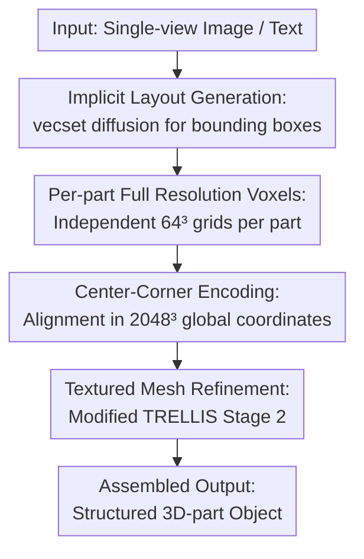

# FullPart: Generating Each 3D Part at Full Resolution

**Conference**: ICLR 2026  
**OpenReview**: [https://openreview.net/forum?id=QlRlE7a1p4](https://openreview.net/forum?id=QlRlE7a1p4)  
**Paper**: [Project Page](https://fullpart3d.github.io)  
**Code**: https://github.com/ (see https://fullpart3d.github.io)  
**Area**: 3D Vision  
**Keywords**: Part-based 3D Generation, Voxel Representation, Layout Generation, Diffusion Models, 3D Datasets

## TL;DR
FullPart integrates two paradigms: generating bounding box layouts using implicit vecset diffusion, followed by generating details for each part within its own independent, full-resolution voxel grid. It employs center-corner encoding to resolve scale mismatches during assembly and introduces PartVerse-XL—the largest manually annotated 3D part dataset to date (40K objects / 320K parts)—achieving SOTA performance in part-based 3D generation.

## Background & Motivation

**Background**: Part-based 3D generation is critical for texture mapping, animation, physical simulation, and fine-grained editing. Current mainstream methods follow two paths: implicit representations (e.g., PartCrafter), where each part corresponds to a set of latent tokens jointly generated by a shared model, and explicit voxels (e.g., OmniPart), which define part layouts via bounding boxes before generating voxel structures within them.

**Limitations of Prior Work**: Implicit methods are limited by the query resolution when decoding part vecsets, leading to insufficient geometric detail and difficulties in precise spatial mapping for texture generation or editing. Explicit methods are proficient at layout modeling but struggle with fine details and global coherence during complex part connections.

**Key Challenge**: A fatal flaw shared by both paradigms is the forced use of a shared global representation space. In a shared $N\times N\times N$ global voxel grid, small but complex parts (e.g., a robot's head or thin chair legs) occupy very few voxels. This results in extremely low effective resolution and the collapse of fine details.

**Goal**: To enable every part—regardless of size—to be generated with fine details at high resolution while maintaining global coherence, encapsulated within a unified framework supporting image or text-conditioned input.

**Key Insight**: The authors make two observations: (i) while implicit representations struggle with fine part details, they are well-suited for generating layouts containing only bounding boxes without geometric details; (ii) explicit representations should allocate an independent, full-resolution space to each part to prevent small components from being vanishingly small in the voxel grid.

**Core Idea**: Use implicit vecset diffusion to first generate layouts (bounding boxes), then generate each part independently in its own dedicated full-resolution voxel grid—generating "each 3D part at full resolution." This approach leverages the strengths of both paradigms while mitigating their weaknesses.

## Method

### Overall Architecture
The objective of FullPart is to generate a structured 3D object $O=\{o_i\}_{i=1}^{K}$ composed of $K$ semantic parts from a single-view RGB image or text prompt. It employs a three-stage sequential pipeline: first, **implicit vecset diffusion generates the bounding box layout** (where the lack of geometric detail suits implicit diffusion); second, each box is cropped into an independent $N^3$ grid for **full-resolution coarse structure generation using explicit voxels**; finally, these are **refined into textured meshes** and assembled. The pivotal shift occurs in the second stage: every part is normalized to its own $[-1,1]^3$ canonical space, consuming the full grid resolution regardless of its physical size. To bridge the resulting scale discrepancy between tokens, **Center-Corner Encoding** is introduced to align all parts within a high-resolution global coordinate system.

### Key Designs

**1. Implicit Layout Generation: Treating bounding boxes as meshes to leverage geometric priors**

This step addresses how to stably generate a reasonable set of part bounding boxes. Instead of regressing boxes as abstract geometric parameters (center + size), each box $b_k$ is represented as a minimal triangular mesh—a cube with 8 vertices and 12 faces. The assembled boxes resemble a coarse "voxel-like" model. This ensures the box mesh aligns with the latent space of the vecset diffusion model, allowing the reuse of strong priors from base models (e.g., TripoSR's VAE). Each box is encoded into $M$ latent tokens $T_k=\mathrm{VAE_{enc}}(b_k)$, with part ID embeddings $\tilde t_k = t_k + e_{id}(k)$ added for differentiation. A global branch (ID=0) is retained to provide semantic guidance. The DiT uses hybrid attention: **Intra-Part Attention** handles local characteristics within a single box, while **Inter-Part Attention** captures global structural relationships across all boxes.

**2. Per-part Full-Resolution Voxel Grids: Maximizing resolution for small parts**

This is the core design addressing the resolution bottleneck of shared global grids. Instead of sharing one $N^3$ grid, FullPart normalizes each part to a canonical space $[-1,1]^3$ and generates an occupancy grid $V_k\in\{0,1\}^{N^3}$ (where $N=64$) in its own dedicated space. This ensures small parts utilize the full grid resolution. Built upon a pretrained 3D generator (TRELLIS), this stage uses sparse voxel structured latents $C=\{c_i\mid c_i=(f_i,p_i)\}$, where $p_i$ denotes voxel position and $f_i$ encodes appearance/geometry. Conditions are injected via cross-attention.

**3. Center-Corner Encoding: Using a "Global Ruler" for multi-scale parts**

To solve the scale mismatch introduced by per-part normalization (where tokens representing different physical sizes would otherwise misalign during attention), the authors explicitly inject the absolute spatial extent of each voxel. For a voxel at position $u=(x,y,z)$ in part $k$'s normalized grid, its 8 corners in global space are calculated: $\{u_g^i = T(u^i,b_k)\}_{i=0}^{7}$, where $T$ transforms local coordinates to global. The global space is discretized into a $2048 \times 2048 \times 2048$ high-resolution grid. The integer coordinates of the 8 corners and the center are used to generate positional embeddings:

$$t_u^k = e_{pos}(\lfloor u_g\rfloor) + \sum_{i=0}^{7} e_{pos}(\lfloor u_g^i\rfloor) + e_{id}(k)$$

This allows the diffusion model to recognize the physical size and location of each part, enabling smooth stitching and interaction. A key benefit is that it reuses the pretrained positional encoding layer, as these layers can effectively extrapolate during fine-tuning.

**4. PartVerse-XL: Closing the gap with manual annotations**

Part-based generation has been hindered by low-quality data. FullPart introduces PartVerse-XL, curated from Objaverse-XL, containing 40K objects and 320K manually annotated, semantically consistent parts across 200+ categories. The construction involves a two-stage process: automated over-segmentation (using mesh connectivity and SAM-2/Samesh) followed by manual merging/splitting in Blender to ensure structural symmetry and semantic clarity. Descriptive captions are generated by a VLM using multi-view renders overlaid with bounding boxes (e.g., "A cylindrical metal handle attached to the right side of the coffee mug").

### Loss & Training
All three stages are trained using a Conditional Flow Matching (CFM) objective: 
$\mathcal{L}_{cfm}(\theta)=\mathbb{E}_{x_0,\epsilon,t}\big[\lVert v_\theta(x,t)-(\epsilon-x_0)\rVert_2^2\big]$. Training is performed on 8×A100 GPUs: 96 hours for the layout generator (batch 64), and 144 hours each for coarse voxels and refinement (batch 8), reusing TRELLIS weights where applicable. The part limit is $K_{max}=30$.

## Key Experimental Results

### Main Results
Evaluated on the PartVerse-XL test set (100 curated objects) for global fidelity (F-Score @0.1), global Chamfer Distance (CD), part-level CD (Part-CD), and semantic alignment (ULIP-Score):

| Method | F-Score ↑ | CD ↓ | Part-CD ↓ | ULIP ↑ |
|------|-----------|------|-----------|--------|
| TRELLIS | 0.71 | 0.16 | - | 0.21 |
| HoloPart | 0.68 | 0.21 | - | 0.15 |
| PartCrafter | 0.63 | 0.42 | - | 0.13 |
| OmniPart | 0.77 | 0.15 | 0.42 | 0.22 |
| **FullPart (Ours)** | **0.81** | **0.11** | **0.36** | **0.24** |

Ours leads across all metrics. Qualitatively, FullPart avoids the fragmented parts seen in PartCrafter and the voxelization artifacts of OmniPart on small structures (like thin chair legs).

### Ablation Study
| Configuration | Observation | Mechanism |
|------|-----------|-----------|
| Full model | Coherent parts, uniform detail | Baseline |
| w/o Center-Corner Encoding | Interaction failure (misaligned legs) | Explicit scale/pos info is vital for spatial relations |
| w/o Manual Annotation | Semantic errors | Raw metadata is too noisy |
| w/o Per-part Full Res | Detail degradation in small parts | Shared grids provide insufficient resolution |

### Key Findings
- **Per-part full resolution is the primary performance driver**: It resolves the bottleneck where small parts are compressed into too few voxels.
- **Center-Corner Encoding is the key to assembly**: Without it, tokens from different scales cannot align, causing artifacts at part boundaries.
- **Data transcends architecture**: Manual annotations are essential for producing functionally sound, semantically correct parts.
- **Interactive editing support**: Layout boxes can be modified to update specific parts while preserving the latent tokens of unchanged regions for efficient updates.

## Highlights & Insights
- **Clean division of labor**: Separating implicit diffusion for bounding box layouts and explicit voxels for full-resolution details leverages the best of both worlds.
- **Normalization + Center-Corner Encoding loop**: Normalization grants "full resolution" but loses scale; encoding injects scale back via global coordinates. This closed loop requires no architectural changes to pretrained generators.
- **High-resolution global ruler**: Using a $2048^3$ grid allows the model to treat scale discrepancies as a standard positional encoding problem, benefiting from the extrapolation capabilities of pretrained layers.

## Limitations & Future Work
- **Dependency on layout quality**: If the layout generator misplaces or misses a part, the subsequent stages cannot correct it.
- **Part count cap**: The $K_{max}=30$ limit may be insufficient for highly complex mechanical assemblies.
- **Computational cost**: The three-stage training is intensive, and per-part generation increases inference overhead linearly with the number of parts.

## Related Work & Insights
- **vs PartCrafter**: While PartCrafter uses independent latent tokens per part, it is limited by query resolution and suffered from token entanglement; Ours solves this by moving detail generation to explicit full-resolution grids.
- **vs OmniPart**: Both use box layouts, but OmniPart's shared grid causes resolution collapse for small parts. Ours improves Part-CD (0.36 vs 0.42) by giving every part its own grid.
- **vs TRELLIS**: Ours extends TRELLIS's single-object generation capability to the part-level, bypassing global grid sparsity issues.

## Rating
- Novelty: ⭐⭐⭐⭐⭐ Resolving part-based bottlenecks with "per-part resolution + center-corner encoding" is an elegant solution.
- Experimental Thoroughness: ⭐⭐⭐⭐ Solid main results and ablations, though the test set is relatively small.
- Writing Quality: ⭐⭐⭐⭐⭐ Clear logical progression from motivation to methodology.
- Value: ⭐⭐⭐⭐⭐ High value due to SOTA performance and the release of the PartVerse-XL dataset.

<!-- RELATED:START -->

## Related Papers

- [\[ICLR 2026\] Part-X-MLLM: Part-aware 3D Multimodal Large Language Model](part-x-mllm_part-aware_3d_multimodal_large_language_model.md)
- [\[ICLR 2026\] HoloPart: Generative 3D Part Amodal Segmentation](holopart_generative_3d_part_amodal_segmentation.md)
- [\[ICLR 2026\] pySpatial: Generating 3D Visual Programs for Zero-Shot Spatial Reasoning](pyspatial_generating_3d_visual_programs_for_zero-shot_spatial_reasoning.md)
- [\[ICLR 2026\] Quartet of Diffusions: Structure-Aware Point Cloud Generation through Part and Symmetry Guidance](quartet_of_diffusions_structure-aware_point_cloud_generation_through_part_and_sy.md)
- [\[ICLR 2026\] PartSAM: A Scalable Promptable Part Segmentation Model Trained on Native 3D Data](partsam_a_scalable_promptable_part_segmentation_model_trained_on_native_3d_data.md)

<!-- RELATED:END -->
