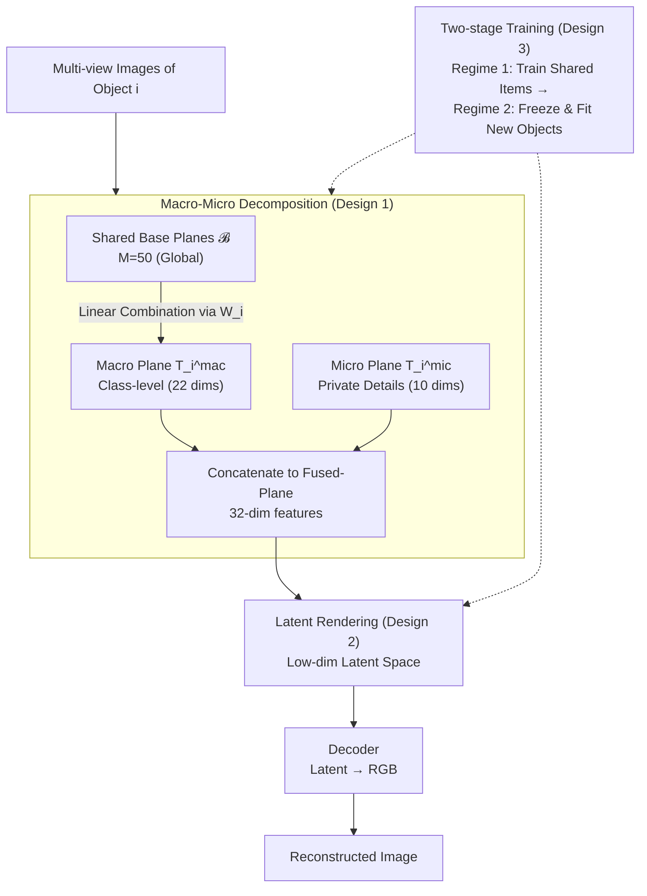

# Fused-Planes: Why Train a Thousand Tri-Planes When You Can Share?

**Conference**: ICLR 2026  
**arXiv**: [2410.23742](https://arxiv.org/abs/2410.23742)  
**Code**: [https://fused-planes.github.io](https://fused-planes.github.io)  
**Area**: 3D Vision / Large-scale 3D Reconstruction  
**Keywords**: tri-plane, NeRF, shared representation, large-scale 3D, latent space

## TL;DR
The paper proposes Fused-Planes, which decomposes the Tri-Plane representation into shared class-level base planes (macro) and object-specific detail planes (micro) through a macro-micro decomposition. Combined with latent space rendering, it achieves 7× training speedup and 3× memory compression while maintaining or even exceeding the reconstruction quality of independent Tri-Planes.

## Background & Motivation

**Background**: Tri-Planar NeRF is a powerful 3D representation (compatible with 2D vision models), but large-scale scene reconstruction requires independent training for each object—a thousand objects mean a thousand training runs, which is computationally expensive.

**Limitations of Prior Work**: (a) Independent training ignores the structural similarity between objects of the same category; (b) existing shared representation methods (e.g., CodeNeRF) either have poor scalability (C3-NeRF handles only 20 scenes) or lack the advantages of planar structures.

**Key Insight**: 3D objects of the same category (e.g., cars) share significant geometric and texture patterns. By decomposing each object's Tri-Plane into a "weighted combination of shared bases + object-specific residuals," redundant computation can be significantly reduced.

**Core Idea**: $T_i = T_i^{mic} \oplus (W_i \cdot \mathcal{B})$—each object's Tri-Plane consists of a weighted sum of a small number of shared base planes (macro) plus object-specific micro features (micro).

## Method

### Overall Architecture
Fused-Planes addresses the wastefulness of training thousands of Tri-Planes by extracting and sharing highly repetitive geometric/texture patterns among objects of the same category, training only the unique parts for each individual object. Specifically, all objects share a global set of $M=50$ base planes $\mathcal{B} = \{B_1, ..., B_{50}\}$, while each object $i$ holds a small micro-plane $T_i^{mic}$ and a weight vector $W_i$. During inference, the base planes are linearly combined using $W_i$ to form a "macro plane," which is then concatenated with the micro-plane to form the complete Fused-Plane. Rendering is performed in a low-dimensional latent space rather than RGB space, with a decoder recovering the RGB image, reducing single-object training time from an hour to under ten minutes. Training is conducted in two stages: first, training shared components with a few objects, then freezing them to rapidly process the remaining objects.

### Key Designs

**1. Macro-Micro Decomposition: Splitting each Tri-Plane into "Shared Bases + Private Residuals" to avoid redundant training of commonalities.**

This step directly addresses the limitation that independent training ignores structural similarities. An object's features are decomposed into two parts: a macro plane $T_i^{mac} = \sum_k w_i^k B_k$, which is a weighted sum of 50 shared base planes carrying class-level structural commonalities (22 dimensions), and a micro plane $T_i^{mic}$, which encodes only the unique details of that object (10 dimensions). The concatenation yields a 32-dimensional feature. The primary benefit is extreme storage efficiency; since base planes are shared globally, each object only needs to store a 480KB micro plane and an 811B weight vector, instead of a full 1.5MB Tri-Plane. The stronger the commonality and the more objects there are, the more cost-effective this amortization becomes.

**2. Latent Space Rendering: Shifting rendering from RGB space to a low-dimensional latent space, jointly trained with the representation.**

A large portion of the per-object optimization overhead comes from high-resolution RGB volume rendering. This method introduces an image autoencoder based on the SD VAE, allowing the NeRF to render directly in the compressed low-dimensional latent space. This significantly reduces resolution and accelerates training. Crucially, the autoencoder cannot use off-the-shelf weights since pre-trained VAE distributions do not match the feature distributions rendered by NeRF. Thus, it must be jointly trained from scratch with Fused-Planes. The rendered latent representation is then restored to RGB by the decoder without losing quality. This explains why removing the latent space in ablation studies causes training time to surge from 8.92 minutes back to 63.52 minutes.

**3. Two-stage Training Strategy: Training shared components with a small subset, then freezing them to swallow remaining objects.**

The benefits of sharing would be diminished if every new object required optimizing the base planes and the autoencoder. Therefore, training is split: Regime 1 uses only the first 500 objects to jointly optimize all components (base planes, encoder, decoder). Once these globally shared components converge, Regime 2 handles the remaining objects by freezing the autoencoder and shared components, training only the respective micro planes and weight vectors. Once shared components are fixed, training a new object reduces to a lightweight fitting problem, which is why the per-object cost remains stable at the minute level during scaling.

### Loss & Training
The training objective is composed of three terms:

$$\mathcal{L} = \mathcal{L}^{latent} + \mathcal{L}^{RGB} + 0.1 \cdot \mathcal{L}^{ae}$$

Where $\mathcal{L}^{latent}$ supervises the rendering results in the latent space, $\mathcal{L}^{RGB}$ constrains the fidelity of the image after decoding back to RGB, and $\mathcal{L}^{ae}$ (weighted at 0.1) ensures the reconstruction capability of the autoencoder itself does not degrade. Together, these terms ensure the end-to-end reliability of rendering in latent space and decoding back to pixels.

## Key Experimental Results

### Main Results

| Method | Training (min/obj) | Storage (MB/obj) | ShapeNet PSNR | FPS |
|------|-------------|-------------|-------------|-----|
| Tri-Planes | 64.32 | 1.50 | 28.15 | 42.9 |
| K-Planes | 75.35 | 410.17 | 30.88 | 14.3 |
| **Ours (Fused-Planes)** | **8.96** | **0.48** | **30.47** | **91.3** |
| **Ours (Fused-Planes-ULW)** | **7.16** | **0.0008** | **29.02** | - |

Compared to Tri-Planes, Fused-Planes is 7.2× faster, 3.2× more storage-efficient, has a 2.32dB PSNR Gain, and is 2.1× faster in rendering.

### Ablation Study

| Configuration | PSNR | Training (min) | Storage (MB) |
|------|------|----------|----------|
| RGB Space (No Latent) | 27.71 | 63.52 | 0.48 |
| Micro-only (No Sharing) | 27.64 | 12.84 | 1.50 |
| M=1 Base Plane | 27.69 | 8.48 | 0.48 |
| M=50 Base Planes | **28.64** | 8.92 | 0.48 |
| M=75 Base Planes | 29.62 | 8.99 | 1348 Total |

### Key Findings
- **Latent Space Rendering is the key to acceleration**: Moving from RGB to latent space reduced training from 63.52 to 8.92 minutes (7.1× acceleration) without quality loss.
- **Shared Base Planes are effective**: $M=50$ is the optimal choice; more base planes yield diminishing returns and increase memory.
- **ULW variant offers extreme compression**: Without using any micro planes, each object requires only 811B (weight vector), yet PSNR still reaches 29.02.
- **Multi-class training is feasible**: Training across 4 ShapeNet categories results in only a slight quality drop.
- **Scaling benefits**: With 10,000 objects, total memory is only 5GB (compared to 14.6GB for Tri-Planes and 4TB for K-Planes).

## Highlights & Insights
- The **macro-micro decomposition** concept is transferable to other 3D representations—any method based on per-object optimization can attempt to extract shared bases.
- **Joint training of latent rendering and representation learning** is critical—pre-trained VAEs cannot adapt to the specific distribution of NeRF.
- It achieves training speeds close to Instant-NGP while maintaining a planar structure (2D compatibility), which is highly valuable for downstream generative tasks (e.g., using planes for diffusion).

## Limitations & Future Work
- The quality upper bound is limited by the Tri-Plane itself (30.47 vs. TensoRF 36.74)—sharing accelerates but does not raise the representation ceiling.
- The number of base planes $M$ must be predefined, and the optimal $M$ may vary across categories.
- Validated only on synthetic data (ShapeNet + Basel Faces); generalization to real-world scenes is unknown.
- The encoder freezing strategy might fail when the category distribution shifts significantly.

## Related Work & Insights
- **vs. Tri-Planes**: A direct replacement—faster, smaller, and better, while maintaining plane compatibility.
- **vs. CodeNeRF**: CodeNeRF shares via latent codes but lacks the planar structure; Fused-Planes maintains 2D compatibility of planes.
- **vs. Instant-NGP**: NGP training speeds are similar, but storage is 189MB/obj vs. 0.48MB/obj for Fused-Planes.

## Rating
- Novelty: ⭐⭐⭐⭐ The macro-micro decomposition is simple and effective; joint latent training is insightful.
- Experimental Thoroughness: ⭐⭐⭐⭐⭐ Multiple datasets, multiple baselines, comprehensive ablations, scaling analysis, and rendering speed evaluation.
- Writing Quality: ⭐⭐⭐⭐⭐ Clear problem definition, detailed experiments, and rich tables.
- Value: ⭐⭐⭐⭐ A practical acceleration solution for large-scale 3D reconstruction, compatible with downstream generative tasks.

<!-- RELATED:START -->

## Related Papers

- [\[ICCV 2025\] Compression of 3D Gaussian Splatting with Optimized Feature Planes and Standard Video Codecs](../../ICCV2025/3d_vision/compression_of_3d_gaussian_splatting_with_optimized_feature_planes_and_standard_.md)
- [\[ICLR 2026\] The Less You Depend, the More You Learn: Synthesizing Novel Views from Sparse, Unposed Images with Minimal 3D Knowledge](the_less_you_depend_the_more_you_learn_synthesizing_novel_views_from_sparse_unpo.md)
- [\[ICLR 2026\] A Scene is Worth a Thousand Features: Feed-Forward Camera Localization from a Collection of Image Features](a_scene_is_worth_a_thousand_features_feed-forward_camera_localization_from_a_col.md)
- [\[ICLR 2026\] YoNoSplat: You Only Need One Model for Feedforward 3D Gaussian Splatting](yonosplat_you_only_need_one_model_for_feedforward_3d_gaussian_splatting.md)
- [\[NeurIPS 2025\] You Can Trust Your Clustering Model: A Parameter-free Self-Boosting Plug-in for Deep Clustering](../../NeurIPS2025/3d_vision/you_can_trust_your_clustering_model_a_parameter-free_self-boosting_plug-in_for_d.md)

<!-- RELATED:END -->
