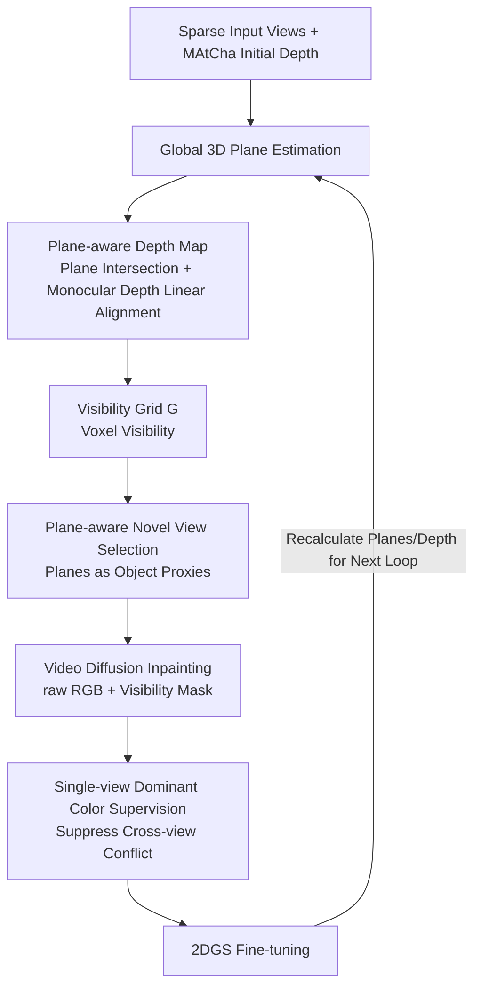

# G4Splat: Geometry-Guided Gaussian Splatting with Generative Prior

**Conference**: ICLR 2026  
**OpenReview**: [https://openreview.net/forum?id=kdPmsMVhZf](https://openreview.net/forum?id=kdPmsMVhZf)  
**Project Page**: [https://dali-jack.github.io/g4splat-web/](https://dali-jack.github.io/g4splat-web/)  
**Code**: To be confirmed  
**Area**: 3D Vision / Sparse-view Scene Reconstruction  
**Keywords**: Gaussian Splatting, Sparse-view reconstruction, Generative prior, Planar geometry, Video diffusion inpainting  

## TL;DR
G4Splat argues that "accurate geometry is the prerequisite for effectively utilizing generative priors." It first derives scale-accurate plane-aware depth using the planar structures ubiquitous in man-made scenes, then integrates this geometry throughout the entire workflow—including visibility estimation, novel view selection, and video diffusion inpainting—to achieve high-quality sparse-view scene reconstruction with superior geometry and appearance in both observed and unobserved regions.

## Background & Motivation
**Background**: 3DGS/2DGS achieve photorealistic novel view synthesis under dense views, but quality significantly degrades in sparse-view settings due to insufficient geometric and photometric supervision. One category of methods relies on depth regularization, while more aggressive approaches directly leverage the generative knowledge of pre-trained diffusion models to "hallucinate" unobserved regions.

**Limitations of Prior Work**: This paper attributes the failure of existing generative reconstruction to two factors. First, **lack of reliable geometric supervision**—monocular depth estimation suffers from scale ambiguity, failing to reconstruct even observed areas well, let alone providing a geometric foundation for inpainting unobserved regions; matching-based methods (e.g., chart alignment in MASt3R/MAtCha) are error-prone in non-overlapping view regions. Second, **lack of mechanisms to suppress multi-view inconsistency**—images generated by diffusion models are inconsistent across views, and using them directly for supervision leads to severe "shape–appearance ambiguity," contaminating the geometry.

**Key Challenge**: The attempt to complete unobserved regions with generative priors is undermined by unreliable geometry and multi-view inconsistency of the generated results, leading to accumulated errors.

**Goal**: Provide accurate and cross-view consistent geometric supervision in both observed and unobserved regions, and inject geometric signals into the entire generative inpainting pipeline for high-quality "any-view" scene completion.

**Key Insight**: **[Planes as Geometric Anchors]** Leverage the characteristic that man-made environments follow the Manhattan world assumption with prevalent planar structures. 3D planes can be reliably estimated from local depth observations and extrapolated to entire surfaces, providing scale-accurate depth even in non-overlapping/unobserved regions. **[Geometry throughout the Generative Pipeline]** Utilize this planar geometry simultaneously for visibility grids, novel view selection, and color supervision for video diffusion, rather than merely as an isolated depth loss.

## Method

### Overall Architecture
G4Splat uses 2DGS + MAtCha (initial scale depth via chart alignment) as the backbone, trained in two stages: an initialization phase to build reliable geometry, followed by a "geometry-guided generative training loop." In each loop, global 3D planes are extracted from all training views to calculate plane-aware depth. This is then used to construct visibility grids, select plane-aware novel views, and inpaint unobserved regions via video diffusion. The completed views are then merged into the training set to fine-tune the Gaussians iteratively (typical for three rounds in experiments).

### Key Designs

**1. Plane-aware Geometry Modeling: Planes as Extrapolatable Scale Anchors.** Per-view 2D plane extraction is performed first—assuming planar regions have consistent normals, geometric smoothness, and similar semantics. K-means clustering is applied to normal maps (from monocular/depth gradients) to find orientation-consistent regions, filtered by SAM instance masks to retain valid 2D plane masks. Next, global 3D plane estimation is performed: since per-view masks are often over-segmented and inconsistent, local planes with similar normals and sufficient spatial overlap in 3D are merged into global planes $\Phi_k: n_k^\top x + d_k = 0$. For robustness, only high-confidence points $P_k^{\text{conf}}$ observed by at least two views are used for RANSAC fitting: $\min_{n_k,d_k}\sum_{p\in P_k^{\text{conf}}}(n_k^\top p + d_k)^2,\ \text{s.t.}\ \|n_k\|=1$. Finally, plane-aware depth is extracted: for planar pixels $u$, depth $D_v^i(u)=\frac{-n_{k_i}^\top o_v - d_{k_i}}{n_{k_i}^\top r_v(u)}$ is computed via ray-plane intersection; for non-planar but visible regions, MAtCha depth is kept; for non-planar and unobserved regions, monocular depth $\hat D_v$ is linearly aligned to absolute scale using least squares on planar regions: $D_v(u)=a_v\hat D_v(u)+b_v$. Key advantage: planes allow **depth extrapolation**—even without view overlap, entire planes can extend reliably from local observations, mitigating MAtCha's errors in non-overlapping areas.

**2. Geometry-guided Visibility: Voxel Visibility Grid instead of Noisy Alpha Masks.** Existing methods rely on alpha maps for inpainting masks, which often fail in visible regions and contaminate results. G4Splat uses scale-accurate plane-aware depth to build a voxel visibility grid $G$: scene 3D boundaries are defined by training views and discretized into voxels. Each voxel center is projected to training views; if it falls within a valid depth range, it is marked visible (visible=1 if seen by at least one view). For rendering novel view visibility, $Q$ points are sampled along each pixel ray to the rendered depth. Nearest-neighbor interpolation retrieves grid visibility values, and $V_v(u)=\prod_{q=1}^{Q} v_q$—a pixel is visible only if all sampled points on the ray are visible. This provides much cleaner inpainting regions for video diffusion.

**3. Plane-aware Novel View Selection + Single-view Dominant Supervision: Suppressing Multi-view Inconsistency at the Source.** Naive elliptical trajectories around the scene center provide only local coverage and leave seams. G4Splat treats global 3D planes as object proxies. For each plane, the centroid is the look-at target, and camera poses are searched within visibility grid centers to maximize plane coverage, minimize distance, and align view direction with the plane normal. This ensures selected views fully cover objects for sufficient context. For inpainting, pre-trained video diffusion jointly inpaints all views using input images as references and $\{\tilde I_v, V_v\}$ as inputs. Despite joint inference, inconsistencies remain; thus, **each region is supervised primarily by the color of a single dominant view**: the view with the most complete observation is chosen for planar regions, and the first view where it became visible for non-planar regions.

The total loss follows MAtCha: $L_{\text{total}}=L_{\text{rgb}}+L_{\text{reg}}+L_{\text{struct}}$, but replaces/augments chart depth with plane-aware depth for stronger geometric constraints.

## Key Experimental Results

### Main Results (5 Input Views, selected datasets, ↓ lower better / ↑ higher better)

| Dataset | Method | CD↓ | F-Score↑ | NC↑ | PSNR↑ | SSIM↑ | LPIPS↓ |
|--------|------|-----|----------|-----|-------|-------|--------|
| Replica | 2DGS | 14.64 | 48.01 | 74.14 | 18.43 | 0.735 | 0.306 |
| Replica | MAtCha | 10.12 | 60.90 | 79.33 | 17.81 | 0.752 | 0.228 |
| Replica | GenFusion | 13.05 | 41.60 | 69.33 | 20.14 | 0.801 | 0.258 |
| Replica | Difix3D+ | 13.71 | 43.11 | 65.34 | 19.42 | 0.779 | 0.231 |
| Replica | **Ours** | **6.61** | **65.14** | **83.98** | **23.90** | **0.836** | **0.199** |
| ScanNet++ | MAtCha | 11.55 | 62.98 | 73.61 | 13.58 | 0.677 | 0.351 |
| ScanNet++ | GenFusion | 10.68 | 47.15 | 66.27 | 16.12 | 0.726 | 0.347 |

Across Replica, ScanNet++, DeepBlending, and Mip-NeRF 360, geometry (CD/F-Score/NC) and appearance (PSNR/SSIM/LPIPS) metrics are consistently leading, with particularly significant gains in unobserved regions.

### Ablation Study (Replica, GP=Generative Prior / PM=Planar Geometry Modeling / PP=Geometry-guided Pipeline)

| GP | PM | PP | CD↓ | F-Score↑ | NC↑ | PSNR↑ | SSIM↑ | LPIPS↓ |
|----|----|----|-----|----------|-----|-------|-------|--------|
| × | × | × | 10.60 | 59.17 | 79.95 | 17.85 | 0.751 | 0.228 |
| ✓ | × | × | 9.46 | 56.99 | 77.58 | 19.63 | 0.740 | 0.295 |
| × | ✓ | × | 8.73 | 64.96 | 80.55 | 17.63 | 0.752 | 0.219 |
| ✓ | ✓ | × | 7.56 | 62.36 | 80.89 | 21.88 | 0.810 | 0.221 |
| ✓ | ✓ | ✓ | **6.61** | **65.14** | **83.98** | **23.90** | **0.836** | **0.199** |

### Key Findings
- Adding only the generative prior (GP) degrades geometry (F-Score 59.17→56.99, LPIPS increases), confirming the core thesis that "without reliable geometry, generative priors are counterproductive."
- Planar geometry modeling (PM) alone reduces CD from 10.60 to 8.73 and increases F-Score to 64.96, yielding the largest geometric gain. Adding the geometry-guided pipeline (PP) further maximizes appearance (PSNR 21.88→23.90).
- The method naturally supports single-view inputs and unposed videos (e.g., YouTube videos), generalizing to indoor and outdoor environments. Runtime is comparable to baselines (Table 4).

## Highlights & Insights
- **Clear Thesis Supported by Evidence**: The paper explicitly argues "accurate geometry is the prerequisite for generative priors" and uses the GP-only ablation to solidify this claim.
- **Clever Use of Plane "Extrapolability"**: Matching methods fail in non-overlapping regions, whereas planes can be fitted from local observations and extrapolated across entire surfaces, filling the supervision gap in unobserved sparse-view areas.
- **Systematic Geometric Integration**: Geometry is not just an additional loss term but is integrated from visibility grids to view selection and color supervision. Geometric signals suppress multi-view inconsistency at every step of the pipeline.

## Limitations & Future Work
- Strong dependency on the Manhattan world assumption; may degrade in scenes with few planes or complex curved/unstructured surfaces (e.g., dense vegetation).
- The pipeline integrates several pre-trained models (SAM, monocular normal/depth, video diffusion), making it heavy and dependent on upstream model quality.
- The iterative optimization (three rounds) requires a fixed number of loops; adaptive stopping mechanisms remains an area for exploration.

## Related Work & Insights
- **Geometric Backbone**: Built upon 2DGS (compressing 3D Gaussians into 2D disks) and MAtCha (chart alignment + MASt3R-SfM for scaled depth), improving upon their failures in non-overlapping regions.
- **Generative Completion Comparison**: See3D, GenFusion, Difix3D+, and GuidedVD represent the "direct-diffusion-for-unseen-areas" route. This work proves that adding reliable geometry can improve both geometry and appearance.
- **Insight**: For any 3D task using generative models for completion, locking down geometric scale and cross-view consistency before letting the generative model work under reliable constraints is often more robust than trusting raw generated results.

## Rating
- Novelty: ⭐⭐⭐⭐ Systematically integrating planar geometry into the generative inpainting pipeline, supported by counter-intuitive ablation results.
- Experimental Thoroughness: ⭐⭐⭐⭐ Four datasets, dual metrics for geometry and appearance, clear three-factor ablation, and generalization to single-view/unposed videos.
- Writing Quality: ⭐⭐⭐⭐ Clear mapping between arguments and methods. Visualization of intermediate results (AM vs VM, NNV vs PNV) effectively explains the design choices.
- Value: ⭐⭐⭐⭐ High utility for sparse-view/any-view reconstruction. The paradigm of plane extrapolation + geometry-guided generation is a valuable reference for related tasks.

<!-- RELATED:START -->

## Related Papers

- [\[CVPR 2026\] GIFSplat: Generative Prior-Guided Iterative Feed-Forward 3D Gaussian Splatting from Sparse Views](../../CVPR2026/3d_vision/gifsplat_generative_prior-guided_iterative_feed-forward_3d_gaussian_splatting_fr.md)
- [\[ICLR 2026\] Generative Human Geometry Distribution](generative_human_geometry_distribution.md)
- [\[CVPR 2026\] P2GS: Physical Prior-guided Gaussian Splatting for Photometrically Consistent Urban Reconstruction](../../CVPR2026/3d_vision/p2gs_physical_prior-guided_gaussian_splatting_for_photometrically_consistent_urb.md)
- [\[ICLR 2026\] From Tokens to Nodes: Semantic-Guided Motion Control for Dynamic 3D Gaussian Splatting](from_tokens_to_nodes_semantic-guided_motion_control_for_dynamic_3d_gaussian_spla.md)
- [\[ICLR 2026\] ReSplat: Degradation-agnostic Feed-forward Gaussian Splatting via Self-guided Residual Diffusion](resplat_degradation-agnostic_feed-forward_gaussian_splatting_via_self-guided_res.md)

<!-- RELATED:END -->
