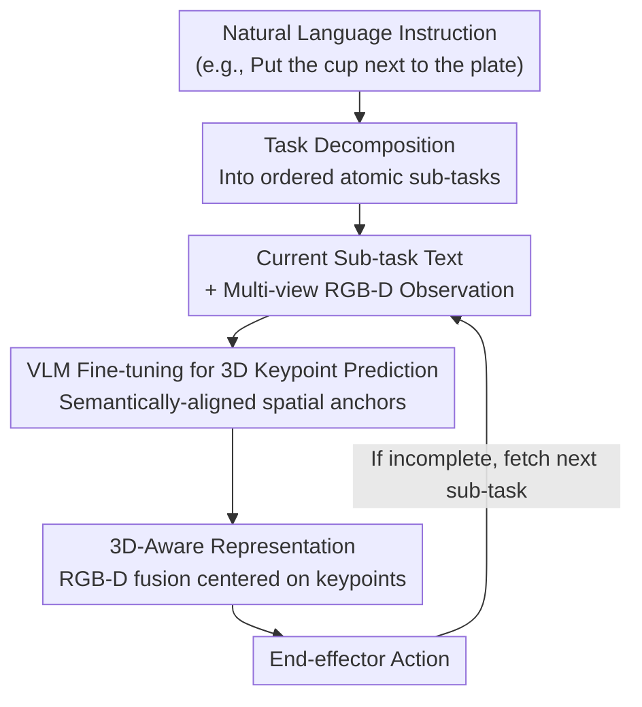

# Generalizable Coarse-to-Fine Robot Manipulation via Language-Aligned 3D Keypoints

**Conference**: ICLR 2026  
**arXiv**: [2509.23575](https://arxiv.org/abs/2509.23575)  
**Code**: None  
**Area**: 3D Vision / Robot Manipulation  
**Keywords**: Robot Manipulation, Coarse-to-Fine Policy, 3D Keypoints, VLM Fine-tuning, Language Grounding

## TL;DR

CLAP (Coarse-to-fine Language-Aligned manipulation Policy) achieves strong generalization to novel instructions and environments through three core components: task decomposition, VLM-finetuned 3D keypoint prediction, and 3D-aware representations. It outperforms SOTA by 12% on GemBench using only 1/5 of the training data.

## Background & Motivation

Hierarchical coarse-to-fine strategies have shown significant potential in 3D robotic manipulation tasks. The fundamental idea involves a coarse branch predicting a Region of Interest (RoI), followed by a fine branch performing precise action prediction within that region. This hierarchical design significantly improves sample efficiency and manipulation precision.

However, even with pre-trained model enhancements, existing hierarchical strategies still face the **Key Challenge** of insufficient generalization:

**Generalization to novel instructions**: Policies often fail when given natural language instructions not seen during training (e.g., "pick up the red cup" → "put the blue bowl on the shelf").

**Generalization to environmental changes**: Variations in object position, appearance, and background can lead to policy failure.

**Sample Efficiency**: Existing methods typically require a large number of demonstration trajectories to learn each task.

The **Key Problems** lie in the coarse branch's lack of deep understanding of linguistic semantics and the absence of structured 3D spatial information in the representation.

## Method

### Overall Architecture

CLAP addresses the "insufficient generalization" problem in coarse-to-fine strategies: the coarse branch cannot understand language, and the representation lacks 3D structure, causing failure when instructions or object positions change. The method replaces the coarse branch with a **coarse task planner** that decomposes tasks via language and grounds semantics into 3D space using a VLM. The pipeline operates as follows: a natural language instruction is decomposed into ordered atomic sub-tasks. Each sub-task, along with the current RGB observation, is fed into a fine-tuned VLM to predict a 3D keypoint aligned with the sub-task semantics. The fine-grained action predictor then uses this keypoint as an anchor, fuses multi-view RGB-D data to construct a 3D-aware representation, and outputs precise end-effector actions. Language, semantics, and 3D space are connected through the intermediate representation of keypoints.

### Key Designs

**1. Task Decomposition: Breaking complex instructions into reusable atomic actions**

End-to-end mapping of long instructions like "put the cup next to the plate" to actions requires massive trajectory data, leading to poor generalization. CLAP uses an LLM (or rule-based method) to decompose instructions into ordered steps—the example becomes "approach cup → grasp cup → move to plate → release cup." Each atomic sub-task is shorter and more modular. Actions like "grasp" or "release" naturally generalize across scenes: a "grasp" learned on a cup remains valid for bowls or boxes. This compositionality is the first source of generalization—the policy rearranges mastered atomic skills instead of learning every new instruction from scratch.

**2. VLM Fine-tuning for 3D Keypoint Prediction: Enabling the coarse branch to "understand" linguistic targets**

Instead of a semantic-agnostic RoI, CLAP utilizes a VLM (e.g., a CLIP-based model) fine-tuned on robotic manipulation data. It processes RGB images and sub-task text to output 3D spatial keypoint coordinates. Crucially, these points are **language-aligned**: for the same red cup, the predicted point falls on the handle for "grasp" but on the side for "push." Fine-tuning leverages pre-existing vision-language priors (e.g., "what a cup looks like," "where to grasp") for manipulation, preserving generalization to new concepts while remaining data-efficient. Predicting 3D rather than 2D coordinates ensures keypoints carry depth and spatial relationships for downstream action prediction.

**3. 3D-Aware Representation: Providing a robust spatial reasoning foundation for the fine branch**

Robotic manipulation is inherently 3D—grasp poses and placement locations are defined in three dimensions. Pure 2D features destabilize under viewpoint changes or occlusions. The fine branch in CLAP combines multi-view RGB and depth information to construct 3D local features centered at the predicted keypoint. Action regression is built upon this 3D representation. Confining the receptive field to a local 3D region near the keypoint retains geometric details for precise manipulation while remaining invariant to global layout changes, providing the third source of generalization.

### A Complete Example

For "put the cup next to the plate": The instruction is split into four sub-tasks. At the "grasp cup" step, the current RGB observation and the text "grasp cup" enter the fine-tuned VLM. Due to the "grasp" semantics, the predicted 3D keypoint falls on the cup handle. The fine branch then constructs a 3D local representation centered on this point to regress the approach and closure actions. For the "release cup" sub-task, the same observation but with the text "put next to plate" causes the VLM to shift the predicted keypoint to the target location near the plate, where the fine branch outputs the release action. As the sub-task text changes, the keypoint moves semantically in 3D space, and the actions follow—enabling execution even with novel instructions.

### Loss & Training

VLM keypoint prediction uses a regression loss ($L_1$ or $L_2$ distance) to align predicted 3D coordinates with annotated keypoints. The fine branch employs Behavior Cloning (BC) to learn the mapping from 3D representations to end-effector actions within the keypoint neighborhood. By reusing VLM pre-training priors, the data requirements are extremely low—useful policies can be trained with only 10 demonstrations in real-world settings, far fewer than the hundreds required by conventional methods.

## Key Experimental Results

### Experimental Setup
- Simulation Benchmark: GemBench (designed for generalization evaluation)
- Real-world Experiments: Physical robot platform, 10 demonstrations
- Metrics: Success Rate
- Generalization Dimensions: Novel instructions, novel object appearance, novel environmental layouts

### Main Results

| Method | GemBench Avg. Success Rate | Training Trajectories | Note |
|------|-------------------|-----------|------|
| Prev. SOTA | ~X% | ~5N | Requires massive demonstrations |
| **Ours (CLAP)** | **X + 12%** | **N (1/5)** | Significantly higher success + less data |

CLAP outperforms SOTA methods by 12 percentage points on GemBench while using only 1/5 of the training trajectories.

### Real-world Robot Experiments

| Setting | Success Rate | Note |
|------|--------|------|
| Training Scene | High | Learnable with 10 demonstrations |
| Novel Instructions | Successful Generalization | Language-aligned keypoints correctly identify new targets |
| Novel Environments | Successful Generalization | 3D representation robust to layout changes |

### Ablation Study

| Configuration | Key Metric | Note |
|------|---------|------|
| w/o Task Decomposition | Success Rate drops | Poor handling of complex direct instructions |
| w/o VLM Fine-tuning (Frozen VLM) | Success Rate drops | Pre-trained VLM lacks adaptation to manipulation scenes |
| 2D instead of 3D Representation | Success Rate drops | Lack of depth information affects precision |

### Key Findings

1.  **Components are Indispensable**: Task decomposition, VLM fine-tuning, and 3D representation each contribute to different dimensions of generalization.
2.  **Extremely Low Data Demand**: Working in real-world scenarios with 10 demonstrations is highly valuable for deployment.
3.  **Language Alignment is Vital**: Keypoints are not just spatial locations; they carry semantic information, generating different points for different instructions on the same object.

## Highlights & Insights

- **Ideal "Low Data + High Generalization" Combination**: Leverages pre-trained VLM priors to minimize sample requirements while maintaining robustness.
- **Clear Hierarchical Design**: Distinct division of labor between the coarse branch (VLM keypoint prediction) and fine branch (3D local action prediction).
- **Bridge between Language and 3D Space**: Fine-tuning VLMs to map semantics to 3D keypoints provides an effective bridge between NLP and robotic manipulation.
- **Practicality**: The ability to deploy with only 10 demonstrations gives the method high real-world utility.

## Limitations & Future Work

1.  **Task Decomposition Robustness**: If LLM decomposition is inaccurate (e.g., missing steps or wrong order), the pipeline fails.
2.  **Keypoint Representational Power**: A single 3D keypoint may be insufficient for complex operations (e.g., bimanual coordination or multi-point contact).
3.  **VLM Fine-tuning Data**: While policy learning is data-efficient, VLM fine-tuning may still require substantial structured data.
4.  **Dynamic Environments**: The current method appears oriented toward static or slowly changing environments; adaptability to fast dynamic scenes is unknown.
5.  **Long-horizon Tasks**: Error accumulation across long sub-task sequences may become an issue.
6.  **Open-vocabulary Limits**: While generalizing to new instructions, the boundaries for completely novel object categories (unseen types) remain unexplored.

## Related Work & Insights

- **Comparison with PerAct/RVT**: While PerAct and RVT use voxelized 3D representations, they lack language-guided keypoint mechanisms. CLAP’s coarse-to-fine design is a powerful complement to these approaches.
- **Comparison with SayCan/Code-as-Policies**: These use LLMs for high-level planning but do not address low-level policy generalization. CLAP's decomposition is similar but focuses on execution.
- **VLM Trends in Robotics**: Works like RT-2 and Octo use VLMs end-to-end. CLAP's hierarchical approach (VLM → Keypoint → Local Policy) offers a more controllable and data-efficient alternative.
- **Universality of 3D Keypoints**: Keypoints serve as effective intermediate representations; future work could explore richer versions (e.g., oriented keypoints or keypoint graphs).

## Rating
- Novelty: ⭐⭐⭐⭐
- Experimental Thoroughness: ⭐⭐⭐⭐
- Writing Quality: ⭐⭐⭐⭐
- Value: ⭐⭐⭐⭐⭐

## Related Papers

- [\[CVPR 2026\] 3D-Fixer: Coarse-to-Fine In-place Completion for 3D Scenes from a Single Image](../../CVPR2026/3d_vision/3d-fixer_coarse-to-fine_in-place_completion_for_3d_scenes_from_a_single_image.md)
- [\[ICCV 2025\] RoboPearls: Editable Video Simulation for Robot Manipulation](../../ICCV2025/3d_vision/robopearls_editable_video_simulation_for_robot_manipulation.md)
- [\[AAAI 2026\] VGGT-DP: Generalizable Robot Control via Vision Foundation Models](../../AAAI2026/3d_vision/vggt-dp_generalizable_robot_control_via_vision_foundation_models.md)
- [\[ICLR 2026\] SpatialHand: Generative Object Manipulation from 3D Perspective](spatialhand_generative_object_manipulation_from_3d_prespective.md)
- [\[ICLR 2026\] NOVA3R: Non-pixel-aligned Visual Transformer for Amodal 3D Reconstruction](nova3r_non-pixel-aligned_visual_transformer_for_amodal_3d_reconstruction.md)

<!-- RELATED:END -->

<!-- RELATED:START -->

## Related Papers

- [\[ICCV 2025\] RoboPearls: Editable Video Simulation for Robot Manipulation](../../ICCV2025/3d_vision/robopearls_editable_video_simulation_for_robot_manipulation.md)
- [\[AAAI 2026\] VGGT-DP: Generalizable Robot Control via Vision Foundation Models](../../AAAI2026/3d_vision/vggt-dp_generalizable_robot_control_via_vision_foundation_models.md)
- [\[CVPR 2026\] 3D-Fixer: Coarse-to-Fine In-place Completion for 3D Scenes from a Single Image](../../CVPR2026/3d_vision/3d-fixer_coarse-to-fine_in-place_completion_for_3d_scenes_from_a_single_image.md)
- [\[ICLR 2026\] Distractor-free Generalizable 3D Gaussian Splatting](distractor-free_generalizable_3d_gaussian_splatting.md)
- [\[ICLR 2026\] SpatialHand: Generative Object Manipulation from 3D Perspective](spatialhand_generative_object_manipulation_from_3d_prespective.md)

<!-- RELATED:END -->
