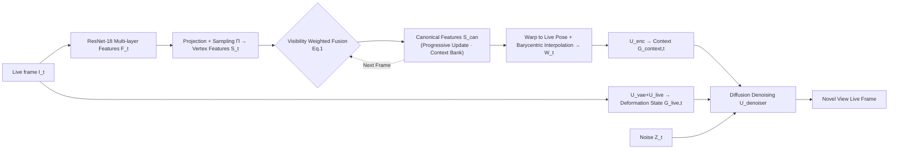

# GenFusion: Feed-forward Human Performance Capture via Progressive Canonical Space Updates

**Conference**: ICLR 2026  
**OpenReview**: [https://openreview.net/forum?id=HlsFKjrHSw](https://openreview.net/forum?id=HlsFKjrHSw)  
**Code**: TBD  
**Area**: 3D Vision / Human Performance Capture / Monocular Novel View Synthesis  
**Keywords**: Human Performance Capture, Monocular Video, Progressive Canonical Space, Probabilistic Regression, Diffusion Models, Feed-forward Methods  

## TL;DR
GenFusion accumulates monocular RGB video streams frame-by-frame into a progressively "completed" canonical feature space as temporal context. It then warps this context back to the current frame and renders novel views through diffusion-based probabilistic regression. This allows the model to synthesize frontal details consistent with historical observations even from side-view inputs, producing sharper results than deterministic regression.

## Background & Motivation
- **Background**: Novel view synthesis of a performer from sparse or monocular views is a core challenge in 3D human reconstruction. Per-frame feed-forward methods rely on pixel-aligned features for generalizable reconstruction, but single-frame observations are inherently incomplete.
- **Limitations of Prior Work**: Single-frame methods fall into two categories with distinct flaws—deterministic regression methods (SHERF, GHG, NHP) use $\ell_1$/MSE supervision, which forces the model to "average" outputs during pose misalignment between historical and current frames, suppressing high-frequency details and causing blurriness. Probabilistic/generative methods (Champ, AniGS, LHM, SiFU) produce sharp single frames but lack historical connection, leading to hallucinations inconsistent with past observations (e.g., rendering a blue shirt as a different pattern).
- **Key Challenge**: A monocular stream only reveals part of the body per frame; invisible regions must be completed using temporal history. However, simple history aggregation faces "deformation inconsistency" between historical and current poses. Deterministic supervision blurs during misalignment, while unconstrained generative supervision "invents" details randomly. It is difficult to simultaneously achieve **temporal context, sharpness, and historical consistency**.
- **Goal**: Feed-forward high-fidelity novel view rendering of a performer from monocular RGB streams, ensuring results are grounded in historical observations while matching the current frame's deformation.
- **Core Idea**: **[Progressive Canonical Context + Probabilistic Regression]** Maintain a canonical feature space updated via visibility weighting as a "context bank." Model the rendering as diffusion-based probabilistic regression—using perceptual rather than pixel-level supervision—allowing the model to leverage semantic cues (textures, patterns) from the canonical space even under pose/geometric misalignment, while reasonably hallucinating in regions without any history.

## Method

### Overall Architecture
Given a monocular video, per-frame fitted SMPL-X templates, and camera parameters, GenFusion operates in a three-step cycle: for each live frame, features are extracted and aligned to SMPL-X vertices, then fused into a shared canonical feature space via visibility weighting (temporal accumulation). The canonical features are then warped back to the current live pose and densified into a 2D context map. Finally, a diffusion denoising network, conditioned on the "canonical context + current deformation state," synthesizes the novel view from noise. SMPL-X is used solely for establishing 4D correspondences for temporal alignment.

### Key Designs
**1. Hierarchical Feature Extraction Aligned to SMPL-X Vertices: Anchoring image information to the template surface.** For the current live frame $I_t$, multi-scale feature maps $F_t$ are extracted using the first three layers of ResNet-18 (resolutions reduced to 1/2, 1/4, 1/8), preserving both fine-grained textures and regional semantics. The receptive field of ResNet allows vertices to encode context like clothing and hair that extend beyond the SMPL-X surface. SMPL-X vertices $X_t$ are then projected to 2D using input camera parameters $C_{input}$ ($\text{Proj}$), and bilinear sampling yields vertex-aligned features $S_t = \Pi(F_t, \text{Proj}(X_t, C_{input})) \in \mathbb{R}^{M\times L}$ ($M$ vertices, $L{=}256$ channels). This step anchors observations from any frame to a unified set of template vertices.

**2. Visibility-Weighted Progressive Canonical Update: Accumulating the "context bank."** The canonical feature set $S_{can}$ is initialized to zero, accompanied by a cumulative visibility map $V_{can}\in\mathbb{R}^{M\times 1}$. For each frame, historical and current features are averaged based on visibility frequency:
$$S_{can} = \frac{(S_t \cdot V_t) + (S_{can}\cdot V_{can})}{\max(V_t + V_{can},\,1)},\qquad V_{can}\leftarrow V_{can}+V_t.$$
This rule ensures that frequently observed vertices remain stable while smoothly integrating new observations, allowing the canonical space to complete over time. Even if a region is occluded in the current frame, its appearance is preserved in $S_{can}$, acting as the context source for rendering.

**3. Warp + Barycentric Interpolation for Dense Live Context.** When rendering the current frame, $S_{can}$ is first warped to the live pose using current SMPL-X vertices $X_t$, then projected to the target novel camera $C_{novel}$. Since $S_{can}$ is a sparse vertex representation, barycentric interpolation is used to render vertex features into a dense 2D feature map: $W_t = \text{Interpolate}(\text{Warp}(S_{can}, X_t), C_{novel})$. $W_t$ carries rich temporal context aggregated from $S_{can}$ as a dense base map. This avoids the difficulty of optimizing SE(3) warps for monocular non-rigid bodies.

**4. Diffusion Probabilistic Regression: Resolving "History vs. Current" deformation conflicts.** Deterministic pixel supervision punishes high-frequency details during misalignment. GenFusion employs a diffusion model (based on pre-trained VAE and Stable Diffusion): the dense context $W_t$ is encoded via $U_{enc}$ into $G_{context,t}=U_{enc}(W_t)$, while the current deformation state is encoded as $G_{live,t}=U_{live}(U_{vae}(I_t))$. The denoiser predicts noise conditioned on both:
$$\mathcal{L}=\mathbb{E}\big[\|\epsilon - U_{denoiser}(Z_t, G_{context,t}, G_{live,t}, i)\|^2\big],\quad Z_t=\alpha_t Z+\sigma_t\epsilon.$$
Perceptual-level supervision does not force pixel-perfect alignment, allowing the model to utilize semantically relevant textures from the canonical space even if the geometry is slightly off.

## Key Experimental Results

### Main Results
In-domain generalization on 4D-Dress (LPIPS-VGG ×1000, ↓ lower is better; FVD measures historical consistency):

| Method | Generalizable | Temporal Context | Target | PSNR↑ | LPIPS-VGG↓ | FVD↓ |
|------|--------|-----------|----------|-------|-----------|------|
| GauHuman (Per-subject) | ✗ | ✗ | Det. | 23.19 | 83.34 | 500.8 |
| Champ | ✓ | ✗ | Prob. | 19.37 | 98.61 | 254.5 |
| SHERF | ✓ | ✗ | Det. | 21.86 | 86.34 | 735.3 |
| GHG | ✓ | ✗ | Det. | 24.50 | 75.60 | 502.93 |
| NHP | ✓ | ✗ | Det. | 24.72 | 96.26 | 630.0 |
| **Ours** | ✓ | ✓ | Prob. | **25.07** | **62.97** | **176.7** |

Cross-dataset generalization on MVHumanNet:

| Method | PSNR↑ | LPIPS-VGG↓ | FVD↓ |
|------|-------|-----------|------|
| Champ | 21.06 | 97.61 | 674.1 |
| NHP | 22.25 | 131.91 | 1321.4 |
| **Ours** | 21.25 | **87.85** | **436.9** |

### Ablation Study
Ablation on 4D-Dress:

| Variant | Temporal Context | Target | PSNR↑ | LPIPS-VGG↓ | FVD↓ |
|------|-----------|----------|-------|-----------|------|
| (a) No Temporal Context | No | Prob. | 25.03 | 63.34 | 177.4 |
| (b) No Feature Context (Raw RGB) | Yes | Prob. | 24.37 | 64.51 | 191.9 |
| (c) No Prob. Target (MSE) | Yes | Det. | 25.23 | 95.70 | 572.3 |
| (d) Full Method | Yes | Prob. | 25.07 | 62.97 | 176.7 |

### Key Findings
- **Probabilistic targets are key to sharpness**: Variant (c) using deterministic MSE achieves the highest PSNR (25.23) but LPIPS jumps to 95.70, proving pixel metrics $\neq$ visual quality.
- **Temporal context ensures consistency**: Removing temporal history (a) causes the model to hallucinate patterns in occluded areas that contradict history, increasing FVD.
- **Encoded features outperform raw RGB**: Variant (b) demonstrates that ResNet feature richness is superior for completing occluded details.
- **Strong generalization**: Qualitative results on TikTok in-the-wild videos show the ability to reconstruct frontal details (e.g., a pink bow) from back-view inputs based on history, whereas Champ/AniGS hallucinate unrelated details.

## Highlights & Insights
- **Natural synergy of Canonical Update + Probabilistic Rendering**: Encodes the intuition of "seeing more of a person as they turn"—the canonical space accumulates information, while probabilistic regression utilizes it even under misalignment.
- **Honest contribution positioning**: The authors state that SMPL-X and diffusion models themselves are not the primary innovations. The core contribution is the design of the canonical context that enables existing diffusion models to significantly improve synthesis.
- **FVD as a consistency metric**: Using FVD on single-view sequences effectively quantifies alignment with historical observations, exposing the "random hallucination" issues of generative methods.

## Limitations & Future Work
- **Dependency on SMPL-X quality**: 4D correspondence relies entirely on the template. Loose clothing or complex poses with poor SMPL-X fitting will degrade alignment and warping.
- **Sequential processing + Diffusion Inference**: Canonical updates are frame-by-frame, and each frame requires 10 diffusion steps, posing challenges for real-time live streaming latency.
- **PSNR Trade-off**: The method essentially sacrifices pixel-level precision for perceptual fidelity and consistency.
- **Unobserved regions remain hallucinations**: Areas never seen are generated by priors and are not guaranteed to be "real."

## Related Work & Insights
- **vs. Optimization methods** (LiveCap, GauHuman): High quality but require per-subject optimization; GenFusion's feed-forward generalization is its primary advantage.
- **vs. Per-frame deterministic** (PIFu, SHERF, GHG): Blur in occluded regions due to the averaging effect of MSE.
- **vs. Temporal deterministic** (NHP): Uses templates to aggregate history but suffers from blur; GenFusion's probabilistic target directly addresses this NHP limitation.
- **vs. Per-frame generative** (Champ, AniGS): Good quality but no temporal memory; GenFusion "grounds" the generative model with canonical context.

## Rating
- **Novelty**: ⭐⭐⭐⭐ — Components are existing, but the combination and the diagnosis of deterministic supervision failure in temporal capturing are clear and logical.
- **Experimental Thoroughness**: ⭐⭐⭐⭐ — Covered in-domain, cross-dataset, and in-the-wild scenarios. Excellent ablation study. PSNR isn't the best on MVHumanNet, and real-time analysis is missing.
- **Writing Quality**: ⭐⭐⭐⭐ — Straightforward motivation (ballet dancer analogy) and honest regarding contributions.
- **Value**: ⭐⭐⭐⭐ — Provides a practical feed-forward route for monocular human capture. The paradigm of canonical context + probabilistic rendering has broad implications for streaming 3D reconstruction.

<!-- RELATED:START -->

## Related Papers

- [\[CVPR 2026\] UniSH: Unifying Scene and Human Reconstruction in a Feed-Forward Pass](../../CVPR2026/3d_vision/unish_unifying_scene_and_human_reconstruction_in_a_feed-forward_pass.md)
- [\[ICLR 2026\] Flash-Mono: Feed-Forward Accelerated Gaussian Splatting Monocular SLAM](flash-mono_feed-forward_accelerated_gaussian_splatting_monocular_slam.md)
- [\[ICLR 2026\] ReSplat: Degradation-agnostic Feed-forward Gaussian Splatting via Self-guided Residual Diffusion](resplat_degradation-agnostic_feed-forward_gaussian_splatting_via_self-guided_res.md)
- [\[ICLR 2026\] Splat and Distill: Augmenting Teachers with Feed-Forward 3D Reconstruction for 3D-Aware Distillation](splat_and_distill_augmenting_teachers_with_feed-forward_3d_reconstruction_for_3d.md)
- [\[ICLR 2026\] A Scene is Worth a Thousand Features: Feed-Forward Camera Localization from a Collection of Image Features](a_scene_is_worth_a_thousand_features_feed-forward_camera_localization_from_a_col.md)

<!-- RELATED:END -->
## Related Papers

- [\[CVPR 2026\] UniSH: Unifying Scene and Human Reconstruction in a Feed-Forward Pass](../../CVPR2026/3d_vision/unish_unifying_scene_and_human_reconstruction_in_a_feed-forward_pass.md)
- [\[ICLR 2026\] Flash-Mono: Feed-Forward Accelerated Gaussian Splatting Monocular SLAM](flash-mono_feed-forward_accelerated_gaussian_splatting_monocular_slam.md)
- [\[ICLR 2026\] ReSplat: Degradation-agnostic Feed-forward Gaussian Splatting via Self-guided Residual Diffusion](resplat_degradation-agnostic_feed-forward_gaussian_splatting_via_self-guided_res.md)
- [\[ICLR 2026\] Splat and Distill: Augmenting Teachers with Feed-Forward 3D Reconstruction for 3D-Aware Distillation](splat_and_distill_augmenting_teachers_with_feed-forward_3d_reconstruction_for_3d.md)
- [\[ICLR 2026\] A Scene is Worth a Thousand Features: Feed-Forward Camera Localization from a Collection of Image Features](a_scene_is_worth_a_thousand_features_feed-forward_camera_localization_from_a_col.md)

<!-- RELATED:END -->
