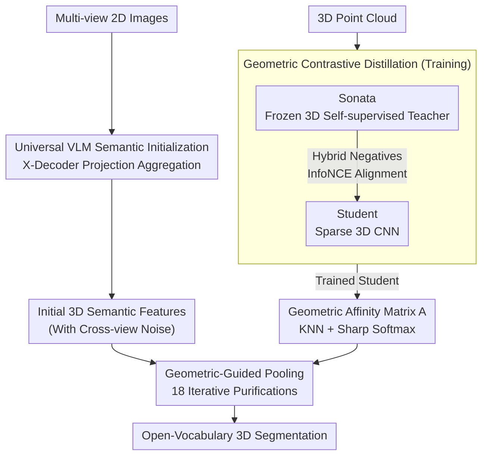

# GeoPurify: A Data-Efficient Geometric Distillation Framework for Open-Vocabulary 3D Segmentation

**Conference**: ICLR 2026  
**arXiv**: [2510.02186](https://arxiv.org/abs/2510.02186)  
**Code**: [Yes](https://github.com/tj12323/GeoPurify)  
**Area**: 3D Vision  
**Keywords**: Open-vocabulary 3D segmentation, Knowledge distillation, Geometric prior, VLM feature purification, Data-efficient

## TL;DR

Proposes the GeoPurify framework, which purifies noisy features projected from 2D VLMs into 3D by distilling geometric priors from a 3D self-supervised teacher model. It achieves or exceeds SOTA open-vocabulary 3D segmentation performance using only ~1.5% of the training data.

## Background & Motivation

Open-vocabulary 3D scene understanding aims to identify objects described by arbitrary text. The core challenge lies in a fundamental trade-off when transferring 2D VLM semantics to 3D:

**Training-free methods**: Directly project multi-view 2D predictions into 3D point clouds and merge them, resulting in severe geometric inconsistency.

**Training-based methods**: Learn point-level 3D-semantic mappings but require large-scale annotated data.

**Key Insight**: When VLM features transfer from 2D to 3D, geometric information is not destroyed but becomes latent. It can be extracted through efficient recovery means rather than learning 3D geometry from scratch.

## Method

### Overall Architecture

GeoPurify addresses the contradiction between geometric inconsistency after 2D VLM projection and the heavy reliance of training-based methods on large-scale labels. The approach completely decouples semantics and geometry. During the training phase, a Student Affinity Network mimics a frozen 3D self-supervised teacher (Sonata) via contrastive distillation to learn pure geometric point-to-point associations without any 3D semantic labels. During inference, a frozen 2D VLM (X-Decoder) generates initial noisy 3D semantic features. These are then refined using geometric-aware pooling based on the affinity provided by the pre-trained Student to "recover" latent geometric structures and purify projection noise. The architecture consists of two paths—one generating high-semantic but noisy features via VLM at inference, and another distilling a pure geometric Student during training—merging at "Geometric-Guided Pooling" where geometric relations correct semantic noise.

### Key Designs

**1. Universal VLM Semantic Initialization: Replacing the "segment-then-match" pipeline with a higher semantic ceiling**

GeoPurify bypasses traditional "segment-then-match" flows like LSeg or SAM+CLIP, adopting X-Decoder which follows a "segmentation is understanding" paradigm. Its unified vision-language embedding space naturally aligns segmentation and semantics, providing a higher semantic upper bound. For projection, corresponding 2D features are sampled from all visible views for each 3D point and weighted-averaged. While these features have strong semantics, the geometric inconsistency from cross-view aggregation is the target for subsequent purification.

**2. Geometric Contrastive Distillation: Learning category-agnostic geometric associations without semantic labels**

Geometric priors are derived from a frozen Sonata (a 3D self-supervised foundation model) providing a robust geometric target space. The Student, a trainable sparse 3D CNN, outputs 128-dimensional geometric embeddings to align with this target. The mechanism uses a hybrid negative sampling strategy: 48 Macro-negatives are taken from globally dissimilar points to force the Student to grasp overall scene structure; 16 Micro-negatives are taken from spatially close but feature-dissimilar points to distinguish fine-grained differences at object boundaries. Distillation uses InfoNCE contrastive loss with temperature $\tau = 0.07$, sampling 4096 anchors per scene. Since it aligns geometry without categories, the learned associations are category-agnostic, leading to strong cross-dataset transferability.

**3. Geometric-Guided Pooling: Iterative purification of VLM features using Student affinity during inference**

At inference, the Student network generates geometric embeddings for each voxel to construct a sparse affinity matrix $A$. This utilizes K-nearest neighbors and a sharpened softmax ($\alpha = 1/20$) to focus on truly adjacent geometric points. Initial VLM features then undergo iterative pooling $F^{(t+1)} = A \cdot F^{(t)}$ for $T=18$ iterations, allowing features to smooth along geometric relations and erase cross-view noise. Refined voxel features are mapped back to the original point cloud for final segmentation. Performance degrades if $T>18$ due to over-smoothing.

### Loss & Training

Training utilizes only the InfoNCE contrastive loss ($\tau = 0.07$). The optimizer is AdamW with a learning rate of $1\text{e-}3$, cosine annealing, for 50 epochs on a single NVIDIA L40. The training scale is minimal: only 20 scenes (approx. 1.6% of ScanNetV2) with no 3D semantic labels. These 20 scenes are selected based on a joint score of Shannon entropy (semantic complexity) and category count (semantic richness), using K-Means clustering to ensure environmental diversity.

## Key Experimental Results

### Main Results: Open-Vocabulary 3D Semantic Segmentation

| Method | Training Data | ScanNetV2 mIoU | ScanNetV2 mAcc | Matterport3D mIoU | Matterport3D mAcc |
|------|----------|----------------|----------------|--------------------|--------------------|
| OpenScene-3D | 100% | 51.6 | 63.1 | 40.5 | 48.8 |
| CUA-O3D (3D) | 100% | 54.1 | 64.1 | 41.3 | 49.5 |
| OV3D | 100% | 57.3 | 72.9 | 45.8 | 62.4 |
| CUA-O3D (Same Data) | ~1.5% | 18.1 | 26.4 | 14.0 | 20.5 |
| **GeoPurify (Ours)** | **~1.5%** | **55.1** | **72.5** | **40.2** | **62.4** |

### Cross-dataset Transfer

| Direction | OpenScene | CUA-O3D | **GeoPurify** |
|------|-----------|---------|---------------|
| ScanNetV2 -> Matterport3D mIoU | 36.0 | 37.4 | **40.5** |
| Matterport3D -> ScanNetV2 mIoU | 36.5 | 38.6 | **54.9** |

### Ablation Study

| Component | Setting | mIoU | mAcc |
|------|------|------|------|
| No Geometric Purification | Direct 2D feature aggregation | 50.2 | 68.1 |
| + GeoPurify | Full framework | **55.1** | **72.5** |
| 2D Backbone | LSeg | 48.6 | 61.6 |
| 2D Backbone | LSeg + GeoPurify | 51.2 | 63.0 |
| Sampling Strategy | Macro-negatives only | 53.5 | 70.8 |
| Sampling Strategy | Hybrid (Full) | **55.1** | **72.5** |
| Pooling Iterations | T=1 / T=18 / T=36 | 52.3 / **55.1** / 55.1 | 70.2 / **72.5** / 72.4 |
| No. of Training Scenes | 10 / 20 / 50 | 54.7 / **55.1** / 55.0 | 72.4 / **72.5** / 72.5 |

### Key Findings

1. **Extreme Data Efficiency**: Matches full-training competitors using 1.5% data (55.1 vs 54.1), whereas CUA-O3D drops to 18.1 under the same data constraints.
2. **Purification Gain of +4.9 mIoU**: Performance improves from 50.2 to 55.1.
3. **Critical Micro-negatives**: Provides a +1.6 mIoU gain in boundary precision.
4. **Saturation at 20 Scenes**: Significant improvement from 10 to 20 scenes, after which it largely converges.
5. **Superior Transferability**: Achieves 54.9 mIoU from Matterport3D to ScanNetV2, outperforming CUA-O3D by 16.3 points.

## Highlights & Insights

- **Recovering Latent Structure vs. Learning from Scratch**: The core hypothesis is insightful; 2D-to-3D transfer does not destroy geometric information.
- **Robustness of Decoupled Design**: Semantics are handled by VLM, geometry by the Student, each operating independently.
- **Class-agnostic Geometric Priors**: Geometric associations do not rely on semantic labels, resulting in exceptional cross-dataset transfer.
- **Data Selection Strategy**: Scene selection based on Shannon entropy is significantly more efficient than random selection.

## Limitations & Future Work

1. **Trade-off between mIoU and mAcc**: Geometric pooling improves recall but may cause semantic bleeding at boundaries.
2. **VLM-bound Upper Limit**: Performance saturates after 20 scenes; the bottleneck is the VLM semantic quality.
3. **Over-smoothing in Iterative Pooling**: Performance begins to degrade when $T>18$.
4. **Outdoor Scenarios**: Validation is currently limited to indoor benchmarks.

## Related Work & Insights

- **OpenScene**: Large-scale 3D knowledge distillation; GeoPurify rivals it with 1.5% data.
- **CUA-O3D**: Full-training SOTA; GeoPurify significantly outperforms it in low-data regimes.
- **Sonata**: The 3D self-supervised teacher providing geometric priors.
- **Insight**: Decoupling semantic and geometric learning may be the key paradigm for data-efficient 3D understanding.

## Rating

- Novelty: 4/5 - The hypothesis of recovering latent geometry and the decoupled framework are novel.
- Technical Depth: 4/5 - Sophisticated combination of contrastive distillation and geometric pooling.
- Experimental Thoroughness: 5/5 - Covers three major benchmarks, cross-dataset tests, and detailed ablations.
- Value: 5/5 - Achieving SOTA with 1.5% data has significant practical deployment value.

<!-- RELATED:START -->

## Related Papers

- [\[ICLR 2026\] OVSeg3R: Learn Open-vocabulary Instance Segmentation from 2D via 3D Reconstruction](ovseg3r_learn_open-vocabulary_instance_segmentation_from_2d_via_3d_reconstructio.md)
- [\[ECCV 2024\] Open Vocabulary 3D Scene Understanding via Geometry Guided Self-Distillation](../../ECCV2024/3d_vision/open_vocabulary_3d_scene_understanding_via_geometry_guided_self-distillation.md)
- [\[CVPR 2025\] Mosaic3D: Foundation Dataset and Model for Open-Vocabulary 3D Segmentation](../../CVPR2025/3d_vision/mosaic3d_foundation_dataset_and_model_for_open-vocabulary_3d_segmentation.md)
- [\[ICLR 2026\] PartSAM: A Scalable Promptable Part Segmentation Model Trained on Native 3D Data](partsam_a_scalable_promptable_part_segmentation_model_trained_on_native_3d_data.md)
- [\[AAAI 2026\] Retrieving Objects from 3D Scenes with Box-Guided Open-Vocabulary Instance Segmentation](../../AAAI2026/3d_vision/retrieving_objects_from_3d_scenes_with_box-guided_open-vocabulary_instance_segme.md)

<!-- RELATED:END -->
