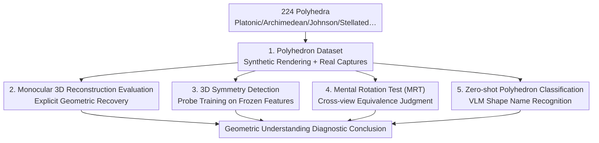

# GIQ: Benchmarking 3D Geometric Reasoning of Vision Foundation Models with Simulated and Real Polyhedra

**Conference**: ICLR 2026  
**arXiv**: [2506.08194](https://arxiv.org/abs/2506.08194)  
**Code**: [Yes](https://toomanymatts.github.io/giq-benchmark/)  
**Area**: 3D Vision  
**Keywords**: Geometric reasoning, benchmark, polyhedra, vision foundation models, VLM evaluation

## TL;DR

The GIQ benchmark dataset is proposed, comprising 224 synthetic and real polyhedra, to systematically evaluate the geometric reasoning capabilities of vision foundation models across four tasks: monocular 3D reconstruction, symmetry detection, mental rotation tests, and zero-shot classification, revealing significant deficiencies in current models' basic geometric understanding.

## Background & Motivation

While modern vision models perform exceptionally well on standard benchmarks, increasing evidence suggests a lack of true 3D geometric understanding:

**VLM perform poorly on spatial problems such as depth ordering**

**Monocular reconstruction algorithms struggle to reconstruct shapes outside the training distribution**

**Existing 3D evaluation datasets** (e.g., Objaverse) **lack precise geometric attribute annotations**

Polyhedra serve as ideal evaluation subjects due to their clear categorical definitions (Platonic, Archimedean, Johnson solids, etc.), precise symmetry groups, and hierarchical geometric complexity ranging from simple to complex.

## Method

### Overall Architecture

GIQ aims to determine whether current vision foundation models truly understand 3D geometry or merely learn textures and statistical patterns. Consequently, "mathematically perfectly defined" polyhedra are used as geometric litmus tests. Four complementary evaluation lines are established around 224 shapes—monocular 3D reconstruction, 3D symmetry detection, mental rotation tests, and zero-shot classification—to interrogate the models' geometric understanding at the levels of explicit reconstruction, implicit representation, cross-view discrimination, and high-level recognition. The entire benchmark is structured as an "accurate shape library fed into four parallel evaluation tasks": the dataset acts as a shared base, while the evaluation lines provide diagnostic perspectives on the current state of geometric understanding.

### Key Designs

**1. Polyhedron Dataset: Eliminating ambiguity in geometric attribute annotations with mathematically precise shapes**

Existing 3D datasets (e.g., Objaverse) lack precise geometric labels, making it difficult to rigorously diagnose geometric reasoning. GIQ collects 224 unique polyhedra with explicit category definitions and symmetry group annotations: 5 Platonic solids, 13 Archimedean solids (convex solids with regular polygon faces but not congruent), 13 dual Catalan solids, 92 Johnson solids (regular polygon faces but lacking vertex uniformity), as well as 48 stellated polyhedra, 4 Kepler-Poinsot solids, 10 compounds, and 53 non-convex uniform solids. Geometric complexity progresses hierarchically. Two sets of images are provided for each shape: synthetic images rendered at 256×256 using the Mitsuba physical renderer across 20 viewpoints, and real images of paper models captured with a Nikon D3500 at 6000×4000 across approximately 20 indoor and outdoor shots, thereby incorporating the "synthetic train → real test" domain gap.

**2. Monocular 3D Reconstruction: Testing if explicit geometric recovery withstands out-of-distribution shapes**

Single images are fed into methods such as Shap-E, Stable Fast 3D, and OpenLRM to recover complete 3D geometry. Results indicate a core pain point: even after training on millions of 3D assets, these models cannot reliably reconstruct attributes of basic shapes like cubes, suggesting they learn noisy surface priors rather than mathematically precise geometry.

**3. 3D Symmetry Detection: Judging if symmetry information is implicitly captured by encoders via linear/non-linear probes**

To bypass the uncertainty of generative reconstruction, this step directly examines whether geometric symmetry information is embedded within the frozen features of 12 encoders (DINOv2, SigLIP, CLIP, DINO, MAE, VGGT, DUSt3R, MASt3R, etc.). Probes are trained to detect center-point reflection, 4-fold, and 5-fold rotational symmetry. To account for class imbalance, a weighted BCE loss is used, where the weight for class $c$ is $w_c = (N - n_c) / n_c$ ($N$ is the total sample count, $n_c$ is the sample count for that class). Probes are trained on synthetic images and tested on real ones, with 5-fold cross-validation ensuring generalization at the shape level rather than specific instances.

**4. Mental Rotation Test (MRT): Evaluating cross-view shape equivalence based on cognitive science paradigms**

Following the Shepard & Metzler mental rotation paradigm, this line requires models to judge if two images (one synthetic, one real) represent the same polyhedron. This is implemented by taking the absolute difference of encoder embeddings and applying a non-linear probe for binary classification. A "hard split" specifically includes visually similar polyhedron pairs to challenge fine-grained discrimination capabilities. A user study with 42 participants was organized to establish a human baseline for comparison.

**5. Zero-shot Polyhedron Classification: Directly identifying shape names with frontier VLMs**

The final line tests frontier VLMs such as Claude 3.7, Gemini 2.5 Pro, and ChatGPT o3 / o4-mini-high in a zero-shot manner, comparing them against 3D native models like LLaVA-3D, ShapeLLM, and PointBind. This task uses standard classification loss and represents the high-level semantic recognition component of the benchmark.

## Key Experimental Results

### 3D Symmetry Detection (Synthetic Training -> Real Testing)

| Encoder | Center Reflection | 4-fold Rotation | 5-fold Rotation |
|---------|-------------------|-----------------|-----------------|
| DINOv2  | ~85%              | **~93%**        | ~80%            |
| SigLIP  | ~82%              | ~88%            | ~78%            |
| MAE     | ~65%              | ~70%            | ~60%            |

### Mental Rotation Test (Hard Split, syn-wild)

| Model | Accuracy |
|-------|----------|
| SigLIP (Non-linear probe) | **~69%** |
| DINOv2 | ~67% |
| Human Average | 68.05% |
| Human Best | 90% |
| Most Models | <60% |

### Main Results (Zero-shot Classification)

| Model | Platonic | Archimedean | Catalan | Johnson | Non-convex |
|-------|---------|-----------|----------|----------|--------|
| ChatGPT o3 | **100%** | ~50% | <20% | <20% | <20% |
| Gemini 2.5 Pro | ~80% | ~60% | <20% | <20% | <20% |
| Claude 3.7 | ~80% | ~40% | <20% | <20% | <20% |
| 3D Native Models | - | - | - | - | Not better than 2D VLMs |

### Ablation Study

- **Chain-of-Thought Prompting**: Minimal effect; models frequent hallucinate intermediate steps.
- **Multi-view Input**: Provides only a slight improvement for low-symmetry Johnson solids.
- **Linear vs. Non-linear probe**: Performance is comparable for symmetry detection.

### Key Findings

1. **Reconstruction Failure**: SOTA reconstruction methods cannot reliably reconstruct even a simple cube.
2. **Symmetry is Detectable**: Encoders like DINOv2 implicitly capture 3D symmetry information (up to 93% for 4-fold rotation).
3. **Insufficient Fine-grained Discrimination**: Most models perform near random levels on the hard mental rotation test.
4. **Systematic VLM Geometric Defects**: Models confuse convex and non-convex shapes, misidentify face types, and confuse compounds with stellated polyhedra.
5. **3D Native Models are not Superior**: Even with precise point clouds, they do not surpass general 2D VLMs.
6. **Significant Human Advantage**: 68% of human participants outperformed the best model.

## Highlights & Insights

- **Polyhedra as Geometric Litmus Paper**: Utilizing mathematically perfectly defined objects for rigorous evaluation.
- **Dissociation of Implicit and Explicit Geometric Understanding**: Encoders can detect symmetry via probes but fail at explicit reasoning tasks.
- **Inclusion of Human Baselines**: A 42-person user study provides meaningful comparison anchors.
- **Revealing Training Data Bias**: Reconstruction models learn noisy surface priors rather than mathematical precision.

## Limitations & Future Work

1. **Evaluation Limited to Polyhedra**: The generalization to arbitrary organic shapes requires further research.
2. **Limited Dataset Scale**: 224 shapes, with some categories having few samples.
3. **Absence of Improvement Strategies**: The work is purely diagnostic and does not design training methods to enhance geometric reasoning.
4. **Focus on Zero-shot Evaluation**: Few-shot or fine-tuning scenarios have not been explored.

## Related Work & Insights

- **Probing 3D Awareness** (El Banani et al., 2024): GIQ extends probing to symmetry.
- **Mental Rotation Test** (Shepard & Metzler, 1971): A classic paradigm borrowed from cognitive science.
- **Insight**: Existing models learn textures and statistical patterns rather than geometric essence; future work should introduce mathematically generated geometric data.

## Rating

- Novelty: 4/5 - The first systematic benchmark for geometric reasoning using polyhedra.
- Technical Depth: 3/5 - Primarily an evaluation work; methodological innovation is limited.
- Experimental Thoroughness: 5/5 - Four-dimensional evaluation, multi-model comparisons, and human baselines.
- Value: 4/5 - Provides a clear direction for improving the geometric understanding of vision models.

<!-- RELATED:START -->

## Related Papers

- [\[CVPR 2026\] GeoCodeBench: Benchmarking PhD-Level Coding in 3D Geometric Computer Vision](../../CVPR2026/3d_vision/benchmarking_phd-level_coding_in_3d_geometric_computer_vision.md)
- [\[CVPR 2026\] AVA-Bench: Atomic Visual Ability Benchmark for Vision Foundation Models](../../CVPR2026/3d_vision/ava-bench_atomic_visual_ability_benchmark_for_vision_foundation_models.md)
- [\[AAAI 2026\] Parameter-Free Fine-tuning via Redundancy Elimination for Vision Foundation Models](../../AAAI2026/3d_vision/parameter-free_fine-tuning_via_redundancy_elimination_for_vision_foundation_mode.md)
- [\[ECCV 2024\] Sapiens: Foundation for Human Vision Models](../../ECCV2024/3d_vision/sapiens_foundation_for_human_vision_models.md)
- [\[AAAI 2026\] VGGT-DP: Generalizable Robot Control via Vision Foundation Models](../../AAAI2026/3d_vision/vggt-dp_generalizable_robot_control_via_vision_foundation_models.md)

<!-- RELATED:END -->
