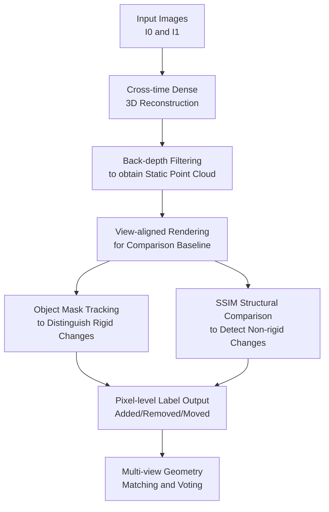

# GOLDILOCS: General Object-Level Detection and Labeling of Changes in Scenes

**Conference**: ICLR2026  
**OpenReview**: [https://openreview.net/forum?id=qbCceo3FBE](https://openreview.net/forum?id=qbCceo3FBE)  
**Code**: To be released  
**Area**: 3D Vision  
**Keywords**: Scene Change Detection, 3D Reconstruction, Object-level Change, Zero-shot Detection, Multi-view Consistency  

## TL;DR
GOLDILOCS reformulates cross-time scene change detection as a problem of "where the static 3D reconstruction hypothesis is violated," utilizing MASt3R for dense reconstruction, back-depth conflict filtering, SAM2 for mask tracking, and SSIM for structural differences to simultaneously detect and label object-level changes (added, removed, moved, warped) under zero-training conditions.

## Background & Motivation
**Background**: Scene Change Detection (SCD) typically takes images of the same scene at $T_0$ and $T_1$ and outputs regions where meaningful changes have occurred. Early deep learning methods treated this as binary or semantic segmentation, requiring training on specific datasets. Recent zero-shot methods leverage foundation models like SAM, SAM2, and DEVA to reduce labeling dependence. Another line of 3D methods models scenes using NeRF or 3D Gaussian Splatting and compares rendering results across time.

**Limitations of Prior Work**: The primary difficulty for 2D methods is viewpoint difference. Pixels of the same object (e.g., a chair or desk) can differ significantly if captured from different angles, leading image subtraction to misidentify viewpoint changes as real scene changes. Conversely, while 3D methods handle viewpoints explicitly, they often require multiple images and structured camera trajectories for both $T_0$ and $T_1$, along with time-consuming reconstruction, failing to degrade gracefully to the common "one old image + one new image" input.

**Key Challenge**: Change detection must resist capture viewpoint variations without demanding rigid acquisition conditions. Traditional methods view viewpoint difference as interference: 2D methods attempt to align it, while 3D methods require numerous views to digest it. The key inversion in GOLDILOCS is: if cross-time images have sufficient 3D overlap, the viewpoint difference itself provides geometric constraints; objects that actually change will cause conflicts in the static scene reconstruction.

**Goal**: The authors aim to solve for detailed object-level semantic changes rather than simple pixel differences: whether an object was removed, added, moved, or underwent non-rigid deformation (warped). The method must work without labels, without camera calibration, and support inputs ranging from image pairs to multi-view image sets.

**Key Insight**: Leveraging the static assumption of multi-view stereo reconstruction: if a region in two cross-time images belongs to the invariant background or a static object, it should be consolidatable into a consistent 3D structure. If an object is removed, added, or moved, the reconstruction model will generate depth conflicts, projection inconsistencies, or untrackable object masks in that region to explain the two images.

**Core Idea**: Replace "inter-image pixel differencing" with "geometric inconsistency in cross-time 3D reconstruction." First, reconstruct a canonical scene containing only shared static parts, then use object mask propagation and structural similarity comparisons to categorize change regions into specific object-level labels.

## Method

### Overall Architecture
The input to GOLDILOCS can be a pair of RGB images $I_0, I_1$ from $T_0, T_1$, or extended sets of multi-view images. It first uses dense stereo 3D reconstruction to estimate camera parameters and point clouds, then removes cross-time inconsistent geometry via back-depth testing to obtain a clean point cloud $P^*$ representing the static commonality. Subsequently, the original and clean point clouds are rendered to the target viewpoint. Using SAM2's segmentation and tracking, the method determines which object masks disappear from "original rendering" to "clean rendering" and whether they can be relocated in the target image, distinguishing between removed, added, and moved. For objects remaining in place but with internal structural changes, warped objects are detected via SSIM heatmaps.

The contribution nodes in this architecture correspond to the key designs: cross-time 3D reconstruction for point maps and cameras, back-depth filtering for a static reference without changes, view-aligned rendering to map 3D decisions back to 2D image space, and mask tracking with SSIM to handle rigid and non-rigid changes respectively. Multi-view input uses a pairwise pipeline on the best-matched reference view followed by cross-view voting to stabilize labels.

### Key Designs
**1. Cross-time Dense 3D Reconstruction: Converting Viewpoint Noise into Constraints**

The first step is not direct pixel comparison but using MASt3R to estimate dense 3D point maps $P_0, P_1 \in \mathbb{R}^{H \times W \times 3}$ and projection matrices $C_0, C_1 \in \mathbb{R}^{3 \times 4}$ from uncalibrated images. Camera intrinsics and extrinsics are contained within $C_i = K_i[R_i|t_i]$. Viewpoint variation is thus transformed into a geometric relationship that supports projection, re-rendering, and depth consistency checks. Since foundational models like MASt3R output geometry in an image-pair setting, GOLDILOCS avoids the need for pre-calibrated cameras or full scans.

**2. Back-depth Filtering: Isolating Changes and Occlusions via Geometric Conflict**

The core step is depth-aware point cloud cleaning. Given a world point $p \in P_i$ from image $I_i$, it is projected into the other view $I_j$ to yield pixel coordinates and camera depth: $(u, v, z_{i \to j}) = C_j p$. The reconstruction also provides a depth map $D_j$ for the target view. If $z_{i \to j} < D_j(u, v)$, the point lies in front of the observed surface in the target view, indicating it is likely a cross-time inconsistent occluder or change rather than a shared static structure. A clean point map $P_i^{Clean}$ is formed by points that do not cause such conflicts. Merging $P_0^{Clean}$ and $P_1^{Clean}$ into $P^*$ creates a canonical static reconstruction representing the furthest visible surfaces supported by both images.

**3. View-aligned Rendering: Translating 3D Static References into 2D Evidence**

GOLDILOCS renders point maps $P_i$ or clean point clouds $P^*$ using camera $C_j$ to produce images $R_{i,j}$ or $R^*_{j}$. For example, $R_{0,1}$ represents "reprojecting $T_0$ geometry and color into the $I_1$ viewpoint." This allows the algorithm to compare the original object, the static reference, and the ground truth target image within the same coordinate system, significantly reducing the interference of viewpoint differences on segmentation and tracking compared to pure 2D methods.

**4. Mechanism: Categorizing Changes as Added, Removed, Moved, or Warped**

For rigid changes, SAM2 generates and propagates masks. To detect objects present at $T_0$ that disappear or move by $T_1$, the method segments objects on $R_{0,1}$ to get $M_{R_{0,1}}$, then tracks these into the clean rendering $R^*_1$. Masks that fail to track into the static reference are considered change candidates: $M^{Changed}_{R_{0,1}} = M_{R_{0,1}} \setminus Track(M_{R_{0,1}}, R_{0,1} \to R^*_{1})$. If these candidates can be tracked into the actual $I_1$ at a different location, they are "moved"; otherwise, they are "removed." New "added" objects are detected via a reverse process. For non-rigid changes, the average SSIM dissimilarity is calculated for each static object mask; masks exceeding the mean structural difference by one standard deviation are labeled "warped."

### Loss & Training
GOLDILOCS is a training-free pipeline. It leverages fixed parameters from foundation models: MASt3R for geometry and SAM2 for segmentation. In multi-view extensions, target views select the top-1 reference view based on geometric matching (number of 3D correspondences). Final labels are determined via majority voting across viewpoints to reduce false positives.

## Key Experimental Results

### Main Results
Evaluation was conducted across datasets including ChangeSim, VL-CMU-CD, RC-3D, 3DGS-CD, and NeRFCD, covering zero-shot, multi-view, and binary/multi-class settings.

| Dataset | Metric | Ours | Representative Baseline | Conclusion |
|---------|--------|------|-------------------------|------------|
| ChangeSim | binary mIoU | 64.9 | C-3PO 59.6 / ZSSCD 57.2 | Outperforms supervised/zero-shot baselines |
| 3DGS-CD | F1 / IoU | 97.72 / 95.30 | 3DGS-CD 97.51 / 95.16 | Superior without auxiliary $T_1$ views |
| NeRFCD | F1 / IoU | 91.97 / 87.62 | Gaussian Diff. 91.90 / 85.74 | Best IoU with fewer views and less time |
| VL-CMU-CD | F1 | 61.8 | ZSSCD 51.6 / C-3PO 80.0 | Best zero-shot, below in-domain supervised |
| RC-3D | mAP | 0.53 | CYWS-3D RGB-D 0.50 | Outperforms RGB-D supervised baseline with RGB only |

### Ablation Study
| Configuration | ChangeSim mIoU | Explanation |
|---------------|----------------|-------------|
| Ours w/o 3D reconstruction | 24.3 | Performance drops significantly without geometric synthesis |
| Ours (Full) | 33.5 | Geometric pipeline provides +9.2 mIoU (~27.5% relative gain) |
| Ours w/o voting | (3DGS-CD) | High recall but many false positives |
| Ours + voting | (3DGS-CD) | Voting significantly improves precision and object consistency |

### Key Findings
- 3D reconstruction is critical for "removed" and "moved" categories. Without it, the "removed" IoU on ChangeSim drops from 21.1 to 11.2, proving that 2D tracking alone cannot distinguish disappearance from occlusion or viewpoint change.
- Cross-view voting primarily improves precision. Without voting, recall in 3DGS-CD is nearly 100%, but precision is low (~60%); voting filters transient noise, pushing precision above 95%.
- Efficiency is a major advantage. In the NeRFCD Potting scene, GOLDILOCS takes ~10.6 mins, whereas C-NeRF requires ~1056 mins and Gaussian Difference ~148.2 mins, as it avoids per-scene optimization.

## Highlights & Insights
- The most elegant insight is treating viewpoint difference as 3D evidence rather than noise.
- Back-depth filtering simplifies semantic change detection into a verifiable geometric conflict problem ($z_{i \to j} < D_j(u,v)$).
- The modular, training-free approach using MASt3R + SAM2 + SSIM provides high interpretability and clear failure modes.
- Object-level taxonomy (Added, Removed, Moved, Warped) is far more practical for real-world robotics and digital twin maintenance than binary masks.

## Limitations & Future Work
- Dependency on foundation models: MASt3R performance in low-texture or highly reflective environments directly affects geometric evidence.
- Warped detection remains heuristic: Average SSIM dissimilarity with a standard deviation threshold is sensitive to lighting and rendering artifacts. Future work could incorporate learned perceptual metrics or local surface curvature changes.
- Label priority may suppress nested changes: Stacked priorities (Warped > Moved > Removed > Added) might label a moving keyboard as "moved" while missing a specific keycap being "removed."
- Conservative strategy in occluded regions: If evidence is missing, the method remains silent, which limits recall in cluttered scenes but maintains high precision.

## Related Work & Insights
- **vs ZSSCD**: While ZSSCD is zero-shot, it resides in 2D. GOLDILOCS interprets changes through 3D consistency, making it robust to non-registered viewpoints.
- **vs C-NeRF / 3DGS-CD**: These require multiple auxiliary $T_1$ images for scene reconstruction. GOLDILOCS achieves comparable or better results with 0 auxiliary images using stereo reconstruction.
- This work suggests that many "semantic" tasks previously requiring depth or labels can be redefined through strong 3D foundation models and geometric consistency.

## Rating
- Novelty: ⭐⭐⭐⭐⭐ 
- Experimental Thoroughness: ⭐⭐⭐⭐☆ 
- Writing Quality: ⭐⭐⭐⭐☆ 
- Value: ⭐⭐⭐⭐⭐ 

<!-- RELATED:START -->

## Related Papers

- [\[CVPR 2026\] Zoo3D: Zero-Shot 3D Object Detection at Scene Level](../../CVPR2026/3d_vision/zoo3d_zero-shot_3d_object_detection_at_scene_level.md)
- [\[CVPR 2026\] Changes in Real Time: Online Scene Change Detection with Multi-View Fusion](../../CVPR2026/3d_vision/changes_in_real_time_online_scene_change_detection_with_multi-view_fusion.md)
- [\[CVPR 2026\] ChronoGS: Disentangling Invariants and Changes in Multi-Period Scenes](../../CVPR2026/3d_vision/chronogs_disentangling_invariants_and_changes_in_multi-period_scenes.md)
- [\[ECCV 2024\] Dual-level Adaptive Self-Labeling for Novel Class Discovery in Point Cloud Segmentation](../../ECCV2024/3d_vision/dual-level_adaptive_self-labeling_for_novel_class_discovery_in_point_cloud_segme.md)
- [\[ICLR 2026\] Fore-Mamba3D: Mamba-based Foreground-Enhanced Encoding for 3D Object Detection](fore-mamba3d_mamba-based_foreground-enhanced_encoding_for_3d_object_detection.md)

<!-- RELATED:END -->
