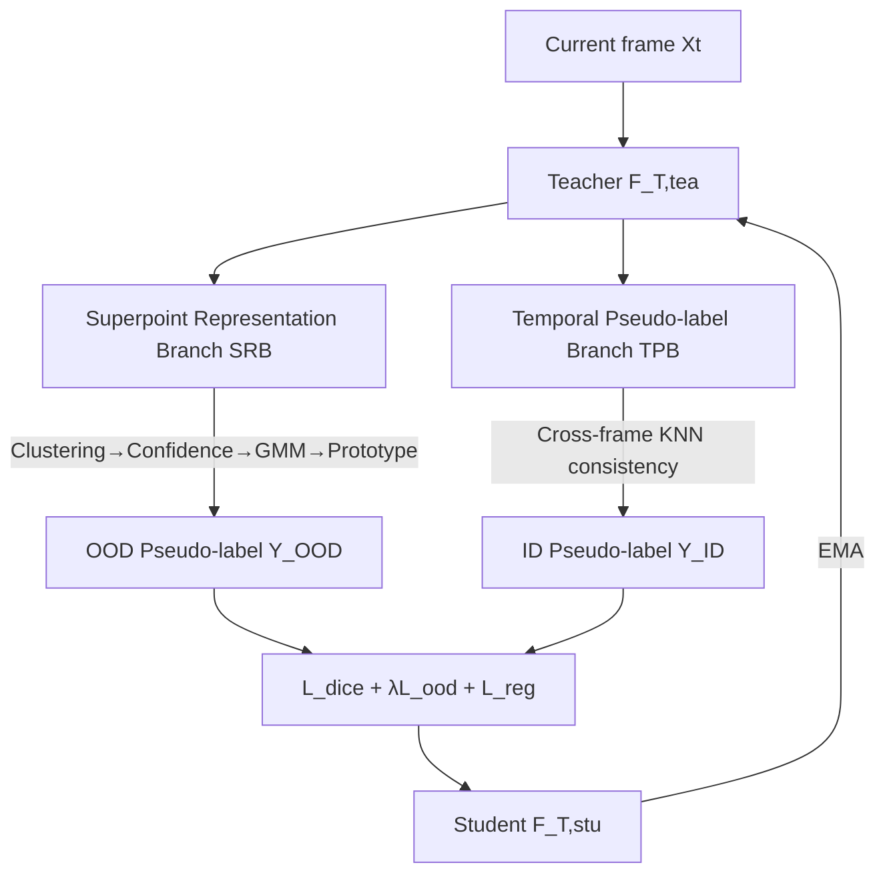

# GOOD: Geometry-guided Out-of-Distribution Modeling for Open-set Test-time Adaptation in Point Cloud Semantic Segmentation

**Conference**: ICLR 2026  
**OpenReview**: [https://openreview.net/forum?id=HyNWlZd4iO](https://openreview.net/forum?id=HyNWlZd4iO)  
**Code**: TBD  
**Area**: 3D Vision / Point Cloud Semantic Segmentation / Test-time Adaptation  
**Keywords**: Open-set Test-time Adaptation, Point Cloud Semantic Segmentation, OOD Detection, Superpoint, Geometric Priors, Mean-teacher  

## TL;DR
This work shifts Open-set Test-time Adaptation (OSTTA) from "point-wise" to "geometrically connected superpoint" granularity. It utilizes superpoint purity and entropy confidence combined with a GMM to distinguish ID/OOD, supplemented by superpoint ID prototypes for error correction. This addresses the severe class imbalance in 3D point clouds where ID points are overwhelming while OOD points are sparse or absent.

## Background & Motivation
- **Background**: Test-time Adaptation (TTA) allows online model updates using unlabeled target data during deployment to mitigate covariate shift. However, most TTA methods only handle distribution shifts of known classes, ignoring **semantic shift**—the emergence of unseen classes in the target domain. In safety-critical scenarios like autonomous driving, misclassifying unknown dynamic objects (bicycles, cyclists) as static vegetation can lead to serious accidents.
- **Limitations of Prior Work**: Existing OSTTA methods on 2D images perform poorly when directly applied to 3D point cloud semantic segmentation for two reasons: (1) 2D methods operate at the **instance level**, losing critical 3D geometric priors and spatial correlations; (2) they generally assume the presence of **sufficient OOD samples** to assist in ID/OOD discrimination.
- **Key Challenge**: In 3D point clouds, ID points (roads, vegetation, buildings) are overwhelmingly numerous, while OOD points (pedestrians, bicycles) are extremely sparse or even entirely absent in many frames. Point-wise OSTTA methods under such extreme imbalance tend to misclassify a large number of ID points as OOD, degrading segmentation performance—experimental results show +WCEM pushes FPR95 to 100.0.
- **Goal**: This paper presents the first systematic study of Open-set Test-time Adaptation for 3D point cloud semantic segmentation (OSTTA-3DSeg), aiming to accurately segment known classes and reliably reject unknown classes under severe ID-OOD imbalance.
- **Key Insight**: **Shift from point-level to superpoint-level recognition**. By clustering spatially and geometrically connected points into superpoints, the recognition task changes from "individual points" to "superpoints," naturally mitigating point-count imbalance. Geometric and temporal consistency are then used to generate reliable confidence scores and pseudo-labels.

## Method

### Overall Architecture
GOOD is built on a mean-teacher EMA self-training framework: the teacher model generates pseudo-labels, the student model is optimized online based on these labels, and the student updates the teacher via EMA. The teacher side includes two branches—the **Superpoint Representation Branch (SRB)** clusters points into superpoints and distinguishes ID/OOD, and the **Temporal Pseudo-label Branch (TPB)** generates stable pseudo-labels for ID classes based on cross-frame consistency; a temporal feature regularization term is also included. The OOD and ID pseudo-labels drive the Dice loss + OOD entropy loss + regularization loss for test-time optimization.

### Key Designs

**1. Superpoint Clustering: Reducing imbalance from point-level to superpoint-level.** Unlike indoor scenes, outdoor LiDAR objects often separate naturally once the ground is removed, providing a geometric basis for "segment-before-recognize." GOOD constructs superpoints using a three-step learning-free pipeline: first, current and historical frames are aligned and overlaid using ego-poses to create a denser point cloud and improve structural continuity; second, a RANSAC-based ground removal is performed (fitting small patches to handle slope variations); finally, DBSCAN is run on the remaining points. DBSCAN is selected as it requires no predefined cluster count, identifies arbitrary shapes, and is robust to noise. This reduces the task from $N$ points to $K$ superpoints, effectively leveling the ID-OOD imbalance.

**2. Superpoint Confidence + GMM: Distinguishing ID/OOD superpoints.** The intuition is that ID superpoints exhibit higher geometric and temporal consistency than OOD superpoints. **Superpoint purity** is defined as $C^{pur}_k = 1 - \frac{1}{\log C}\sum_{c=1}^{C} P_{k,c}\log P_{k,c}$, where $P_{k,c}=\frac{1}{N_k}\sum_{j\in N_k}\hat{y}_{j,c}$ is the normalized distribution of one-hot labels, measuring internal class homogeneity. To address cases where points only "weakly prefer" a class, **superpoint entropy** $C^{ent}_k$ is introduced—using soft softmax outputs instead of $\mathbb{1}_c(\arg\max)$ to capture distribution uncertainty. The final score $C^{sup}_k = C^{ent}_k \cdot C^{pur}_k$ balances open/closed-set needs. Since $C^{sup}_k$ exhibits a bimodal distribution, a two-component GMM $G(x)=\pi(x)\mathcal{N}(x|\mu_{ID},\sigma^2_{ID})+(1-\pi(x))\mathcal{N}(x|\mu_{OOD},\sigma^2_{OOD})$ is used to model it. Superpoints below $\mu_{OOD}$ are classified as OOD, and those above $\mu_{ID}$ as ID.

**3. Superpoint ID Prototypes: Correcting over-segmentation when OOD is absent.** GMM only utilizes classifier logits and its "hard partitioning" forces each frame to contain both ID and OOD superpoints—causing over-segmentation of ID regions when OOD is absent. Based on the observation that ID superpoints are more stable, the method maintains a prototype for each ID class $\rho^t_c = \frac{1}{N_c}\sum_k z^t_k$ (centroid of ID superpoint embeddings), updated via EMA: $\hat{\rho}^t_c = \alpha\hat{\rho}^{t-1}_c + (1-\alpha)\rho^t_c$ ($\alpha=0.99$). Superpoints flagged as OOD by the GMM are corrected if their cosine similarity to an ID prototype exceeds a threshold: $\hat{s}_k = \text{ID}$ if $\text{sim}(z^t_k,\hat{\rho}^t_c)\ge\tau$.

**4. Temporal Pseudo-labels + Feature Reg: Stable supervision for ID classes.** Unlike existing TTA-3DSeg methods that use single frames, TPB projects the current and $w$ previous frames into a global coordinate system. For each point, K-NN finds a temporal neighborhood to aggregate a neighbor label $\hat{y}^{t,Ne}_i$. An ID pseudo-label $\hat{y}^t_{i,ID}$ is assigned **only when the current prediction matches the temporal neighborhood prediction**, $\hat{y}^t_{i,ID}=y^{t,Ne}_i\ \text{s.t.}\ \hat{y}^t_i=\hat{y}^{t,Ne}_i$, excluding areas overlapping with OOD pseudo-labels. Temporal regularization $L_{reg}$ uses bidirectional negative cosine distance to constrain feature consistency across adjacent frames. The final objective is $L_{final}=L_{dice}+L_{reg}+\lambda L_{ood}$, where OOD entropy loss $L_{ood}=-\frac{1}{\|S_{OOD}\|}\sum_{x\in S_{OOD}}H(F_{T,stu}(x))$ supervises OOD superpoints.

## Key Experimental Results

### Main Results (Synth4D → SemanticKITTI, Selected)

| Method | mIoU(↑) | AUROC(↑) | FPR95(↓) |
|------|---------|----------|----------|
| Source | 40.26 | 65.80 | 78.39 |
| GIPSO | +2.08 | 64.47 | 80.40 |
| GIPSO+UniEnt | +1.17 | 64.90 | 82.27 |
| GIPSO+WCEM | +2.16 | 53.01 | 100.0 |
| **GIPSO+GOOD** | **+4.88** | **74.76** | **73.30** |
| HGL | +2.90 | 64.40 | 79.82 |
| HGL+WCEM | +3.38 | 59.07 | 100.0 |
| **HGL+GOOD** | **+5.31** | **75.31** | **71.31** |

When integrated with HGL, GOOD improves mIoU/AUROC/FPR95 by 1.93%, 8.99%, and 7.91% respectively. In contrast, 2D OSTTA methods (+UniEnt/+WCEM) typically lower AUROC and push FPR95 to 100.0, validating that point-wise OSTTA collapses under 3D imbalance.

### Main Results (Synth4D → nuScenes, Selected)

| Method | mIoU(↑) | AUROC(↑) | FPR95(↓) |
|------|---------|----------|----------|
| Source | 35.59 | 60.44 | 76.97 |
| GIPSO | +0.48 | 58.66 | 78.75 |
| GIPSO+WCEM | +1.01 | 57.80 | 83.51 |
| **GIPSO+GOOD** | **+1.67** | **62.95** | **73.25** |
| HGL | +0.51 | 57.67 | 82.01 |
| **HGL+GOOD** | **+2.62** | **62.20** | **74.82** |

On the sparser real-world data of nuScenes, 2D OSTTA methods consistently cause AUROC to drop below the baseline, whereas GOOD is the only method to simultaneously improve mIoU and AUROC while reducing FPR95.

### Key Findings
- **Plug-and-play**: GOOD provides stable, significant improvements when integrated into both GIPSO and HGL architectures, indicating it is an orthogonal open-set enhancement module.
- **Granularity is key**: Superpoint granularity is the decisive factor for 3D OSTTA. Point-wise methods frequently hit 100.0 FPR95, while the superpoint approach reduces it to 71–73.
- Conclusions were consistent across four benchmarks, including SynLiDAR → SemanticKITTI (18 fine-grained classes).

## Highlights & Insights
- **Novel Problem Definition**: This is the first work to introduce Open-set Test-time Adaptation to 3D point cloud semantic segmentation (OSTTA-3DSeg), identifying that the 3D-specific "ID dominance vs. OOD sparsity/absence" is the root cause for the failure of 2D OSTTA methods.
- **Smart Granularity Shift**: Shifting the recognition task to geometrically connected superpoints via a learning-free "frame-stacking → ground-removal → DBSCAN" pipeline flattens extreme class imbalance without increasing training costs.
- **Targeted Patch for GMM Failure**: The use of superpoint ID prototypes addresses the over-segmentation issue where GMM forces OOD presence in every frame, leveraging the empirical observation that ID classes are more stable than OOD.

## Limitations & Future Work
- **Dependency on Ego-pose**: Frame-stacking and temporal pseudo-labels assume reliable ego-poses. Performance degrades when poses are noisy, which is a potential risk in poorly estimated scenarios.
- **Heuristics and Hyperparameters**: RANSAC sub-regions, DBSCAN parameters, GMM thresholds $\mu_{ID}/\mu_{OOD}$, prototype threshold $\tau$, and EMA coefficients require empirical tuning, which may affect robustness during cross-domain migration.
- **Outdoor LiDAR Specificity**: The method relies on the outdoor assumption that objects naturally separate after ground removal, which may not hold in dense indoor scenes or non-LiDAR modalities.
- **Reliability Gap**: While state-of-the-art, an AUROC of ~75 and FPR95 of ~71 still leave a gap for high-reliability safety deployment.

## Related Work & Insights
- **TTA-3DSeg**: GIPSO was the first TTA for 3D segmentation, using confidence sorting; HGL used local-global strategies. GOOD is orthogonal to these.
- **2D OSTTA**: Methods like UniEnt and WCEM perform online OOD detection on images but collapse in 3D due to instance-level processing and balanced OOD assumptions.
- **OOD Detection**: GOOD upgrades traditional confidence measurements (MSP, energy) to superpoint-level geometric confidence.
- **Insight**: For open-set problems with extreme class imbalance, "changing recognition granularity" is often more effective than "tuning loss/thresholds"; geometric priors are a "free lunch" in 3D tasks to alleviate imbalance.

## Rating
- **Novelty**: ⭐⭐⭐⭐ First to propose and systematically solve OSTTA-3DSeg; the combination of superpoint shift and ID prototypes targets the core 3D pain point.
- **Experimental Thoroughness**: ⭐⭐⭐⭐ Four benchmarks and two backbones compared against various 2D/3D methods. The 100.0 FPR95 phenomenon in baselines is very telling.
- **Writing Quality**: ⭐⭐⭐⭐ Clear motivation, well-dissected method branches, and logical flow.
- **Value**: ⭐⭐⭐⭐ Addresses a high-demand problem in safety-critical autonomous driving with a low-barrier, plug-and-play approach.

<!-- RELATED:START -->

## Related Papers

- [\[ICLR 2026\] Open-Set Semantic Gaussian Splatting SLAM with Expandable Representation](open-set_semantic_gaussian_splatting_slam_with_expandable_representation.md)
- [\[ICLR 2026\] Test-Time Optimization of 3D Point Cloud LLM via Manifold-Aware In-Context Guidance and Refinement](test-time_optimization_of_3d_point_cloud_llm_via_manifold-aware_in-context_guida.md)
- [\[ICLR 2026\] SpaceControl: Introducing Test-Time Spatial Control to 3D Generative Modeling](spacecontrol_introducing_test-time_spatial_control_to_3d_generative_modeling.md)
- [\[ICCV 2025\] A Unified Interpretation of Training-Time Out-of-Distribution Detection](../../ICCV2025/3d_vision/a_unified_interpretation_of_training-time_out-of-distribution_detection.md)
- [\[ICLR 2026\] Generative Human Geometry Distribution](generative_human_geometry_distribution.md)

<!-- RELATED:END -->
