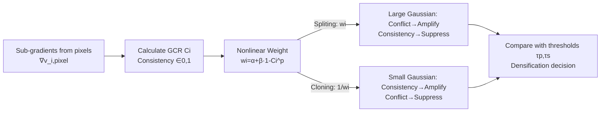

# Gradient-Direction-Aware Density Control for 3D Gaussian Splatting

**Conference**: ICLR 2026  
**Code**: https://github.com/zzcqz/GDAGS  
**Area**: 3D Vision / Novel View Synthesis / 3D Gaussian Splatting  
**Keywords**: 3D Gaussian Splatting, Adaptive Density Control, Gradient Direction, Over-reconstruction, Over-densification, Novel View Synthesis  

## TL;DR
GDAGS identifies that 3DGS density control considers only the "magnitude" of view-space gradients while ignoring the "direction." It proposes the Gradient Consistency Ratio (GCR) and a nonlinear dynamic weighting rule to prioritize splitting large Gaussians with direction conflicts and cloning small Gaussians with consistent directions. This simultaneously alleviates over-reconstruction and over-densification, achieving comparable or better rendering quality while significantly reducing memory consumption.

## Background & Motivation
**Background**: 3D Gaussian Splatting (3DGS) explicitly represents scenes using a set of learnable anisotropic Gaussian ellipsoids. Coupled with adaptive density control (splitting large Gaussians and cloning small ones based on gradient thresholds), it achieves real-time, high-fidelity novel view synthesis, two orders of magnitude faster than NeRF. Density control is the critical factor for 3DGS quality.

**Limitations of Prior Work**: The densification criterion in 3DGS only compares the norm of the view-space position gradient $\nabla_{\mu_i}L$ against a threshold. However, the norm is influenced by gradient directions—since one Gaussian covers many pixels, sub-gradients returned from each pixel amplify the norm when directions are consistent and cancel it out when they conflict. This leads to two opposite pathologies: (1) **Over-reconstruction**—large Gaussians covering expansive areas fail to split because conflicting sub-gradients push the aggregate norm below the threshold, causing local blurring; (2) **Over-densification**—regions with consistent directions continuously amplify gradients, triggering redundant densification and creating excessive Gaussians, which leads to memory bloat.

**Key Challenge**: Existing improvements often sacrifice one aspect for another. AbsGS forces all sub-gradients to be positive to eliminate conflicts, which mitigates over-reconstruction but amplifies noise/outlier gradients, worsening over-densification. Pixel-GS uses pixel coverage weighting for spatial adaptivity but ignores direction, still over-densifying in areas with large but consistent gradients. **The missing element is explicitly extracting "gradient direction" as a decision signal rather than allowing it to implicitly perturb the norm.**

**Goal**: Design a density control framework that incorporates both gradient direction and magnitude into the criterion. The goal is to prioritize splitting for large Gaussians with direction conflicts (actual under-reconstruction) and suppress those with consistent directions; conversely, for cloning, prioritize small Gaussians with consistent directions and suppress those with conflicts, thereby solving both over-reconstruction and over-densification to build a compact representation.

**Core Idea**: **Quantify direction consistency (GCR), and then use a nonlinear weight function—sensitive to conflicts and inhibitory to consistency—to re-calibrate the gradient norm, applying inverse weighting strategies for splitting and cloning.**

## Method

### Overall Architecture
GDAGS maintains the Gaussian parameterization and differentiable rasterization of 3DGS, replacing only the metric used in the density control step. The process involves three steps: first, calculating the GCR for each Gaussian to measure direction consistency across pixels; second, feeding the GCR into a nonlinear dynamic weight function; third, re-calibrating the view-space gradient norm using this weight to form a new decision metric. Critically, splitting uses the weight $w_i$, while cloning uses its reciprocal $1/w_i$, allowing the same GCR signal to drive opposite preferences for the two operations.

### Key Designs

**1. Gradient Consistency Ratio (GCR): Decoupling direction from magnitude.** For each Gaussian $i$ observed across $V$ views, $C_i=\dfrac{\lVert\sum_{\text{pixel}}\nabla^v_{i,\text{pixel}}\rVert_2}{\sum_{\text{pixel}}\lVert\nabla^v_{i,\text{pixel}}\rVert_2+\epsilon}$ is defined, where $\nabla^v_{i,\text{pixel}}\in\mathbb{R}^2$ is the sub-gradient component projected onto each pixel. The denominator represents total activity by summing magnitudes regardless of direction; the numerator represents net alignment by taking the norm of the vector sum. By the Cauchy-Schwarz inequality $0\le\lVert\sum\nabla\rVert_2\le\sum\lVert\nabla\rVert_2$, $C_i$ is strictly constrained to $[0,1]$ and naturally cancels out magnitude factors. $C_i\to1$ indicates high alignment (amplification), while $C_i\to0$ indicates conflict (cancellation). This step explicitly quantifies the "direction" that 3DGS implicitly blends into the norm.

**2. Nonlinear Dynamic Weight: Sensitivity to conflict and suppression of consistency.** Linear weighting lacks sufficient expressiveness to suppress consistent Gaussians or detect critical conflicts. The authors design $w_i=\alpha+\beta\cdot(1-C_i)^p$, where $\alpha$ is a base suppression factor and $\beta$ is an amplification factor. The power-law term $(1-C_i)^p$ ensures the weight is much more sensitive to changes when $C_i$ is low (conflicting), accurately identifying large Gaussians that require refinement; as $C_i$ increases, the weight decays rapidly to prevent redundant operations. The re-calibrated norm $\tilde\nabla_{\mu_i}L=w_i\cdot\nabla_{\mu_i}L$ replaces the original in all criteria. Implementation uses $\alpha=0.8,\ \beta=25,\ p=15$.

**3. Opposite Weighting for Splitting/Cloning: One signal, two needs.** For splitting (targeting large Gaussians), $w_i$ is used directly: low GCR (conflicts, often under-reconstructed geometry) is amplified to encourage fragmentation, while high GCR is suppressed. For cloning (targeting small Gaussians), the reciprocal $1/w_i$ is used: high GCR cloning allows smooth propagation along gradient directions to fill structures and is encouraged, while low GCR cloning, which would merely result in local stacking, is suppressed. This asymmetric "split prefers conflict, clone prefers consistency" design is central to addressing both pathologies. Moreover, $p$ acts as a knob to balance performance and efficiency; sensitivity analysis shows $p$ has a greater impact on quality and memory than $\beta$.

## Key Experimental Results

Datasets: All 9 indoor/outdoor scenes from Mip-NeRF360, Train/Truck from Tanks&Temples, and drJohnson/playroom from Deep Blending (13 total); single RTX 4090; 3DGS training settings (densification every 100 iterations, stopping at 15k, total 30k iterations).

### Main Results Table (Mem indicates memory for Gaussian parameters)

| Dataset | Method | SSIM↑ | PSNR↑ | LPIPS↓ | Mem↓ |
|---|---|---|---|---|---|
| Mip-NeRF360 | 3DGS | 0.815 | 27.21 | 0.214 | 734MB |
| | Pixel-GS | 0.832 | 27.72 | 0.178 | 1.2GB |
| | AbsGS | 0.820 | 27.49 | 0.191 | 728MB |
| | **GDAGS** | **0.839** | **28.02** | **0.145** | 515MB |
| Tanks&Temples | 3DGS | 0.841 | 23.14 | 0.183 | 411MB |
| | Pixel-GS | 0.853 | 23.74 | 0.150 | 1.05GB |
| | Taming 3DGS | 0.851 | **24.04** | 0.170 | 411MB |
| | **GDAGS** | **0.854** | 23.79 | 0.165 | 226MB |
| Deep Blending | 3DGS | 0.903 | 29.41 | 0.243 | 676MB |
| | AbsGS | 0.902 | 29.67 | 0.236 | 444MB |
| | **GDAGS** | 0.905 | 29.70 | **0.235** | 388MB |

Key Takeaway: On Mip-NeRF360, GDAGS ranks first across all metrics, with LPIPS significantly dropping from 0.214 to 0.145. It uses less than half the memory of Pixel-GS (515MB vs 1.2GB). Across datasets, it generally achieves comparable or better quality using **20%–50% of the memory** of Pixel-GS.

### Ablation Study Table (Mip-NeRF360)

| Method | SSIM↑ | PSNR↑ | LPIPS↓ | Mem↓ |
|---|---|---|---|---|
| 3DGS | 0.815 | 27.21 | 0.214 | 734MB |
| GDAGS-L (Linear weight $w_i=2-C_i$) | 0.814 | 27.55 | 0.248 | 713MB |
| GDAGS-S (Splitting weight only) | 0.819 | 27.52 | 0.240 | 441MB |
| GDAGS-C (Cloning weight only) | 0.812 | 27.46 | 0.217 | 615MB |
| **GDAGS (Full)** | **0.839** | **28.02** | **0.145** | 515MB |

### Key Findings
- **Splitting weight (GDAGS-S) mainly improves SSIM/LPIPS and significantly saves memory** (734MB→441MB), confirming it suppresses over-densification. **Cloning weight (GDAGS-C) mainly improves PSNR but increases memory**, as structural filling creates more Gaussians. Combining both achieves the optimal balance.
- **Nonlinear weight is vastly superior to the linear version (GDAGS-L)**: the linear version worsened LPIPS to 0.248, indicating that translating direction consistency into a control signal requires nonlinear mapping sensitive to conflicts.
- Sensitivity analysis shows $p$ has a stronger influence on quality and memory than $\beta$, serving as the primary knob for the performance-efficiency trade-off.

## Highlights & Insights
- **Accurate Diagnosis**: It unifies two opposing issues (over-reconstruction vs. over-densification) by noting that "criteria only use gradient magnitude, implicitly swallowing direction," successfully explaining the limitations of AbsGS and Pixel-GS.
- **Clever GCR Design**: Using Cauchy-Schwarz to normalize direction consistency to $[0,1]$ and decouple magnitude provides a dimensionless scalar that extracts "direction" cleanly with almost zero extra parameters.
- **Asymmetric Weighting**: Using $w_i$ for splitting and $1/w_i$ for cloning allows a single signal to serve two opposite needs, which is the key to toggling both "switches" simultaneously rather than fixing one at the expense of the other.
- **Memory Efficiency as a Core Value**: Achieving equivalent or better quality while being significantly more efficient than Pixel-GS is highly valuable for real-world deployment.

## Limitations & Future Work
- **Reliance on Sufficient Gradient Info**: The method assumes most Gaussians receive enough gradients across views. GCR estimation might degrade in textureless areas, sparse views, or heavy occlusions, which was not extensively discussed.
- **Hyperparameter Sensitivity**: The three hyperparameters ($\alpha,\beta,p$), especially the large $p=15$, significantly impact results. Their robustness across scenes and potential for self-adaptation require further validation.
- **Not SOTA in All Dimensions**: PSNR is slightly lower than Taming 3DGS/AbsGS on Tanks&Temples/Deep Blending. The main value proposition is "quality-memory trade-off" rather than pure quality dominance.
- **Overhead of Per-pixel Sub-gradients**: The computational and memory cost of accumulating sub-gradient statistics per pixel during training was not quantified.

## Related Work & Insights
- **Comparison with AbsGS**: While AbsGS uses absolute values to "eliminate conflict," GDAGS does the opposite by explicitly utilizing direction. This proves that "retaining and distinguishing direction" is more effective than "flattening" it.
- **Comparison with Pixel-GS**: Pixel-GS views the problem from a magnitude/spatial perspective (pixel coverage). GDAGS complements this with an orthogonal "directional" perspective; the two approaches could be combined.
- **Broader Density Control Taxonomy**: Various methods (GOF, ReAct-GS, PSRGS, etc.) modify densification criteria. GDAGS offers the insight that **any adaptive mechanism based on "gradient norm vs. threshold" should question whether direction is being quietly sabotaged by the norm.**
- This idea of "explicitly extracting structural information swallowed by a norm/scalar before making decisions" is transferable to other adaptive structures triggered by gradient magnitude, such as deformable mesh subdivision or point cloud upsampling.

## Rating
- **Novelty**: ⭐⭐⭐⭐ — The diagnosis of direction being swallowed by the norm and the GCR+asymmetric nonlinear solution is clear and novel within the 3DGS context.
- **Experimental Thoroughness**: ⭐⭐⭐⭐ — 13 scenes across 3 datasets, comparison with multiple baselines, and extensive ablations/sensitivity tests; lacks quantification of training overhead and analysis of textureless degradation.
- **Writing Quality**: ⭐⭐⭐⭐ — Problem attribution, schematic diagrams in Figs 1/2, and derivations are self-consistent and easy to follow.
- **Value**: ⭐⭐⭐⭐ — Directly valuable for 3DGS deployment by saving memory while maintaining quality; the method is essentially plug-and-play.

<!-- RELATED:START -->

## Related Papers

- [\[ECCV 2024\] Pixel-GS: Density Control with Pixel-aware Gradient for 3D Gaussian Splatting](../../ECCV2024/3d_vision/pixel-gs_density_control_with_pixel-aware_gradient_for_3d_gaussian_splatting.md)
- [\[ICLR 2026\] MoE-GS: Mixture of Experts for Dynamic Gaussian Splatting](moe-gs_mixture_of_experts_for_dynamic_gaussian_splatting.md)
- [\[NeurIPS 2025\] DC4GS: Directional Consistency-Driven Adaptive Density Control for 3D Gaussian Splatting](../../NeurIPS2025/3d_vision/dc4gs_directional_consistency-driven_adaptive_density_control_for_3d_gaussian_sp.md)
- [\[CVPR 2026\] STAvatar: Soft Binding and Temporal Density Control for Monocular 3D Head Avatars Reconstruction](../../CVPR2026/3d_vision/stavatar_soft_binding_and_temporal_density_control_for_monocular_3d_head_avatars.md)
- [\[ICLR 2026\] Signal Structure-Aware Gaussian Splatting for Large-Scale Scene Reconstruction](signal_structure-aware_gaussian_splatting_for_large-scale_scene_reconstruction.md)

<!-- RELATED:END -->
