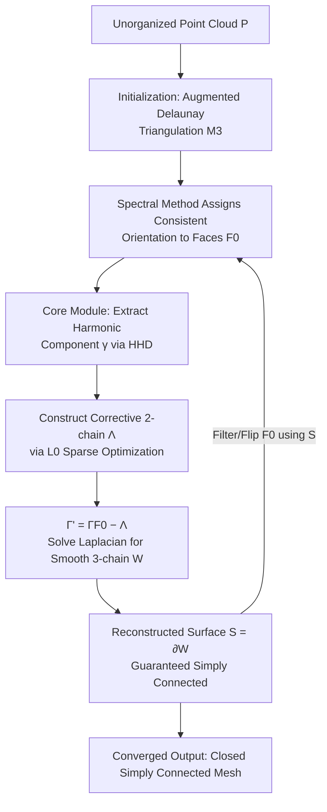

# Guaranteed Simply Connected Mesh Reconstruction from an Unorganized Point Cloud

**Conference**: ICLR 2026  
**OpenReview**: [https://openreview.net/forum?id=jjEnTBsffi](https://openreview.net/forum?id=jjEnTBsffi)  
**Code**: TBD  
**Area**: 3D Vision / Surface Reconstruction  
**Keywords**: Surface Reconstruction, Point Cloud, Winding Number Field, Helmholtz-Hodge Decomposition, Topological Control, Simply Connected  

## TL;DR
Closed triangle meshes are reconstructed from noisy point clouds with an algebraic **guarantee** of simple connectivity (homeomorphic to a 2-sphere) via Helmholtz-Hodge Decomposition (HHD), filling the gap in topological control for existing methods.

## Background & Motivation
**Background**: Reconstructing 3D meshes from noisy point clouds is a fundamental problem in computer graphics. Existing methods fall into two categories: computational geometry methods (Delaunay/Voronoi) with theoretical guarantees on clean data, and implicit function methods (Poisson, DeepSDF, SIREN, IPSR, SAL/SALD) with high geometric fidelity.

**Limitations of Prior Work**: All methods focus primarily on geometric fitting, but **none can guarantee the topological structure of the reconstruction**. In medical scenarios like organs and vessels, which must be simply connected (path-connected without non-trivial loops), mainstream methods often produce multiple disconnected components and numerous "spurious handles"—for instance, CrossSDF yields 6 components for a lung vessel in Figure 1. While computational geometry methods have guarantees, they fail with outliers; implicit methods offer no topological control.

**Key Challenge**: Topological constraints are inherently combinatorial. Explicitly enumerating or repairing handles on meshes is computationally expensive and difficult to integrate into high-fidelity optimization.

**Goal**: To maintain SOTA geometric accuracy while ensuring the output is a closed, simply connected manifold mesh **by construction** (rather than via probabilistic or heuristic approximations), remaining robust to outliers.

**Key Insight**: **The winding number field paradigm is extended from "1D curves on 2D surfaces" to "2D surfaces in 3D space"**. The critical observation is that all topological features of a surface are encoded in the **harmonic component** $\gamma$ of the HHD of its winding number field 1-form. The Hodge Isomorphism Theorem states that the space of harmonic 1-forms is strictly isomorphic to the first cohomology group $H^1$ (the algebraic generators of topological handles). Thus, **by eliminating $\gamma$ through a single linear solve, combinatorial topological constraints are transformed into a linear domain**, where enforcing a trivial $H^1$ ensures simple connectivity.

## Method

### Overall Architecture
The core is a robust module that takes a set of oriented triangles from a 3D triangulation as input and outputs a mesh whose boundary approximates these triangles while being volume-simply connected. The pipeline consists of two phases: an **initialization phase** involving Delaunay triangulation and spectral orientation, and an **alternating reconstruction phase** that iteratively calls the core module to refine the reconstruction and filter/flip input triangles to remove outliers, typically converging in 1–4 rounds.

### Key Designs

**1. HHD Representation and Topological Extraction: Converting "Handles" to Linear Decomposition.** For an oriented surface $S$ embedded in $\mathbb{R}^3$, its winding number field $u:\mathbb{R}^3\to\mathbb{Z}_{\ge0}$ jumps at $S$ and is piecewise constant elsewhere. Taking the discrete 1-form $\omega=Du$ (mapping scalar fields to edges), HHD uniquely decomposes any 1-form as $\omega=d_0\alpha+\delta_2\beta+\gamma$, where $d_0\alpha$ is curl-free, $\delta_2\beta$ is divergence-free, and the harmonic component $\gamma$ is both. $\gamma$ represents the de Rham cohomology class of $\omega$, isomorphic to the non-trivial first homology of the domain. To compute $\gamma$ directly from input, the field is represented with reduced coordinates $u^T_v=(u_0)_v+c^T_v$. Since $\omega$ and the directly observable $\bar\omega$ differ only by an exact form $du$, they share the same harmonic component, allowing $\gamma$ extraction without knowing $u$.

**2. L0 Sparse Corrective 2-chain: From Algebraic Guarantee to Robust Discrete Surfaces.** While $\gamma$ determines the homology class of the corrective surface, ambiguity remains. The paper parameterizes the corrective chain as $\Lambda_{T_1T_2}:=\sigma_{T_1}-\sigma_{T_2}$ using per-tetrahedron potentials $\sigma_T$. Under the consistency constraint $(D\sigma)_{ij}=\gamma_{ij}$, it minimizes the area-weighted $L_0$ norm: $\min_{\sigma_T}\sum_{f\in F}\mathrm{Area}(f)|\Lambda_f|_0$. $L_0$ is chosen over linear programming because sparse penalties are more robust to outliers in $F_0$ and can be solved efficiently via Iteratively Reweighted Least Squares (IRLS). Finally, a "clean" 2-chain $\Gamma'=\Gamma_{F_0}-\Lambda$ is smoothed via a Laplacian solve $Lw_0=b'$, and a 3-chain $W$ is obtained by rounding. The surface $S=\partial_3 W$, as the boundary of a connected volume, is naturally null-homologous and **simply connected by construction**.

**3. Spectral Initialization for Triangle Orientation: Relaxing Combinatorial Orientation to a Smallest Eigenvector.** The HHD framework requires consistently oriented input triangles, but unorganized point clouds lack inside/outside labels. Each face $f\in F_0$ is assigned an indicator $x_f\in\{-1,1\}$, and the harmonic component is expressed as $\gamma=Ax$. The goal is to find $x$ such that $\gamma$ vanishes. This is relaxed to a real-valued problem minimizing the Rayleigh quotient $\frac{\|Ax\|^2}{\|x\|^2}$. The optimal $x^\star$ is the smallest eigenvector of $A^\top A$, which is then rounded to $\{-1,1\}$. The operator $A=(I-d_0 L^\dagger\delta_1-\delta_2 L_2^\dagger d_1)B$ is solved using the Lanczos algorithm.

**4. Alternating Reconstruction for Outlier Removal: Iterative Inlier Refinement.** After the core module outputs a mesh $M^2$, it induces an optimized oriented face set $F^\star\subset F$. Updating $F_0\leftarrow F_0\cap F^\star$ and re-running the module allows the corrective surface $\Lambda$ to refine the inlier set $F_0$ across rounds. This gradually eliminates outliers until $F^\star$ stabilizes (1–4 rounds).

On the engineering side, Conjugate Gradient (CG) solvers with Geometric Multigrid preconditioning are fused into a single persistent GPU kernel using CUTLASS, enabling sub-millisecond sparse matrix solves on an NVIDIA GH200.

## Key Experimental Results

### Main Results: 3D Medical Reconstruction (CrossSDF Benchmark)
Metrics: Chamfer Distance (CD)×100, Hausdorff Distance (HD)×100, Connected Components (CC, closer to GT is better).

| Method | CD (Mean) | HD (Mean) | Correct CC |
|------|-----------|-----------|----------|
| CrossSDF | Good | Good | No (e.g., Heart: 68/176) |
| OReX | Poor | Poor | No (Hundreds of components) |
| Screened Poisson | Medium | Medium | No |
| POCO | Poor | Poor | No |
| Neural-IMLS | Poor | Poor | Partially |
| **Ours** | **Best** | **Best** | **Only method matching GT** |

Compared to CrossSDF, Ours **reduces CD by 15.8% and HD by 9.62%**, and is the **only** method to correctly reconstruct the Ground Truth (GT) number of connected components.

### Synthetic Robustness (Stanford Bunny with Noise + Outliers)
Compared with Screened Poisson and SALD.

| Method | CC under High Outliers | Geometric Fidelity |
|------|-----------------|---------|
| Screened Poisson | Out of control (176 CC for 1K+200) | Requires clean input |
| SALD | Severely out of control | Requires clean input |
| **Ours** | **Consistently 1** | High fidelity, robust |

### Ablation Study (2D)

| Configuration | Result |
|------|------|
| Full Method | Correct reconstruction |
| W/o Spectral Orientation | Complete failure; inlier edges wrongly removed |
| W/o Robust Optimization (L1 instead of L0) | Non-smooth artifacts appear |
| W/o Alternating Optimization | Fails to remove all outliers in a single pass |

### Key Findings
- Topological guarantees are not achieved via post-processing but are inherent to the construction $S=\partial W$.
- Robustness stems from $L_0$ sparse correction: outliers are naturally treated as sparse corrections and eliminated.
- The three components—spectral orientation, $L_0$ optimization, and alternating refinement—are all essential.

## Highlights & Insights
- **Topological control moved from the combinatorial to the linear domain**: Leveraging the Hodge Isomorphism Theorem to equate "handle presence" with "non-zero harmonic 1-form" allows handles to be eliminated via linear solves.
- **Non-trivial extension of Winding Number Fields**: Extending Feng et al. (2023) from 1D curves to 3D surfaces while solving the orientation challenge for unorganized point clouds.
- **Guarantee + SOTA Accuracy**: Demonstrates that "guaranteed" computational geometry methods can achieve high accuracy and robustness previously reserved for implicit methods.
- **Algorithm-System Co-design**: Fusing CG and Multigrid into persistent GPU kernels makes the iterative framework practical for large-scale data.

## Limitations & Future Work
- **Assumption of precise inliers**: The current method uses inlier vertices directly, making it **sensitive to Gaussian noise**, though suitable for LiDAR/CT salt-and-pepper noise. Future work may involve Marching Tetrahedron-style vertex placement.
- **Restricted to Simply Connected Topology**: The current focus is on closed, simply connected shapes. Multi-component scenes require prior segmentation. The authors plan to extend this to arbitrary topologies by controlling the harmonic component $\gamma$.
- **Spectral Initialization Dependence**: Failures in initial orientation can lead to unrecoverable errors.
- **Generative Extensions**: The controllable topological representation could be used to train 3D shape generation models with topological constraints.

## Related Work & Insights
- **Winding Number Lineage**: From Jacobson et al. (2013) to Feng et al. (2023), this work represents a major upgrade to 3D surfaces.
- **Unoriented Reconstruction**: Unlike IPSR or SALD, which do not control topology, this method uses an alternating mechanism for both orientation refinement and denoising.
- **Computational Geometry vs. Implicit**: This work revitalizes Delaunay-based approaches by solving the sensitivity to outliers through robust $L_0$ optimization.
- **Insight**: Transforming discrete/combinatorial constraints into linear spectral problems via algebraic isomorphisms (Hodge Isomorphism) is a powerful paradigm for many structured reconstruction tasks.

## Rating
- **Novelty**: ⭐⭐⭐⭐⭐ First method to guarantee simply connected reconstruction via algebraic construction.
- **Experimental Thoroughness**: ⭐⭐⭐⭐ Comprehensive testing on medical and synthetic data, though some multi-component scenarios rely on external clustering.
- **Writing Quality**: ⭐⭐⭐⭐ Clear mathematical derivation and logical flow, though the HHD theory has high prerequisites.
- **Value**: ⭐⭐⭐⭐⭐ Critical for medical reconstruction (organs/vessels) where topological guarantees are non-negotiable.

<!-- RELATED:START -->

## Related Papers

- [\[ICLR 2026\] Point-UQ: An Uncertainty Quantification Paradigm for Point Cloud Few-Shot Class-Incremental Learning](point-uq_an_uncertainty-quantification_paradigm_for_point_cloud_few-shot_class_i.md)
- [\[ICLR 2026\] Mesh Splatting for End-to-end Multiview Surface Reconstruction](mesh_splatting_for_end-to-end_multiview_surface_reconstruction.md)
- [\[ICLR 2026\] Spiking Discrepancy Transformer for Point Cloud Analysis](spiking_discrepancy_transformer_for_point_cloud_analysis.md)
- [\[ICLR 2026\] Point-Focused Attention Meets Context-Scan State Space: Robust Biological Visual Perception for Point Cloud Representation](point-focused_attention_meets_context-scan_state_space_robust_biological_visual_.md)
- [\[ICLR 2026\] RayI2P: Learning Rays for Image-to-Point Cloud Registration](rayi2p_learning_rays_for_image-to-point_cloud_registration.md)

<!-- RELATED:END -->
