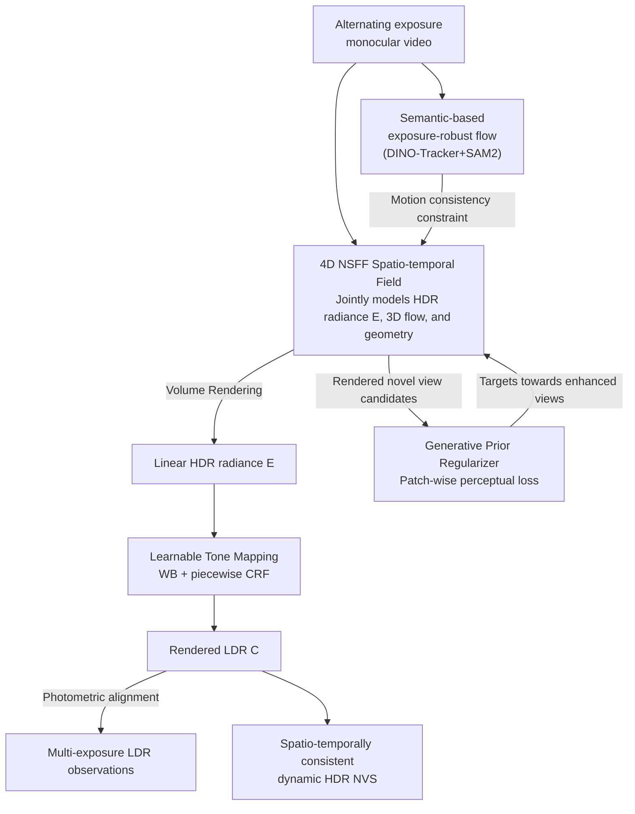

# HDR-NSFF: High Dynamic Range Neural Scene Flow Fields

**Conference**: ICLR2026  
**arXiv**: [2603.08313](https://arxiv.org/abs/2603.08313)  
**Code**: [Project Page](https://shin-dong-yeon.github.io/HDR-NSFF/)  
**Area**: 3D Vision  
**Keywords**: HDR reconstruction, neural scene flow fields, dynamic scene, tone-mapping, 4D radiance field  

## TL;DR
The authors propose HDR-NSFF, which transforms HDR video reconstruction from the traditional 2D pixel-level fusion paradigm to 4D spatio-temporal modeling. By jointly reconstructing the HDR radiance field, 3D scene flow, geometry, and tone-mapping from a monocular video with alternating exposures, they achieve spatio-temporally consistent dynamic HDR novel view synthesis.

## Background & Motivation
The dynamic range of radiance in real-world scenes often far exceeds the capture capabilities of consumer-grade cameras. Traditional HDR methods attempt to recover lost information by fusing different exposure frames, but they face fundamental limitations:

1. **Limitations of Prior Work**: Existing HDR video methods (e.g., LAN-HDR, HDRFlow, NECHDR) rely on 2D pixel-level alignment and typically operate only within a narrow temporal window (3-7 frames), resulting in a lack of physical understanding of the 3D scene.
2. **Key Challenge**: Due to the absence of radiance and spatio-temporal consistency constraints between distant frames, 2D methods frequently produce visible artifacts, such as color drift and geometric flickering.
3. **Key Challenge**: Monocular alternating-exposure videos provide only a single-view observation at any given moment and are frequently affected by over-saturation, making the reconstruction problem highly ill-posed.

These issues motivated the authors to propose a paradigm shift from 2D pixel fusion to 4D spatio-temporal modeling.

## Core Problem
How to reconstruct a spatio-temporally consistent dynamic HDR radiance field from a monocular video with alternating exposures? Specific challenges include:

- Extreme color inconsistency between frames caused by exposure changes, leading to the failure of conventional optical flow methods.
- Monocular videos provide only a single viewpoint, with information completely lost in over-saturated regions.
- The need to simultaneously model the coupled relationships between HDR radiance, 3D motion, geometry, and tone-mapping.

## Method

### Overall Architecture
HDR-NSFF aims to reconstruct a spatio-temporally consistent dynamic HDR radiance field from monocular video. The difficulty lies in exposure fluctuations that invalidate standard flow and monocular views that lose information in saturated areas. Instead of 2D fusion, the framework jointly learns HDR radiance, 3D scene flow, and geometry within a 4D Neural Scene Flow Fields (NSFF) representation, unifying the entire video into a continuous spatio-temporal field. Three pillars support this 4D field for supervision: rendered linear HDR radiance is mapped back to LDR via a **learnable tone-mapping** module for photometric alignment; motion consistency is constrained by **semantic-based exposure-robust flow** instead of RGB matching; and information gaps from monocular saturation are filled by a **generative prior regularizer**.

### Key Designs

**1. Learnable Tone-Mapping Module: Differentiably mapping rendered HDR radiance back to LDR for supervision.**

The radiance field renders linear HDR radiance $E$, but the supervision signal consists only of LDR frames captured by the camera, separated by a camera response function. The module $\mathcal{T}$ explicitly parameterizes this chain as $C = \mathcal{T}(E; \theta) = g_\theta(w(E))$, where $w$ is per-channel white balance correction and $g_\theta$ is the camera response function (CRF). The specific form of the CRF determines reconstruction quality: a fixed CRF is too restrictive, while an MLP-based CRF is too flexible and unstable. The authors adopt a piecewise parametric CRF to balance flexibility and regularization—obtaining a PSNR of 31.01, significantly higher than MLP CRF (28.76), Fixed CRF (25.55), or no tone-mapping (17.79).

**2. Semantic-based Exposure-robust Flow: Using semantic invariance instead of color matching to avoid motion estimation failure.**

The key insight is that while pixel appearance fluctuates violently with exposure, the semantic features of objects remain largely invariant. Thus, motion estimation should be built on semantic embeddings rather than RGB values. The authors use DINO-Tracker as the backbone in the robust embedding space of DINOv2 with two modifications: re-initializing track points at each step to prevent cumulative error and using SAM2 motion masks to restrict tracking to dynamic regions. Ablations show that removing this module (DT) drops PSNR from 32.66 to 31.04, proving its necessity for motion consistency.

**3. Generative Prior as a Regularizer: Providing priors for missing views and saturated information in monocular video.**

In monocular video, information is missing at saturated spots, making reconstruction under-determined. During optimization, the model periodically renders novel view candidates $\hat{C}$, feeds them into a generative prior $\mathcal{G}$ to obtain enhanced views $C^{\text{gen}}$, and applies a patch-wise perceptual loss: $\hat{\mathcal{L}}_{\text{gen}} = \sum_{p} \|\phi(\hat{C}_p) - \phi(C_p^{\text{gen}})\|_1$. To prevent hallucinations from overriding real observations, it is activated only with a probability $p_{\text{gen}} = 0.1$ after a warmup period $T_{\text{warm}} = 200K$. Its impact is primarily on perceptual quality (LPIPS improves from 0.0557 to 0.0554).

### Loss & Training
The total objective jointly optimizes the tone-mapped photometric loss, flow constraints, depth priors, CRF smoothness regularization, and the generative prior loss. This allows radiance, motion, geometry, and tone-mapping to constrain each other end-to-end within a single 4D field.

## Key Experimental Results

### Datasets
- **HDR-GoPro** (Newly proposed): The first real-world dynamic HDR dataset using 9 synchronized GoPro Hero 13 Black cameras with 3 exposure levels across 12 scenes.
- **Synthetic Data**: Used for comparative evaluation.

### Main Results (GoPro Dataset)

| Method | PSNR↑ | SSIM↑ | LPIPS↓ |
| :--- | :--- | :--- | :--- |
| NSFF | 18.02 | 0.6792 | 0.2061 |
| 4DGS | 20.94 | 0.7905 | 0.1541 |
| NeRF-WT | 29.70 | 0.9333 | 0.0598 |
| HDR-HexPlane | 20.70 | 0.6694 | 0.1917 |
| **Ours (Full)** | **32.63** | **0.9444** | **0.0554** |

### Ablation Study
- Removing DINO-Tracker (DT): PSNR drops from 32.66 to 31.04, indicating that semantic flow is vital for motion consistency.
- Removing Generative Prior (GP): LPIPS increases from 0.0554 to 0.0557, showing GP primarily improves perceptual quality.
- Tone-mapping comparison: Piecewise CRF (PSNR 31.01) >> MLP CRF (28.76) >> Fixed CRF (25.55) >> No TM (17.79).

## Highlights & Insights
1. **Novelty**: First to lift HDR video reconstruction from 2D pixel fusion to 4D spatio-temporal modeling, establishing a global temporal receptive field.
2. **Key Insight**: Leverages the semantic invariance of DINOv2 to solve the problem of optical flow failure under changing exposures.
3. **Function**: The framework is representation-agnostic and compatible with various dynamic representations like NeRF and 4D Gaussian Splatting.
4. **Value**: The introduction of the HDR-GoPro dataset with synchronized cameras fills a critical gap in the field.
5. **Experimental Thoroughness**: Joint optimization of radiance, motion, geometry, and tone-mapping ensures physical consistency.

## Limitations & Future Work
1. **Dependency on COLMAP**: Pose estimation may fail under extreme exposure changes, limiting practical application.
2. **Motion Blur**: Motion blur caused by long exposures is not explicitly modeled.
3. **Training Efficiency**: The NeRF-based framework is computationally expensive to train.
4. **Limited Generative Contribution**: Ablations show GP has a negligible effect on PSNR and sometimes slightly decreases it (32.66 to 32.63).
5. **Scene Scale**: Validation is currently limited to small-scale scenes; performance in massive outdoor environments is unknown.

## Related Work & Insights
- **vs HDR Video Methods** (LAN-HDR, HDRFlow): HDR-NSFF uses 4D modeling instead of 2D alignment, naturally solving temporal consistency issues.
- **vs Dynamic Reconstruction** (NSFF, 4DGS): These methods assume photometric consistency in LDR inputs and cannot handle high dynamic range scenes.
- **vs HDR-HexPlane**: HDR-NSFF out-performs it by using explicit 3D scene flow modeling, providing superior temporal interpolation.

## Rating
- Novelty: ⭐⭐⭐⭐
- Experimental Thoroughness: ⭐⭐⭐⭐
- Writing Quality: ⭐⭐⭐⭐
- Value: ⭐⭐⭐⭐

<!-- RELATED:START -->

## Related Papers

- [\[ICLR 2026\] Mono4DGS-HDR: High Dynamic Range 4D Gaussian Splatting from Alternating-exposure Monocular Videos](mono4dgs-hdr_high_dynamic_range_4d_gaussian_splatting_from_alternating-exposure_.md)
- [\[ICLR 2026\] Dynamic Novel View Synthesis in High Dynamic Range](dynamic_novel_view_synthesis_in_high_dynamic_range.md)
- [\[CVPR 2025\] Event Fields: Capturing Light Fields at High Speed, Resolution, and Dynamic Range](../../CVPR2025/3d_vision/event_fields_capturing_light_fields_at_high_speed_resolution_and_dynamic_range.md)
- [\[ICLR 2026\] RobustSpring: Benchmarking Robustness to Image Corruptions for Optical Flow, Scene Flow and Stereo](robustspring_benchmarking_robustness_to_image_corruptions_for_optical_flow_scene.md)
- [\[ICLR 2026\] Splat the Net: Radiance Fields with Splattable Neural Primitives](splat_the_net_radiance_fields_with_splattable_neural_primitives.md)

<!-- RELATED:END -->
