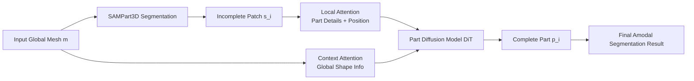

# HoloPart: Generative 3D Part Amodal Segmentation

**Conference**: ICLR 2026  
**OpenReview**: [https://openreview.net/forum?id=2VsBJwefDC](https://openreview.net/forum?id=2VsBJwefDC)  
**Code**: To be confirmed  
**Area**: 3D Vision / 3D Generation / Part Segmentation  
**Keywords**: 3D part amodal segmentation, shape completion, diffusion model, 3D generative prior, context-aware attention  

## TL;DR
HoloPart introduces the concept of "amodal segmentation" from 2D to 3D, proposing the new task of "3D Part Amodal Segmentation"—decomposing a global mesh into **geometrically complete** semantic parts (rather than fragmented surface patches) using a diffusion model that incorporates local attention and global shape context for part completion.

## Background & Motivation
- **Background**: 3D part segmentation groups vertices of meshes or point clouds by semantics, which is particularly useful for "single-piece" meshes produced by photogrammetry or 3D generative models. While 2D amodal segmentation has seen extensive research in inferring occluded parts, it has remained largely unexplored for 3D shapes.
- **Limitations of Prior Work**: Existing 3D part segmentation methods can only extract **surface patches**, which are fragmented and truncated by occlusions. This is sufficient for perception but inadequate for content creation (geometric editing, rigging, texturing), where each part must possess **complete solid geometry**.
- **Key Challenge**: Decoupling the amodal idea into 3D presents three non-trivial challenges simultaneously: (1) inferring occluded 3D geometry; (2) ensuring the completed parts maintain geometric and semantic consistency with the global shape; and (3) generalizing across various object categories and part types despite a severe scarcity of part-annotated data.
- **Goal**: Formally define the "3D Part Amodal Segmentation" task and provide a practical, effective solution to decompose holistic shapes into complete semantic parts.
- **Key Insight**: **[Decoupled Two-stage]** Instead of end-to-end learning, the task is split into "existing part segmentation + proposed part shape completion"; **[Generative Priors for Occlusion]** Strong generative priors are obtained through large-scale general 3D shape pre-training, followed by fine-tuning on limited "part-whole" pairs, allowing the model to generate plausible complete geometry based on shape priors rather than just "filling holes"; **[Dual Attention for Balance]** Local attention captures part details while context-aware attention injects global shape information, ensuring completions are both refined and consistent.

## Method

### Overall Architecture
HoloPart is a two-stage pipeline. The **first stage** uses off-the-shelf SAMPart3D to segment an input mesh $m$ into several (possibly occluded) surface patches $\{s_1, \dots, s_n\}$. The **second stage** (core contribution) uses a diffusion model to complete each incomplete patch $s_i$ into a full part $p_i$, satisfying completeness, geometric consistency, and semantic consistency. The completion model is first pre-trained on 180,000 general 3D shapes to acquire generative priors, then fine-tuned as a "part diffusion model" using "part-whole" pairs with two types of conditional attention (Local + Context).

### Key Designs

**1. Object-level Pre-training + Rectified Flow: Accumulating 3D Shape Priors.** Due to the scarcity of 3D data with complete part annotations, the authors first pre-train a 3D generative model on large-scale holistic shapes to learn generalizable shape representations. Geometry is compressed using a VAE similar to 3DShape2VecSet / CLAY: the encoder processes input point clouds $X \in \mathbb{R}^{N \times 3}$ via Farthest Point Sampling $X_0 = \mathrm{FPS}(X)$ and cross-attention $z = E(X) = \mathrm{CrossAttn}(\mathrm{PosEmb}(X_0), \mathrm{PosEmb}(X))$. The decoder predicts occupancy given query points $q$. For diffusion, a DiT-based denoising network $v_\theta$ uses Rectified Flow to map Gaussian noise to the 3D shape distribution in the latent space. The forward process is a linear interpolation $z_t = (1-t)z_0 + t\epsilon$, with the flow matching loss: $\mathbb{E}\big[\|v_\theta(z_t, t, g) - (\epsilon - z_0)\|_2^2\big]$, where $g$ represents image features. This provides critical "shape common sense" for subsequent completion.

**2. Context-aware Attention: Aligning Completion with Global Shape.** The primary risk in part completion is independent processing leading to mismatched scales, orientations, or joints. To address this, the incomplete part patch is cross-attended with the holistic shape: $c_o = \mathcal{C}(S_0, X) = \mathrm{CrossAttn}(\mathrm{PosEmb}(S_0), \mathrm{PosEmb}(X \#\# M))$, where $X$ is the global point cloud, $M$ is a binary mask highlighting the segmented region, and $\#\#$ denotes concatenation. This ensures the model "sees" the global structure, knowing the intended appearance and interfaces of the part.

**3. Local Attention: Capturing Part Details and Position Mapping.** Global context alone is insufficient for fine geometry. The incomplete patch is normalized to $[-1, 1]$ and cross-attended with its own subsampled point cloud $c_l = \mathcal{C}(S_0, S) = \mathrm{CrossAttn}(\mathrm{PosEmb}(S_0), \mathrm{PosEmb}(S))$. This allows the model to learn both local details and the position mapping within the normalized space. $c_o$ and $c_l$ are injected into the DiT via cross-attention; context provides consistency, while local attention provides precision—this is the key to adapting object-level priors to part-level completion.

**4. Data Creation Pipeline: Generating Part-Whole Pairs from Unlabeled Shapes.** Part annotations are scarce. While ABO provides ground truth, Objaverse contains 800k models without part labels. The authors filtered these into 180k high-quality shapes using Mesh Count Restriction and connectivity analysis. Pairs are created by merging components into a whole and simulating occlusions by removing faces invisible to multi-view rays. Non-watertight meshes are processed via Unsigned Distance Fields (UDF) and Marching Cubes. Labels are assigned to global mesh faces based on the nearest part faces, yielding surface segmentation masks $\{s_i\}$.

## Key Experimental Results

### Main Results (ABO Dataset, 3D Part Amodal Segmentation)
Comparison between PatchComplete (P/C), DiffComplete (D/C), Finetune-VAE (F/V), and Ours. Metrics: Chamfer Distance ↓ / IoU ↑ / F1 ↑ / Success ↑:

| Method | Chamfer ↓ | IoU ↑ | F1 ↑ | Success ↑ |
|:---|:---|:---|:---|:---|
| PatchComplete | 0.122 | 0.159 | 0.259 | 0.822 |
| DiffComplete | 0.087 | 0.235 | 0.371 | 0.824 |
| Finetune-VAE | 0.037 | 0.565 | 0.689 | 0.976 |
| **Ours (w/o Context-attn)** | 0.036 | 0.733 | 0.816 | 0.987 |
| **Ours (with Context-attn)** | **0.026** | **0.764** | **0.843** | **0.994** |

The full model significantly outperforms the strongest baseline, DiffComplete (IoU 0.764 vs 0.235).

### Cross-Dataset Generalization (3DCoMPaT++, 2.5D mask input)

| Method | Chamfer ↓ | IoU ↑ | F1 ↑ | Success ↑ |
|:---|:---|:---|:---|:---|
| PatchComplete | 0.278 | 0.245 | 0.312 | 0.835 |
| DiffComplete | 0.146 | 0.401 | 0.485 | 0.935 |
| SDFusion | 0.255 | 0.246 | 0.321 | 0.884 |
| **Ours** | **0.088** | **0.558** | **0.641** | **0.995** |

### Ablation Study (PartObjaverse-Tiny, Chamfer ↓)

| Method | Overall | Human | Daily | Buildings | Plants |
|:---|:---|:---|:---|:---|:---|
| Finetune-VAE | 0.064 | 0.064 | 0.075 | 0.064 | 0.049 |
| Ours w/o Local | 0.057 | 0.061 | 0.051 | 0.047 | 0.045 |
| Ours w/o Context | 0.055 | 0.059 | 0.044 | 0.047 | 0.042 |
| **Ours (full)** | **0.034** | **0.034** | **0.032** | **0.032** | **0.029** |

### Key Findings
- **Both Attention Modules are Essential**: Removing local or context-aware attention degrades Chamfer from 0.034 to 0.055-0.057. 
- **Generative Priors >> Direct Infilling**: Finetune-VAE already outperforms PatchComplete/DiffComplete, proving that strong 3D generative priors are the foundation. Adding dual attention then pushes performance further.
- **Robust Generalization**: On the cross-domain 3DCoMPaT++ dataset with 2.5D mask inputs, the method maintains a 99.5% success rate and 0.558 IoU.

## Highlights & Insights
- **Task Definition as a Contribution**: Formally introduces "amodal segmentation" to 3D with two new benchmarks (ABO, PartObjaverse-Tiny), opening a direction with clear value for geometric editing and animation.
- **"Completion = Generation, Not Infilling"**: Using pre-trained generative priors with small-data fine-tuning bypasses the deadlock of end-to-end learning with scarce data.
- **Explicit Decoupling of Local vs. Global**: The dual conditional attention paths manage "precision" and "consistency" separately.
- **Self-Supervised Data Generation**: Transforms the annotation bottleneck into an engineering pipeline using ray visibility and UDF/marching cubes.

## Limitations & Future Work
- **Dependency on Input Mask Quality**: HoloPart's results are limited by the first-stage surface segmentation; low-quality masks lead to incomplete results.
- **Future Work**: The authors envision using HoloPart to generate large-scale "part-aware" 3D shapes to train native part-aware generative models, removing external dependencies.
- **(Reviewer Note)** Parts are currently completed independently; inter-part constraints are only implicit through context-aware attention, and error accumulation is a risk in this two-stage pipeline.

## Related Work & Insights
- **2D Amodal Segmentation**: The conceptual source (Ehsani 2018, Ke 2021).
- **3D Shape Completion**: Previous works (PatchComplete, SDFusion) focus on **entire objects** and struggle with complex part structures or maintaining part-whole consistency.
- **3D Generation and Representation**: Provides the VAE compression, diffusion backbone (DiT), and segmentation frontend.
- **Insight**: In sub-tasks with scarce labels, the paradigm of "Large Model Generative Prior + Small Data Adaptation + Task-Specific Conditional Injection" is a highly cost-effective route.

## Rating
- **Novelty**: ⭐⭐⭐⭐⭐ (Formally defines a high-value new task and provides a complete solution/benchmark).
- **Experimental Thoroughness**: ⭐⭐⭐⭐ (Solid benchmarks and ablation; lacks comparison with end-to-end alternatives).
- **Writing Quality**: ⭐⭐⭐⭐ (Logical flow from motivation to validation; excellent visualizations).
- **Value**: ⭐⭐⭐⭐⭐ (Strong practical utility for 3D content creation).

<!-- RELATED:START -->

## Related Papers

- [\[ICLR 2026\] PartSAM: A Scalable Promptable Part Segmentation Model Trained on Native 3D Data](partsam_a_scalable_promptable_part_segmentation_model_trained_on_native_3d_data.md)
- [\[ECCV 2024\] 3×2: 3D Object Part Segmentation by 2D Semantic Correspondences](../../ECCV2024/3d_vision/3x2_3d_object_part_segmentation_by_2d_semantic_correspondenc.md)
- [\[ICLR 2026\] Part-X-MLLM: Part-aware 3D Multimodal Large Language Model](part-x-mllm_part-aware_3d_multimodal_large_language_model.md)
- [\[CVPR 2026\] GeoSAM2: Unleashing the Power of SAM2 for 3D Part Segmentation](../../CVPR2026/3d_vision/geosam2_unleashing_the_power_of_sam2_for_3d_part_segmentation.md)
- [\[ICLR 2026\] NOVA3R: Non-pixel-aligned Visual Transformer for Amodal 3D Reconstruction](nova3r_non-pixel-aligned_visual_transformer_for_amodal_3d_reconstruction.md)

<!-- RELATED:END -->
