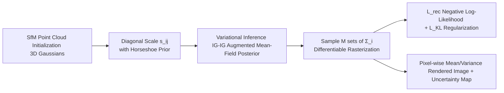

# Horseshoe Splatting: Handling Structural Sparsity for Uncertainty-Aware Gaussian-Splatting Radiance Field Rendering

**Conference**: ICLR 2026  
**OpenReview**: [https://openreview.net/forum?id=NHuyk9KsG6](https://openreview.net/forum?id=NHuyk9KsG6)  
**Code**: [https://github.com/HKU-MedAI/Horseshoe-Splatting](https://github.com/HKU-MedAI/Horseshoe-Splatting)  
**Area**: 3D Vision / Neural Rendering / Bayesian Uncertainty  
**Keywords**: 3D Gaussian Splatting, Horseshoe Prior, Variational Inference, Uncertainty Estimation, Structural Sparsity  

## TL;DR
Apply a global-local Horseshoe shrinkage prior to the covariance scale of each 3DGS Gaussian. Use variational inference to simultaneously solve "automatic pruning of noise directions + outputting pixel-level uncertainty," matching SOTA rendering quality while providing calibrated uncertainty maps.

## Background & Motivation
- **Background**: NeRF provides high-fidelity novel view synthesis but is slow. 3DGS achieving real-time high-quality rendering via explicit anisotropic Gaussians and differentiable rasterization has become the mainstream representation.
- **Limitations of Prior Work**: Mainstream 3DGS is **deterministic** and provides no confidence measures, which are crucial under sparse views, occlusions, or out-of-distribution content. Meanwhile, existing pipelines do not explicitly encode **structural sparsity** in covariance (per-axis variance, inter-axis correlation), leading to insufficient regularization of noise-dominated directions.
- **Key Challenge**: Existing uncertainty variants (semantic/posterior variance, depth uncertainty fields, Fisher information, etc.) are either computationally expensive or only characterize scene-level ambiguity. **No work directly applies hierarchical priors to the covariance structure of each splat**—failing to selectively suppress spurious variance or provide posterior uncertainty consistent with rendered images.
- **Goal**: Integrate Bayesian inference into 3DGS using a prior capable of both "near-zero strong shrinkage + heavy-tail protection" to unifiedly handle covariance structural sparsity and calibrated uncertainty with minimal speed sacrifice.
- **Key Insight**: **[Structural Sparsity Prior]** Placing a global-local Horseshoe prior on covariance scale parameters—its spike at zero aggressively shrinks irrelevant directions, while heavy tails preserve significant anisotropic structures, perfectly fitting how 3DGS elliptical footprints are formed; **[Variational Tractability]** Fitting with a factorized variational family via mirrored Horseshoe inverse-gamma augmentation makes Monte Carlo rendering and pixel-level posterior uncertainty nearly free byproducts.

## Method

### Overall Architecture
The original 3DGS representation is retained (position $\mu_i$, opacity $\alpha_i$, SH color $c_i$, covariance $\Sigma_i = R_i S_i S_i^\top R_i^\top$). Only the scales on the diagonal matrix $S_i = \mathrm{diag}(s_{i1}, s_{i2}, s_{i3})$ are treated as random variables with a global-local Horseshoe prior. During training, a mirrored inverse-gamma augmented mean-field variational posterior is fitted. The loss combines Monte Carlo reconstruction negative log-likelihood (NLL) and KL regularization. At inference, multiple scales are sampled via ancestral sampling and rendered to compute pixel-wise mean and variance for the final image and uncertainty map.

### Key Designs

**1. Global-Local Horseshoe Prior on Covariance Scales: Directional Shrinkage.** For each splat $i$ and each axis $j$ of the diagonal scale $s_{ij}$, global shrinkage $\theta_j$ and local shrinkage $\lambda_{ij}$ are introduced, modeled as $s_{ij} \mid \lambda_{ij}, \theta_j \sim \mathcal{N}(\beta_{ij}, \sigma_{ij}^2 \theta_j^2 \lambda_{ij}^2)$, where $\beta_{ij}$ is the learnable mean and $\sigma_{ij} = \mathrm{softplus}(\rho_{ij})$. Both shrinkage terms follow a half-Cauchy prior $\lambda_{ij} \sim C^+(0,1), \theta_j \sim C^+(0,b)$, achieving the signature "spike at zero + heavy tails" of the Horseshoe prior. The spike aggressively pulls noise-dominated axes toward zero (effectively pruning redundant splats), while heavy tails ensure signal-supported anisotropic directions are barely shrunk. This allows shrinkage intensity to be data-adaptive rather than globally uniform, directly echoing the geometry of 3DGS screen-space elliptical footprints by distinguishing "noise along irrelevant axes" from "sharp structures along signal axes."

**2. Mirrored Inverse-Gamma Augmented Mean-Field Variational Inference: Trainable Bayesian Inference.** Since direct inference for half-Cauchy priors is intractable, this work leverages the classic IG-IG (Inverse Gamma over Inverse Gamma) augmentation: $\lambda_{ij}^2 \mid \nu_{ij} \sim \mathrm{IG}(1/2, 1/\nu_{ij})$ and $\nu_{ij} \sim \mathrm{IG}(1/2, 1)$ (similarly for $\theta_j^2$), making the hierarchy conjugate-friendly. The variational family **mirrors this augmented structure**, using independent factors for $s, \lambda^2, \nu, \theta^2, \xi$: $q(s, \dots) = \prod q_{\mathcal{N}}(s_{ij}) \prod q_{\mathrm{IG}}(\lambda_{ij}^2) \dots$. The Gaussian prior term in the ELBO has a closed-form expectation (using IG identities like $\mathbb{E}\log X = \log \beta - \psi(\alpha)$ and $\mathbb{E}[1/X] = \alpha/\beta$). $s_{ij}$ is sampled via reparameterization $s_{ij} = \beta_{ij} + \sigma_{ij}\varepsilon$, while KL terms between IG factors are analytic with low-variance gradients. The system is optimized jointly via SGD without auxiliary variance networks.

**3. Reconstruction Loss Coupling + Ancestral Sampling Uncertainty Estimation: Unified Pipeline.** The total loss combines the variational objective with 3DGS reconstruction: $L_{\text{total}} = L_{\text{rec}} + L_{\text{KL}}$, where $L_{\text{rec}} \approx -\frac{1}{M} \sum_m \sum_u \ln f_{\mathcal{N}}(I_u \mid \hat I_u^{(m)}, \sigma_u^2)$. $\hat I_u^{(m)}$ is rendered using $\Sigma_i^{(m)}$ sampled from $q$, and $\sigma$ is reparameterized as $\sigma = \log(1 + e^\rho)$. The prior part of the KL term naturally acts as an "auto-scaling factor" to balance Horseshoe regularization. After training, **no additional variance parameters are needed**. Instead, ancestral sampling follows the Horseshoe hierarchy: drawing $\theta_j^{2(m)}, \lambda_{ij}^{2(m)}, \varepsilon_{ij}^{(m)}$ leads to $s_{ij}^{(m)} = \beta_{ij} + \sigma_{ij} \theta_j^{(m)} \lambda_{ij}^{(m)} \varepsilon_{ij}^{(m)}$. After assembly into $\Sigma_i^{(m)}$ and rendering, pixel-wise mean, variance, and confidence intervals provide well-calibrated uncertainty maps while maintaining 3DGS real-time performance. Furthermore, the authors prove that under a non-linear observation model and local Lipschitz renderer, the scale posterior contracts at a near-minimax rate and propagates to image space via Lipschitz continuity, providing theoretical grounding for "error and uncertainty decreasing with more data."

## Key Experimental Results

### Main Results (LF / LLFF Datasets, Novel View Synthesis + Uncertainty Quality)

| Dataset | Method | PSNR↑ | SSIM↑ | LPIPS↓ | AUSE↓ | NLL↓ |
|---|---|---|---|---|---|---|
| LF | FisherRF | 29.13 | 0.927 | 0.076 | 0.54 | 7.02 |
| LF | Variational 3DGS | 27.39 | 0.914 | 0.101 | 0.26 | -0.30 |
| LF | Ensemble GS (×10) | 27.64 | 0.902 | 0.088 | 0.29 | -0.34 |
| LF | **Ours** | **30.05** | **0.947** | **0.064** | **0.25** | **-0.74** |
| LLFF | FisherRF | 25.34 | 0.849 | 0.125 | 0.51 | 7.05 |
| LLFF | Variational 3DGS | 23.97 | 0.806 | 0.172 | 0.32 | 0.23 |
| LLFF | **Ours** | **25.86** | **0.864** | **0.110** | 0.31 | **0.14** |

- Depth uncertainty (AUSE-MAE on LF) averages **0.18** (SOTA), with a 23% improvement over the runner-up in the *basket* scene.
- Inference Speed: **0.03s** per view, approximately 9× faster than Ensemble GS, and faster than FisherRF (0.12s) and Variational 3DGS (0.06s).

### Ablation Study (Prior Types Comparison)

| Dataset | Prior | PSNR↑ | SSIM↑ | AUSE↓ | NLL↓ |
|---|---|---|---|---|---|
| LF | Laplace | 30.04 | 0.942 | 0.37 | 10.58 |
| LF | Gaussian | 30.01 | 0.941 | 0.38 | 9.15 |
| LF | **Horseshoe** | **30.05** | **0.947** | **0.25** | **-0.74** |
| LLFF | Laplace | 25.74 | 0.860 | 0.42 | 8.22 |
| LLFF | **Horseshoe** | **25.86** | **0.864** | **0.31** | **0.14** |

- PSNR/SSIM across the three priors are nearly identical, but Horseshoe significantly leads in AUSE/NLL, indicating that **heavy tails + zero-spikes are the keys to uncertainty calibration**, whereas rendering quality is not the primary differentiator for the choice of prior.
- Active view selection (LLFF, iteratively adding from 10% to 30% views): Horseshoe achieves PSNR 26.23 / SSIM 0.87 / LPIPS 0.104, significantly outperforming FisherRF (23.37), validating that well-calibrated uncertainty selects the most informative views.

### Key Findings
- Structural sparsity priors significantly improve uncertainty calibration (NLL dropped from positive or 7+ values to negative values) **without sacrificing visual fidelity**.
- FisherRF exhibits good reconstruction but poor uncertainty, as its Hessian/depth-based approximation fails to transfer well to RGB space, producing noisy and uninformative uncertainty maps.

## Highlights & Insights
- **"Porting" the statistical Horseshoe shrinkage prior to 3DGS covariance scales** is a clean and geometrically fitting idea: screen-space elliptical footprints are naturally suited for per-axis sparsity modeling.
- Uncertainty is a **free byproduct** of variational inference rather than an external module; ancestral sampling reuses the same renderer, avoiding auxiliary networks and maintaining real-time performance.
- Theoretical derivation (near-minimax contraction rate of scale posterior + Lipschitz propagation to image space) connects empirical methods with statistical theory.
- The ablation study clearly decouples "rendering quality" from "uncertainty calibration," showing the prior primarily affects the latter.

## Limitations & Future Work
- Validated only on **relatively small-scale and sparse-view** datasets like LF (8 scenes) and LLFF (8 forward-facing scenes); lacks investigation into large-scale unbounded scenes (e.g., Mip-NeRF 360) and dynamic scenes.
- Horseshoe is applied only to **diagonal scales** (though the paper mentions extension to low-rank paired components, it isn't fully explored); structural sparsity modeling for inter-axis correlation remains light.
- Monte Carlo uses only 10 samples; while fast, the trade-off between uncertainty precision and sample count was not systematically analyzed.
- Theoretical analysis relies on assumptions like local linearization and local Lipschitzness; the gap with real-world differentiable rasterization deserves further characterization.

## Related Work & Insights
- **NeRF / 3DGS Novel View Synthesis**: From NeRF's implicit volume function to 3DGS's explicit anisotropic Gaussians + differentiable rasterization, this work builds upon 3DGS.
- **Rendering Uncertainty Estimation**: NeRF-side includes Bayesian (S-NeRF), posterior (Bayes' Ray), normalizing flows (CF-NeRF), and ensembles. 3DGS-side includes FisherRF (Fisher Info), Variational 3DGS, and Ensemble GS. The distinction here is applying hierarchical priors directly to the covariance structure.
- **Shrinkage Prior Sparsification**: The global-local shrinkage family (represented by Horseshoe) achieves adaptive sparsity with "spike at zero + heavy tails." This paper is the first to systematically apply it to 3DGS sparsity.
- **Insight**: Migrating mature Bayesian shrinkage tools to explicit 3D representations is a universal path to "unifying sparse regularization and uncertainty," applicable to other explicit representations like point clouds and meshes.

## Rating
- **Novelty**: ⭐⭐⭐⭐ First to systematically introduce the Horseshoe global-local shrinkage prior to 3DGS covariance scales; the perspective is novel and fits the geometry, supported by theoretical analysis.
- **Experimental Thoroughness**: ⭐⭐⭐ Validated across novel view synthesis, uncertainty calibration, active view selection, and inference speed. Ablations are clear, but dataset scales are limited (lacks unbounded/dynamic scenes).
- **Writing Quality**: ⭐⭐⭐⭐ Logic from motivation to method, theory, and experiments is smooth. Formulas and flowcharts are well-integrated, and the decoupling of quality vs. calibration in the ablation is well-explained.
- **Value**: ⭐⭐⭐⭐ Provides calibrated uncertainty for 3DGS with almost no sacrifice in speed or fidelity, offering practical value for downstream tasks like active learning and robotic mapping.

<!-- RELATED:START -->

## Related Papers

- [\[ICLR 2026\] Augmented Radiance Field: A General Framework for Enhanced Gaussian Splatting](augmented_radiance_field_a_general_framework_for_enhanced_gaussian_splatting.md)
- [\[CVPR 2025\] 3D Convex Splatting: Radiance Field Rendering with 3D Smooth Convexes](../../CVPR2025/3d_vision/3d_convex_splatting_radiance_field_rendering_with_3d_smooth_convexes.md)
- [\[ICLR 2026\] Uncertainty-Aware 3D Reconstruction for Dynamic Underwater Scenes](uncertainty-aware_3d_reconstruction_for_dynamic_underwater_scenes.md)
- [\[ICLR 2026\] Gradient-Direction-Aware Density Control for 3D Gaussian Splatting](gradient-direction-aware_density_control_for_3d_gaussian_splatting.md)
- [\[ICLR 2026\] Station2Radar: Query-Conditioned Gaussian Splatting for Precipitation Field](station2radar_query_conditioned_gaussian_splatting_for_precipitation_field.md)

<!-- RELATED:END -->
