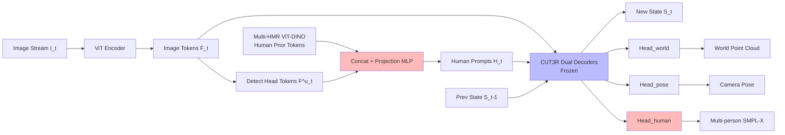

# Human3R: Everyone Everywhere All at Once

**Conference**: ICLR 2026  
**OpenReview**: [https://openreview.net/forum?id=y7duXr0JXF](https://openreview.net/forum?id=y7duXr0JXF)  
**Code**: [fanegg.github.io/Human3R](https://fanegg.github.io/Human3R)  
**Area**: 3D Vision / Human-Scene 4D Reconstruction  
**Keywords**: Human Mesh Recovery, Global Human Motion Estimation, 4D Reconstruction Foundation Model, CUT3R, Visual Prompt Tuning, Online Feed-forward Reconstruction  

## TL;DR
Human3R freezes the online 4D reconstruction foundation model CUT3R and uses Visual Prompt Tuning (VPT) to insert "human prompts." This allows the model to simultaneously output multi-person SMPL-X meshes (everyone), dense scene point clouds (everywhere), and camera trajectories (all-at-once) in a single feed-forward pass at 15 FPS with 8 GB VRAM, reaching SOTA after training on a single GPU for just one day.

## Background & Motivation
- **Background**: Reconstructing "global human motion + surrounding 3D scene + camera trajectory" from monocular video in a world coordinate system is a fundamental requirement for AR/VR, embodied navigation, and humanoid policy learning. Existing approaches either rely on learned motion priors to directly estimate global human motion or use SLAM to estimate global cameras before transforming local human meshes from HMR to the world system. Recent works attempt joint reconstruction of humans, scenes, and cameras.
- **Limitations of Prior Work**: Mainstream pipelines are **multi-stage/multi-model/multi-crop**—first reconstructing the scene and humans separately, then iteratively optimizing under contact constraints, a process that often takes hours. Multi-person scenarios require off-the-shelf detection and tracking to crop each person before feeding them into single-person regressors, causing speed to degrade linearly with the number of people. Furthermore, they rely heavily on various off-the-shelf modules (metric depth estimation, general 3D reconstruction for point clouds, camera poses/intrinsics), hindering real-time online processing, end-to-end learning, and long-sequence scaling.
- **Key Challenge**: The primary bottleneck for a unified model is the **lack of large-scale video data with reliable annotations (global human motion + 3D scene + camera pose)**—real datasets are small in scale, while synthetic datasets (like BEDLAM) have limited scene variations. Training from scratch requires immense data and computing power.
- **Goal**: To achieve online recovery of multi-person world-coordinate meshes, dense scenes, and cameras from casual monocular videos using **one model, one stage, one feed-forward pass, and one GPU for one day**, completely removing heavy dependencies on detection, tracking, depth, SLAM, and iterative optimization.
- **Key Insight**: **Reuse the strong spatio-temporal priors of 4D reconstruction foundation models and minimize fine-tuning to read out humans**. CUT3R has already learned persistent state priors for both scenes (everywhere) and humans (everyone) on large-scale point clouds. Instead of explicitly extracting humans from point clouds, Human3R **freezes the entire CUT3R backbone and uses Visual Prompt Tuning (VPT) to insert a few human-related parameters**. This directly reads multi-person SMPL-X from the state, saving both data and parameters.

## Method

### Overall Architecture
At each time step $t$, given an input image $I_t$, the model simultaneously estimates: multi-person SMPL-X meshes $\{M^n_t\}$ (world system, 10,475 vertices each), camera extrinsic $T_t$ and intrinsic $C_t$, and canonical point clouds $X_t$. Human3R is built upon CUT3R: images are encoded into image tokens via a ViT tokenizer, interacting bidirectionally with a fixed-size **persistent state** $S_{t-1}$ to incrementally update to $S_t$. Camera/world system point clouds are read out by dense prediction heads, and camera poses are read by an MLP. Human3R adds detection of "human head tokens," concatenates human priors from Multi-HMR, and projects them into **human prompts** inserted into the decoder input space. These prompts self-attend to image tokens to aggregate full-body information and cross-attend to the scene state for scene awareness. Finally, a human head reads out the SMPL-X parameters. Only human-related layers are fine-tuned; the rest are frozen.

### Key Designs

**1. Visual Prompt Tuning (VPT) using "head tokens" as discriminative human queries**: Standard VPT inserts randomly initialized learnable tokens into the input space, which carry low information. Human3R's key modification is **using detected human head tokens as the prompt source**—as the head is the most discriminative keypoint on the human body. For each patch $(i,j)$, an MLP + sigmoid calculates a confidence score $s_{i,j}=\sigma(\mathrm{MLP_{head}}(F_{i,j}))$. Head tokens are collected based on a threshold $\tau$ and transformed into human prompts $H_t$ via a projection MLP:

$$H_t = \mathrm{Head_{projection}}(F^u_t), \quad [F'_t, z'_t, H'_t], S_t = \mathrm{Decoders}([F_t, z, H_t], S_{t-1}), \quad Y_t = \mathrm{Head_{human}}(H'_t)$$

Only the projection MLP and human head MLP are learnable. These prompts act as "human ID queries," aggregating spatial information through self-attention and retrieving temporally consistent SMPL-X parameters from 3D context via cross-attention. This preserves CUT3R's spatio-temporal priors while making human estimation inherently scene-aware. Fine-tuning also **improves scene reconstruction**, validating the mutual benefit of joint human-scene reasoning.

**2. Injecting Multi-HMR human priors to bridge scene model "blind spots"**: Since CUT3R is trained primarily on scene data, it lacks fine-grained human priors, leading to inaccurate poses/shapes. A **frozen Multi-HMR ViT-DINO encoder** (finetuned on human data) is added. Human features $F^u_{HMR}$ are extracted using indices $\{u\}^n$ and concatenated with CUT3R head tokens: $H = \mathrm{Head_{projection}}(F^u \oplus F^u_{HMR})$. This fuses "scene-aware states" with "human-aware priors" at the token level. Ablations show W-MPJPE jumps from 268 to 808 without these priors.

**3. Training-free human segmentation and tracking**: For segmentation, an MLP + sigmoid + pixel-shuffle generates pixel-aligned human masks from each token. For tracking, refined human tokens $H'$ (encoding both identity and parameters) are used as discriminative features for **feature matching**. A tracklet memory is maintained, and a cost matrix is constructed using pairwise L2 distance $D_{m,n}=\|H'_m - H'_n\|_2$. The Sinkhorn algorithm is applied with a dustbin mechanism for optimal transport to obtain soft assignments. No additional training is required.

**4. Test-time sequence adaptation (TTT3R + State Reset)**: Although trained on 4-frame sequences, the RNN-like state forgets early frames in long sequences. Human3R utilizes TTT3R, treating state $S$ as "fast weights" updated online via gradient descent: $S_t = S_{t-1} - \beta_t \nabla(S_{t-1}, F_t, z, H_t)$. Spatial averaging of attention values serves as a closed-form rule for online associative recall. Furthermore, **resetting the state every 100 frames** and aligning chunks using global camera poses maintains stability over thousands of frames (TTT3R reduces W-MPJPE from 292 to 268).

## Key Experimental Results

### Main Results

Local Human Mesh Recovery (3DPW / EMDB-1, mm, lower is better):

| Category | Method | No Crop | No Detect | No Intr. | 3DPW PA-MPJPE | EMDB-1 MPJPE | EMDB-1 PVE |
|------|------|:---:|:---:|:---:|:---:|:---:|:---:|
| Multi-stage | NLF | ✗ | ✗ | ✗ | 37.3 | 69.6 | 82.4 |
| Multi-stage | PromptHMR | ✓ | ✗ | ✗ | 36.6 | 71.7 | 84.5 |
| One-stage | BEV | ✓ | ✓ | ✓ | 46.9 | 112.2 | 133.4 |
| One-stage | Multi-HMR | ✓ | ✓ | ✗ | 45.9 | 81.6 | 95.7 |
| One-stage | **Ours** | ✓ | ✓ | ✓ | **44.1** | **73.9** | **86.0** |

In the "one-stage" setting (no crop, no detect, no intrinsics), the model outperforms BEV/Multi-HMR, achieving ~10% improvement in MPJPE/PVE on EMDB-1.

Global Human Motion Estimation (EMDB-2 / RICH, mm and %):

| Setting | Method | EMDB-2 W-MPJPE ↓ | EMDB-2 RTE ↓ | RICH W-MPJPE ↓ | RICH RTE ↓ |
|------|------|:---:|:---:|:---:|:---:|
| Offline | JOSH | 174.7 | 1.3 | 132.5 | 3.0 |
| Online | WHAM | 354.8 | 6.0 | 196.1 | 4.5 |
| Online | JOSH3R | 661.7 | 13.1 | - | - |
| Online | **Ours** | **267.9** | **2.2** | **184.9** | **3.3** |

Compared to the online WHAM, W-MPJPE on EMDB-2 is reduced by ~20% and RTE by ~60%. Ours is the only method simultaneously outputting scene geometry and camera poses.

### Ablation Study

Ablation of components on EMDB-2 (W-MPJPE / RTE):

| Configuration | WA-MPJPE ↓ | W-MPJPE ↓ | RTE ↓ |
|------|:---:|:---:|:---:|
| Ours w/o Prior | 221.2 | 808.4 | 2.2 |
| Ours w/ ViT-L/896 (Full) | 112.2 | 267.9 | 2.2 |
| Naive (CUT3R+Multi-HMR) w/ TTT3R | 401.3 | 1173.9 | 12.2 |
| Ours w/o TTT3R | 124.3 | 292.3 | 2.5 |
| Ours w/ TTT3R | 112.2 | 267.9 | 2.2 |

Human priors are critical (W-MPJPE triples without them); TTT3R provides incremental gains; naive concatenation is significantly inferior to the prompt-tuning fusion.

### Key Findings
- **High Efficiency**: Reaches SOTA with one day of training on a single 48GB GPU (BEDLAM). Inference runs at 15 FPS (RTX 4090) with 8 GB VRAM, linear complexity, and supports sequences over 1000 frames.
- **Mutual Benefit**: After fine-tuning for human reconstruction, camera poses (TUM-D) and metric depth (Bonn) also become more accurate than the original CUT3R/TTT3R.
- **Intrinsic Robustness**: While Multi-HMR is sensitive to aspect ratios, Human3R remains stable without intrinsics by leveraging metric-scale scene context.
- **Crowd Generalization**: Though trained on synthetic data with 1-10 people, it successfully reconstructs real crowded scenes with >10 people (bottom-up, speed is independent of headcount).

## Highlights & Insights
- **Paradigm shift from "extraction" to "reading out"**: Instead of cropping humans from scene point clouds, the persistent state of a 4D foundation model is treated as a latent space containing both humans and scenes. Multi-person SMPL-X is "read out" via prompts, collapsing the "detect-crop-regress-align" pipeline into a single feed-forward pass.
- **Elegant VPT adaptation**: Replacing random learnable tokens with semantically clear "head tokens" provides spatial anchors without an external detector, offering a graceful paradigm for structured downstream output from frozen large models.
- **Data/Parameter Efficiency**: Combining a frozen foundation model with minimal fine-tuning provides a practical solution to the fundamental lack of large-scale annotated 4D data.

## Limitations & Future Work
- **Head visibility dependency**: Using the head as a discriminative point leads to failure when the head is occluded or multiple people share a head token; a pixel-aligned body-point locator could mitigate this.
- **Simple proxies**: Only reconstructs naked SMPL proxies without clothing or appearance; future work could use 3DGS anchored on SMPL for full appearance reconstruction.
- **Online accuracy ceiling**: As an online method, accuracy may still be improved by using iterative optimization methods (trading computation for precision).
- **Scalability**: The spatio-temporal logic could be extended to other dynamic entities like animals or vehicles with 6D poses.

## Related Work & Insights
- **Foundation Models**: CUT3R (recursive 4D reconstruction) is the backbone, TTT3R provides test-time updates, and Multi-HMR provides bottom-up multi-person priors. The core contribution is fusing these via "prompt tuning" into a unified system.
- **Comparison with JOSH3R/JOSH**: While JOSH3R also outputs human-scene-camera jointly, it still depends on camera-coordinate meshes and split detection/segmentation. Human3R removes all such dependencies.
- **Insight**: When lacking large-scale labels, instead of training from scratch, find a foundation model with relevant priors, freeze it, and use structured prompts to read out targets—this "minimal fine-tuning for readout" logic is transferable to other structured estimation tasks.

## Rating
- **Novelty**: ⭐⭐⭐⭐⭐ Using VPT + head token prompts to "read" a 4D foundation model into a unified feed-forward output is a novel and elegant paradigm.
- **Experimental Thoroughness**: ⭐⭐⭐⭐ Covers four task types and analyses on crowds/intrinsics. Scaling to crowded scenes is impressive, though quantitative benchmarks for multi-person scenarios are still limited by available datasets.
- **Writing Quality**: ⭐⭐⭐⭐⭐ The "everyone/everywhere/all-at-once" theme is clear, and the synergy between models is well-argued.
- **Value**: ⭐⭐⭐⭐⭐ Extreme efficiency (15 FPS / 8 GB / 1-day training) plus SOTA performance makes this a strong baseline for AR/VR and humanoid robotics.

<!-- RELATED:START -->

## Related Papers

- [\[ECCV 2024\] Track Everything Everywhere Fast and Robustly](../../ECCV2024/3d_vision/track_everything_everywhere_fast_and_robustly.md)
- [\[NeurIPS 2025\] Every Camera Effect, Every Time, All at Once: 4D Gaussian Ray Tracing for Physics-based Camera Effect Data Generation](../../NeurIPS2025/3d_vision/every_camera_effect_every_time_all_at_once_4d_gaussian_ray_tracing_for_physics-b.md)
- [\[ICLR 2026\] All That Glitters Is Not Gold: Key-Secured 3D Secrets within 3D Gaussian Splatting](all_that_glitters_is_not_gold_key-secured_3d_secrets_within_3d_gaussian_splattin.md)
- [\[CVPR 2026\] Random Wins All: Rethinking Grouping Strategies for Vision Tokens](../../CVPR2026/3d_vision/random_wins_all_rethinking_grouping_strategies_for_vision_tokens.md)
- [\[CVPR 2025\] One Diffusion to Generate Them All](../../CVPR2025/3d_vision/one_diffusion_to_generate_them_all.md)

<!-- RELATED:END -->
