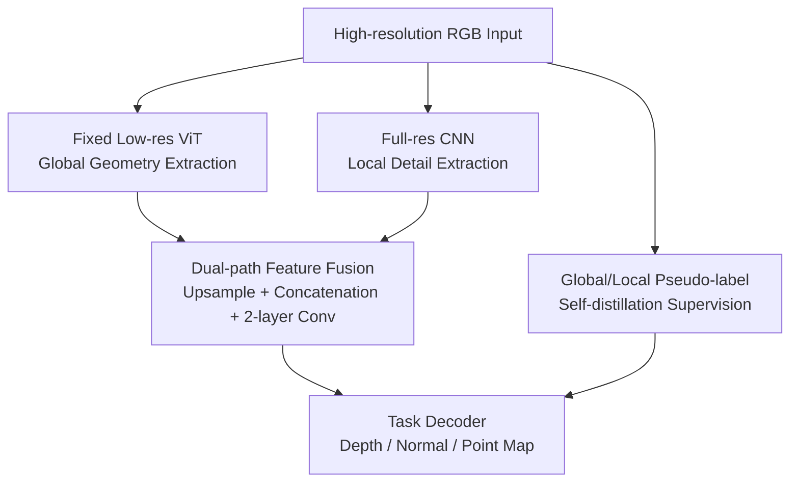

# Hyden: A Hybrid Dual-Path Encoder for Monocular Geometry of High-resolution Images

**Conference**: ICLR2026  
**OpenReview**: [https://openreview.net/forum?id=2eL6yXLCh8](https://openreview.net/forum?id=2eL6yXLCh8)  
**Code**: None  
**Area**: 3D Vision  
**Keywords**: Monocular Geometry Estimation, High-resolution Depth, Point Map, Surface Normal, Self-distillation

## TL;DR
Hyden utilizes a low-resolution ViT to capture global geometry and a full-resolution CNN to recover local details. Through self-distillation using both global and local crop pseudo-labels, it upgrades monocular geometry models like DepthAnything-v2 and MoGe2 into versions that are faster, sharper, and more accurate under high-resolution inputs.

## Background & Motivation
**Background**: Monocular geometry estimation has evolved from traditional single-dataset training to zero-shot geometric foundation models such as MiDaS, DepthAnything, Metric3D, and MoGe2. These models predict relative depth, metric depth, point maps, or surface normals from a single RGB image, serving as fundamental capabilities for robotics, autonomous driving, AR/MR, and 3D reconstruction.

**Limitations of Prior Work**: Most of these models are trained and infer at $518 \times 518$ or similar low resolutions. When facing 2K, 4K, or even higher resolution images, directly downscaling the input erases fine boundaries, thin structures, and texture transitions. Conversely, pushing ViT to full resolution causes a surge in token count, making the computational cost and memory consumption unbearable. Another category—patch or tile-based methods—retains local details but requires multiple crops, fusion, and boundary patching, which is often slow and prone to blocky artifacts.

**Key Challenge**: High-resolution geometry must satisfy two conditions simultaneously: capturing global context to avoid interpreting local textures incorrectly, while preserving original pixel-level details to prevent blunted boundaries and local surfaces. Pure ViT full-resolution inference is too expensive, pure low-resolution inference loses detail, and high-quality high-resolution ground truth supervision is scarce, forming a triple constraint addressed in this work.

**Goal**: The authors aim to transform existing strong teacher models, such as DepthAnything-v2 and MoGe2, into student models suitable for high-resolution input. The objective is not to reinvent a new geometric head but to retain the teacher model's global geometric capability while restoring clearer depth boundaries, normal variations, and point cloud details at the original resolution, significantly reducing 2K/4K inference latency.

**Key Insight**: The paper observes that CNN convolution calculations grow approximately linearly with image area, whereas ViT attention calculations are more sensitive to token counts. Thus, the roles are divided: the ViT only processes fixed low-resolution images for scene-level geometric relationships, while the CNN directly processes the original image for high-frequency edges and local textures. For supervision, the model generates pseudo-labels from unlabeled high-resolution images using existing models, using global pseudo-labels for geometric consistency and local crop pseudo-labels for detail enhancement.

**Core Idea**: Replace the original encoder with a "fixed low-resolution ViT + full-resolution CNN" dual-path encoder and employ global/local dual pseudo-label self-distillation to maintain global accuracy, local sharpness, and inference speed on multi-megapixel inputs.

## Method

### Overall Architecture
The input to Hyden is a high-resolution RGB image, and the output can be relative depth, a metric point map, or surface normals, depending on the downstream decoder. The encoder is split into two paths: the low-resolution ViT branch receives the full image scaled to $S \times S$ ($S=518$), and the high-resolution CNN branch receives the original image. Subsequently, the ViT features are upsampled to the CNN feature scale, concatenated with the CNN features, and passed through a lightweight fusion layer before entering the task decoder of DepthAnything-v2 or MoGe2.

During training, high-resolution ground truth is not required. Instead, a frozen teacher model $T$ generates two types of pseudo-labels for unlabeled high-resolution images. Global pseudo-labels $y_g^T$ are obtained by scaling the full image to $518 \times 518$, ensuring structural consistency. Local pseudo-labels $y_k^T$ are obtained by taking $518 \times 518$ crops from the high-resolution image and mapping them back to the original regions to provide sharp boundary supervision. Only the CNN branch, fusion layers, and decoder are trained; the ViT branch remains frozen.

The core contributions lie in three areas: the specialization of the low-res ViT and full-res CNN, the dual-path feature fusion, and the global/local pseudo-label self-distillation. The input, output, and task decoders serve as a framework inherited from existing models.

### Key Designs
**1. Dual-path Encoding: Separating Global Geometry and Local Details**

High-resolution monocular geometry often struggles with the trade-off between expensive full-image processing and inaccurate local-only processing. Hyden's ViT branch always processes a unified $518 \times 518$ image, preventing attention computation explosion at 2K/4K. This branch retains the global representation from strong models (e.g., DepthAnything-v2), responsible for room structure, vanishing points, and object relationships. The CNN branch directly processes the original resolution, using a hierarchical downsampling structure (like ResNet) to extract edges and textures.

**2. Lightweight Fusion: Referencing Global Context for CNN Details**

Upsampled ViT feature maps are bilinearly interpolated to match the CNN feature scale and then concatenated. The features pass through a two-layer lightweight convolutional fusion. Experiments show that two-layer CNN fusion outperforms MLP or single-layer fusion, indicating a need for local spatial mixing rather than simple channel projection. For global-level features, the CNN map is average-pooled and concatenated with the ViT CLS token to ensure the global vector receives high-resolution information.

**3. Global/Local Self-distillation: Structural Correctness and Boundary Sharpness**

To overcome the lack of high-resolution ground truth, Hyden uses existing models to generate pseudo-labels. For an image $I \in \mathbb{R}^{H \times W \times 3}$, the teacher generates a global label $y_g^T = T(\downarrow_S(I))$ and local labels $y_k^T = T(\mathrm{rcrop}_k(I))$ for the $k$-th high-resolution crop region $\Omega_k$. The global loss constrains the student's downsampled output against $y_g^T$, while the local crop loss constrains the student's high-resolution prediction in the region $\Omega_k$ against the localized teacher labels.

**4. Frozen ViT and Plug-and-Play Upgrade**

The ViT branch is frozen to maintain the teacher’s global semantics, while only the CNN encoder, fusion layers, and task decoder are optimized. This reduces training instability and allows Hyden to be easily integrated into different base models. Hyden-DA2 targets relative depth, while Hyden-MoGe2 covers surface normals and metric point maps. The additional CNN encoder adds only ~10M parameters but significantly reduces end-to-end latency at 2K/4K.

### Loss & Training
The task losses of the base models are applied to both global and local supervision. For relative depth, prediction $d$ and teacher label $\tilde d$ are aligned over valid pixels $M$ via:

$$
a^\star, b^\star = \arg\min_{a,b} \frac{1}{|M|}\sum_{p\in M}(a d_p + b - \tilde d_p)^2
$$

For surface normals, the angular error is used:

$$
\ell_{normal}(n, \tilde n; M)=\frac{1}{|M|}\sum_{p\in M}(1-\langle n_p, \tilde n_p\rangle)
$$

The total objective is:

$$
L_{total}=\lambda_g L_{global}+\lambda_\ell L_{local}
$$

The model is trained on 50 million web images resized to $2072 \times 2072$ for 300k iterations with a batch size of 192 using 64 NVIDIA H100 GPUs.

## Key Experimental Results

### Main Results

| Task / Model | 2K Latency | Aggregated Metric | Change vs. Baseline | Conclusion |
|--------------|------------|--------------------|---------------------|------------|
| DA2 | 408.1 ms | Rel. Depth Avg. Rank 4.6 | Baseline | Strong teacher, slow at 2K |
| Hyden-DA2 | 100.7 ms | Rel. Depth Avg. Rank 3.9 | ~4x faster, better rank | Dual-path preserves DA2 accuracy |
| MoGe2 | 476.8 ms | Rel. Depth Avg. Rank 2.0 | Baseline | Accurate but expensive |
| Hyden-MoGe2 | 171.6 ms | Rel. Depth Avg. Rank 1.3 | ~2.8x faster, top rank | Best high-res accuracy |
| DepthPro | 341.3 ms* | Rel. Depth Avg. Rank 4.3 | Fixed 1536 input | Sharp boundaries, fixed res |

| Task / Model | Latency | NYUv2 | iBims-1 | ScanNet | vkitti | Avg. Rank |
|--------------|---------|-------|---------|---------|--------|-----------|
| DSINE | 149.4 ms | 17.1 | 18.0 | 16.9 | 30.2 | 4.0 |
| Metric3Dv2 | 606.7 ms | 15.9 | 15.4 | 11.4* | 29.6 | 2.3 |
| MoGe2 | 438.2 ms | 15.6 | 16.0 | 13.7 | 27.3 | 2.5 |
| Hyden-MoGe2 | 127.4 ms | 14.6 | 14.8 | 13.0 | 27.0 | 1.2 |

The table above shows mean angular error (lower is better) for surface normals. Hyden-MoGe2 outperforms MoGe2 across all four benchmarks while significantly reducing latency.

### Ablation Study

| Configuration | iBims-1 F1 / R | Sintel F1 / R | HAMMER F1 / R | Spring F1 / R |
|---------------|----------------|---------------|---------------|---------------|
| Hyden-DA2 w/o local crop loss | 11.8 / 18.4 | 27.9 / 38.2 | 7.8 / 13.1 | 14.7 / 13.8 |
| Hyden-DA2 w/ 4 crops | 15.8 / 21.3 | 33.1 / 46.0 | 10.7 / 19.3 | 15.9 / 16.8 |

| Configuration | NYUv2 Rel | KITTI Rel | ETH3D Rel | HAMMER Rel |
|---------------|-----------|-----------|-----------|------------|
| Training Res 518-1036 | 5.14 | 8.83 | 5.27 | 7.10 |
| Training Res 518-2072 | 4.60 | 7.63 | 5.12 | 5.44 |
| 2-layer CNN Fusion | 4.60 | 7.63 | 5.12 | 5.44 |

### Key Findings
- **Local crop loss** is the key to boundary sharpness. Without it, F1 scores drop significantly.
- **Mixed-resolution training** is essential; models trained only up to 1036 perform poorly on 2K tests.
- **Hyden-MoGe2** is the strongest configuration, achieving an average rank of 1.2-1.3 across tasks while being ~3x faster than the original.
- **Efficiency gains** stem from the architecture. By fixing the ViT resolution, 4K processing remains feasible without sacrificing the global context.

## Highlights & Insights
- Hyden effectively allocates specialized tasks to CNN and ViT based on their computational characteristics.
- The combination of global/local pseudo-labels is a practical solution for the lack of high-res ground truth.
- This work presents a reusable "foundation model upgrade" roadmap: freeze the original path, insert a high-res path, and self-distill.

## Limitations & Future Work
- **Training Cost**: Utilizing 50 million images and 64 H100s is high for smaller research teams.
- **Teacher Ceiling**: The student's accuracy is fundamentally capped by the teacher's capability; systematic teacher errors may be inherited.
- **Label Inconsistency**: Scale and shift discrepancies between local crops and global labels remain a challenge.
- **Generalization**: Future work could explore extending Hyden to open-vocabulary 3D scene understanding or video geometry.

## Related Work & Insights
- **vs DepthAnything-v2**: Hyden-DA2 preserves global accuracy while slashing 2K latency from 408.1ms to 100.7ms.
- **vs MoGe2**: Hyden-MoGe2 liberates the model from expensive ViT computation at high resolutions.
- **vs PatchFusion / PatchRefiner**: Hyden treats high-resolution as an encoding problem rather than a post-processing refinement problem.

## Rating
- **Novelty**: ⭐⭐⭐⭐☆ Systematic dual-path application for high-res geometry.
- **Experimental Thoroughness**: ⭐⭐⭐⭐⭐ Extensively covers depth, point maps, and normals across multiple benchmarks.
- **Writing Quality**: ⭐⭐⭐⭐☆ Clear logic; however, some task-specific losses require referencing base model papers.
- **Value**: ⭐⭐⭐⭐⭐ Highly practical for AR, robotics, and 3D perception requiring 2K/4K inputs with low latency.

<!-- RELATED:START -->

## Related Papers

- [\[CVPR 2026\] GHPT: Real-Time Relightable Gaussian Splatting using Hybrid Path Tracing](../../CVPR2026/3d_vision/ghpt_real-time_relightable_gaussian_splatting_using_hybrid_path_tracing.md)
- [\[ICCV 2025\] One Look is Enough: Seamless Patchwise Refinement for Zero-Shot Monocular Depth Estimation on High-Resolution Images](../../ICCV2025/3d_vision/one_look_is_enough_seamless_patchwise_refinement_for_zero-shot_monocular_depth_e.md)
- [\[AAAI 2026\] SmartSplat: Feature-Smart Gaussians for Scalable Compression of Ultra-High-Resolution Images](../../AAAI2026/3d_vision/smartsplat_feature-smart_gaussians_for_scalable_compression_of_ultra-high-resolu.md)
- [\[ECCV 2024\] High-Resolution and Few-shot View Synthesis from Asymmetric Dual-Lens Inputs](../../ECCV2024/3d_vision/high-resolution_and_few-shot_view_synthesis_from_asymmetric_dual-lens_inputs.md)
- [\[CVPR 2026\] Any Resolution Any Geometry: From Multi-View To Multi-Patch](../../CVPR2026/3d_vision/any_resolution_any_geometry_from_multi-view_to_multi-patch.md)

<!-- RELATED:END -->
