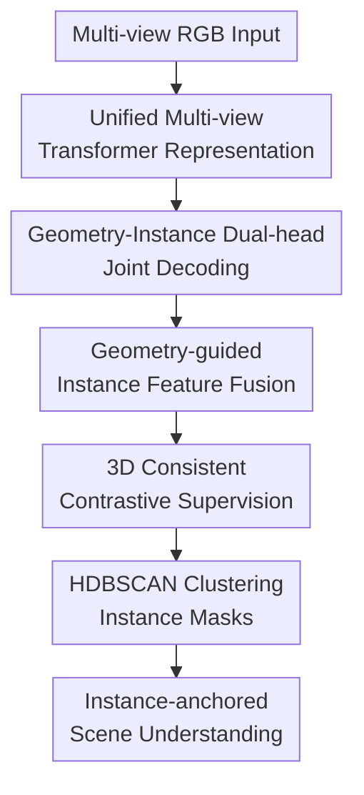

# IGGT: Instance-Grounded Geometry Transformer for Semantic 3D Reconstruction

**Conference**: ICLR 2026  
**OpenReview**: [https://openreview.net/forum?id=swiL18PmUV](https://openreview.net/forum?id=swiL18PmUV)  
**Code**: https://github.com/lifuguan/IGGT_official  
**Area**: 3D Vision  
**Keywords**: Semantic 3D Reconstruction, Multi-view Instance Matching, Open-vocabulary Segmentation, 3D Consistency, Instance-level Scene Understanding  

## TL;DR
IGGT utilizes a multi-view Geometry Transformer to simultaneously predict cameras, depth, point maps, and instance-level features. By employing 3D-consistent contrastive learning to bind geometric reconstruction and instance semantics within a single representation, it achieves more stable results in semantic 3D reconstruction, multi-view instance matching, and open-vocabulary scene understanding.

## Background & Motivation
**Background**: Semantic 3D reconstruction is typically decoupled into two pipelines: one for geometry, using methods like SfM, MVS, DUSt3R, or VGGT to recover cameras, depth, and point clouds from multi-view images; the other for semantics, using 2D segmentation models or VLMs to assign categories to image regions and then lifting these semantics to 3D.

**Limitations of Prior Work**: This "reconstruct-then-understand" pipeline prone to propagating errors from the first stage to the second. Geometric models focus solely on point positions and depth without knowing if a sofa, chair, or cabinet should maintain a consistent instance identity across views. Conversely, semantic models often operate at the 2D category level, easily becoming confused by multiple instances of the same category or significant viewpoint changes.

**Key Challenge**: 3D geometry requires the preservation of fine-grained structures, while semantic understanding requires stable object identities. Directly hard-aligning 3D features to the high-level semantic space of a language model makes representations overly dependent on that specific VLM and may damage geometric details. However, training them entirely separately fails to allow instance identity to constrain geometric consistency.

**Goal**: The authors aim for a unified model that directly outputs geometry and instance representations from multiple RGB images: it should perform feed-forward 3D reconstruction like VGGT while distinguishing different objects of the same category in 2D/3D, providing instance masks for open-vocabulary querying and scene grounding with any VLM or LMM.

**Key Insight**: Instead of using language features as the sole supervision, the paper first trains the model to learn a 3D-consistent instance clustering field. Instance masks serve as a lower-level and more transferable bridge than category labels: the same mask can be connected to OpenSeg for semantic segmentation or to Qwen2.5-VL / GPT-4o for visual question answering.

**Core Idea**: Replace fixed VLM alignment with instance-level 3D-consistent features, training geometric reconstruction and object identity clustering together. Use instance masks as a general interface to connect downstream vision-language models.

## Method

### Overall Architecture
The input to IGGT is $N$ RGB images of the same scene, and the output includes camera parameters, depth maps, point maps, and 8-dimensional instance feature maps for each view. The workflow can be understood as: first using a large-scale multi-view Transformer to obtain unified tokens, followed by parallel decoding via a geometry head and an instance head, and finally using a 3D-consistent contrastive loss to cluster features of the same object across views while pushing different objects apart.

After training, IGGT is not directly bound to a specific language model. It first uses HDBSCAN to cluster multi-view instance features into 3D-consistent masks, which then serve as prompts or pooling regions for models like OpenSeg, CLIP, LSeg, or Qwen2.5-VL to complete open-vocabulary segmentation, instance tracking, and QA scene grounding.

### Key Designs
**1. Unified Multi-view Transformer Representation: Deriving geometry and instances from the same scene tokens**

IGGT follows the VGGT approach to build a unified Transformer with approximately 1B parameters. Each image is first processed by DINOv2 to extract patch tokens, followed by a learnable camera token, allowing the model to remain aware of camera-related information despite a variable number of input views. Subsequently, 24 intra-view self-attention and global-view cross-attention blocks model local textures and cross-view relationships.

The key to this design is not just scaling the model, but placing geometry and instance understanding within the same scene-level representation. The model predicts $F:\{I_i\}_{i=1}^N \mapsto (t_i,D_i,P_i,S_i)_{i=1}^N$, where $t_i$ are camera parameters, $D_i$ is depth, $P_i$ is the point map, and $S_i$ are instance-level features. Thus, the instance head sees unified tokens modulated by multi-view geometric relationships rather than isolated 2D features.

**2. Geometry-Instance Dual-head Joint Decoding: Predicting object identity and spatial structure together**

The model splits into a Geometry Head and an Instance Head after the unified tokens. The Geometry Head inherits VGGT's modules for camera, depth, and point map prediction, using a DPT-like upsampling structure to recover multi-scale geometric features $F_i^{pt}$. The Instance Head uses a similar dense prediction structure to generate multi-scale instance features $F_i^{ins}$.

This dual-head structure resolves a common fracture in semantic 3D reconstruction: geometry networks usually do not know where instance boundaries are, while segmentation networks do not know if boundaries are 3D-consistent across views. By sharing the preceding Transformer representation and optimizing both geometric and instance contrastive losses, instance identities can leverage geometric context, and geometric representations are indirectly constrained by object consistency.

**3. Geometry-guided Instance Feature Fusion: Supplementary spatial details via window-shifted cross attention**

If the instance head decodes only from semantic tokens, it tends to produce features that are category-separable but have coarse boundaries. The paper introduces a cross-modal fusion block where instance features act as queries and geometric features as keys/values. Pixel-level spatial structure is injected via sliding window cross-attention: 
$$\hat{F}_{i,l}^{ins}=F_{i,l}^{ins}+F_{win}(Q=F_{i,l}^{ins},K=F_{i,l}^{pt},V=F_{i,l}^{pt})$$

Window attention is used instead of global attention because of the high spatial resolution of dense features, which would make global cross-attention computationally prohibitive. The shifted window approach propagates geometric information across local boundaries, object contours, and adjacent regions while keeping computation manageable. PCA visualizations in ablation studies indicate that without this fusion, the instance head struggles to converge in high-frequency regions like chair edges.

**4. 3D Consistent Contrastive Supervision and Instance-anchored Interface: Learning stable objects before connecting to arbitrary VLMs/LMMs**

Instead of directly aligning instance features to text, IGGT uses 3D-consistent instance masks for contrastive learning. For a sampled set of pixels $P$, features of pixels belonging to the same 3D instance are pulled together, while features of different instances are pushed apart within a margin $M$: 
$$L_{mvc}=\lambda_{pull}\sum_{m(p_i)=m(p_j)}d(f_{p_i},f_{p_j})+\lambda_{push}\sum_{m(p_i)\ne m(p_j)}\max(0,M-d(f_{p_i},f_{p_j}))$$

This loss converts the principle that "the same object remains the same across views" into a training signal. It is more fine-grained than category-level semantics because two chairs of the same category should remain separable in feature space. It is also more stable than 2D tracking because supervision comes from cross-view consistent 3D instance IDs. The final loss is $L_{overall}=L_{pose}+L_{depth}+L_{pmap}+L_{mvc}$.

After training, IGGT clusters multi-view instance features into $K$ clusters via HDBSCAN and projects cluster labels back to each view to obtain consistent 2D instance masks. For open-vocabulary segmentation, these masks serve as region priors for mask pooling of OpenSeg/CLIP/LSeg features. For QA scene grounding, the system highlights multi-view regions of the same instance to an LMM and uses yes/no questions to determine if the instance satisfies the query.

### Loss & Training
The authors constructed **InsScene-15K**, containing approx. 15K scenes and 200M image-level data points from synthetic sources, web-captured videos, and RGB-D scans. Synthetic data uses rendered instance masks; video data (like RE10K) uses SAM/SAM2 to propagate masks from initial frames; RGB-D data (like ScanNet++) projects 3D labels to 2D followed by SAM2 refinement.

Training was initialized from VGGT weights and conducted on 8 NVIDIA A800 GPUs for 2 days. Optimizer: AdamW. Learning rates: $1\times10^{-6}$ for backbone, $1\times10^{-5}$ for heads. Batches include 1 to 12 frames per scene (24 images total). Contrastive parameters: $\lambda_{pull}=2.0$, $\lambda_{push}=1.0$, $M=1.0$.

## Key Experimental Results

### Main Results
Evaluated on ScanNet and ScanNet++ across multi-view instance matching, geometric reconstruction, and 2D/3D open-vocabulary segmentation.

| Dataset | Metric | Ours (IGGT) | Prev. SOTA | Gain / Notes |
|--------|------|-----------|------------|-------------|
| ScanNet | T-mIoU↑ | 69.41 | SAM2*: 53.74 | +15.67, more stable matching |
| ScanNet | T-SR↑ | 98.66 | SAM2*: 71.25 | +27.41, objects tracked in almost all views |
| ScanNet | Abs. Rel↓ | 1.90 | VGGT: 1.84 | Geometry accuracy remains comparable |
| ScanNet | 2D mIoU↑ | 60.46 | LSeg: 58.11 | +2.35, better open-vocab segmentation |
| ScanNet | 3D mIoU↑ | 39.68 | LSM-MV: 35.37 | +4.31, stronger 3D semantic consistency |
| ScanNet++ | T-mIoU↑ | 73.02 | SAM2*: 44.16 | +28.86, superior in large viewpoint changes |
| ScanNet++ | T-SR↑ | 98.90 | SAM2*: 57.89 | +41.01, robust instance persistence |

### Ablation Study
Analyses on contrastive loss weights and VLM integration.

| Configuration | Key Metrics | Description |
|------|----------|------|
| $\lambda=0.1$ | ScanNet++ 2D mIoU 20.63 | Weak supervision; inseparable instance features; mask quality drops significantly |
| $\lambda=1$ | 2D mIoU 31.31, 3D mIoU 20.14 | Main setting; balances geometry and understanding |
| $\lambda=10$ | 2D mIoU 32.60, 3D mIoU 15.18 | Semantic goal too strong; geometry quality compromised |
| Ours w/ OpenSeg | ScanNet++ mIoU 31.31 | Best result on ScanNet++, proves mask interface flexibility |
| Ours class-agnostic | AP 12.25, AP50 24.93 | Significantly faster than VGGT+SAI3D (2.52 min) |

### Key Findings
- **Multi-view matching** is a standout result: T-SR jumped from 57.89 to 98.90 on ScanNet++, suggesting 3D-consistent features handle large camera motions better than 2D video tracking.
- **Geometric reconstruction** did not significantly degrade with semantic integration; geometry even slightly improved on ScanNet++.
- **Open-vocabulary gains** stem from the spatial prior of instance masks: aggregating objects stably before VLM pooling is more robust than pixel-wise projection.
- **Efficiency**: In class-agnostic 3D instance segmentation, IGGT is ~8 minutes faster than VGGT+Graph Cut.

## Highlights & Insights
- **Instance identity as a mediator**: Learning cross-view consistent objects before language alignment is highly practical; instances depend on geometry and can be named by language models.
- **Unified training cycle**: Geometry heads, instance heads, cross-modal fusion, and contrastive loss form a closed loop where instance features refine geometric boundaries and vice versa.
- **Mask-as-interface**: Future VLMs/LMMs can be integrated without retraining the 3D model, as long as they can process regions/masks.

## Limitations & Future Work
- Instance mask quality currently depends on unsupervised clustering (HDBSCAN); boundaries are not as sharp as specialized models like SAM2.
- Scaling evaluation to larger scene counts is needed for statistical verification of real-world stability.
- QA grounding relies on external LMM reasoning; complex spatial relations or counting still suffer from LMM biases.
- High-resolution clustering takes time (~2.52 min); not yet a real-time system for closed-loop robotics.

## Related Work & Insights
- **vs VGGT**: IGGT adds instance heads and 3D contrastive supervision to the VGGT backbone to enable direct semantic understanding.
- **vs LSM/Uni3R**: Unlike methods locked to a specific VLM, IGGT uses instance masks as a replaceable interface.
- **vs SAM2**: IGGT provides an explicit 3D scene-consistent representation, whereas SAM2 focuses on 2D/video propagation.

## Rating
- Novelty: ⭐⭐⭐⭐⭐ 
- Experimental Thoroughness: ⭐⭐⭐⭐ 
- Writing Quality: ⭐⭐⭐⭐ 
- Value: ⭐⭐⭐⭐⭐ 

<!-- RELATED:START -->

## Related Papers

- [\[ICLR 2026\] Quantized Visual Geometry Grounded Transformer](quantized_visual_geometry_grounded_transformer.md)
- [\[CVPR 2026\] GGPT: Geometry-Grounded Point Transformer](../../CVPR2026/3d_vision/ggpt_geometry_grounded_point_transformer.md)
- [\[ICLR 2026\] Streaming Visual Geometry Transformer](streaming_visual_geometry_transformer.md)
- [\[ICLR 2026\] FastVGGT: Fast Visual Geometry Transformer](fastvggt_fast_visual_geometry_transformer.md)
- [\[CVPR 2025\] VGGT: Visual Geometry Grounded Transformer](../../CVPR2025/3d_vision/vggt_visual_geometry_grounded_transformer.md)

<!-- RELATED:END -->
