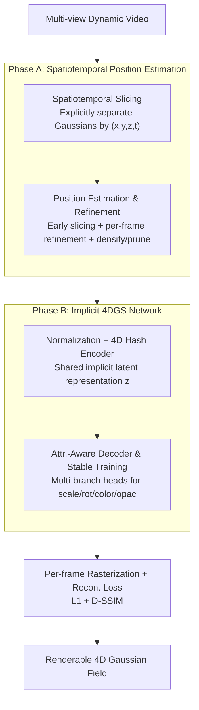

# Implicit 4D Gaussian Splatting for Fast Motion with Large Inter-Frame Displacements

**Conference**: ICLR 2026  
**OpenReview**: [https://openreview.net/forum?id=MWtXs60n38](https://openreview.net/forum?id=MWtXs60n38)  
**Code**: TBD  
**Area**: 3D Vision / Dynamic Scene Reconstruction / 4D Gaussian Splatting  
**Keywords**: 4D Gaussian Splatting, Dynamic Scene Reconstruction, Fast Motion with Large Displacements, Implicit Neural Networks, Spatiotemporal Slicing

## TL;DR
SPIN-4DGS reformulates the failure mode where "poorly learned Gaussian attributes lead to blurred or disappearing dynamic objects" under fast motion as a problem of "explicitly slicing by $(x,y,z,t)$ to obtain reliable spatiotemporal positions, and then using a lightweight feedforward network to decode scale, rotation, color, and opacity directly from these positions." It achieves an average PSNR 1.4–1.7 dB higher than the strongest baselines on six CMU Panoptic Sports scenes, outperforming D3DGS by +1.83 dB in the basketball scene.

## Background & Motivation
**Background**: 4D Gaussian Splatting (4DGS) is the leading framework for dynamic scene reconstruction due to its high rendering speed and quality. It follows two main paradigms: 1) **Explicit 4D parameterization** (e.g., Realtime-4DGS, 4D-Rotor), which unifies space and time into a continuous 4D Gaussian field rendered via temporal slicing; and 2) **Deformable methods** (e.g., 4DGaussian, Grid4D), which place Gaussians in a static canonical space and learn displacements over time. Both excel in scenes with small displacements (e.g., Neu3D).

**Limitations of Prior Work**: When motion becomes fast and inter-frame displacements are large (e.g., a fast-moving basketball or tennis racket in Panoptic Sports), both paradigms struggle. Deformable methods fail because fast-moving objects are often not assigned initial Gaussians in the canonical space. Explicit methods may initially track positions, but in later training stages, **attributes** such as color, opacity, scale, and rotation **collapse rapidly**, leading to severe visual degradation (as shown in the paper's Fig. 2, where 30K iterations yield worse results than 15K).

**Key Challenge**: The authors identify that the root cause of collapse is not inaccurate positioning, but rather **attribute failure**. Reconstruction losses are dominated by static background Gaussians. Fast-moving Gaussians at new positions naturally incur higher reconstruction errors, causing optimization to prioritize the background at the expense of dynamic objects. Furthermore, the requirement for a single 4D Gaussian to explain all timestamps simultaneously while rasterization is performed frame-by-frame creates **cross-frame interference**, making it difficult to maintain temporal consistency in dynamic regions.

**Goal**: Solve the failure mode of "poorly learned Gaussian attributes for fast-moving objects" without introducing external supervision like segmentation masks. This is split into two sub-problems: (1) obtaining Gaussian positions that cover the entire trajectory without interference; and (2) learning attributes at these positions stably and memory-efficiently.

**Key Insight**: Since positions are reliable but attributes are prone to collapse, the model should **avoid modeling temporal displacement directly**. Instead, it should use explicit spatiotemporal positions $(x,y,z,t)$ as inputs to a network that predicts attributes. By explicitly separating Gaussians at different times by their spatiotemporal coordinates, cross-frame interference is eliminated.

**Core Idea**: Use a lightweight feedforward implicit network to decode Gaussian attributes directly from explicitly collected spatiotemporal positions, replacing the paradigm of "per-Gaussian explicit attribute storage + learning temporal displacement"—hence Spatiotemporal Position Implicit Network for 4DGS (SPIN-4DGS).

## Method

### Overall Architecture
SPIN-4DGS takes multi-view dynamic videos as input and outputs a 4D Gaussian field renderable at any time. The pipeline consists of two serial phases. **Phase A (Spatiotemporal Position Estimation)**: An explicit baseline (Realtime-4DGS) is used during **early training** to obtain a set of Gaussian positions $\{u_t\}$ via temporal slicing. These positions are refined using per-frame rasterization losses (densifying salient points and pruning redundant ones) to produce a fixed set of reliable positions separated by $(x,y,z,t)$. **Phase B (Implicit 4DGS Network)**: Refined positions $(\mu, t)$ are normalized and fed into a 4D hash encoder to obtain a shared latent representation $z$. An attribute-aware multi-branch decoder then predicts scale, rotation, spherical harmonic (SH) colors, and opacity. Finally, the scene is rendered via per-frame rasterization and trained end-to-end with standard 3DGS reconstruction losses. Crucially, attributes are stored **implicitly within network parameters** rather than per Gaussian, ensuring memory efficiency and temporal consistency across massive spatiotemporal positions.

### Key Designs

**1. Spatiotemporal Slicing: Eliminating cross-frame interference**

This design serves as the conceptual foundation, directly addressing the interference caused by individual 4D Gaussians trying to explain all timestamps while being rasterized frame-by-frame. Traditional methods use **joint optimization** for Gaussians covering whole trajectories in a unified 4D space, meaning updates meant to reduce loss in one frame might degrade the Gaussian's performance in others. SPIN-4DGS constructs Gaussian sets **independently** at each time step, separating them via $(x,y,z,t)$. Mathematically, positions and colors are treated as explicit functions of time $u_t=f_\theta(x,y,z,t)$ and $c_t=g_\phi(x,y,z,t)$ for $t\in\{0,\dots,T\}$. Optimization for each frame focuses only on relevant Gaussians, preventing interference. This step improved PSNR from 27.48 to 28.96, reduced training time from 1h20m to 25m, and lowered VRAM usage from 18GB to 9GB (Table 3).

**2. Spatiotemporal Position Estimation and Refinement**

This step provides a high-quality position set across the trajectory at low cost. Rather than training a position network from scratch, the authors use Realtime-4DGS in its **early training stage** (15K iterations) to extract initial positions through temporal slicing. The insight is that positions are easier to learn than attributes. These positions are then refined per frame $u_t\leftarrow\mathrm{Refine}(u_t,c_t;t)$ using rasterization losses to densify salient regions and prune redundant background noise. Increasing refinement from 0.5K to 2K iterations improved PSNR from 29.86 to 30.05 (Table 2b).

**3. Normalization + 4D Hash Encoder: Shared implicit representation**

To prevent memory explosion from storing attributes for massive spatiotemporal positions, the authors utilize an implicit approach. Original 3D positions $u\in\mathbb{R}^3$ are unbounded, so they are compressed using Mip-NeRF style scene contraction into $[0,1]^3$: $\mathrm{contract}(\mu)=\mu$ if $\|\mu\|\le 1$ else $(2-\frac{1}{\|\mu\|})\frac{\mu}{\|\mu\|}$, with $\bar\mu=\frac14\mathrm{contract}(\mu)+\frac12$. Time is also normalized to $t_{\text{norm}}$, resulting in a 4D input $\tilde x=[\bar\mu^\top,t_{\text{norm}}]^\top\in[0,1]^4$. An Instant-NGP-style multi-resolution hash grid is extended to 4D to encode latent vectors $z=f_{\text{enc}}(\tilde x)\in\mathbb{R}^ {LF}$. This shared representation ensures temporal consistency and keeps storage low (1261 MB), outperforming D3DGS (1994 MB). Input normalization is critical; without it, PSNR drops from 29.89 to 19.17 (Table 5).

**4. Attribute-aware Decoder and Stable Training**

The latent vector $z$ is processed by a **multi-branch decoder** with separate three-layer MLP heads for scale, rotation, SH color, and opacity: $(\hat s,\hat r,\widehat{sh},\hat o)=(f_{\text{scale}}(z),f_{\text{rot}}(z),f_{\text{sh}}(z),f_{\text{opacity}}(z))$. To stabilize the direct regression of these sensitive attributes:
- **Scale**: Clipped pre-scale $\le 20$ to prevent gradient explosion; bias initialized to $-5$ (start small: $\exp(-5)\approx 0.0067$).
- **Rotation**: Bias set to $(1,0,0,0)$ to start near identity.
- **Opacity**: Bias set to $\mathrm{logit}(0.1)\approx-2.197$ to start nearly transparent.
- **Color**: Standard initialization for SH rendering.
GELU activation is used throughout. Switching from ReLU to GELU alone improved PSNR from 29.89 to 30.05 (Table 5).

### Loss & Training
The standard 3DGS reconstruction loss is used:

$$L = (1-\lambda)\, L_1 + \lambda\, L_{\text{D-SSIM}}, \quad \lambda = 0.2$$

**Separate learning rates** are employed: $8\times10^{-3}$ for the encoder, $1\times10^{-3}$ for color, $3\times10^{-4}$ for scale, $3\times10^{-5}$ for rotation, and $8\times10^{-4}$ for opacity. Optimization uses Adam with linear warmup and cosine decay. Training takes 40K iterations with a batch size of 3 on an RTX 4090.

## Key Experimental Results

### Main Results
Evaluated on CMU Panoptic Sports (31 cameras, 150 frames, $640\times360$).

| Method | Category | Avg. PSNR↑ | Avg. SSIM↑ | FPS↑ | Storage(MB)↓ |
|------|------|-----------|-----------|------|------|
| Grid4D | Deformable | 27.06 | 0.91 | 146 | 333 |
| 4DGaussian | Deformable | 27.53 | 0.91 | 40 | 62 |
| MoDec-GS | Deformable | 27.23 | 0.92 | 62 | 34 |
| TC3DGS | Ext. Supervision | 27.88 | 0.89 | 890 | 49 |
| D3DGS | Ext. Supervision | 28.70 | 0.91 | 760 | 1994 |
| 4D-Rotor-Gaussians | Explicit | 27.16 | 0.91 | 100 | 94 |
| Realtime-4DGS | Explicit | 28.38 | 0.93 | 197 | 1293 |
| **SPIN-4DGS (Ours)** | Implicit | **30.11** | **0.93** | 104 | 1261 |

Ours achieves the best PSNR across all six scenes, surpassing Realtime-4DGS by +1.73 dB and the externally supervised D3DGS by +1.41 dB. It achieves this without segmentation masks, while maintaining a higher FPS than other network-based methods like 4DGaussian and MoDec-GS.

### Ablation Study

| Configuration | Key Metrics | Description |
|------|---------|------|
| Early Training 15K / 30K | PSNR 29.57 / 29.39 | 15K is sufficient; 30K slightly degrades results and triples time. |
| Refinement 0.5K → 2K | PSNR 29.86 → 30.05 | Moderate refinement yields steady gains. |
| w/o Spatiotemporal Slicing | 27.48 PSNR, 1h20m, 18GB | Joint optimization suffers from interference and higher costs. |
| w/ Spatiotemporal Slicing | 28.96 PSNR, 25m, 9GB | Slicing improves quality while significantly cutting costs. |
| Implicit: ReLU + Fixed Pos. | PSNR 18.64 | Very low starting point. |
| + Input Normalization | PSNR 29.89 | Decisive step; PSNR jumps by +10.7 dB. |
| + GELU Activation | PSNR 30.05 | Further +0.16 gain. |
| Reusing D3DGS Pos. + Ours Attr. | Tennis 30.51 PSNR | Original D3DGS was 28.11; confirms gain from attr. learning. |

### Key Findings
- **Attributes are the bottleneck**: Experiments using positions from other baselines (D3DGS/Realtime-4DGS) with SPIN-4DGS attribute learning consistently show improvement, suggesting the framework acts as a powerful "plug-in."
- **Normalization is the "On/Off" switch**: Without input normalization, the network fails to converge (PSNR 19.17 vs. 29.89).
- **Slicing provides free gains**: Spatiotemporal slicing halves training time and VRAM while increasing PSNR.
- **Max gain in fast, small object scenes**: Basketball and tennis scenes show the largest improvements (+1.83 / +1.64 dB).

## Highlights & Insights
- **Problem diagnosis is the core strength**: The authors accurately attribute "disappearing objects" to background dominance and cross-frame interference, building the method directly from this diagnosis.
- **Paradigm shift from displacement to implicit decoding**: Avoids the pitfalls of temporal displacement modeling by treating spatiotemporal position as an input for implicit attribute retrieval.
- **Memory efficiency via shared representation**: Implicit storage maintains temporal consistency and manages memory across massive spatio-temporal Gaussian sets.
- **Conservative initialization**: Starting with small scales, identity rotations, and low opacity allows the network to gradually learn the structure from a stable baseline.

## Limitations & Future Work
- **Dependency on external estimators**: Phase A relies on Realtime-4DGS for initial positions; the method is not fully end-to-end.
- **Dataset Variety**: Evaluation is limited to the CMU Panoptic Sports dataset (multi-camera, fixed setup). Generalization to monocular/sparse views or outdoor environments remains untested.
- **Storage**: At 1261 MB, it is smaller than D3DGS but much larger than deformable methods like 4DGaussian (62 MB), limiting mobile deployment.
- **Future Directions**: Developing an end-to-end position/attribute joint model, utilizing trajectory priors, and applying more aggressive compression/quantization to the hash table.

## Related Work & Insights
- **vs. Deformable methods**: These fail to capture fast objects because they lack initial Gaussians in the canonical space. SPIN-4DGS bypasses the canonical space entirely.
- **vs. Explicit 4D parameterization**: These suffer cross-frame interference when a single Gaussian covers long trajectories. SPIN-4DGS uses slicing to isolate frames and implicit networks to learn robust attributes.
- **vs. Supervised methods**: Methods like D3DGS require masks. SPIN-4DGS outperforms them using only raw video.
- **Insight**: When one component (position) is stable but another (attributes) is fragile, freezing the easy component and decoding the difficult one through a shared implicit network from the first is a powerful strategy.

## Rating
- Novelty: ⭐⭐⭐⭐⭐ 
- Experimental Thoroughness: ⭐⭐⭐⭐ 
- Writing Quality: ⭐⭐⭐⭐⭐ 
- Value: ⭐⭐⭐⭐ 

<!-- RELATED:START -->

## Related Papers

- [\[AAAI 2026\] Sparse4DGS: 4D Gaussian Splatting for Sparse-Frame Dynamic Scene Reconstruction](../../AAAI2026/3d_vision/sparse4dgs_4d_gaussian_splatting_for_sparse-frame_dynamic_scene_reconstruction.md)
- [\[ICLR 2026\] Mango-GS: Enhancing Spatio-Temporal Consistency in Dynamic Scenes Reconstruction using Multi-Frame Node-Guided 4D Gaussian Splatting](mango-gs_enhancing_spatio-temporal_consistency_in_dynamic_scenes_reconstruction_.md)
- [\[CVPR 2026\] CaT-GS: Efficient 3DGS Rendering for Large-Scale Scenes with Inter-frame Caching and Tile Scheduling](../../CVPR2026/3d_vision/cat-gs_efficient_3dgs_rendering_for_large-scale_scenes_with_inter-frame_caching_.md)
- [\[CVPR 2026\] 4C4D: 4 Camera 4D Gaussian Splatting](../../CVPR2026/3d_vision/4c4d_4_camera_4d_gaussian_splatting.md)
- [\[ICLR 2026\] FastAvatar: Towards Unified and Fast 3D Avatar Reconstruction with Large Gaussian Reconstruction Transformers](fastavatar_towards_unified_and_fast_3d_avatar_reconstruction_with_large_gaussian.md)

<!-- RELATED:END -->
