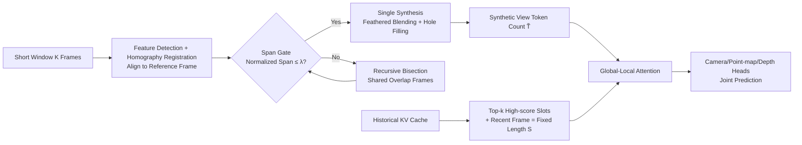

# IncVGGT: Incremental VGGT for Memory-Bounded Long-Range 3D Reconstruction

**Conference**: ICLR 2026  
**OpenReview**: [https://openreview.net/forum?id=CezA1eLa1Y](https://openreview.net/forum?id=CezA1eLa1Y)  
**Code**: TBD  
**Area**: 3D Vision / Feed-forward 3D Reconstruction / Long-Sequence Streaming Inference  
**Keywords**: VGGT, Streaming 3D Reconstruction, KV Cache Pruning, Image Registration and Stitching, Memory-Bounded, Edge Deployment  

## TL;DR
Under a **completely training-free** premise, IncVGGT modifies VGGT/StreamVGGT with two orthogonal modules: "Input-side registration & synthesis" and "History-side Top-k cache pruning." This compresses the quadratic growth of attention to near-constant levels, enabling the processing of 10,000 frames on an 80GB GPU without memory overflow. Compared to StreamVGGT on 500 frames, it reduces operations by 58.5×, memory by 9×, and energy by 25.7×, with 4.9× faster inference while maintaining comparable accuracy.

## Background & Motivation
- **Background**: Feed-forward Transformer-based 3D reconstruction, represented by VGGT, can simultaneously predict depth, pose, point maps, and trajectories in a single forward pass without per-scene optimization, achieving SOTA on multi-view benchmarks. StreamVGGT further introduces causal attention and KV cache to transform VGGT into an online streaming version, currently the SOTA for long-sequence 4D reconstruction.
- **Limitations of Prior Work**: The global self-attention in VGGT grows **quadratically** with the total number of tokens. A 24GB GPU can only handle dozens of frames, and even an 80GB GPU fails beyond 300 frames. While StreamVGGT is streaming-capable, it caches "all historical key/values," causing cache and latency to expand linearly with the frame count. Memory usage exceeds 80GB after 700–800 frames, leading to sharp efficiency degradation on long videos.
- **Key Challenge**: Real-world long videos (VR/AR, robotics, autonomous driving) naturally contain significant redundancy. However, existing methods pay the **full token cost at every step** and **retain all history indiscriminately**, carrying this redundancy directly into the computational and memory budget.
- **Goal**: To enable Transformer-based 3D reconstruction to run "arbitrarily long" sequences stably under strict memory and computational constraints, without retraining or breaking the feed-forward nature.
- **Core Idea**: **[Redundancy-Aware Dual-Axis Compression]** — Decompose video stream redundancy into two orthogonal directions: **Input-side redundancy** (adjacent frames repeatedly covering the same area) is folded via registration-based synthesis before tokenization; **History-side redundancy** (most cached KV pairs contribute little to the next step) is compressed into a fixed length using Top-k pruning based on relevance rather than sequence length. This replaces dense "all tokens × all history" with sparse "few tokens × few slots."

## Method

### Overall Architecture
IncVGGT is a **training-free modification** of the StreamVGGT inference path (using official weights): On the input side, a short window of $K$ frames is aligned to a reference domain via feature registration. A span gate decides whether to integrate them or use recursive bisection, merging them into a compact "synthetic view" before tokenization. This ensures the number of tokens $\tilde{T}$ entering attention is proportional to the "synthetic support area" rather than the raw frame count. On the history side, the global attention KV cache is limited to $S=k{+}1$ fixed-length slots, consisting of "Top-k high-score slots + the most recent frame." Together, these reduce the dense cost per layer/step from $O(B H L^2 d_h)$ to $O(B H \tilde{T} S d_h)$, where $\tilde{T}\cdot S \ll L^2$.

### Key Designs

**1. Registration-based Redundancy Reduction: Folding overlapping pixels before tokenization.** Pixel-level overlap in adjacent frames causes the Transformer to tokenize the same region repeatedly. IncVGGT stitches $K$ frames within a window into a single synthetic view before attention. Specifically, $I_0$ is chosen as the reference frame. Local features are extracted via ORB/SIFT, matched via kNN, and filtered using a ratio test and cross-check. Homography $H_{i\to i-1}$ between adjacent frames is estimated using DLT+RANSAC. All frames are incrementally mapped to the reference domain via cumulative multiplication $H_{i\to0}=H_{1\to0}H_{2\to1}\cdots H_{i\to i-1}$. While homography cannot fully model strong 3D parallax, it is sufficient for short windows and naturally supports incremental alignment without recomputing early frames.

**2. Band-limited Warping + Recursive Bisection (Span Gate): Adaptive decision of "one view or two."** Projecting all warped frames onto a global canvas would cause unbounded expansion and excessive extrapolation. This method restricts synthesis to a narrow vertical band centered on the reference support (with global translation for non-negative coordinates) to bound canvas size. Whether to synthesize in one pass is determined by the normalized span: let $S_i=H_{i\to0}(\Omega_i)$ be the warped support of frame $i$, and $W_0$ be the reference frame width. The span is the x-axis projection width of the union of supports divided by the single frame width: $\mathrm{span}=B_x\!\big(\bigcup_i S_i\big)/W_0$. If $\mathrm{span}\le\lambda$, viewpoints are coherent for a single synthesis; otherwise, the window is bisected into two sub-windows sharing an intermediate frame to act as an alignment anchor.

**3. Blending and Hole Filling: Stabilizing the synthetic token grid for batch processing.** After the span gate, frames are fused using mask-aware distance transform feathering. For each warp, a validity mask is computed with weights increasing smoothly towards the interior. Normalized accumulation $\hat{I}(x)=\big(\sum_i W_i(x)\tilde{I}_i(x)\big)/\big(\sum_i W_i(x)+\delta\big)$ suppresses seams without introducing halos. Newer frames overwrite older ones to simulate streaming input and fill minor gaps. Residual holes are cleaned by cropping unsupported horizontal edges and using small-radius inpainting for strictly zeroed holes, allowing the grid to be cropped to the reference frame height for batch efficiency.

**4. Global-Local KV Cache Pruning: Compressing growing cache to fixed length.** Naive streaming stores all history, leading to a step cost of $O(B H p L_{hist} d_h)$ that grows linearly, hitting the 80GB limit on an A100 at 800 frames. Due to the strong temporal continuity in 3D video, high-score slots at step $t$ are likely to be reused at $t{+}1$. IncVGGT computes attention scores $A_t=\mathrm{softmax}(Q_t K_{1:L_{hist}}^\top/\sqrt{d_h})$, reduces them across queries/heads to get a relevance vector $s^{(t)}$, and pre-selects $S_{t+1}=\mathrm{TopK}(s^{(t)},k)\cup\{\text{recent frame}\}$ for the next step. This limits attention to $O_{t+1}=\mathrm{softmax}(Q_{t+1}K_{S_{t+1}}^\top/\sqrt{d_h})V_{S_{t+1}}$. Both scoring cost $O(B H (k{+}1) d_h)$ and KV occupancy $O((k{+}1)d_h)$ become independent of sequence length. Retaining the "recent frame" helps capture sudden scene changes.

## Key Experimental Results

Environment: Single A100 (80GB), fixed image height 518px, 10-frame sliding window, Top-$k=5$ historical frames, Top-20 camera tokens for multi-view, using StreamVGGT official weights.

### Main Results

Total Inference Time (seconds, OOM denotes Out of Memory):

| Frames | 5 | 50 | 100 | 300 | 500 | 1k | 10k |
|---|---|---|---|---|---|---|---|
| Ours (Inc) | 0.57 | 4.17 | 8.20 | 25.50 | 38.12 | 82.00 | 797.31 |
| StreamVGGT | 0.50 | 7.23 | 20.09 | 136.72 | 185.11 | OOM | OOM |
| VGGT | 0.51 | 2.37 | 5.78 | 36.32 | OOM | OOM | OOM |

Video Depth Accuracy (Sintel / Bonn / KITTI, Abs Rel↓ and δ<1.25↑):

| Method | Type | Sintel AbsRel | Bonn AbsRel | KITTI AbsRel |
|---|---|---|---|---|
| VGGT | Dense-view | 0.298 | 0.057 | 0.061 |
| StreamVGGT | Streaming | 0.328 | 0.059 | 0.173 |
| Ours (Inc) | Streaming | 0.341 | 0.064 | 0.176 |
| CUT3R | Streaming | 0.421 | 0.078 | 0.118 |

Multi-view Reconstruction (7Scenes / NRGBD, Median Acc↓): Ours 0.0266 / 0.0516 vs. StreamVGGT 0.0241 / 0.0520 (differences within 0.3%).

### Ablation Study

Attention Operation Count (KITTI, in thousands):

| Frames | VGGT | StreamVGGT | Ours (Inc) |
|---|---|---|---|
| 100 | 951.58 | 548.13 | 27.39 |
| 300 | 7956.14 | 4299.78 | 126.33 |
| 500 | OOM | 11591.97 | 198.88 |

Energy Consumption (Joules, 300 frames): Ours 811 J vs. VGGT 8079 J vs. StreamVGGT 23516 J, approximately a one-order-of-magnitude reduction; average power 135.7W is also lower than 153.8W/178.3W.

### Key Findings
- **Near-Constant Latency**: From 10 to 300 frames, Ours per-frame latency slightly decreases from ~104ms to ~85ms, while StreamVGGT surges from 106ms to 455ms. The incremental design successfully decoupled per-frame latency from sequence length.
- **Flat Memory Curve**: Ours remains <9GB at 1k frames, with incremental steps stabilized at 2–3GB; VGGT exceeds 60GB at 300 frames, and StreamVGGT crashes after 78GB at 1k frames.
- **Virtually No Accuracy Loss**: Compared to StreamVGGT, the performance gap is typically within 1–3%, in exchange for 1–2 orders of magnitude efficiency gains.

## Highlights & Insights
- **Training-free and Architecture-agnostic**: The modification is purely in the inference path and reuses StreamVGGT weights. This implies it can be plug-and-play with any future VGGT-based backbone upgrades, with minimal deployment costs.
- **Orthogonal Dual-Axis Decompression**: Separating input redundancy (pixel overlap) from historical redundancy (useless KV) and solving them with classic CV (registration/stitching) and LLM inference tricks (KV pruning) is a clean and interpretable strategy.
- **Clear Complexity Derivation**: The relation $\tilde{T}\cdot S \ll L^2$ concisely identifies how quadratic complexity is reduced to near-constant levels, with complexity bounds provided for each module.

## Limitations & Future Work
- **Dependency on High Overlap**: The stability of homography registration may degrade when overlap is low or drops suddenly (large viewpoint changes, weak textures).
- **Homography Approximation**: Homography cannot model strong 3D parallax. While sufficient for short windows, it may introduce geometric errors in long-baseline scenarios.
- **Slight Accuracy Gap**: On short sequences where non-streaming VGGT can run, it remains the upper bound for accuracy. This work prioritizes "scalability" over "higher accuracy."
- The authors discuss a finetuning mode but choose not to pursue it, noting the proximity to the accuracy ceiling. Lightweight finetuning for pruning/synthesis could further bridge the gap to dense baselines.

## Related Work & Insights
- **VGGT / StreamVGGT**: These are the direct baselines and competitors, representing the "dense but non-scalable" and "streaming but cache-expanding" ends of the spectrum.
- **VGGT-Long**: Uses tiling and inter-tile alignment for kilometer-scale offline reconstruction, requiring post-processing; IncVGGT focuses on online, fixed-length cache.
- **DUSt3R/MASt3R/CUT3R/Spann3R/Point3R**: Feed-forward point map/streaming routes that lack systematic exploitation of temporal redundancy.
- **Insight**: Migrating **KV cache pruning (StreamingLLM/Top-k Attention)** from LLM inference to 3D reconstruction history compression, combined with **classic image stitching** for token-level de-redundancy, offers a high-value paradigm for "training-free efficiency" applicable to video understanding and 4D reconstruction.

## Rating
- **Novelty**: ⭐⭐⭐⭐ — While modules (registration, Top-k KV pruning) are not entirely new, their orthogonal combination to solve the VGGT long-sequence memory bottleneck training-free is an ingenious engineering approach.
- **Experimental Thoroughness**: ⭐⭐⭐⭐ — Covers multi-dimensional efficiency metrics (latency, memory, ops, energy) and validates accuracy on multiple depth and reconstruction benchmarks. The 10k frame test is highly convincing, though systematic ablation on hyperparameters like $k$ and $\lambda$ is slightly lacking.
- **Writing Quality**: ⭐⭐⭐⭐ — Clear motivation regarding dual-axis redundancy; complexity derivations and illustrations (Fig. 1/2/4) are effective and readable.
- **Value**: ⭐⭐⭐⭐ — Directly addresses pain points for edge/resource-constrained deployment. Training-free and plug-and-play features provide immediate utility for 3D/4D sensing applications.

<!-- RELATED:START -->

## Related Papers

- [\[CVPR 2025\] FrameVGGT: Frame Evidence Rolling Memory for streaming VGGT](../../CVPR2025/3d_vision/framevggt_frame_evidence_rolling_memory_for_streaming_vggt.md)
- [\[CVPR 2026\] Long-SCOPE: Fully Sparse Long-Range Cooperative 3D Perception](../../CVPR2026/3d_vision/long_scope_fully_sparse_long_range_cooperative_3d_perception.md)
- [\[ICLR 2026\] PAGE-4D: VGGT-4D Perception via Disentangled Pose and Geometry Estimation](page-4d_vggt-4d_perception_via_disentangled_pose_and_geometry_estimation.md)
- [\[ICLR 2026\] Point-UQ: An Uncertainty Quantification Paradigm for Point Cloud Few-Shot Class-Incremental Learning](point-uq_an_uncertainty-quantification_paradigm_for_point_cloud_few-shot_class_i.md)
- [\[ICLR 2026\] MEGS2: Memory-Efficient Gaussian Splatting via Spherical Gaussians and Unified Pruning](megs2_memory-efficient_gaussian_splatting_via_spherical_gaussians_and_unified_pr.md)

<!-- RELATED:END -->
