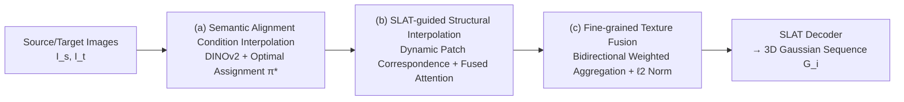

# Interp3D: Correspondence-aware Interpolation for Generative Textured 3D Morphing

**Conference**: ICLR 2026  
**OpenReview**: [https://openreview.net/forum?id=au6cziMtGM](https://openreview.net/forum?id=au6cziMtGM)  
**Code**: [https://github.com/xiaolul2/Interp3D](https://github.com/xiaolul2/Interp3D)  
**Area**: 3D Vision / Generative 3D Morphing  
**Keywords**: textured 3D morphing, training-free, correspondence-aware interpolation, TRELLIS, SLAT, generative prior  

## TL;DR
Interp3D proposes a training-free framework that leverages the 3D generative prior of TRELLIS to inject a progressive three-stage correspondence — "Semantic Alignment → Structural Alignment → Texture Alignment" — into the diffusion generation process, thereby generating structurally coherent, visually plausible, and smoothly transitioning morphing sequences between two textured 3D assets.

## Background & Motivation
- **Background**: Textured 3D morphing aims to generate smooth transition sequences between two 3D assets, maintaining both structural coherence and fine-grained appearance, which is valuable for animation, editing, and visual effects (character/creature evolution).
- **Limitations of Prior Work**: Traditional geometric morphing methods establish explicit correspondences directly on point clouds or meshes to find deformation trajectories, but they rely on strict topological consistency and vertex alignment. These methods are restricted to **pure shape interpolation while ignoring textures**, and often result in blurred matching or unnatural deformations when encountering topological differences. Generative methods that adapt 2D interpolation strategies to 3D are essentially "2D-native"—either morphing in image space first to drive 3D (leading to view inconsistency and error accumulation) or forcefully applying 2D strategies to 3D generators (ignoring structural correspondence and struggling with scale/topology changes), often resulting in semantic misalignment, structural collapse, and blurred textures.
- **Key Challenge**: Generative priors can create detailed appearances but lack reliable 3D correspondence; conversely, geometric correspondences are reliable but cannot generate textures. **Combining the two is non-trivial**—structural and semantic gaps can make correspondences unstable (e.g., Mario's head might be misaligned to the stomach of a piece of bread).
- **Goal**: Under a training-free premise, jointly guarantee geometric consistency, texture alignment, and transition robustness to generate morphing trajectories that possess both structural fidelity and texture continuity.
- **Core Idea**: **[Progressive Three-stage Alignment]** Decomposes correspondence into three levels from coarse to fine—semantic alignment acts as a "high-level planner" to establish conceptual maps (ensuring head-to-head matching), structural alignment regularizes deformation between matched parts (handling large shape differences and avoiding collapse), and texture alignment performs material transfer and detail recomposition on aligned structures (avoiding blurred color mixing or texture jumping). All three are built upon the Structured Latent (SLAT) of TRELLIS, a 3D generative prior.

## Method

### Overall Architecture
Given source and target image prompts $I_s, I_t$, the goal is to generate a textured 3D sequence $S=\{G_i\}_{i=0}^{L-1}$ of length $L$. Interp3D utilizes pre-trained TRELLIS as a 3D diffusion prior (two stages: Stage-1 generates voxel structures, Stage-2 generates texture-aware SLAT features, which are then mapped to 3D Gaussians by the SLAT decoder). During the generation process, it progressively injects three layers of correspondence: (a) semantic alignment interpolation in the 2D conditioning layer, (b) SLAT-guided structural interpolation during the structure generation stage, and (c) fine-grained texture fusion at the appearance layer.

### Key Designs

**1. Semantic Alignment Condition Interpolation: Establishing the "head-to-head" conceptual map first.** Naive condition space interpolation is effective in 2D but ignores semantic correspondence in 3D generation, leading to feature confusion. Interp3D uses DINOv2 to extract patch-level embeddings for source and target $c_s=\{c_{s,j}\}_{j=1}^M$ and $c_t=\{c_{t,k}\}_{k=1}^M$. Correspondence estimation is formulated as a one-to-one assignment problem, finding the optimal permutation $\pi^\star = \arg\max_{\pi\in P_M}\sum_{j,k}\frac{\langle c_{s,j}, c_{t,\pi(k)}\rangle}{\|c_{s,j}\|\|c_{t,\pi(k)}\|}$ based on cosine similarity. After reordering the target embeddings according to $\pi^\star$, a token-level convex combination interpolation is performed: $c_i=(1-\alpha_i)\{c_{s,j}\}+\alpha_i\{c_{t,\pi^\star(k)}\}$. This allows each patch to evolve smoothly toward its semantic counterpart, eliminating category-level mismatches from the root and providing reliable guidance for the subsequent morphing trajectory.

**2. SLAT-guided Structural Interpolation: Building dynamic correspondences and fused attention with 3D latent features.** Condition interpolation only carries single-view 2D semantics and struggles to capture the spatial correspondences needed for intermediate 3D structures. Therefore, SLAT features from the source and target generation processes are introduced as geometric guidance. The first part is **dynamic patch correspondence**: since denoising is a coarse-to-fine process (recovering global layout early and refining details later), the method densifies sparse SLAT features and projects them onto a grid with the same resolution as the KV maps in the structural stage. Patches are divided by side length $s_t$ at denoising step $t$ (total $G=\lceil N/s_t\rceil^3$ blocks). Only patch pairs with similarity higher than a threshold $\tau_0$ participate in the assignment $\pi^\star=\arg\max_\pi\sum_{p,q}\mathrm{sim}(f^{SLAT}_{s,p}, f^{SLAT}_{t,\pi^\star(q)})$, while unmatched patches maintain their original positions. As denoising progresses, $s_t$ decreases exponentially, achieving "early coarse alignment, late fine alignment." The second part is **fused attention interpolation**: the target geometric KV is reordered using the permutation matrix $P_\pi$ obtained from correspondence as $\hat K^{geo}_t, \hat V^{geo}_t \leftarrow P_{\pi^\star}(K^{geo}_t, V^{geo}_t)$, and the aligned source/target KV are concatenated into self-attention for interpolative fusion: $Q_i\leftarrow(1-\alpha_i)\,\mathrm{SelfAttn}(Q_i,[K^{geo}_s,K^{geo}_i],[V^{geo}_s,V^{geo}_i])+\alpha_i\,\mathrm{SelfAttn}(Q_i,[\hat K^{geo}_t,K^{geo}_i],[\hat V^{geo}_t,V^{geo}_i])$. This allows each query to integrate aligned structural information from both source and target while retaining its own spatial cues, resulting in structurally coherent intermediate geometry.

**3. Fine-grained Texture Fusion: Bidirectional weighted aggregation across different voxel counts instead of linear color mixing.** Differences in 3D object structures between source and target lead to different numbers of active voxels. Direct interpolation or forcefully binding textures to voxels can cause color distortion and blurring. For each intermediate token $K^{tex}_{i,v}$, the method retrieves the most similar corresponding tokens in the source and target: $m^*=\arg\max_m \mathrm{sim}(K^{tex}_{i,v}, K^{tex}_{s,m})$ and $n^*=\arg\max_n \mathrm{sim}(K^{tex}_{i,v}, K^{tex}_{t,n})$. It then performs weighted aggregation including an identity term and applies ℓ2 normalization to prevent magnitude drift: $K^{tex}_{i,v}\leftarrow\frac{\|K^{tex}_{i,v}\|}{\|\tilde K^{tex}_{i,v}\|}\tilde K^{tex}_{i,v}$, where $\tilde K^{tex}_{i,v}=(1-\alpha_i)K^{tex}_{s,m^*}+\alpha_i K^{tex}_{t,n^*}+K^{tex}_{i,v}$. Value tokens are updated similarly. Retaining the identity feature term prevents the intermediate state from collapsing into either endpoint or degrading into simple linear color mixing, achieving coherent texture alignment across different voxel resolutions.

## Key Experimental Results

### Main Results
Evaluation on the self-constructed Interp3DData (57 pairs, 19 each for easy/mid/hard, 7-frame sequences) using FID / PPL / LPIPS (lower is better):

| Method | FID↓(Avg) | PPL↓(Avg) | LPIPS↓(Avg) |
|------|-----------|-----------|-------------|
| MorphFlow | 104.88 | 2.89 | 0.151 |
| DiffMorpher | 169.54 | 4.42 | 0.128 |
| FreeMorph | 124.57 | 5.61 | 0.166 |
| AID-I | 87.88 | 3.20 | 0.112 |
| AID-O | 81.03 | 2.92 | 0.102 |
| **Interp3D (Ours)** | **78.97** | **2.47** | **0.086** |

User study (30 volunteers) overall preference:

| Method | Fidelity↑ | Smoothness↑ | Plausibility↑ | Overall↑ |
|------|-----------|-------------|---------------|----------|
| DiffMorpher | 2.35% | 1.57% | 1.96% | 1.96% |
| FreeMorph | 9.02% | 12.16% | 10.20% | 10.46% |
| AID-O | 16.86% | 12.94% | 18.43% | 16.08% |
| MorphFlow | 17.65% | 23.14% | 11.37% | 17.39% |
| **Interp3D (Ours)** | **54.12%** | **50.20%** | **58.04%** | **54.12%** |

### Ablation Study
Stepwise addition of three-stage components (Average):

| Configuration | FID↓ | PPL↓ | LPIPS↓ |
|------|------|------|--------|
| Initial Condition Interp. | 85.55 | 3.25 | 0.113 |
| + Semantic Align. | 83.51 | 2.99 | 0.105 |
| + Structure Interp. | 81.62 | 2.83 | 0.098 |
| + Texture Fusion | **78.97** | **2.47** | **0.086** |

### Key Findings
- Each layer of the three stages brings consistent improvements: semantic alignment yields the largest FID reduction for easy cases (approx. -4.06), proving the value of establishing meaningful correspondences; structural interpolation further improves fidelity; texture fusion provides the most significant gain for hard cases (PPL +0.59, LPIPS +0.024).
- MorphFlow's PPL/LPIPS is unusually low because texture variations are weakened and outputs are oversimplified, rather than being truly smooth; DiffMorpher/FreeMorph show inconsistency when feeding 2D morphing results into 3D, with PPL as high as 4.42/5.61.
- In the user study, Interp3D's preference across all dimensions exceeds 50%, far higher than the second-best MorphFlow (17.39%).
- The entire method is training-free and can run on a single RTX A5000 (TRELLIS 25-step denoising, grid $N=64$, SLAT dimension $C=8$).

## Highlights & Insights
- **Systematically decoupling "correspondence" into semantic/structural/texture layers**, mapped to different hierarchical levels of TRELLIS's two-stage generation (condition space → structural KV → texture token), is the cleanest design intuition—different levels use matching of different granularities (patch assignment, dynamic grids, token retrieval).
- **Dynamic patch correspondence shrinks patch size with denoising steps**, aligning the "coarse-to-fine" temporal structure of diffusion with "coarse-to-fine" alignment, a lightweight detail that fits the generative mechanism well.
- **Texture fusion retaining identity feature terms + ℓ2 normalization** cleverly bypasses the difficulty of direct interpolation due to unequal voxel counts between source and target, while avoiding collapse and magnitude drift.
- The method is entirely training-free and single-GPU capable, accompanied by the difficulty-stratified Interp3DData benchmark, offering good reproducibility and utility.

## Limitations & Future Work
- Strongly dependent on TRELLIS's SLAT representation and generation quality; distortion or insufficient category coverage in the prior itself will propagate to morphing results.
- The evaluation scale is relatively small (57 pairs, 30 volunteers), FID is estimated using rendered views, and difficulty classification mainly relies on manual judgment, providing limited evidence of generalization.
- Semantic correspondence based on DINOv2 patch similarity with one-to-one assignment may still be unstable in cases where source/target semantic parts differ greatly in quantity or structure.
- Texture fusion relies on nearest-neighbor token retrieval via similarity; the paper has less discussion on robustness in highly repetitive or low-texture areas, and whether material semantics (e.g., metal/fabric) are correctly transferred.
- Only morphing between two assets is performed; multi-target/controllable attribute morphing and end-to-end integration with animation/editing downstream tasks are possible extensions.

## Related Work & Insights
- **Traditional Geometric Morphing** (manifold/deformation-field, MorphFlow's NeRF-based optimal transport volume interpolation) ensures view consistency but is shape-centric and ignores texture, which is the old paradigm this paper aims to surpass.
- **2D Generative Morphing** (AID's attention interpolation, IMPUS/DiffMorpher's LoRA text embedding refinement, FreeMorph's tuning-free slerp) provides tools for attention/condition interpolation; this paper upgrades the "fused attention" idea to a 3D version with SLAT correspondence.
- **3D Generative Priors** (TRELLIS's Structured Latent SLAT) is the foundation of the framework; the insight is that when a generator provides decodable structured latent representations, reliable 3D correspondences can be established directly in latent space without explicit mesh matching.
- For researchers in generative 3D editing/interpolation, "hierarchical injection of correspondence according to generation stages" is a transferable paradigm that can be extended to controllable generation tasks beyond morphing.

## Rating
- **Novelty**: ⭐⭐⭐⭐ — Among the first training-free frameworks for textured 3D morphing that systematically injects progressive correspondence alignment into 3D generative priors; the three-layer decoupled design is clear and fits the TRELLIS mechanism.
- **Experimental Thoroughness**: ⭐⭐⭐ — Main experiments, ablations, and user studies are comprehensive, with clear gains per component; however, the benchmark scale is small, baselines are mostly adaptations, and it lacks validation on larger scales or more prior backbones.
- **Writing Quality**: ⭐⭐⭐⭐ — The motivational narrative (Mario → Bread three-layer alignment analogy) is intuitive, and the methods and formulas are clearly organized with ample illustrations.
- **Value**: ⭐⭐⭐⭐ — Training-free, single-GPU capable, includes a benchmark, and has practical potential for animation/editing/VFX; the "layered correspondence injection" paradigm is insightful for the generative 3D community.

<!-- RELATED:START -->

## Related Papers

- [\[ICCV 2025\] Textured 3D Regenerative Morphing with 3D Diffusion Prior](../../ICCV2025/3d_vision/textured_3d_regenerative_morphing_with_3d_diffusion_prior.md)
- [\[ICLR 2026\] Parameterization-Based Dataset Distillation of 3D Point Clouds through Learnable Shape Morphing](parameterization-based_dataset_distillation_of_3d_point_clouds_through_learnable.md)
- [\[ICLR 2026\] SpatialHand: Generative Object Manipulation from 3D Perspective](spatialhand_generative_object_manipulation_from_3d_prespective.md)
- [\[ICLR 2026\] HoloPart: Generative 3D Part Amodal Segmentation](holopart_generative_3d_part_amodal_segmentation.md)
- [\[ICLR 2026\] Generative Human Geometry Distribution](generative_human_geometry_distribution.md)

<!-- RELATED:END -->
