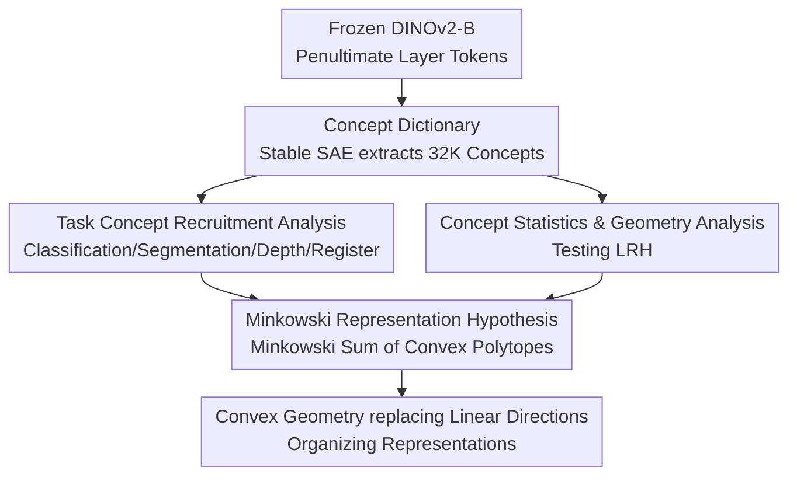

# Into the Rabbit Hull: From Task-Relevant Concepts in DINO to Minkowski Geometry

**Conference**: ICLR2026  
**arXiv**: [2510.08638](https://arxiv.org/abs/2510.08638)  
**Code**: [kempnerinstitute.github.io/dinovision](https://kempnerinstitute.github.io/dinovision)  
**Area**: 3D Vision  
**Keywords**: DINOv2, Sparse Autoencoder, Linear Representation Hypothesis, Minkowski Representation Hypothesis, interpretability, Vision Transformer

## TL;DR
By training a 32,000-unit Sparse Autoencoder dictionary on DINOv2, this paper systematically analyzes how downstream tasks recruit different concepts. It finds that representation geometry deviates from the Linear Representation Hypothesis (LRH) and proposes the Minkowski Representation Hypothesis (MRH), which posits that token representations are Minkowski sums of multiple convex polytopes, where concepts are defined by proximity to prototypical points rather than linear directions.

## Background & Motivation
As a self-supervised vision foundation model, DINOv2 excels in tasks such as classification, segmentation, depth estimation, and robotic perception, yet the nature of its internal representations remains unclear. Existing interpretability methods are largely based on the Linear Representation Hypothesis (LRH), which suggests that internal features of neural networks can be represented as sparse superpositions of near-orthogonal directions. However, the authors observed geometric phenomena in large-scale experiments that LRH cannot fully explain:

- Dictionary atoms exhibit higher-than-expected coherence, deviating from ideal Grassmannian frames.
- Representations contain a mixture of sparse features and dense features (such as positional encodings).
- Token embeddings within a single image present smooth low-dimensional manifold structures, persisting even after removing spatial information.
- Concepts recruited by different tasks form low-dimensional functional subspaces.

These observations prompted the authors to move beyond LRH and propose a new representation hypothesis based on convex geometry.

## Core Problem
1. Which internal concepts of DINOv2 are utilized by different downstream tasks? Is there functional specialization?
2. What are the statistical and geometric properties of the learned concept dictionary? Do they align with the predictions of LRH?
3. Can a more accurate geometric hypothesis be proposed to explain the observed phenomena instead of LRH?

## Method

### Overall Architecture
Rather than proposing a new model, this paper introduces a "probe dictionary + geometric analysis" pipeline to dissect DINOv2's internal representations. First, a 32,000-unit sparse dictionary is trained on frozen DINOv2-B tokens to decompose each token into a few namable concepts. The analysis then addresses three questions: which concepts are recruited by tasks, what their statistics and geometry look like, and what mathematical structure can unify them. The observations from "task recruitment" and "statistical/geometric analysis" collectively force the abandonment of linear directions and culminate in the Minkowski Representation Hypothesis (MRH), using convex geometry as the organizing language for representations.

### Key Designs

**1. Concept Dictionary: Decomposing tokens into namable concepts with Stable SAE**

The first step is obtaining a stable, reproducible concept dictionary. The authors train a Stable SAE on the penultimate layer of DINOv2-B (including 4 register tokens) with a dictionary size $c = 32{,}000$, where each token activates only $k = 8$ concepts via BatchTopK. To avoid dictionary drift common in standard SAEs, atoms are constrained within the convex hull of real activations—parameterizing the dictionary $\bm{D} = \bm{S}\bm{C}$ using 128,000 k-means centroids $\bm{C}$ ($\bm{S}$ is row-stochastic), ensuring each atom is a convex combination of real data points. After 50 epochs on 1.4M ImageNet-1K images, reconstruction fidelity reaches $R^2 > 88\%$, providing a reliable foundation for analysis.

**2. Task Concept Recruitment Analysis: Identifying concepts used by downstream tasks**

To understand what tasks "use," the authors derive a concept importance measure $\mathbb{E}(\bm{Z})\bm{W}'$ from linear probes $\bm{Y} = \bm{A}\bm{W}^T$ using the decomposition $\bm{A} \approx \bm{Z}\bm{D}$, then rank top concepts per task. Four task categories show distinct, interpretable recruitment patterns. For **Classification**, the most important are not just the target objects, but counter-intuitive "Elsewhere" concepts—they activate on all tokens outside the object but depend on its presence, implementing a conditional negation logic ("the object is elsewhere, so this token is not the object"). **Segmentation** top-50 concepts almost exclusively activate along object outlines; these "border concepts" look different across classes but have highly consistent spatial footprints, clustering into tight low-dimensional subspaces. **Depth Estimation** revealed three cue families: projective geometry (vanishing lines), shading (soft gradients), and local frequency transitions (texture changes), aligning with classic principles of visual neuroscience. **Register tokens** house hundreds of exclusive concepts encoding global non-local attributes like motion blur, lighting styles, and caustic reflections.

**3. Concept Statistics & Geometry Analysis: Testing Linear Representation Hypothesis**

This step directly tests LRH predictions, which fail almost universally. Activation statistics follow a frequency-energy tradeoff envelope but are disrupted by three abnormally dense concepts encoding position (Left/Right/Bottom), revealing a hybrid regime where sparse and dense features coexist. The eigenvalues of the co-activation matrix $\bm{Z}^T\bm{Z}$ decay smoothly without block structures, suggesting concepts are part of a high-dimensional distribution rather than modular units. Dictionary geometry differs from the near-orthogonal frames envisioned by LRH: pairwise inner products show much heavier tails than random baselines, and singular value spectra decay sharply, exposing anisotropy. Furthermore, "opposite pairs" encoding semantic polarities (e.g., "White vs. Black") exist such that $\bm{D}_i \approx -\bm{D}_j$, and Hoyer sparsity is significantly below 1.0, confirming concepts are distributed rather than neuron-aligned.

**4. Minkowski Representation Hypothesis: Organizing representations via Minkowski sums**

MRH defines the activation space $\mathcal{X}$ as the Minkowski sum of multiple "tiled polytopes":

$$\mathcal{X} = \bigoplus_{i=1}^{m} \mathcal{P}_i, \quad \mathcal{P}_i = \text{conv}(\mathcal{A}_{\mathcal{T}_i})$$

Each token is a sum of convex combinations of a few active tiles $\bm{x} = \sum_{i \in S} \bm{z}_i \mathcal{A}_{\mathcal{T}_i}$ ($\bm{z}_i \in \Delta^{|\mathcal{T}_i|}$, $|S| \ll m$), where concepts are defined by proximity to prototypical points. This hypothesis has triple support: in cognitive science, it corresponds to Gärdenfors' conceptual spaces; architecturally, multi-head attention (MHA) outputs naturally belong to $\text{conv}(\bm{V})$, and their summation naturally produces a Minkowski sum; the paper provides formal proofs that MHA implements an MRH structure. Empirical evidence includes the fact that linear interpolation exits the data support quickly while piecewise linear geodesics on kNN graphs stay on the manifold, and Archetypal Analysis (a single-tile MRH case) matches SAE reconstruction quality with only ~10 prototypes.

## Key Experimental Results
- SAE dictionary size: 32,000 concept atoms, reconstruction $R^2 > 88\%$.
- Classification recruits significantly more concepts than segmentation or depth estimation.
- Cosine similarity of top-100 concepts within a task is significantly higher than random subsets, with faster eigenvalue decay.
- Positional information is compressed into a 2D subspace in the final layer.
- Archetypal Analysis achieves SAE-level reconstruction error with only 10 prototypes.
- Co-activation only weakly correlates with geometric similarity ($r = 0.28$, $R^2 = 0.08$).

## Highlights & Insights
- **Large-scale interpretability resource**: Released the largest interactive interpretability exhibit for a vision foundation model (32K concept browser).
- **Discovery of "Elsewhere" concepts**: Revealed a counter-intuitive classification mechanism that supports decisions via conditional activation in non-object regions.
- **Theoretical elegance of MRH**: Derived convex geometric organization naturally from the mathematical structure of multi-head attention, supported by a chain of lemmas and propositions.
- **Interdisciplinary perspective**: Integrating cognitive science (Gärdenfors spaces), discrete geometry (Minkowski sums), and deep learning interpretability.
- **Implications for steering**: MRH predicts a natural upper bound for concept manipulation (saturation at the prototype), explaining the plateaus and reversals observed in current SAE probing.

## Limitations & Future Work
- MRH remains a hypothesis; empirical signals are "consistent evidence" rather than definitive proof, as multiple geometric hypotheses might yield similar observations.
- Minkowski decomposition is inherently non-identifiable (Proposition 2), meaning original generative factors cannot be uniquely recovered from single-layer activations.
- Analysis is concentrated on DINOv2-B; generalization to other ViT variants or larger models is not yet verified.
- Archetypal Analysis comparisons were conducted at the single-image token level, lacking global cross-image validation.
- The categorization of depth estimation cues is incomplete, as some concepts show hybrid sensitivities.

## Related Work & Insights

| Method/Hypothesis | Core Viewpoint | Relationship to Ours |
|---|---|---|
| LRH + SAE | Repr. = Sparse superposition of near-orthogonal directions | Starting point, but limitations exposed by experiments |
| Sparse Autoencoder | Overcomplete dictionary learning | Used as an analytical tool (Stable SAE) |
| k-Deep Simplex / SpaDE | Repr. within convex hulls | Pioneering work aligned with the MRH approach |
| Gärdenfors Space | Concept = Convex region | Cognitive science foundation for MRH |
| Park et al. 2025 | Polytope coding of concepts in LLMs | Parallel discovery in the NLP domain |

## Rating
- Novelty: ⭐⭐⭐⭐⭐ (MRH is a fresh representation hypothesis with a unique interdisciplinary view)
- Experimental Thoroughness: ⭐⭐⭐⭐ (Extensive large-scale analysis, though MRH evidence is still preliminary)
- Writing Quality: ⭐⭐⭐⭐⭐ (Clear structure, rigorous theoretical derivation, excellent visualizations)
- Value: ⭐⭐⭐⭐⭐ (Significant impact on the field of interpretability)

<!-- RELATED:START -->

## Related Papers

- [\[CVPR 2026\] DINO Eats CLIP: Adapting Beyond Knowns for Open-set 3D Object Retrieval](../../CVPR2026/3d_vision/dino_eats_clip_adapting_beyond_knowns_for_open-set_3d_object_retrieval.md)
- [\[CVPR 2026\] Task-Driven Implicit Representations for Automated Design of LiDAR Systems](../../CVPR2026/3d_vision/task-driven_implicit_representations_for_automated_design_of_lidar_systems.md)
- [\[CVPR 2025\] ASHiTA: Automatic Scene-grounded Hierarchical Task Analysis](../../CVPR2025/3d_vision/ashita_automatic_scene-grounded_hierarchical_task_analysis.md)
- [\[CVPR 2025\] Olympus: A Universal Task Router for Computer Vision Tasks](../../CVPR2025/3d_vision/olympus_a_universal_task_router_for_computer_vision_tasks.md)
- [\[ICLR 2026\] Generative Human Geometry Distribution](generative_human_geometry_distribution.md)

<!-- RELATED:END -->
